# llm-d-inference-scheduler

> **Architecture snapshot: 2026-05-15** (2026-05-15)

**Repository:** llm-d/llm-d-inference-scheduler  
**Analyzer:** arch-analyzer 0.2.0  
**Extracted:** 2026-05-15T11:43:47Z

## Summary

| Metric | Count |
|--------|-------|
| CRDs | 0 |
| Deployments | 11 |
| Services | 5 |
| Secrets | 3 |
| Cluster Roles | 0 |
| Controller Watches | 12 |

## Component Architecture

CRDs, controllers, and owned Kubernetes resources.

```mermaid
graph LR
    %% Component architecture for llm-d-inference-scheduler

    classDef crd fill:#e74c3c,stroke:#c0392b,color:#fff
    classDef controller fill:#3498db,stroke:#2980b9,color:#fff
    classDef owned fill:#2ecc71,stroke:#27ae60,color:#fff
    classDef external fill:#95a5a6,stroke:#7f8c8d,color:#fff
    classDef dep fill:#f39c12,stroke:#e67e22,color:#fff

    subgraph controller["llm-d-inference-scheduler Controller"]
        dep_1["${EPP_NAME}"]
        class dep_1 controller
        dep_2["${MODEL_NAME_SAFE}-vllm-sim"]
        class dep_2 controller
        dep_3["0"]
        class dep_3 controller
        dep_4["0"]
        class dep_4 controller
        dep_5["0"]
        class dep_5 controller
        dep_6["istiod-llm-d-gateway"]
        class dep_6 controller
        dep_7["vllm-sim-d"]
        class dep_7 controller
        dep_8["vllm-sim-d"]
        class dep_8 controller
        dep_9["vllm-sim-e"]
        class dep_9 controller
        dep_10["vllm-sim-p"]
        class dep_10 controller
        dep_11["vllm-sim-p"]
        class dep_11 controller
    end
```

### CRDs

No CRDs defined.

## Dependencies

### Key External Dependencies

| Module | Version |
|--------|---------|
| github.com/go-logr/logr | v1.2.2 |
| github.com/go-logr/logr | v1.4.3 |
| github.com/go-logr/logr | v1.4.3 |
| github.com/go-logr/logr | v1.4.3 |
| github.com/go-logr/logr | v1.4.1 |
| github.com/go-logr/logr | v1.4.3 |
| github.com/go-logr/logr | v1.4.3 |
| github.com/go-logr/logr | v1.4.3 |
| github.com/go-logr/logr | v1.4.3 |
| github.com/go-logr/logr | v1.3.0 |
| github.com/go-logr/logr | v1.4.3 |
| github.com/go-logr/logr | v1.4.3 |
| github.com/go-logr/logr | v1.4.3 |
| github.com/go-logr/logr | v1.4.3 |
| github.com/go-logr/logr | v1.4.3 |
| github.com/go-logr/logr | v1.4.3 |
| github.com/go-logr/logr | v1.4.1 |
| github.com/go-logr/logr | v1.3.0 |
| github.com/go-logr/logr | v1.4.3 |
| github.com/go-logr/logr | v1.2.2 |
| github.com/go-logr/logr | v1.4.3 |
| github.com/go-logr/logr | v1.4.3 |
| github.com/go-logr/logr | v1.4.3 |
| github.com/go-logr/logr | v1.4.3 |
| github.com/go-logr/logr | v1.4.3 |
| github.com/go-logr/stdr | v1.2.2 |
| github.com/go-logr/stdr | v1.2.2 |
| github.com/go-logr/stdr | v1.2.2 |
| github.com/go-logr/stdr | v1.2.2 |
| github.com/go-logr/zapr | v1.3.0 |
| github.com/go-logr/zapr | v1.3.0 |
| github.com/go-logr/zapr | v1.3.0 |
| github.com/go-logr/zapr | v1.3.0 |
| github.com/go-logr/zapr | v1.3.0 |
| github.com/go-logr/zapr | v1.3.0 |
| github.com/prometheus/alertmanager | v0.31.0 |
| github.com/prometheus/alertmanager | v0.31.0 |
| github.com/prometheus/client_golang | v1.22.0 |
| github.com/prometheus/client_golang | v1.23.2 |
| github.com/prometheus/client_golang | v1.23.2 |
| github.com/prometheus/client_golang | v1.23.2 |
| github.com/prometheus/client_golang | v1.23.2 |
| github.com/prometheus/client_golang | v1.11.1 |
| github.com/prometheus/client_golang | v1.23.2 |
| github.com/prometheus/client_golang | v1.11.1 |
| github.com/prometheus/client_golang | v1.23.2 |
| github.com/prometheus/client_golang | v1.23.2 |
| github.com/prometheus/client_golang | v1.23.2 |
| github.com/prometheus/client_golang | v1.22.0 |
| github.com/prometheus/client_golang | v1.23.2 |
| github.com/prometheus/client_golang/exp | v0.0.0-20260108101519-fb0838f53562 |
| github.com/prometheus/client_golang/exp | v0.0.0-20260108101519-fb0838f53562 |
| github.com/prometheus/client_model | v0.6.1 |
| github.com/prometheus/client_model | v0.6.2 |
| github.com/prometheus/client_model | v0.6.2 |
| github.com/prometheus/client_model | v0.6.2 |
| github.com/prometheus/client_model | v0.6.2 |
| github.com/prometheus/client_model | v0.6.2 |
| github.com/prometheus/client_model | v0.6.2 |
| github.com/prometheus/client_model | v0.6.2 |
| github.com/prometheus/client_model | v0.6.2 |
| github.com/prometheus/client_model | v0.6.2 |
| github.com/prometheus/client_model | v0.6.2 |
| github.com/prometheus/client_model | v0.6.2 |
| github.com/prometheus/client_model | v0.6.2 |
| github.com/prometheus/client_model | v0.6.2 |
| github.com/prometheus/client_model | v0.6.1 |
| github.com/prometheus/client_model | v0.6.2 |
| github.com/prometheus/client_model | v0.6.2 |
| github.com/prometheus/common | v0.67.5 |
| github.com/prometheus/common | v0.66.1 |
| github.com/prometheus/common | v0.67.5 |
| github.com/prometheus/common | v0.67.5 |
| github.com/prometheus/common | v0.66.1 |
| github.com/prometheus/common | v0.66.1 |
| github.com/prometheus/common | v0.67.5 |
| github.com/prometheus/common | v0.67.5 |
| github.com/prometheus/common | v0.66.1 |
| github.com/prometheus/common/assets | v0.2.0 |
| github.com/prometheus/common/assets | v0.2.0 |
| github.com/prometheus/exporter-toolkit | v0.15.1 |
| github.com/prometheus/exporter-toolkit | v0.15.1 |
| github.com/prometheus/otlptranslator | v1.0.0 |
| github.com/prometheus/otlptranslator | v1.0.0 |
| github.com/prometheus/procfs | v0.16.1 |
| github.com/prometheus/procfs | v0.16.1 |
| github.com/prometheus/procfs | v0.16.1 |
| github.com/prometheus/procfs | v0.16.1 |
| github.com/prometheus/prometheus | v0.310.0 |
| github.com/prometheus/prometheus | v0.310.0 |
| github.com/prometheus/prometheus | v0.310.0 |
| github.com/prometheus/sigv4 | v0.4.1 |
| github.com/prometheus/sigv4 | v0.4.1 |
| google.golang.org/grpc | v1.78.0 |
| google.golang.org/grpc | v1.80.0 |
| google.golang.org/grpc | v1.78.0 |
| google.golang.org/grpc | v1.58.2 |
| google.golang.org/grpc | v1.79.3 |
| google.golang.org/grpc | v1.56.3 |
| google.golang.org/grpc | v1.79.2 |
| google.golang.org/grpc | v1.72.2 |
| google.golang.org/grpc | v1.68.0 |
| google.golang.org/grpc | v1.79.1 |
| google.golang.org/grpc | v1.80.0 |
| google.golang.org/grpc | v1.80.0 |
| google.golang.org/grpc | v1.77.0 |
| google.golang.org/grpc | v1.79.3 |
| google.golang.org/grpc | v1.56.3 |
| google.golang.org/grpc | v1.72.2 |
| google.golang.org/grpc | v1.80.0 |
| google.golang.org/grpc | v1.79.1 |
| google.golang.org/grpc | v1.77.0 |
| google.golang.org/grpc | v1.68.0 |
| google.golang.org/grpc | v1.58.2 |
| google.golang.org/grpc | v1.78.0 |
| google.golang.org/grpc | v1.72.2 |
| google.golang.org/grpc | v1.72.2 |
| google.golang.org/grpc | v1.78.0 |
| google.golang.org/grpc | v1.79.2 |
| google.golang.org/grpc | v1.80.0 |
| k8s.io/api | v0.35.4 |
| k8s.io/api | v0.35.4 |
| k8s.io/api | v0.35.4 |
| k8s.io/api | v0.35.3 |
| k8s.io/api | v0.33.8 |
| k8s.io/api | v0.35.0 |
| k8s.io/api | v0.35.4 |
| k8s.io/api | v0.35.0 |
| k8s.io/api | v0.35.4 |
| k8s.io/api | v0.35.0 |
| k8s.io/api | v0.35.0 |
| k8s.io/api | v0.35.4 |
| k8s.io/api | v0.33.8 |
| k8s.io/api | v0.35.4 |
| k8s.io/api | v0.35.3 |
| k8s.io/apiextensions-apiserver | v0.35.4 |
| k8s.io/apiextensions-apiserver | v0.35.0 |
| k8s.io/apiextensions-apiserver | v0.35.3 |
| k8s.io/apiextensions-apiserver | v0.35.3 |
| k8s.io/apiextensions-apiserver | v0.35.0 |
| k8s.io/apimachinery | v0.35.4 |
| k8s.io/apimachinery | v0.35.4 |
| k8s.io/apimachinery | v0.35.3 |
| k8s.io/apimachinery | v0.35.1 |
| k8s.io/apimachinery | v0.35.0 |
| k8s.io/apimachinery | v0.35.4 |
| k8s.io/apimachinery | v0.35.4 |
| k8s.io/apimachinery | v0.35.1 |
| k8s.io/apimachinery | v0.35.4 |
| k8s.io/apimachinery | v0.35.0 |
| k8s.io/apimachinery | v0.35.4 |
| k8s.io/apimachinery | v0.35.4 |
| k8s.io/apimachinery | v0.35.4 |
| k8s.io/apimachinery | v0.35.4 |
| k8s.io/apimachinery | v0.35.0 |
| k8s.io/apimachinery | v0.35.4 |
| k8s.io/apimachinery | v0.35.0 |
| k8s.io/apimachinery | v0.33.8 |
| k8s.io/apimachinery | v0.35.3 |
| k8s.io/apimachinery | v0.33.8 |
| k8s.io/apimachinery | v0.35.4 |
| k8s.io/apiserver | v0.35.4 |
| k8s.io/apiserver | v0.35.4 |
| k8s.io/apiserver | v0.35.0 |
| k8s.io/apiserver | v0.35.0 |
| k8s.io/client-go | v0.35.4 |
| k8s.io/client-go | v0.35.4 |
| k8s.io/client-go | v0.35.3 |
| k8s.io/client-go | v0.35.0 |
| k8s.io/client-go | v0.35.1 |
| k8s.io/client-go | v0.35.4 |
| k8s.io/client-go | v0.35.0 |
| k8s.io/client-go | v0.35.3 |
| k8s.io/client-go | v0.35.4 |
| k8s.io/client-go | v0.35.0 |
| k8s.io/client-go | v0.35.0 |
| k8s.io/client-go | v0.33.8 |
| k8s.io/client-go | v0.33.8 |
| k8s.io/client-go | v0.35.4 |
| k8s.io/client-go | v0.35.4 |
| k8s.io/client-go | v0.35.1 |
| k8s.io/client-go | v0.35.4 |
| sigs.k8s.io/controller-runtime | v0.21.0 |
| sigs.k8s.io/controller-runtime | v0.21.0 |
| sigs.k8s.io/controller-runtime | v0.23.3 |
| sigs.k8s.io/controller-runtime | v0.23.3 |
| sigs.k8s.io/controller-runtime | v0.23.3 |

