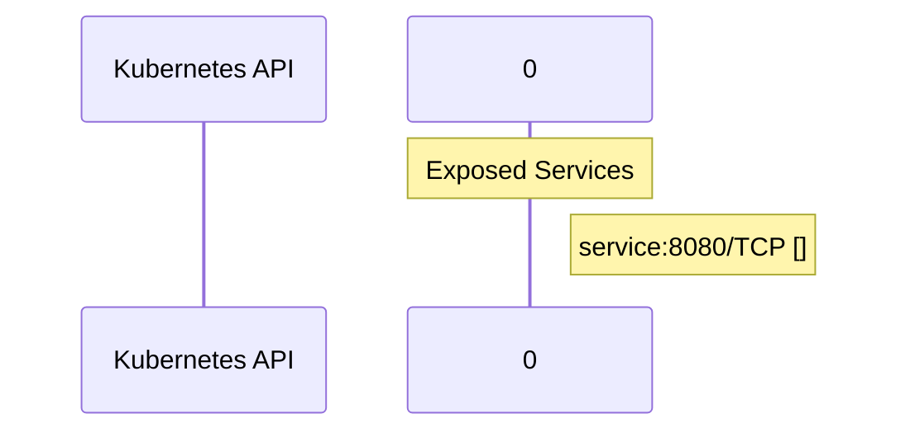

# llm-d-routing-sidecar: Dataflow

## Controller Watches

Kubernetes resources this controller monitors for changes. Each watch triggers reconciliation when the watched resource is created, updated, or deleted.

No controller watches found in analyzed sources.

## Reconciliation Flow

How the controller interacts with the Kubernetes API during reconciliation.

### HTTP Endpoints

| Method | Path | Source |
|--------|------|--------|
| * | / | [`.gomod-cache/golang.org/x/tools@v0.31.0/go/types/internal/play/play.go:46`](https://github.com/llm-d/llm-d-routing-sidecar/blob/cc502d185a124d82170df5675b7ec9a533acfd4f/.gomod-cache/golang.org/x/tools@v0.31.0/go/types/internal/play/play.go#L46) |
| * | / | [`.gopath-loader/pkg/mod/golang.org/x/tools@v0.31.0/cmd/present/dir.go:23`](https://github.com/llm-d/llm-d-routing-sidecar/blob/cc502d185a124d82170df5675b7ec9a533acfd4f/.gopath-loader/pkg/mod/golang.org/x/tools@v0.31.0/cmd/present/dir.go#L23) |
| * | / | [`.gopath-loader/pkg/mod/golang.org/x/tools@v0.31.0/cmd/godoc/handlers.go:42`](https://github.com/llm-d/llm-d-routing-sidecar/blob/cc502d185a124d82170df5675b7ec9a533acfd4f/.gopath-loader/pkg/mod/golang.org/x/tools@v0.31.0/cmd/godoc/handlers.go#L42) |
| * | / | [`.gomod-cache/github.com/google/pprof@v0.0.0-20250403155104-27863c87afa6/internal/driver/webui.go:212`](https://github.com/llm-d/llm-d-routing-sidecar/blob/cc502d185a124d82170df5675b7ec9a533acfd4f/.gomod-cache/github.com/google/pprof@v0.0.0-20250403155104-27863c87afa6/internal/driver/webui.go#L212) |
| * | / | [`.gomod-cache/golang.org/x/tools@v0.31.0/godoc/pres.go:130`](https://github.com/llm-d/llm-d-routing-sidecar/blob/cc502d185a124d82170df5675b7ec9a533acfd4f/.gomod-cache/golang.org/x/tools@v0.31.0/godoc/pres.go#L130) |
| * | / | [`.gopath-loader/pkg/mod/github.com/google/pprof@v0.0.0-20250403155104-27863c87afa6/internal/driver/webui.go:212`](https://github.com/llm-d/llm-d-routing-sidecar/blob/cc502d185a124d82170df5675b7ec9a533acfd4f/.gopath-loader/pkg/mod/github.com/google/pprof@v0.0.0-20250403155104-27863c87afa6/internal/driver/webui.go#L212) |
| * | / | [`.gopath-loader/pkg/mod/golang.org/x/tools@v0.31.0/cmd/godoc/handlers.go:31`](https://github.com/llm-d/llm-d-routing-sidecar/blob/cc502d185a124d82170df5675b7ec9a533acfd4f/.gopath-loader/pkg/mod/golang.org/x/tools@v0.31.0/cmd/godoc/handlers.go#L31) |
| * | / | [`.gomod-cache/golang.org/x/tools@v0.31.0/cmd/present/dir.go:23`](https://github.com/llm-d/llm-d-routing-sidecar/blob/cc502d185a124d82170df5675b7ec9a533acfd4f/.gomod-cache/golang.org/x/tools@v0.31.0/cmd/present/dir.go#L23) |
| * | / | [`.gopath-loader/pkg/mod/golang.org/x/net@v0.38.0/webdav/litmus_test_server.go:83`](https://github.com/llm-d/llm-d-routing-sidecar/blob/cc502d185a124d82170df5675b7ec9a533acfd4f/.gopath-loader/pkg/mod/golang.org/x/net@v0.38.0/webdav/litmus_test_server.go#L83) |
| * | / | [`.gopath-loader/pkg/mod/golang.org/x/tools@v0.31.0/go/types/internal/play/play.go:46`](https://github.com/llm-d/llm-d-routing-sidecar/blob/cc502d185a124d82170df5675b7ec9a533acfd4f/.gopath-loader/pkg/mod/golang.org/x/tools@v0.31.0/go/types/internal/play/play.go#L46) |
| * | / | [`.gopath-loader/pkg/mod/golang.org/x/tools@v0.31.0/godoc/pres.go:130`](https://github.com/llm-d/llm-d-routing-sidecar/blob/cc502d185a124d82170df5675b7ec9a533acfd4f/.gopath-loader/pkg/mod/golang.org/x/tools@v0.31.0/godoc/pres.go#L130) |
| * | / | [`.gomod-cache/golang.org/x/tools@v0.31.0/cmd/godoc/handlers.go:42`](https://github.com/llm-d/llm-d-routing-sidecar/blob/cc502d185a124d82170df5675b7ec9a533acfd4f/.gomod-cache/golang.org/x/tools@v0.31.0/cmd/godoc/handlers.go#L42) |
| * | / | [`.gomod-cache/golang.org/x/tools@v0.31.0/cmd/godoc/handlers.go:31`](https://github.com/llm-d/llm-d-routing-sidecar/blob/cc502d185a124d82170df5675b7ec9a533acfd4f/.gomod-cache/golang.org/x/tools@v0.31.0/cmd/godoc/handlers.go#L31) |
| * | / | [`.gomod-cache/golang.org/x/net@v0.38.0/webdav/litmus_test_server.go:83`](https://github.com/llm-d/llm-d-routing-sidecar/blob/cc502d185a124d82170df5675b7ec9a533acfd4f/.gomod-cache/golang.org/x/net@v0.38.0/webdav/litmus_test_server.go#L83) |
| * | / | [`internal/proxy/proxy.go:275`](https://github.com/llm-d/llm-d-routing-sidecar/blob/cc502d185a124d82170df5675b7ec9a533acfd4f/internal/proxy/proxy.go#L275) |
| * | /abort | [`.gopath-loader/pkg/mod/github.com/onsi/ginkgo/v2@v2.23.4/internal/parallel_support/http_server.go:63`](https://github.com/llm-d/llm-d-routing-sidecar/blob/cc502d185a124d82170df5675b7ec9a533acfd4f/.gopath-loader/pkg/mod/github.com/onsi/ginkgo/v2@v2.23.4/internal/parallel_support/http_server.go#L63) |
| * | /abort | [`.gomod-cache/github.com/onsi/ginkgo/v2@v2.23.4/internal/parallel_support/http_server.go:63`](https://github.com/llm-d/llm-d-routing-sidecar/blob/cc502d185a124d82170df5675b7ec9a533acfd4f/.gomod-cache/github.com/onsi/ginkgo/v2@v2.23.4/internal/parallel_support/http_server.go#L63) |
| * | /aggregated-nonprimary-procs-report | [`.gopath-loader/pkg/mod/github.com/onsi/ginkgo/v2@v2.23.4/internal/parallel_support/http_server.go:60`](https://github.com/llm-d/llm-d-routing-sidecar/blob/cc502d185a124d82170df5675b7ec9a533acfd4f/.gopath-loader/pkg/mod/github.com/onsi/ginkgo/v2@v2.23.4/internal/parallel_support/http_server.go#L60) |
| * | /aggregated-nonprimary-procs-report | [`.gomod-cache/github.com/onsi/ginkgo/v2@v2.23.4/internal/parallel_support/http_server.go:60`](https://github.com/llm-d/llm-d-routing-sidecar/blob/cc502d185a124d82170df5675b7ec9a533acfd4f/.gomod-cache/github.com/onsi/ginkgo/v2@v2.23.4/internal/parallel_support/http_server.go#L60) |
| * | /before-suite-completed | [`.gopath-loader/pkg/mod/github.com/onsi/ginkgo/v2@v2.23.4/internal/parallel_support/http_server.go:57`](https://github.com/llm-d/llm-d-routing-sidecar/blob/cc502d185a124d82170df5675b7ec9a533acfd4f/.gopath-loader/pkg/mod/github.com/onsi/ginkgo/v2@v2.23.4/internal/parallel_support/http_server.go#L57) |
| * | /before-suite-completed | [`.gomod-cache/github.com/onsi/ginkgo/v2@v2.23.4/internal/parallel_support/http_server.go:57`](https://github.com/llm-d/llm-d-routing-sidecar/blob/cc502d185a124d82170df5675b7ec9a533acfd4f/.gomod-cache/github.com/onsi/ginkgo/v2@v2.23.4/internal/parallel_support/http_server.go#L57) |
| * | /before-suite-state | [`.gopath-loader/pkg/mod/github.com/onsi/ginkgo/v2@v2.23.4/internal/parallel_support/http_server.go:58`](https://github.com/llm-d/llm-d-routing-sidecar/blob/cc502d185a124d82170df5675b7ec9a533acfd4f/.gopath-loader/pkg/mod/github.com/onsi/ginkgo/v2@v2.23.4/internal/parallel_support/http_server.go#L58) |
| * | /before-suite-state | [`.gomod-cache/github.com/onsi/ginkgo/v2@v2.23.4/internal/parallel_support/http_server.go:58`](https://github.com/llm-d/llm-d-routing-sidecar/blob/cc502d185a124d82170df5675b7ec9a533acfd4f/.gomod-cache/github.com/onsi/ginkgo/v2@v2.23.4/internal/parallel_support/http_server.go#L58) |
| * | /compile | [`.gomod-cache/golang.org/x/tools@v0.31.0/playground/playground.go:23`](https://github.com/llm-d/llm-d-routing-sidecar/blob/cc502d185a124d82170df5675b7ec9a533acfd4f/.gomod-cache/golang.org/x/tools@v0.31.0/playground/playground.go#L23) |
| * | /compile | [`.gopath-loader/pkg/mod/golang.org/x/tools@v0.31.0/playground/playground.go:23`](https://github.com/llm-d/llm-d-routing-sidecar/blob/cc502d185a124d82170df5675b7ec9a533acfd4f/.gopath-loader/pkg/mod/golang.org/x/tools@v0.31.0/playground/playground.go#L23) |
| * | /counter | [`.gomod-cache/github.com/onsi/ginkgo/v2@v2.23.4/internal/parallel_support/http_server.go:61`](https://github.com/llm-d/llm-d-routing-sidecar/blob/cc502d185a124d82170df5675b7ec9a533acfd4f/.gomod-cache/github.com/onsi/ginkgo/v2@v2.23.4/internal/parallel_support/http_server.go#L61) |
| * | /counter | [`.gopath-loader/pkg/mod/github.com/onsi/ginkgo/v2@v2.23.4/internal/parallel_support/http_server.go:61`](https://github.com/llm-d/llm-d-routing-sidecar/blob/cc502d185a124d82170df5675b7ec9a533acfd4f/.gopath-loader/pkg/mod/github.com/onsi/ginkgo/v2@v2.23.4/internal/parallel_support/http_server.go#L61) |
| * | /did-run | [`.gomod-cache/github.com/onsi/ginkgo/v2@v2.23.4/internal/parallel_support/http_server.go:49`](https://github.com/llm-d/llm-d-routing-sidecar/blob/cc502d185a124d82170df5675b7ec9a533acfd4f/.gomod-cache/github.com/onsi/ginkgo/v2@v2.23.4/internal/parallel_support/http_server.go#L49) |
| * | /did-run | [`.gopath-loader/pkg/mod/github.com/onsi/ginkgo/v2@v2.23.4/internal/parallel_support/http_server.go:49`](https://github.com/llm-d/llm-d-routing-sidecar/blob/cc502d185a124d82170df5675b7ec9a533acfd4f/.gopath-loader/pkg/mod/github.com/onsi/ginkgo/v2@v2.23.4/internal/parallel_support/http_server.go#L49) |
| * | /emit-output | [`.gomod-cache/github.com/onsi/ginkgo/v2@v2.23.4/internal/parallel_support/http_server.go:51`](https://github.com/llm-d/llm-d-routing-sidecar/blob/cc502d185a124d82170df5675b7ec9a533acfd4f/.gomod-cache/github.com/onsi/ginkgo/v2@v2.23.4/internal/parallel_support/http_server.go#L51) |
| * | /emit-output | [`.gopath-loader/pkg/mod/github.com/onsi/ginkgo/v2@v2.23.4/internal/parallel_support/http_server.go:51`](https://github.com/llm-d/llm-d-routing-sidecar/blob/cc502d185a124d82170df5675b7ec9a533acfd4f/.gopath-loader/pkg/mod/github.com/onsi/ginkgo/v2@v2.23.4/internal/parallel_support/http_server.go#L51) |
| * | /fmt | [`.gomod-cache/golang.org/x/tools@v0.31.0/cmd/godoc/handlers.go:39`](https://github.com/llm-d/llm-d-routing-sidecar/blob/cc502d185a124d82170df5675b7ec9a533acfd4f/.gomod-cache/golang.org/x/tools@v0.31.0/cmd/godoc/handlers.go#L39) |
| * | /fmt | [`.gopath-loader/pkg/mod/golang.org/x/tools@v0.31.0/cmd/godoc/handlers.go:39`](https://github.com/llm-d/llm-d-routing-sidecar/blob/cc502d185a124d82170df5675b7ec9a533acfd4f/.gopath-loader/pkg/mod/golang.org/x/tools@v0.31.0/cmd/godoc/handlers.go#L39) |
| * | /have-nonprimary-procs-finished | [`.gomod-cache/github.com/onsi/ginkgo/v2@v2.23.4/internal/parallel_support/http_server.go:59`](https://github.com/llm-d/llm-d-routing-sidecar/blob/cc502d185a124d82170df5675b7ec9a533acfd4f/.gomod-cache/github.com/onsi/ginkgo/v2@v2.23.4/internal/parallel_support/http_server.go#L59) |
| * | /have-nonprimary-procs-finished | [`.gopath-loader/pkg/mod/github.com/onsi/ginkgo/v2@v2.23.4/internal/parallel_support/http_server.go:59`](https://github.com/llm-d/llm-d-routing-sidecar/blob/cc502d185a124d82170df5675b7ec9a533acfd4f/.gopath-loader/pkg/mod/github.com/onsi/ginkgo/v2@v2.23.4/internal/parallel_support/http_server.go#L59) |
| * | /main.css | [`.gomod-cache/golang.org/x/tools@v0.31.0/go/types/internal/play/play.go:48`](https://github.com/llm-d/llm-d-routing-sidecar/blob/cc502d185a124d82170df5675b7ec9a533acfd4f/.gomod-cache/golang.org/x/tools@v0.31.0/go/types/internal/play/play.go#L48) |
| * | /main.css | [`.gopath-loader/pkg/mod/golang.org/x/tools@v0.31.0/go/types/internal/play/play.go:48`](https://github.com/llm-d/llm-d-routing-sidecar/blob/cc502d185a124d82170df5675b7ec9a533acfd4f/.gopath-loader/pkg/mod/golang.org/x/tools@v0.31.0/go/types/internal/play/play.go#L48) |
| * | /main.js | [`.gopath-loader/pkg/mod/golang.org/x/tools@v0.31.0/go/types/internal/play/play.go:47`](https://github.com/llm-d/llm-d-routing-sidecar/blob/cc502d185a124d82170df5675b7ec9a533acfd4f/.gopath-loader/pkg/mod/golang.org/x/tools@v0.31.0/go/types/internal/play/play.go#L47) |
| * | /main.js | [`.gomod-cache/golang.org/x/tools@v0.31.0/go/types/internal/play/play.go:47`](https://github.com/llm-d/llm-d-routing-sidecar/blob/cc502d185a124d82170df5675b7ec9a533acfd4f/.gomod-cache/golang.org/x/tools@v0.31.0/go/types/internal/play/play.go#L47) |
| * | /opensearch.xml | [`.gopath-loader/pkg/mod/golang.org/x/tools@v0.31.0/godoc/pres.go:133`](https://github.com/llm-d/llm-d-routing-sidecar/blob/cc502d185a124d82170df5675b7ec9a533acfd4f/.gopath-loader/pkg/mod/golang.org/x/tools@v0.31.0/godoc/pres.go#L133) |
| * | /opensearch.xml | [`.gomod-cache/golang.org/x/tools@v0.31.0/godoc/pres.go:133`](https://github.com/llm-d/llm-d-routing-sidecar/blob/cc502d185a124d82170df5675b7ec9a533acfd4f/.gomod-cache/golang.org/x/tools@v0.31.0/godoc/pres.go#L133) |
| * | /pkg/C/ | [`.gopath-loader/pkg/mod/golang.org/x/tools@v0.31.0/cmd/godoc/handlers.go:38`](https://github.com/llm-d/llm-d-routing-sidecar/blob/cc502d185a124d82170df5675b7ec9a533acfd4f/.gopath-loader/pkg/mod/golang.org/x/tools@v0.31.0/cmd/godoc/handlers.go#L38) |
| * | /pkg/C/ | [`.gomod-cache/golang.org/x/tools@v0.31.0/cmd/godoc/handlers.go:38`](https://github.com/llm-d/llm-d-routing-sidecar/blob/cc502d185a124d82170df5675b7ec9a533acfd4f/.gomod-cache/golang.org/x/tools@v0.31.0/cmd/godoc/handlers.go#L38) |
| * | /play.js | [`.gomod-cache/golang.org/x/tools@v0.31.0/cmd/present/play.go:43`](https://github.com/llm-d/llm-d-routing-sidecar/blob/cc502d185a124d82170df5675b7ec9a533acfd4f/.gomod-cache/golang.org/x/tools@v0.31.0/cmd/present/play.go#L43) |
| * | /play.js | [`.gopath-loader/pkg/mod/golang.org/x/tools@v0.31.0/cmd/present/play.go:43`](https://github.com/llm-d/llm-d-routing-sidecar/blob/cc502d185a124d82170df5675b7ec9a533acfd4f/.gopath-loader/pkg/mod/golang.org/x/tools@v0.31.0/cmd/present/play.go#L43) |
| * | /progress-report | [`.gopath-loader/pkg/mod/github.com/onsi/ginkgo/v2@v2.23.4/internal/parallel_support/http_server.go:52`](https://github.com/llm-d/llm-d-routing-sidecar/blob/cc502d185a124d82170df5675b7ec9a533acfd4f/.gopath-loader/pkg/mod/github.com/onsi/ginkgo/v2@v2.23.4/internal/parallel_support/http_server.go#L52) |
| * | /progress-report | [`.gomod-cache/github.com/onsi/ginkgo/v2@v2.23.4/internal/parallel_support/http_server.go:52`](https://github.com/llm-d/llm-d-routing-sidecar/blob/cc502d185a124d82170df5675b7ec9a533acfd4f/.gomod-cache/github.com/onsi/ginkgo/v2@v2.23.4/internal/parallel_support/http_server.go#L52) |
| * | /report-before-suite-completed | [`.gomod-cache/github.com/onsi/ginkgo/v2@v2.23.4/internal/parallel_support/http_server.go:55`](https://github.com/llm-d/llm-d-routing-sidecar/blob/cc502d185a124d82170df5675b7ec9a533acfd4f/.gomod-cache/github.com/onsi/ginkgo/v2@v2.23.4/internal/parallel_support/http_server.go#L55) |
| * | /report-before-suite-completed | [`.gopath-loader/pkg/mod/github.com/onsi/ginkgo/v2@v2.23.4/internal/parallel_support/http_server.go:55`](https://github.com/llm-d/llm-d-routing-sidecar/blob/cc502d185a124d82170df5675b7ec9a533acfd4f/.gopath-loader/pkg/mod/github.com/onsi/ginkgo/v2@v2.23.4/internal/parallel_support/http_server.go#L55) |
| * | /report-before-suite-state | [`.gomod-cache/github.com/onsi/ginkgo/v2@v2.23.4/internal/parallel_support/http_server.go:56`](https://github.com/llm-d/llm-d-routing-sidecar/blob/cc502d185a124d82170df5675b7ec9a533acfd4f/.gomod-cache/github.com/onsi/ginkgo/v2@v2.23.4/internal/parallel_support/http_server.go#L56) |
| * | /report-before-suite-state | [`.gopath-loader/pkg/mod/github.com/onsi/ginkgo/v2@v2.23.4/internal/parallel_support/http_server.go:56`](https://github.com/llm-d/llm-d-routing-sidecar/blob/cc502d185a124d82170df5675b7ec9a533acfd4f/.gopath-loader/pkg/mod/github.com/onsi/ginkgo/v2@v2.23.4/internal/parallel_support/http_server.go#L56) |
| * | /search | [`.gopath-loader/pkg/mod/golang.org/x/tools@v0.31.0/godoc/pres.go:131`](https://github.com/llm-d/llm-d-routing-sidecar/blob/cc502d185a124d82170df5675b7ec9a533acfd4f/.gopath-loader/pkg/mod/golang.org/x/tools@v0.31.0/godoc/pres.go#L131) |
| * | /search | [`.gomod-cache/golang.org/x/tools@v0.31.0/godoc/pres.go:131`](https://github.com/llm-d/llm-d-routing-sidecar/blob/cc502d185a124d82170df5675b7ec9a533acfd4f/.gomod-cache/golang.org/x/tools@v0.31.0/godoc/pres.go#L131) |
| * | /select.json | [`.gopath-loader/pkg/mod/golang.org/x/tools@v0.31.0/go/types/internal/play/play.go:49`](https://github.com/llm-d/llm-d-routing-sidecar/blob/cc502d185a124d82170df5675b7ec9a533acfd4f/.gopath-loader/pkg/mod/golang.org/x/tools@v0.31.0/go/types/internal/play/play.go#L49) |
| * | /select.json | [`.gomod-cache/golang.org/x/tools@v0.31.0/go/types/internal/play/play.go:49`](https://github.com/llm-d/llm-d-routing-sidecar/blob/cc502d185a124d82170df5675b7ec9a533acfd4f/.gomod-cache/golang.org/x/tools@v0.31.0/go/types/internal/play/play.go#L49) |
| * | /socket | [`.gopath-loader/pkg/mod/golang.org/x/tools@v0.31.0/cmd/present/play.go:59`](https://github.com/llm-d/llm-d-routing-sidecar/blob/cc502d185a124d82170df5675b7ec9a533acfd4f/.gopath-loader/pkg/mod/golang.org/x/tools@v0.31.0/cmd/present/play.go#L59) |
| * | /socket | [`.gomod-cache/golang.org/x/tools@v0.31.0/cmd/present/play.go:59`](https://github.com/llm-d/llm-d-routing-sidecar/blob/cc502d185a124d82170df5675b7ec9a533acfd4f/.gomod-cache/golang.org/x/tools@v0.31.0/cmd/present/play.go#L59) |
| * | /src/pkg/ | [`.gopath-loader/pkg/mod/golang.org/x/tools@v0.31.0/godoc/redirect/redirect.go:21`](https://github.com/llm-d/llm-d-routing-sidecar/blob/cc502d185a124d82170df5675b7ec9a533acfd4f/.gopath-loader/pkg/mod/golang.org/x/tools@v0.31.0/godoc/redirect/redirect.go#L21) |
| * | /src/pkg/ | [`.gomod-cache/golang.org/x/tools@v0.31.0/godoc/redirect/redirect.go:21`](https://github.com/llm-d/llm-d-routing-sidecar/blob/cc502d185a124d82170df5675b7ec9a533acfd4f/.gomod-cache/golang.org/x/tools@v0.31.0/godoc/redirect/redirect.go#L21) |
| * | /static/ | [`.gomod-cache/golang.org/x/tools@v0.31.0/cmd/present/main.go:98`](https://github.com/llm-d/llm-d-routing-sidecar/blob/cc502d185a124d82170df5675b7ec9a533acfd4f/.gomod-cache/golang.org/x/tools@v0.31.0/cmd/present/main.go#L98) |
| * | /static/ | [`.gopath-loader/pkg/mod/golang.org/x/tools@v0.31.0/cmd/present/main.go:98`](https://github.com/llm-d/llm-d-routing-sidecar/blob/cc502d185a124d82170df5675b7ec9a533acfd4f/.gopath-loader/pkg/mod/golang.org/x/tools@v0.31.0/cmd/present/main.go#L98) |
| * | /suite-did-end | [`.gomod-cache/github.com/onsi/ginkgo/v2@v2.23.4/internal/parallel_support/http_server.go:50`](https://github.com/llm-d/llm-d-routing-sidecar/blob/cc502d185a124d82170df5675b7ec9a533acfd4f/.gomod-cache/github.com/onsi/ginkgo/v2@v2.23.4/internal/parallel_support/http_server.go#L50) |
| * | /suite-did-end | [`.gopath-loader/pkg/mod/github.com/onsi/ginkgo/v2@v2.23.4/internal/parallel_support/http_server.go:50`](https://github.com/llm-d/llm-d-routing-sidecar/blob/cc502d185a124d82170df5675b7ec9a533acfd4f/.gopath-loader/pkg/mod/github.com/onsi/ginkgo/v2@v2.23.4/internal/parallel_support/http_server.go#L50) |
| * | /suite-will-begin | [`.gomod-cache/github.com/onsi/ginkgo/v2@v2.23.4/internal/parallel_support/http_server.go:48`](https://github.com/llm-d/llm-d-routing-sidecar/blob/cc502d185a124d82170df5675b7ec9a533acfd4f/.gomod-cache/github.com/onsi/ginkgo/v2@v2.23.4/internal/parallel_support/http_server.go#L48) |
| * | /suite-will-begin | [`.gopath-loader/pkg/mod/github.com/onsi/ginkgo/v2@v2.23.4/internal/parallel_support/http_server.go:48`](https://github.com/llm-d/llm-d-routing-sidecar/blob/cc502d185a124d82170df5675b7ec9a533acfd4f/.gopath-loader/pkg/mod/github.com/onsi/ginkgo/v2@v2.23.4/internal/parallel_support/http_server.go#L48) |
| * | /ui/ | [`.gopath-loader/pkg/mod/github.com/google/pprof@v0.0.0-20250403155104-27863c87afa6/internal/driver/webui.go:211`](https://github.com/llm-d/llm-d-routing-sidecar/blob/cc502d185a124d82170df5675b7ec9a533acfd4f/.gopath-loader/pkg/mod/github.com/google/pprof@v0.0.0-20250403155104-27863c87afa6/internal/driver/webui.go#L211) |
| * | /ui/ | [`.gomod-cache/github.com/google/pprof@v0.0.0-20250403155104-27863c87afa6/internal/driver/webui.go:211`](https://github.com/llm-d/llm-d-routing-sidecar/blob/cc502d185a124d82170df5675b7ec9a533acfd4f/.gomod-cache/github.com/google/pprof@v0.0.0-20250403155104-27863c87afa6/internal/driver/webui.go#L211) |
| * | /up | [`.gomod-cache/github.com/onsi/ginkgo/v2@v2.23.4/internal/parallel_support/http_server.go:62`](https://github.com/llm-d/llm-d-routing-sidecar/blob/cc502d185a124d82170df5675b7ec9a533acfd4f/.gomod-cache/github.com/onsi/ginkgo/v2@v2.23.4/internal/parallel_support/http_server.go#L62) |
| * | /up | [`.gopath-loader/pkg/mod/github.com/onsi/ginkgo/v2@v2.23.4/internal/parallel_support/http_server.go:62`](https://github.com/llm-d/llm-d-routing-sidecar/blob/cc502d185a124d82170df5675b7ec9a533acfd4f/.gopath-loader/pkg/mod/github.com/onsi/ginkgo/v2@v2.23.4/internal/parallel_support/http_server.go#L62) |
| GET | /{user-id} | [`.gopath-loader/pkg/mod/github.com/emicklei/go-restful/v3@v3.12.0/doc.go:83`](https://github.com/llm-d/llm-d-routing-sidecar/blob/cc502d185a124d82170df5675b7ec9a533acfd4f/.gopath-loader/pkg/mod/github.com/emicklei/go-restful/v3@v3.12.0/doc.go#L83) |
| GET | /{user-id} | [`.gopath-loader/pkg/mod/github.com/emicklei/go-restful/v3@v3.12.0/doc.go:19`](https://github.com/llm-d/llm-d-routing-sidecar/blob/cc502d185a124d82170df5675b7ec9a533acfd4f/.gopath-loader/pkg/mod/github.com/emicklei/go-restful/v3@v3.12.0/doc.go#L19) |
| GET | /{user-id} | [`.gomod-cache/github.com/emicklei/go-restful/v3@v3.12.0/doc.go:19`](https://github.com/llm-d/llm-d-routing-sidecar/blob/cc502d185a124d82170df5675b7ec9a533acfd4f/.gomod-cache/github.com/emicklei/go-restful/v3@v3.12.0/doc.go#L19) |
| GET | /{user-id} | [`.gomod-cache/github.com/emicklei/go-restful/v3@v3.12.0/doc.go:83`](https://github.com/llm-d/llm-d-routing-sidecar/blob/cc502d185a124d82170df5675b7ec9a533acfd4f/.gomod-cache/github.com/emicklei/go-restful/v3@v3.12.0/doc.go#L83) |
| * | GET /health | [`internal/proxy/proxy.go:239`](https://github.com/llm-d/llm-d-routing-sidecar/blob/cc502d185a124d82170df5675b7ec9a533acfd4f/internal/proxy/proxy.go#L239) |
| * | POST  | [`internal/proxy/proxy.go:242`](https://github.com/llm-d/llm-d-routing-sidecar/blob/cc502d185a124d82170df5675b7ec9a533acfd4f/internal/proxy/proxy.go#L242) |
| * | POST  | [`internal/proxy/proxy.go:243`](https://github.com/llm-d/llm-d-routing-sidecar/blob/cc502d185a124d82170df5675b7ec9a533acfd4f/internal/proxy/proxy.go#L243) |
| * | header | [`.gopath-loader/pkg/mod/golang.org/x/net@v0.38.0/quic/qlog.go:269`](https://github.com/llm-d/llm-d-routing-sidecar/blob/cc502d185a124d82170df5675b7ec9a533acfd4f/.gopath-loader/pkg/mod/golang.org/x/net@v0.38.0/quic/qlog.go#L269) |
| * | header | [`.gomod-cache/golang.org/x/net@v0.38.0/quic/qlog.go:213`](https://github.com/llm-d/llm-d-routing-sidecar/blob/cc502d185a124d82170df5675b7ec9a533acfd4f/.gomod-cache/golang.org/x/net@v0.38.0/quic/qlog.go#L213) |
| * | header | [`.gopath-loader/pkg/mod/golang.org/x/net@v0.38.0/quic/qlog.go:213`](https://github.com/llm-d/llm-d-routing-sidecar/blob/cc502d185a124d82170df5675b7ec9a533acfd4f/.gopath-loader/pkg/mod/golang.org/x/net@v0.38.0/quic/qlog.go#L213) |
| * | header | [`.gomod-cache/golang.org/x/net@v0.38.0/quic/qlog.go:167`](https://github.com/llm-d/llm-d-routing-sidecar/blob/cc502d185a124d82170df5675b7ec9a533acfd4f/.gomod-cache/golang.org/x/net@v0.38.0/quic/qlog.go#L167) |
| * | header | [`.gopath-loader/pkg/mod/golang.org/x/net@v0.38.0/quic/qlog.go:189`](https://github.com/llm-d/llm-d-routing-sidecar/blob/cc502d185a124d82170df5675b7ec9a533acfd4f/.gopath-loader/pkg/mod/golang.org/x/net@v0.38.0/quic/qlog.go#L189) |
| * | header | [`.gomod-cache/golang.org/x/net@v0.38.0/quic/qlog.go:189`](https://github.com/llm-d/llm-d-routing-sidecar/blob/cc502d185a124d82170df5675b7ec9a533acfd4f/.gomod-cache/golang.org/x/net@v0.38.0/quic/qlog.go#L189) |
| * | header | [`.gopath-loader/pkg/mod/golang.org/x/net@v0.38.0/quic/qlog.go:167`](https://github.com/llm-d/llm-d-routing-sidecar/blob/cc502d185a124d82170df5675b7ec9a533acfd4f/.gopath-loader/pkg/mod/golang.org/x/net@v0.38.0/quic/qlog.go#L167) |
| * | header | [`.gomod-cache/golang.org/x/net@v0.38.0/quic/qlog.go:269`](https://github.com/llm-d/llm-d-routing-sidecar/blob/cc502d185a124d82170df5675b7ec9a533acfd4f/.gomod-cache/golang.org/x/net@v0.38.0/quic/qlog.go#L269) |
| * | raw | [`.gomod-cache/golang.org/x/net@v0.38.0/quic/qlog.go:219`](https://github.com/llm-d/llm-d-routing-sidecar/blob/cc502d185a124d82170df5675b7ec9a533acfd4f/.gomod-cache/golang.org/x/net@v0.38.0/quic/qlog.go#L219) |
| * | raw | [`.gopath-loader/pkg/mod/golang.org/x/net@v0.38.0/quic/qlog.go:219`](https://github.com/llm-d/llm-d-routing-sidecar/blob/cc502d185a124d82170df5675b7ec9a533acfd4f/.gopath-loader/pkg/mod/golang.org/x/net@v0.38.0/quic/qlog.go#L219) |
| * | raw | [`.gomod-cache/golang.org/x/net@v0.38.0/quic/qlog.go:195`](https://github.com/llm-d/llm-d-routing-sidecar/blob/cc502d185a124d82170df5675b7ec9a533acfd4f/.gomod-cache/golang.org/x/net@v0.38.0/quic/qlog.go#L195) |
| * | raw | [`.gopath-loader/pkg/mod/golang.org/x/net@v0.38.0/quic/qlog.go:174`](https://github.com/llm-d/llm-d-routing-sidecar/blob/cc502d185a124d82170df5675b7ec9a533acfd4f/.gopath-loader/pkg/mod/golang.org/x/net@v0.38.0/quic/qlog.go#L174) |
| * | raw | [`.gomod-cache/golang.org/x/net@v0.38.0/quic/qlog.go:174`](https://github.com/llm-d/llm-d-routing-sidecar/blob/cc502d185a124d82170df5675b7ec9a533acfd4f/.gomod-cache/golang.org/x/net@v0.38.0/quic/qlog.go#L174) |
| * | raw | [`.gopath-loader/pkg/mod/golang.org/x/net@v0.38.0/quic/qlog.go:195`](https://github.com/llm-d/llm-d-routing-sidecar/blob/cc502d185a124d82170df5675b7ec9a533acfd4f/.gopath-loader/pkg/mod/golang.org/x/net@v0.38.0/quic/qlog.go#L195) |
| * | vantage_point | [`.gopath-loader/pkg/mod/golang.org/x/net@v0.38.0/quic/qlog.go:98`](https://github.com/llm-d/llm-d-routing-sidecar/blob/cc502d185a124d82170df5675b7ec9a533acfd4f/.gopath-loader/pkg/mod/golang.org/x/net@v0.38.0/quic/qlog.go#L98) |
| * | vantage_point | [`.gomod-cache/golang.org/x/net@v0.38.0/quic/qlog.go:98`](https://github.com/llm-d/llm-d-routing-sidecar/blob/cc502d185a124d82170df5675b7ec9a533acfd4f/.gomod-cache/golang.org/x/net@v0.38.0/quic/qlog.go#L98) |

## Configuration

ConfigMaps and Helm values that control this component's runtime behavior.

