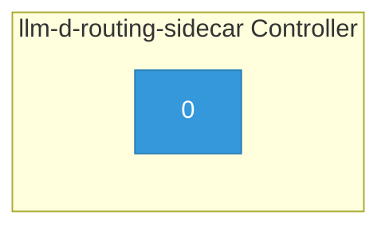

# llm-d-routing-sidecar

> **Architecture snapshot: 2026-05-16** (2026-05-16)

**Repository:** llm-d/llm-d-routing-sidecar  
**Analyzer:** arch-analyzer 0.2.0  
**Extracted:** 2026-05-16T03:47:38Z

## Summary

| Metric | Count |
|--------|-------|
| CRDs | 0 |
| Deployments | 1 |
| Services | 1 |
| Secrets | 0 |
| Cluster Roles | 0 |
| Controller Watches | 0 |

## Component Architecture

CRDs, controllers, and owned Kubernetes resources.

### CRDs

No CRDs defined.

## Dependencies

### Key External Dependencies

| Module | Version |
|--------|---------|
| github.com/go-logr/logr | v1.4.2 |
| github.com/go-logr/logr | v1.4.2 |
| github.com/go-logr/logr | v1.4.1 |
| github.com/go-logr/logr | v1.4.2 |
| github.com/go-logr/logr | v1.4.1 |
| k8s.io/api | v0.31.3 |
| k8s.io/api | v0.31.3 |
| k8s.io/apimachinery | v0.31.3 |
| k8s.io/apimachinery | v0.31.3 |
| k8s.io/apimachinery | v0.31.3 |
| k8s.io/client-go | v0.31.3 |

