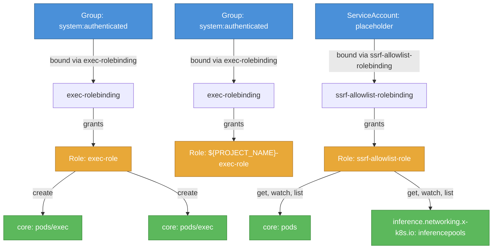

# llm-d-routing-sidecar: RBAC

ServiceAccount bindings, roles, and resource permissions.

## RBAC Hierarchy

## Bindings

Subject-to-role mappings defining who has access to what.

| Binding | Type | Role | Subject |
|---------|------|------|---------|
| exec-rolebinding | RoleBinding | exec-role | Group/system:authenticated |
| exec-rolebinding | RoleBinding | ${PROJECT_NAME}-exec-role | Group/system:authenticated |
| ssrf-allowlist-rolebinding | RoleBinding | ssrf-allowlist-role | ServiceAccount/placeholder |

## Role Details

Per-rule breakdown of API groups, resources, and verbs for each role.

| Role | Kind | API Groups | Resources | Verbs |
|------|------|------------|-----------|-------|
| exec-role | Role |  | pods/exec | create |
| exec-role | Role |  | pods/exec | create |
| ssrf-allowlist-role | Role |  | pods | get, watch, list |
| ssrf-allowlist-role | Role |  | inferencepools | get, watch, list |

