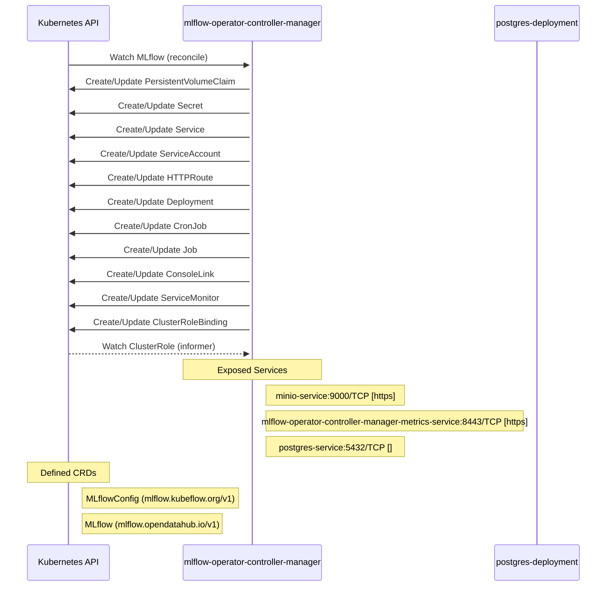

# mlflow-operator: Dataflow

## Controller Watches

Kubernetes resources this controller monitors for changes. Each watch triggers reconciliation when the watched resource is created, updated, or deleted.

| Type | GVK | Source |
|------|-----|--------|
| For | api/v1/MLflow | [`internal/controller/mlflow_controller.go:414`](https://github.com/opendatahub-io/mlflow-operator/blob/d6eee433c94c4492e55b5f16eda0c9f26f0291be/internal/controller/mlflow_controller.go#L414) |
| Owns | /v1/PersistentVolumeClaim | [`internal/controller/mlflow_controller.go:421`](https://github.com/opendatahub-io/mlflow-operator/blob/d6eee433c94c4492e55b5f16eda0c9f26f0291be/internal/controller/mlflow_controller.go#L421) |
| Owns | /v1/Secret | [`internal/controller/mlflow_controller.go:418`](https://github.com/opendatahub-io/mlflow-operator/blob/d6eee433c94c4492e55b5f16eda0c9f26f0291be/internal/controller/mlflow_controller.go#L418) |
| Owns | /v1/Service | [`internal/controller/mlflow_controller.go:419`](https://github.com/opendatahub-io/mlflow-operator/blob/d6eee433c94c4492e55b5f16eda0c9f26f0291be/internal/controller/mlflow_controller.go#L419) |
| Owns | /v1/ServiceAccount | [`internal/controller/mlflow_controller.go:420`](https://github.com/opendatahub-io/mlflow-operator/blob/d6eee433c94c4492e55b5f16eda0c9f26f0291be/internal/controller/mlflow_controller.go#L420) |
| Owns | apis/v1/HTTPRoute | [`internal/controller/mlflow_controller.go:450`](https://github.com/opendatahub-io/mlflow-operator/blob/d6eee433c94c4492e55b5f16eda0c9f26f0291be/internal/controller/mlflow_controller.go#L450) |
| Owns | apps/v1/Deployment | [`internal/controller/mlflow_controller.go:415`](https://github.com/opendatahub-io/mlflow-operator/blob/d6eee433c94c4492e55b5f16eda0c9f26f0291be/internal/controller/mlflow_controller.go#L415) |
| Owns | batch/v1/CronJob | [`internal/controller/mlflow_controller.go:417`](https://github.com/opendatahub-io/mlflow-operator/blob/d6eee433c94c4492e55b5f16eda0c9f26f0291be/internal/controller/mlflow_controller.go#L417) |
| Owns | batch/v1/Job | [`internal/controller/mlflow_controller.go:416`](https://github.com/opendatahub-io/mlflow-operator/blob/d6eee433c94c4492e55b5f16eda0c9f26f0291be/internal/controller/mlflow_controller.go#L416) |
| Owns | console/v1/ConsoleLink | [`internal/controller/mlflow_controller.go:442`](https://github.com/opendatahub-io/mlflow-operator/blob/d6eee433c94c4492e55b5f16eda0c9f26f0291be/internal/controller/mlflow_controller.go#L442) |
| Owns | monitoring/v1/ServiceMonitor | [`internal/controller/mlflow_controller.go:458`](https://github.com/opendatahub-io/mlflow-operator/blob/d6eee433c94c4492e55b5f16eda0c9f26f0291be/internal/controller/mlflow_controller.go#L458) |
| Owns | rbac.authorization.k8s.io/v1/ClusterRoleBinding | [`internal/controller/mlflow_controller.go:427`](https://github.com/opendatahub-io/mlflow-operator/blob/d6eee433c94c4492e55b5f16eda0c9f26f0291be/internal/controller/mlflow_controller.go#L427) |
| Watches | rbac.authorization.k8s.io/v1/ClusterRole | [`internal/controller/mlflow_controller.go:426`](https://github.com/opendatahub-io/mlflow-operator/blob/d6eee433c94c4492e55b5f16eda0c9f26f0291be/internal/controller/mlflow_controller.go#L426) |

### Programmatic Resource Operations

| Verb | Kind | Group | Condition |
|------|------|-------|----------|
| update | MLflow | api |  |

## Reconciliation Flow

How the controller interacts with the Kubernetes API during reconciliation.

### HTTP Endpoints

| Method | Path | Source |
|--------|------|--------|
| * | / | [`.gopath-loader/pkg/mod/golang.org/x/net@v0.49.0/webdav/litmus_test_server.go:83`](https://github.com/opendatahub-io/mlflow-operator/blob/d6eee433c94c4492e55b5f16eda0c9f26f0291be/.gopath-loader/pkg/mod/golang.org/x/net@v0.49.0/webdav/litmus_test_server.go#L83) |
| * | / | [`.gomod-cache/golang.org/x/tools@v0.40.0/go/types/internal/play/play.go:46`](https://github.com/opendatahub-io/mlflow-operator/blob/d6eee433c94c4492e55b5f16eda0c9f26f0291be/.gomod-cache/golang.org/x/tools@v0.40.0/go/types/internal/play/play.go#L46) |
| * | / | [`.gomod-cache/golang.org/x/tools@v0.40.0/cmd/present/dir.go:23`](https://github.com/opendatahub-io/mlflow-operator/blob/d6eee433c94c4492e55b5f16eda0c9f26f0291be/.gomod-cache/golang.org/x/tools@v0.40.0/cmd/present/dir.go#L23) |
| * | / | [`.gomod-cache/github.com/google/pprof@v0.0.0-20250403155104-27863c87afa6/internal/driver/webui.go:212`](https://github.com/opendatahub-io/mlflow-operator/blob/d6eee433c94c4492e55b5f16eda0c9f26f0291be/.gomod-cache/github.com/google/pprof@v0.0.0-20250403155104-27863c87afa6/internal/driver/webui.go#L212) |
| * | / | [`.gomod-cache/golang.org/x/net@v0.49.0/webdav/litmus_test_server.go:83`](https://github.com/opendatahub-io/mlflow-operator/blob/d6eee433c94c4492e55b5f16eda0c9f26f0291be/.gomod-cache/golang.org/x/net@v0.49.0/webdav/litmus_test_server.go#L83) |
| * | / | [`.gopath-loader/pkg/mod/github.com/google/pprof@v0.0.0-20250403155104-27863c87afa6/internal/driver/webui.go:212`](https://github.com/opendatahub-io/mlflow-operator/blob/d6eee433c94c4492e55b5f16eda0c9f26f0291be/.gopath-loader/pkg/mod/github.com/google/pprof@v0.0.0-20250403155104-27863c87afa6/internal/driver/webui.go#L212) |
| * | / | [`.gopath-loader/pkg/mod/golang.org/x/tools@v0.40.0/go/types/internal/play/play.go:46`](https://github.com/opendatahub-io/mlflow-operator/blob/d6eee433c94c4492e55b5f16eda0c9f26f0291be/.gopath-loader/pkg/mod/golang.org/x/tools@v0.40.0/go/types/internal/play/play.go#L46) |
| * | / | [`.gopath-loader/pkg/mod/golang.org/x/tools@v0.40.0/cmd/present/dir.go:23`](https://github.com/opendatahub-io/mlflow-operator/blob/d6eee433c94c4492e55b5f16eda0c9f26f0291be/.gopath-loader/pkg/mod/golang.org/x/tools@v0.40.0/cmd/present/dir.go#L23) |
| GET | / | [`.gomod-cache/k8s.io/apiserver@v0.34.3/pkg/server/routes/version.go:44`](https://github.com/opendatahub-io/mlflow-operator/blob/d6eee433c94c4492e55b5f16eda0c9f26f0291be/.gomod-cache/k8s.io/apiserver@v0.34.3/pkg/server/routes/version.go#L44) |
| GET | / | [`.gopath-loader/pkg/mod/k8s.io/apiserver@v0.34.3/pkg/endpoints/discovery/version.go:67`](https://github.com/opendatahub-io/mlflow-operator/blob/d6eee433c94c4492e55b5f16eda0c9f26f0291be/.gopath-loader/pkg/mod/k8s.io/apiserver@v0.34.3/pkg/endpoints/discovery/version.go#L67) |
| GET | / | [`.gopath-loader/pkg/mod/k8s.io/apiserver@v0.34.3/pkg/endpoints/discovery/root.go:154`](https://github.com/opendatahub-io/mlflow-operator/blob/d6eee433c94c4492e55b5f16eda0c9f26f0291be/.gopath-loader/pkg/mod/k8s.io/apiserver@v0.34.3/pkg/endpoints/discovery/root.go#L154) |
| GET | / | [`.gomod-cache/k8s.io/apiserver@v0.34.3/pkg/endpoints/discovery/aggregated/wrapper.go:58`](https://github.com/opendatahub-io/mlflow-operator/blob/d6eee433c94c4492e55b5f16eda0c9f26f0291be/.gomod-cache/k8s.io/apiserver@v0.34.3/pkg/endpoints/discovery/aggregated/wrapper.go#L58) |
| GET | / | [`.gomod-cache/k8s.io/apiserver@v0.34.3/pkg/endpoints/discovery/group.go:57`](https://github.com/opendatahub-io/mlflow-operator/blob/d6eee433c94c4492e55b5f16eda0c9f26f0291be/.gomod-cache/k8s.io/apiserver@v0.34.3/pkg/endpoints/discovery/group.go#L57) |
| GET | / | [`.gopath-loader/pkg/mod/k8s.io/apiserver@v0.34.3/pkg/server/routes/version.go:44`](https://github.com/opendatahub-io/mlflow-operator/blob/d6eee433c94c4492e55b5f16eda0c9f26f0291be/.gopath-loader/pkg/mod/k8s.io/apiserver@v0.34.3/pkg/server/routes/version.go#L44) |
| GET | / | [`.gopath-loader/pkg/mod/k8s.io/apiserver@v0.34.3/pkg/endpoints/discovery/legacy.go:59`](https://github.com/opendatahub-io/mlflow-operator/blob/d6eee433c94c4492e55b5f16eda0c9f26f0291be/.gopath-loader/pkg/mod/k8s.io/apiserver@v0.34.3/pkg/endpoints/discovery/legacy.go#L59) |
| GET | / | [`.gomod-cache/k8s.io/apiserver@v0.34.3/pkg/endpoints/discovery/legacy.go:59`](https://github.com/opendatahub-io/mlflow-operator/blob/d6eee433c94c4492e55b5f16eda0c9f26f0291be/.gomod-cache/k8s.io/apiserver@v0.34.3/pkg/endpoints/discovery/legacy.go#L59) |
| GET | / | [`.gomod-cache/k8s.io/apiserver@v0.34.3/pkg/endpoints/discovery/root.go:154`](https://github.com/opendatahub-io/mlflow-operator/blob/d6eee433c94c4492e55b5f16eda0c9f26f0291be/.gomod-cache/k8s.io/apiserver@v0.34.3/pkg/endpoints/discovery/root.go#L154) |
| GET | / | [`.gomod-cache/k8s.io/apiserver@v0.34.3/pkg/endpoints/discovery/version.go:67`](https://github.com/opendatahub-io/mlflow-operator/blob/d6eee433c94c4492e55b5f16eda0c9f26f0291be/.gomod-cache/k8s.io/apiserver@v0.34.3/pkg/endpoints/discovery/version.go#L67) |
| GET | / | [`.gopath-loader/pkg/mod/k8s.io/apiserver@v0.34.3/pkg/endpoints/discovery/aggregated/wrapper.go:58`](https://github.com/opendatahub-io/mlflow-operator/blob/d6eee433c94c4492e55b5f16eda0c9f26f0291be/.gopath-loader/pkg/mod/k8s.io/apiserver@v0.34.3/pkg/endpoints/discovery/aggregated/wrapper.go#L58) |
| GET | / | [`.gopath-loader/pkg/mod/k8s.io/apiserver@v0.34.3/pkg/endpoints/discovery/group.go:57`](https://github.com/opendatahub-io/mlflow-operator/blob/d6eee433c94c4492e55b5f16eda0c9f26f0291be/.gopath-loader/pkg/mod/k8s.io/apiserver@v0.34.3/pkg/endpoints/discovery/group.go#L57) |
| * | /abort | [`.gomod-cache/github.com/onsi/ginkgo/v2@v2.27.2/internal/parallel_support/http_server.go:63`](https://github.com/opendatahub-io/mlflow-operator/blob/d6eee433c94c4492e55b5f16eda0c9f26f0291be/.gomod-cache/github.com/onsi/ginkgo/v2@v2.27.2/internal/parallel_support/http_server.go#L63) |
| * | /abort | [`.gopath-loader/pkg/mod/github.com/onsi/ginkgo/v2@v2.27.2/internal/parallel_support/http_server.go:63`](https://github.com/opendatahub-io/mlflow-operator/blob/d6eee433c94c4492e55b5f16eda0c9f26f0291be/.gopath-loader/pkg/mod/github.com/onsi/ginkgo/v2@v2.27.2/internal/parallel_support/http_server.go#L63) |
| * | /aggregated-nonprimary-procs-report | [`.gopath-loader/pkg/mod/github.com/onsi/ginkgo/v2@v2.27.2/internal/parallel_support/http_server.go:60`](https://github.com/opendatahub-io/mlflow-operator/blob/d6eee433c94c4492e55b5f16eda0c9f26f0291be/.gopath-loader/pkg/mod/github.com/onsi/ginkgo/v2@v2.27.2/internal/parallel_support/http_server.go#L60) |
| * | /aggregated-nonprimary-procs-report | [`.gomod-cache/github.com/onsi/ginkgo/v2@v2.27.2/internal/parallel_support/http_server.go:60`](https://github.com/opendatahub-io/mlflow-operator/blob/d6eee433c94c4492e55b5f16eda0c9f26f0291be/.gomod-cache/github.com/onsi/ginkgo/v2@v2.27.2/internal/parallel_support/http_server.go#L60) |
| * | /before-suite-completed | [`.gopath-loader/pkg/mod/github.com/onsi/ginkgo/v2@v2.27.2/internal/parallel_support/http_server.go:57`](https://github.com/opendatahub-io/mlflow-operator/blob/d6eee433c94c4492e55b5f16eda0c9f26f0291be/.gopath-loader/pkg/mod/github.com/onsi/ginkgo/v2@v2.27.2/internal/parallel_support/http_server.go#L57) |
| * | /before-suite-completed | [`.gomod-cache/github.com/onsi/ginkgo/v2@v2.27.2/internal/parallel_support/http_server.go:57`](https://github.com/opendatahub-io/mlflow-operator/blob/d6eee433c94c4492e55b5f16eda0c9f26f0291be/.gomod-cache/github.com/onsi/ginkgo/v2@v2.27.2/internal/parallel_support/http_server.go#L57) |
| * | /before-suite-state | [`.gopath-loader/pkg/mod/github.com/onsi/ginkgo/v2@v2.27.2/internal/parallel_support/http_server.go:58`](https://github.com/opendatahub-io/mlflow-operator/blob/d6eee433c94c4492e55b5f16eda0c9f26f0291be/.gopath-loader/pkg/mod/github.com/onsi/ginkgo/v2@v2.27.2/internal/parallel_support/http_server.go#L58) |
| * | /before-suite-state | [`.gomod-cache/github.com/onsi/ginkgo/v2@v2.27.2/internal/parallel_support/http_server.go:58`](https://github.com/opendatahub-io/mlflow-operator/blob/d6eee433c94c4492e55b5f16eda0c9f26f0291be/.gomod-cache/github.com/onsi/ginkgo/v2@v2.27.2/internal/parallel_support/http_server.go#L58) |
| * | /compile | [`.gomod-cache/golang.org/x/tools@v0.40.0/playground/playground.go:23`](https://github.com/opendatahub-io/mlflow-operator/blob/d6eee433c94c4492e55b5f16eda0c9f26f0291be/.gomod-cache/golang.org/x/tools@v0.40.0/playground/playground.go#L23) |
| * | /compile | [`.gopath-loader/pkg/mod/golang.org/x/tools@v0.40.0/playground/playground.go:23`](https://github.com/opendatahub-io/mlflow-operator/blob/d6eee433c94c4492e55b5f16eda0c9f26f0291be/.gopath-loader/pkg/mod/golang.org/x/tools@v0.40.0/playground/playground.go#L23) |
| * | /counter | [`.gopath-loader/pkg/mod/github.com/onsi/ginkgo/v2@v2.27.2/internal/parallel_support/http_server.go:61`](https://github.com/opendatahub-io/mlflow-operator/blob/d6eee433c94c4492e55b5f16eda0c9f26f0291be/.gopath-loader/pkg/mod/github.com/onsi/ginkgo/v2@v2.27.2/internal/parallel_support/http_server.go#L61) |
| * | /counter | [`.gomod-cache/github.com/onsi/ginkgo/v2@v2.27.2/internal/parallel_support/http_server.go:61`](https://github.com/opendatahub-io/mlflow-operator/blob/d6eee433c94c4492e55b5f16eda0c9f26f0291be/.gomod-cache/github.com/onsi/ginkgo/v2@v2.27.2/internal/parallel_support/http_server.go#L61) |
| * | /debug/flags | [`.gopath-loader/pkg/mod/k8s.io/apiserver@v0.34.3/pkg/server/routes/debugsocket.go:55`](https://github.com/opendatahub-io/mlflow-operator/blob/d6eee433c94c4492e55b5f16eda0c9f26f0291be/.gopath-loader/pkg/mod/k8s.io/apiserver@v0.34.3/pkg/server/routes/debugsocket.go#L55) |
| * | /debug/flags | [`.gomod-cache/k8s.io/apiserver@v0.34.3/pkg/server/routes/debugsocket.go:55`](https://github.com/opendatahub-io/mlflow-operator/blob/d6eee433c94c4492e55b5f16eda0c9f26f0291be/.gomod-cache/k8s.io/apiserver@v0.34.3/pkg/server/routes/debugsocket.go#L55) |
| * | /debug/flags/ | [`.gopath-loader/pkg/mod/k8s.io/apiserver@v0.34.3/pkg/server/routes/debugsocket.go:56`](https://github.com/opendatahub-io/mlflow-operator/blob/d6eee433c94c4492e55b5f16eda0c9f26f0291be/.gopath-loader/pkg/mod/k8s.io/apiserver@v0.34.3/pkg/server/routes/debugsocket.go#L56) |
| * | /debug/flags/ | [`.gomod-cache/k8s.io/apiserver@v0.34.3/pkg/server/routes/debugsocket.go:56`](https://github.com/opendatahub-io/mlflow-operator/blob/d6eee433c94c4492e55b5f16eda0c9f26f0291be/.gomod-cache/k8s.io/apiserver@v0.34.3/pkg/server/routes/debugsocket.go#L56) |
| * | /debug/pprof | [`.gomod-cache/k8s.io/apiserver@v0.34.3/pkg/server/routes/debugsocket.go:44`](https://github.com/opendatahub-io/mlflow-operator/blob/d6eee433c94c4492e55b5f16eda0c9f26f0291be/.gomod-cache/k8s.io/apiserver@v0.34.3/pkg/server/routes/debugsocket.go#L44) |
| * | /debug/pprof | [`.gopath-loader/pkg/mod/k8s.io/apiserver@v0.34.3/pkg/server/routes/debugsocket.go:44`](https://github.com/opendatahub-io/mlflow-operator/blob/d6eee433c94c4492e55b5f16eda0c9f26f0291be/.gopath-loader/pkg/mod/k8s.io/apiserver@v0.34.3/pkg/server/routes/debugsocket.go#L44) |
| * | /debug/pprof/ | [`.gopath-loader/pkg/mod/sigs.k8s.io/controller-runtime@v0.22.4/pkg/manager/internal.go:316`](https://github.com/opendatahub-io/mlflow-operator/blob/d6eee433c94c4492e55b5f16eda0c9f26f0291be/.gopath-loader/pkg/mod/sigs.k8s.io/controller-runtime@v0.22.4/pkg/manager/internal.go#L316) |
| * | /debug/pprof/ | [`.gopath-loader/pkg/mod/k8s.io/apiserver@v0.34.3/pkg/server/routes/debugsocket.go:45`](https://github.com/opendatahub-io/mlflow-operator/blob/d6eee433c94c4492e55b5f16eda0c9f26f0291be/.gopath-loader/pkg/mod/k8s.io/apiserver@v0.34.3/pkg/server/routes/debugsocket.go#L45) |
| * | /debug/pprof/ | [`.gomod-cache/sigs.k8s.io/controller-runtime@v0.22.4/pkg/manager/internal.go:316`](https://github.com/opendatahub-io/mlflow-operator/blob/d6eee433c94c4492e55b5f16eda0c9f26f0291be/.gomod-cache/sigs.k8s.io/controller-runtime@v0.22.4/pkg/manager/internal.go#L316) |
| * | /debug/pprof/ | [`.gomod-cache/k8s.io/apiserver@v0.34.3/pkg/server/routes/debugsocket.go:45`](https://github.com/opendatahub-io/mlflow-operator/blob/d6eee433c94c4492e55b5f16eda0c9f26f0291be/.gomod-cache/k8s.io/apiserver@v0.34.3/pkg/server/routes/debugsocket.go#L45) |
| * | /debug/pprof/cmdline | [`.gopath-loader/pkg/mod/sigs.k8s.io/controller-runtime@v0.22.4/pkg/manager/internal.go:317`](https://github.com/opendatahub-io/mlflow-operator/blob/d6eee433c94c4492e55b5f16eda0c9f26f0291be/.gopath-loader/pkg/mod/sigs.k8s.io/controller-runtime@v0.22.4/pkg/manager/internal.go#L317) |
| * | /debug/pprof/cmdline | [`.gomod-cache/k8s.io/apiserver@v0.34.3/pkg/server/routes/debugsocket.go:46`](https://github.com/opendatahub-io/mlflow-operator/blob/d6eee433c94c4492e55b5f16eda0c9f26f0291be/.gomod-cache/k8s.io/apiserver@v0.34.3/pkg/server/routes/debugsocket.go#L46) |
| * | /debug/pprof/cmdline | [`.gopath-loader/pkg/mod/k8s.io/apiserver@v0.34.3/pkg/server/routes/debugsocket.go:46`](https://github.com/opendatahub-io/mlflow-operator/blob/d6eee433c94c4492e55b5f16eda0c9f26f0291be/.gopath-loader/pkg/mod/k8s.io/apiserver@v0.34.3/pkg/server/routes/debugsocket.go#L46) |
| * | /debug/pprof/cmdline | [`.gomod-cache/sigs.k8s.io/controller-runtime@v0.22.4/pkg/manager/internal.go:317`](https://github.com/opendatahub-io/mlflow-operator/blob/d6eee433c94c4492e55b5f16eda0c9f26f0291be/.gomod-cache/sigs.k8s.io/controller-runtime@v0.22.4/pkg/manager/internal.go#L317) |
| * | /debug/pprof/profile | [`.gopath-loader/pkg/mod/k8s.io/apiserver@v0.34.3/pkg/server/routes/debugsocket.go:47`](https://github.com/opendatahub-io/mlflow-operator/blob/d6eee433c94c4492e55b5f16eda0c9f26f0291be/.gopath-loader/pkg/mod/k8s.io/apiserver@v0.34.3/pkg/server/routes/debugsocket.go#L47) |
| * | /debug/pprof/profile | [`.gomod-cache/k8s.io/apiserver@v0.34.3/pkg/server/routes/debugsocket.go:47`](https://github.com/opendatahub-io/mlflow-operator/blob/d6eee433c94c4492e55b5f16eda0c9f26f0291be/.gomod-cache/k8s.io/apiserver@v0.34.3/pkg/server/routes/debugsocket.go#L47) |
| * | /debug/pprof/profile | [`.gopath-loader/pkg/mod/sigs.k8s.io/controller-runtime@v0.22.4/pkg/manager/internal.go:318`](https://github.com/opendatahub-io/mlflow-operator/blob/d6eee433c94c4492e55b5f16eda0c9f26f0291be/.gopath-loader/pkg/mod/sigs.k8s.io/controller-runtime@v0.22.4/pkg/manager/internal.go#L318) |
| * | /debug/pprof/profile | [`.gomod-cache/sigs.k8s.io/controller-runtime@v0.22.4/pkg/manager/internal.go:318`](https://github.com/opendatahub-io/mlflow-operator/blob/d6eee433c94c4492e55b5f16eda0c9f26f0291be/.gomod-cache/sigs.k8s.io/controller-runtime@v0.22.4/pkg/manager/internal.go#L318) |
| * | /debug/pprof/symbol | [`.gomod-cache/k8s.io/apiserver@v0.34.3/pkg/server/routes/debugsocket.go:48`](https://github.com/opendatahub-io/mlflow-operator/blob/d6eee433c94c4492e55b5f16eda0c9f26f0291be/.gomod-cache/k8s.io/apiserver@v0.34.3/pkg/server/routes/debugsocket.go#L48) |
| * | /debug/pprof/symbol | [`.gopath-loader/pkg/mod/sigs.k8s.io/controller-runtime@v0.22.4/pkg/manager/internal.go:319`](https://github.com/opendatahub-io/mlflow-operator/blob/d6eee433c94c4492e55b5f16eda0c9f26f0291be/.gopath-loader/pkg/mod/sigs.k8s.io/controller-runtime@v0.22.4/pkg/manager/internal.go#L319) |
| * | /debug/pprof/symbol | [`.gomod-cache/sigs.k8s.io/controller-runtime@v0.22.4/pkg/manager/internal.go:319`](https://github.com/opendatahub-io/mlflow-operator/blob/d6eee433c94c4492e55b5f16eda0c9f26f0291be/.gomod-cache/sigs.k8s.io/controller-runtime@v0.22.4/pkg/manager/internal.go#L319) |
| * | /debug/pprof/symbol | [`.gopath-loader/pkg/mod/k8s.io/apiserver@v0.34.3/pkg/server/routes/debugsocket.go:48`](https://github.com/opendatahub-io/mlflow-operator/blob/d6eee433c94c4492e55b5f16eda0c9f26f0291be/.gopath-loader/pkg/mod/k8s.io/apiserver@v0.34.3/pkg/server/routes/debugsocket.go#L48) |
| * | /debug/pprof/trace | [`.gopath-loader/pkg/mod/sigs.k8s.io/controller-runtime@v0.22.4/pkg/manager/internal.go:320`](https://github.com/opendatahub-io/mlflow-operator/blob/d6eee433c94c4492e55b5f16eda0c9f26f0291be/.gopath-loader/pkg/mod/sigs.k8s.io/controller-runtime@v0.22.4/pkg/manager/internal.go#L320) |
| * | /debug/pprof/trace | [`.gomod-cache/k8s.io/apiserver@v0.34.3/pkg/server/routes/debugsocket.go:49`](https://github.com/opendatahub-io/mlflow-operator/blob/d6eee433c94c4492e55b5f16eda0c9f26f0291be/.gomod-cache/k8s.io/apiserver@v0.34.3/pkg/server/routes/debugsocket.go#L49) |
| * | /debug/pprof/trace | [`.gomod-cache/sigs.k8s.io/controller-runtime@v0.22.4/pkg/manager/internal.go:320`](https://github.com/opendatahub-io/mlflow-operator/blob/d6eee433c94c4492e55b5f16eda0c9f26f0291be/.gomod-cache/sigs.k8s.io/controller-runtime@v0.22.4/pkg/manager/internal.go#L320) |
| * | /debug/pprof/trace | [`.gopath-loader/pkg/mod/k8s.io/apiserver@v0.34.3/pkg/server/routes/debugsocket.go:49`](https://github.com/opendatahub-io/mlflow-operator/blob/d6eee433c94c4492e55b5f16eda0c9f26f0291be/.gopath-loader/pkg/mod/k8s.io/apiserver@v0.34.3/pkg/server/routes/debugsocket.go#L49) |
| * | /did-run | [`.gopath-loader/pkg/mod/github.com/onsi/ginkgo/v2@v2.27.2/internal/parallel_support/http_server.go:49`](https://github.com/opendatahub-io/mlflow-operator/blob/d6eee433c94c4492e55b5f16eda0c9f26f0291be/.gopath-loader/pkg/mod/github.com/onsi/ginkgo/v2@v2.27.2/internal/parallel_support/http_server.go#L49) |
| * | /did-run | [`.gomod-cache/github.com/onsi/ginkgo/v2@v2.27.2/internal/parallel_support/http_server.go:49`](https://github.com/opendatahub-io/mlflow-operator/blob/d6eee433c94c4492e55b5f16eda0c9f26f0291be/.gomod-cache/github.com/onsi/ginkgo/v2@v2.27.2/internal/parallel_support/http_server.go#L49) |
| * | /emit-output | [`.gopath-loader/pkg/mod/github.com/onsi/ginkgo/v2@v2.27.2/internal/parallel_support/http_server.go:51`](https://github.com/opendatahub-io/mlflow-operator/blob/d6eee433c94c4492e55b5f16eda0c9f26f0291be/.gopath-loader/pkg/mod/github.com/onsi/ginkgo/v2@v2.27.2/internal/parallel_support/http_server.go#L51) |
| * | /emit-output | [`.gomod-cache/github.com/onsi/ginkgo/v2@v2.27.2/internal/parallel_support/http_server.go:51`](https://github.com/opendatahub-io/mlflow-operator/blob/d6eee433c94c4492e55b5f16eda0c9f26f0291be/.gomod-cache/github.com/onsi/ginkgo/v2@v2.27.2/internal/parallel_support/http_server.go#L51) |
| * | /have-nonprimary-procs-finished | [`.gomod-cache/github.com/onsi/ginkgo/v2@v2.27.2/internal/parallel_support/http_server.go:59`](https://github.com/opendatahub-io/mlflow-operator/blob/d6eee433c94c4492e55b5f16eda0c9f26f0291be/.gomod-cache/github.com/onsi/ginkgo/v2@v2.27.2/internal/parallel_support/http_server.go#L59) |
| * | /have-nonprimary-procs-finished | [`.gopath-loader/pkg/mod/github.com/onsi/ginkgo/v2@v2.27.2/internal/parallel_support/http_server.go:59`](https://github.com/opendatahub-io/mlflow-operator/blob/d6eee433c94c4492e55b5f16eda0c9f26f0291be/.gopath-loader/pkg/mod/github.com/onsi/ginkgo/v2@v2.27.2/internal/parallel_support/http_server.go#L59) |
| * | /main.css | [`.gopath-loader/pkg/mod/golang.org/x/tools@v0.40.0/go/types/internal/play/play.go:48`](https://github.com/opendatahub-io/mlflow-operator/blob/d6eee433c94c4492e55b5f16eda0c9f26f0291be/.gopath-loader/pkg/mod/golang.org/x/tools@v0.40.0/go/types/internal/play/play.go#L48) |
| * | /main.css | [`.gomod-cache/golang.org/x/tools@v0.40.0/go/types/internal/play/play.go:48`](https://github.com/opendatahub-io/mlflow-operator/blob/d6eee433c94c4492e55b5f16eda0c9f26f0291be/.gomod-cache/golang.org/x/tools@v0.40.0/go/types/internal/play/play.go#L48) |
| * | /main.js | [`.gomod-cache/golang.org/x/tools@v0.40.0/go/types/internal/play/play.go:47`](https://github.com/opendatahub-io/mlflow-operator/blob/d6eee433c94c4492e55b5f16eda0c9f26f0291be/.gomod-cache/golang.org/x/tools@v0.40.0/go/types/internal/play/play.go#L47) |
| * | /main.js | [`.gopath-loader/pkg/mod/golang.org/x/tools@v0.40.0/go/types/internal/play/play.go:47`](https://github.com/opendatahub-io/mlflow-operator/blob/d6eee433c94c4492e55b5f16eda0c9f26f0291be/.gopath-loader/pkg/mod/golang.org/x/tools@v0.40.0/go/types/internal/play/play.go#L47) |
| * | /play.js | [`.gopath-loader/pkg/mod/golang.org/x/tools@v0.40.0/cmd/present/play.go:43`](https://github.com/opendatahub-io/mlflow-operator/blob/d6eee433c94c4492e55b5f16eda0c9f26f0291be/.gopath-loader/pkg/mod/golang.org/x/tools@v0.40.0/cmd/present/play.go#L43) |
| * | /play.js | [`.gomod-cache/golang.org/x/tools@v0.40.0/cmd/present/play.go:43`](https://github.com/opendatahub-io/mlflow-operator/blob/d6eee433c94c4492e55b5f16eda0c9f26f0291be/.gomod-cache/golang.org/x/tools@v0.40.0/cmd/present/play.go#L43) |
| * | /progress-report | [`.gomod-cache/github.com/onsi/ginkgo/v2@v2.27.2/internal/parallel_support/http_server.go:52`](https://github.com/opendatahub-io/mlflow-operator/blob/d6eee433c94c4492e55b5f16eda0c9f26f0291be/.gomod-cache/github.com/onsi/ginkgo/v2@v2.27.2/internal/parallel_support/http_server.go#L52) |
| * | /progress-report | [`.gopath-loader/pkg/mod/github.com/onsi/ginkgo/v2@v2.27.2/internal/parallel_support/http_server.go:52`](https://github.com/opendatahub-io/mlflow-operator/blob/d6eee433c94c4492e55b5f16eda0c9f26f0291be/.gopath-loader/pkg/mod/github.com/onsi/ginkgo/v2@v2.27.2/internal/parallel_support/http_server.go#L52) |
| * | /report-before-suite-completed | [`.gopath-loader/pkg/mod/github.com/onsi/ginkgo/v2@v2.27.2/internal/parallel_support/http_server.go:55`](https://github.com/opendatahub-io/mlflow-operator/blob/d6eee433c94c4492e55b5f16eda0c9f26f0291be/.gopath-loader/pkg/mod/github.com/onsi/ginkgo/v2@v2.27.2/internal/parallel_support/http_server.go#L55) |
| * | /report-before-suite-completed | [`.gomod-cache/github.com/onsi/ginkgo/v2@v2.27.2/internal/parallel_support/http_server.go:55`](https://github.com/opendatahub-io/mlflow-operator/blob/d6eee433c94c4492e55b5f16eda0c9f26f0291be/.gomod-cache/github.com/onsi/ginkgo/v2@v2.27.2/internal/parallel_support/http_server.go#L55) |
| * | /report-before-suite-state | [`.gopath-loader/pkg/mod/github.com/onsi/ginkgo/v2@v2.27.2/internal/parallel_support/http_server.go:56`](https://github.com/opendatahub-io/mlflow-operator/blob/d6eee433c94c4492e55b5f16eda0c9f26f0291be/.gopath-loader/pkg/mod/github.com/onsi/ginkgo/v2@v2.27.2/internal/parallel_support/http_server.go#L56) |
| * | /report-before-suite-state | [`.gomod-cache/github.com/onsi/ginkgo/v2@v2.27.2/internal/parallel_support/http_server.go:56`](https://github.com/opendatahub-io/mlflow-operator/blob/d6eee433c94c4492e55b5f16eda0c9f26f0291be/.gomod-cache/github.com/onsi/ginkgo/v2@v2.27.2/internal/parallel_support/http_server.go#L56) |
| * | /select.json | [`.gopath-loader/pkg/mod/golang.org/x/tools@v0.40.0/go/types/internal/play/play.go:49`](https://github.com/opendatahub-io/mlflow-operator/blob/d6eee433c94c4492e55b5f16eda0c9f26f0291be/.gopath-loader/pkg/mod/golang.org/x/tools@v0.40.0/go/types/internal/play/play.go#L49) |
| * | /select.json | [`.gomod-cache/golang.org/x/tools@v0.40.0/go/types/internal/play/play.go:49`](https://github.com/opendatahub-io/mlflow-operator/blob/d6eee433c94c4492e55b5f16eda0c9f26f0291be/.gomod-cache/golang.org/x/tools@v0.40.0/go/types/internal/play/play.go#L49) |
| * | /socket | [`.gomod-cache/golang.org/x/tools@v0.40.0/cmd/present/play.go:59`](https://github.com/opendatahub-io/mlflow-operator/blob/d6eee433c94c4492e55b5f16eda0c9f26f0291be/.gomod-cache/golang.org/x/tools@v0.40.0/cmd/present/play.go#L59) |
| * | /socket | [`.gopath-loader/pkg/mod/golang.org/x/tools@v0.40.0/cmd/present/play.go:59`](https://github.com/opendatahub-io/mlflow-operator/blob/d6eee433c94c4492e55b5f16eda0c9f26f0291be/.gopath-loader/pkg/mod/golang.org/x/tools@v0.40.0/cmd/present/play.go#L59) |
| * | /static/ | [`.gomod-cache/golang.org/x/tools@v0.40.0/cmd/present/main.go:98`](https://github.com/opendatahub-io/mlflow-operator/blob/d6eee433c94c4492e55b5f16eda0c9f26f0291be/.gomod-cache/golang.org/x/tools@v0.40.0/cmd/present/main.go#L98) |
| * | /static/ | [`.gopath-loader/pkg/mod/golang.org/x/tools@v0.40.0/cmd/present/main.go:98`](https://github.com/opendatahub-io/mlflow-operator/blob/d6eee433c94c4492e55b5f16eda0c9f26f0291be/.gopath-loader/pkg/mod/golang.org/x/tools@v0.40.0/cmd/present/main.go#L98) |
| * | /suite-did-end | [`.gopath-loader/pkg/mod/github.com/onsi/ginkgo/v2@v2.27.2/internal/parallel_support/http_server.go:50`](https://github.com/opendatahub-io/mlflow-operator/blob/d6eee433c94c4492e55b5f16eda0c9f26f0291be/.gopath-loader/pkg/mod/github.com/onsi/ginkgo/v2@v2.27.2/internal/parallel_support/http_server.go#L50) |
| * | /suite-did-end | [`.gomod-cache/github.com/onsi/ginkgo/v2@v2.27.2/internal/parallel_support/http_server.go:50`](https://github.com/opendatahub-io/mlflow-operator/blob/d6eee433c94c4492e55b5f16eda0c9f26f0291be/.gomod-cache/github.com/onsi/ginkgo/v2@v2.27.2/internal/parallel_support/http_server.go#L50) |
| * | /suite-will-begin | [`.gopath-loader/pkg/mod/github.com/onsi/ginkgo/v2@v2.27.2/internal/parallel_support/http_server.go:48`](https://github.com/opendatahub-io/mlflow-operator/blob/d6eee433c94c4492e55b5f16eda0c9f26f0291be/.gopath-loader/pkg/mod/github.com/onsi/ginkgo/v2@v2.27.2/internal/parallel_support/http_server.go#L48) |
| * | /suite-will-begin | [`.gomod-cache/github.com/onsi/ginkgo/v2@v2.27.2/internal/parallel_support/http_server.go:48`](https://github.com/opendatahub-io/mlflow-operator/blob/d6eee433c94c4492e55b5f16eda0c9f26f0291be/.gomod-cache/github.com/onsi/ginkgo/v2@v2.27.2/internal/parallel_support/http_server.go#L48) |
| * | /ui/ | [`.gopath-loader/pkg/mod/github.com/google/pprof@v0.0.0-20250403155104-27863c87afa6/internal/driver/webui.go:211`](https://github.com/opendatahub-io/mlflow-operator/blob/d6eee433c94c4492e55b5f16eda0c9f26f0291be/.gopath-loader/pkg/mod/github.com/google/pprof@v0.0.0-20250403155104-27863c87afa6/internal/driver/webui.go#L211) |
| * | /ui/ | [`.gomod-cache/github.com/google/pprof@v0.0.0-20250403155104-27863c87afa6/internal/driver/webui.go:211`](https://github.com/opendatahub-io/mlflow-operator/blob/d6eee433c94c4492e55b5f16eda0c9f26f0291be/.gomod-cache/github.com/google/pprof@v0.0.0-20250403155104-27863c87afa6/internal/driver/webui.go#L211) |
| * | /up | [`.gopath-loader/pkg/mod/github.com/onsi/ginkgo/v2@v2.27.2/internal/parallel_support/http_server.go:62`](https://github.com/opendatahub-io/mlflow-operator/blob/d6eee433c94c4492e55b5f16eda0c9f26f0291be/.gopath-loader/pkg/mod/github.com/onsi/ginkgo/v2@v2.27.2/internal/parallel_support/http_server.go#L62) |
| * | /up | [`.gomod-cache/github.com/onsi/ginkgo/v2@v2.27.2/internal/parallel_support/http_server.go:62`](https://github.com/opendatahub-io/mlflow-operator/blob/d6eee433c94c4492e55b5f16eda0c9f26f0291be/.gomod-cache/github.com/onsi/ginkgo/v2@v2.27.2/internal/parallel_support/http_server.go#L62) |
| GET | /{user-id} | [`.gomod-cache/github.com/emicklei/go-restful/v3@v3.13.0/doc.go:19`](https://github.com/opendatahub-io/mlflow-operator/blob/d6eee433c94c4492e55b5f16eda0c9f26f0291be/.gomod-cache/github.com/emicklei/go-restful/v3@v3.13.0/doc.go#L19) |
| GET | /{user-id} | [`.gopath-loader/pkg/mod/github.com/emicklei/go-restful/v3@v3.13.0/doc.go:19`](https://github.com/opendatahub-io/mlflow-operator/blob/d6eee433c94c4492e55b5f16eda0c9f26f0291be/.gopath-loader/pkg/mod/github.com/emicklei/go-restful/v3@v3.13.0/doc.go#L19) |
| GET | /{user-id} | [`.gopath-loader/pkg/mod/github.com/emicklei/go-restful/v3@v3.13.0/doc.go:82`](https://github.com/opendatahub-io/mlflow-operator/blob/d6eee433c94c4492e55b5f16eda0c9f26f0291be/.gopath-loader/pkg/mod/github.com/emicklei/go-restful/v3@v3.13.0/doc.go#L82) |
| GET | /{user-id} | [`.gomod-cache/github.com/emicklei/go-restful/v3@v3.13.0/doc.go:82`](https://github.com/opendatahub-io/mlflow-operator/blob/d6eee433c94c4492e55b5f16eda0c9f26f0291be/.gomod-cache/github.com/emicklei/go-restful/v3@v3.13.0/doc.go#L82) |
| * | G | [`.gomod-cache/golang.org/x/exp@v0.0.0-20240719175910-8a7402abbf56/slog/slogtest/slogtest.go:171`](https://github.com/opendatahub-io/mlflow-operator/blob/d6eee433c94c4492e55b5f16eda0c9f26f0291be/.gomod-cache/golang.org/x/exp@v0.0.0-20240719175910-8a7402abbf56/slog/slogtest/slogtest.go#L171) |
| * | G | [`.gomod-cache/golang.org/x/exp@v0.0.0-20240719175910-8a7402abbf56/slog/slogtest/slogtest.go:191`](https://github.com/opendatahub-io/mlflow-operator/blob/d6eee433c94c4492e55b5f16eda0c9f26f0291be/.gomod-cache/golang.org/x/exp@v0.0.0-20240719175910-8a7402abbf56/slog/slogtest/slogtest.go#L191) |
| * | G | [`.gopath-loader/pkg/mod/golang.org/x/exp@v0.0.0-20240719175910-8a7402abbf56/slog/slogtest/slogtest.go:171`](https://github.com/opendatahub-io/mlflow-operator/blob/d6eee433c94c4492e55b5f16eda0c9f26f0291be/.gopath-loader/pkg/mod/golang.org/x/exp@v0.0.0-20240719175910-8a7402abbf56/slog/slogtest/slogtest.go#L171) |
| * | G | [`.gopath-loader/pkg/mod/golang.org/x/exp@v0.0.0-20240719175910-8a7402abbf56/slog/slogtest/slogtest.go:113`](https://github.com/opendatahub-io/mlflow-operator/blob/d6eee433c94c4492e55b5f16eda0c9f26f0291be/.gopath-loader/pkg/mod/golang.org/x/exp@v0.0.0-20240719175910-8a7402abbf56/slog/slogtest/slogtest.go#L113) |
| * | G | [`.gopath-loader/pkg/mod/golang.org/x/exp@v0.0.0-20240719175910-8a7402abbf56/slog/slogtest/slogtest.go:102`](https://github.com/opendatahub-io/mlflow-operator/blob/d6eee433c94c4492e55b5f16eda0c9f26f0291be/.gopath-loader/pkg/mod/golang.org/x/exp@v0.0.0-20240719175910-8a7402abbf56/slog/slogtest/slogtest.go#L102) |
| * | G | [`.gopath-loader/pkg/mod/golang.org/x/exp@v0.0.0-20240719175910-8a7402abbf56/slog/slogtest/slogtest.go:191`](https://github.com/opendatahub-io/mlflow-operator/blob/d6eee433c94c4492e55b5f16eda0c9f26f0291be/.gopath-loader/pkg/mod/golang.org/x/exp@v0.0.0-20240719175910-8a7402abbf56/slog/slogtest/slogtest.go#L191) |
| * | G | [`.gomod-cache/golang.org/x/exp@v0.0.0-20240719175910-8a7402abbf56/slog/slogtest/slogtest.go:102`](https://github.com/opendatahub-io/mlflow-operator/blob/d6eee433c94c4492e55b5f16eda0c9f26f0291be/.gomod-cache/golang.org/x/exp@v0.0.0-20240719175910-8a7402abbf56/slog/slogtest/slogtest.go#L102) |
| * | G | [`.gomod-cache/golang.org/x/exp@v0.0.0-20240719175910-8a7402abbf56/slog/slogtest/slogtest.go:113`](https://github.com/opendatahub-io/mlflow-operator/blob/d6eee433c94c4492e55b5f16eda0c9f26f0291be/.gomod-cache/golang.org/x/exp@v0.0.0-20240719175910-8a7402abbf56/slog/slogtest/slogtest.go#L113) |
| * | POST | [`.gopath-loader/pkg/mod/go.opentelemetry.io/proto/otlp@v1.9.0/collector/trace/v1/trace_service.pb.gw.go:140`](https://github.com/opendatahub-io/mlflow-operator/blob/d6eee433c94c4492e55b5f16eda0c9f26f0291be/.gopath-loader/pkg/mod/go.opentelemetry.io/proto/otlp@v1.9.0/collector/trace/v1/trace_service.pb.gw.go#L140) |
| * | POST | [`.gopath-loader/pkg/mod/go.opentelemetry.io/proto/otlp@v1.9.0/collector/logs/v1/logs_service.pb.gw.go:140`](https://github.com/opendatahub-io/mlflow-operator/blob/d6eee433c94c4492e55b5f16eda0c9f26f0291be/.gopath-loader/pkg/mod/go.opentelemetry.io/proto/otlp@v1.9.0/collector/logs/v1/logs_service.pb.gw.go#L140) |
| * | POST | [`.gopath-loader/pkg/mod/go.opentelemetry.io/proto/otlp@v1.9.0/collector/logs/v1/logs_service.pb.gw.go:74`](https://github.com/opendatahub-io/mlflow-operator/blob/d6eee433c94c4492e55b5f16eda0c9f26f0291be/.gopath-loader/pkg/mod/go.opentelemetry.io/proto/otlp@v1.9.0/collector/logs/v1/logs_service.pb.gw.go#L74) |
| * | POST | [`.gopath-loader/pkg/mod/go.opentelemetry.io/proto/otlp@v1.9.0/collector/metrics/v1/metrics_service.pb.gw.go:74`](https://github.com/opendatahub-io/mlflow-operator/blob/d6eee433c94c4492e55b5f16eda0c9f26f0291be/.gopath-loader/pkg/mod/go.opentelemetry.io/proto/otlp@v1.9.0/collector/metrics/v1/metrics_service.pb.gw.go#L74) |
| * | POST | [`.gopath-loader/pkg/mod/go.opentelemetry.io/proto/otlp@v1.9.0/collector/metrics/v1/metrics_service.pb.gw.go:140`](https://github.com/opendatahub-io/mlflow-operator/blob/d6eee433c94c4492e55b5f16eda0c9f26f0291be/.gopath-loader/pkg/mod/go.opentelemetry.io/proto/otlp@v1.9.0/collector/metrics/v1/metrics_service.pb.gw.go#L140) |
| * | POST | [`.gopath-loader/pkg/mod/go.opentelemetry.io/proto/otlp@v1.9.0/collector/trace/v1/trace_service.pb.gw.go:74`](https://github.com/opendatahub-io/mlflow-operator/blob/d6eee433c94c4492e55b5f16eda0c9f26f0291be/.gopath-loader/pkg/mod/go.opentelemetry.io/proto/otlp@v1.9.0/collector/trace/v1/trace_service.pb.gw.go#L74) |
| * | POST | [`.gomod-cache/go.opentelemetry.io/proto/otlp@v1.9.0/collector/trace/v1/trace_service.pb.gw.go:140`](https://github.com/opendatahub-io/mlflow-operator/blob/d6eee433c94c4492e55b5f16eda0c9f26f0291be/.gomod-cache/go.opentelemetry.io/proto/otlp@v1.9.0/collector/trace/v1/trace_service.pb.gw.go#L140) |
| * | POST | [`.gomod-cache/go.opentelemetry.io/proto/otlp@v1.9.0/collector/trace/v1/trace_service.pb.gw.go:74`](https://github.com/opendatahub-io/mlflow-operator/blob/d6eee433c94c4492e55b5f16eda0c9f26f0291be/.gomod-cache/go.opentelemetry.io/proto/otlp@v1.9.0/collector/trace/v1/trace_service.pb.gw.go#L74) |
| * | POST | [`.gomod-cache/go.opentelemetry.io/proto/otlp@v1.9.0/collector/metrics/v1/metrics_service.pb.gw.go:140`](https://github.com/opendatahub-io/mlflow-operator/blob/d6eee433c94c4492e55b5f16eda0c9f26f0291be/.gomod-cache/go.opentelemetry.io/proto/otlp@v1.9.0/collector/metrics/v1/metrics_service.pb.gw.go#L140) |
| * | POST | [`.gomod-cache/go.opentelemetry.io/proto/otlp@v1.9.0/collector/metrics/v1/metrics_service.pb.gw.go:74`](https://github.com/opendatahub-io/mlflow-operator/blob/d6eee433c94c4492e55b5f16eda0c9f26f0291be/.gomod-cache/go.opentelemetry.io/proto/otlp@v1.9.0/collector/metrics/v1/metrics_service.pb.gw.go#L74) |
| * | POST | [`.gomod-cache/go.opentelemetry.io/proto/otlp@v1.9.0/collector/logs/v1/logs_service.pb.gw.go:140`](https://github.com/opendatahub-io/mlflow-operator/blob/d6eee433c94c4492e55b5f16eda0c9f26f0291be/.gomod-cache/go.opentelemetry.io/proto/otlp@v1.9.0/collector/logs/v1/logs_service.pb.gw.go#L140) |
| * | POST | [`.gomod-cache/go.opentelemetry.io/proto/otlp@v1.9.0/collector/logs/v1/logs_service.pb.gw.go:74`](https://github.com/opendatahub-io/mlflow-operator/blob/d6eee433c94c4492e55b5f16eda0c9f26f0291be/.gomod-cache/go.opentelemetry.io/proto/otlp@v1.9.0/collector/logs/v1/logs_service.pb.gw.go#L74) |
| * | header | [`.gomod-cache/golang.org/x/net@v0.49.0/quic/qlog.go:211`](https://github.com/opendatahub-io/mlflow-operator/blob/d6eee433c94c4492e55b5f16eda0c9f26f0291be/.gomod-cache/golang.org/x/net@v0.49.0/quic/qlog.go#L211) |
| * | header | [`.gomod-cache/golang.org/x/net@v0.49.0/quic/qlog.go:187`](https://github.com/opendatahub-io/mlflow-operator/blob/d6eee433c94c4492e55b5f16eda0c9f26f0291be/.gomod-cache/golang.org/x/net@v0.49.0/quic/qlog.go#L187) |
| * | header | [`.gomod-cache/golang.org/x/net@v0.49.0/quic/qlog.go:165`](https://github.com/opendatahub-io/mlflow-operator/blob/d6eee433c94c4492e55b5f16eda0c9f26f0291be/.gomod-cache/golang.org/x/net@v0.49.0/quic/qlog.go#L165) |
| * | header | [`.gopath-loader/pkg/mod/golang.org/x/net@v0.49.0/quic/qlog.go:211`](https://github.com/opendatahub-io/mlflow-operator/blob/d6eee433c94c4492e55b5f16eda0c9f26f0291be/.gopath-loader/pkg/mod/golang.org/x/net@v0.49.0/quic/qlog.go#L211) |
| * | header | [`.gopath-loader/pkg/mod/golang.org/x/net@v0.49.0/quic/qlog.go:267`](https://github.com/opendatahub-io/mlflow-operator/blob/d6eee433c94c4492e55b5f16eda0c9f26f0291be/.gopath-loader/pkg/mod/golang.org/x/net@v0.49.0/quic/qlog.go#L267) |
| * | header | [`.gopath-loader/pkg/mod/golang.org/x/net@v0.49.0/quic/qlog.go:187`](https://github.com/opendatahub-io/mlflow-operator/blob/d6eee433c94c4492e55b5f16eda0c9f26f0291be/.gopath-loader/pkg/mod/golang.org/x/net@v0.49.0/quic/qlog.go#L187) |
| * | header | [`.gomod-cache/golang.org/x/net@v0.49.0/quic/qlog.go:267`](https://github.com/opendatahub-io/mlflow-operator/blob/d6eee433c94c4492e55b5f16eda0c9f26f0291be/.gomod-cache/golang.org/x/net@v0.49.0/quic/qlog.go#L267) |
| * | header | [`.gopath-loader/pkg/mod/golang.org/x/net@v0.49.0/quic/qlog.go:165`](https://github.com/opendatahub-io/mlflow-operator/blob/d6eee433c94c4492e55b5f16eda0c9f26f0291be/.gopath-loader/pkg/mod/golang.org/x/net@v0.49.0/quic/qlog.go#L165) |
| * | raw | [`.gopath-loader/pkg/mod/golang.org/x/net@v0.49.0/quic/qlog.go:172`](https://github.com/opendatahub-io/mlflow-operator/blob/d6eee433c94c4492e55b5f16eda0c9f26f0291be/.gopath-loader/pkg/mod/golang.org/x/net@v0.49.0/quic/qlog.go#L172) |
| * | raw | [`.gomod-cache/golang.org/x/net@v0.49.0/quic/qlog.go:217`](https://github.com/opendatahub-io/mlflow-operator/blob/d6eee433c94c4492e55b5f16eda0c9f26f0291be/.gomod-cache/golang.org/x/net@v0.49.0/quic/qlog.go#L217) |
| * | raw | [`.gomod-cache/golang.org/x/net@v0.49.0/quic/qlog.go:193`](https://github.com/opendatahub-io/mlflow-operator/blob/d6eee433c94c4492e55b5f16eda0c9f26f0291be/.gomod-cache/golang.org/x/net@v0.49.0/quic/qlog.go#L193) |
| * | raw | [`.gopath-loader/pkg/mod/golang.org/x/net@v0.49.0/quic/qlog.go:193`](https://github.com/opendatahub-io/mlflow-operator/blob/d6eee433c94c4492e55b5f16eda0c9f26f0291be/.gopath-loader/pkg/mod/golang.org/x/net@v0.49.0/quic/qlog.go#L193) |
| * | raw | [`.gomod-cache/golang.org/x/net@v0.49.0/quic/qlog.go:172`](https://github.com/opendatahub-io/mlflow-operator/blob/d6eee433c94c4492e55b5f16eda0c9f26f0291be/.gomod-cache/golang.org/x/net@v0.49.0/quic/qlog.go#L172) |
| * | raw | [`.gopath-loader/pkg/mod/golang.org/x/net@v0.49.0/quic/qlog.go:217`](https://github.com/opendatahub-io/mlflow-operator/blob/d6eee433c94c4492e55b5f16eda0c9f26f0291be/.gopath-loader/pkg/mod/golang.org/x/net@v0.49.0/quic/qlog.go#L217) |
| * | request | [`.gopath-loader/pkg/mod/golang.org/x/exp@v0.0.0-20240719175910-8a7402abbf56/slog/doc.go:137`](https://github.com/opendatahub-io/mlflow-operator/blob/d6eee433c94c4492e55b5f16eda0c9f26f0291be/.gopath-loader/pkg/mod/golang.org/x/exp@v0.0.0-20240719175910-8a7402abbf56/slog/doc.go#L137) |
| * | request | [`.gomod-cache/golang.org/x/exp@v0.0.0-20240719175910-8a7402abbf56/slog/doc.go:137`](https://github.com/opendatahub-io/mlflow-operator/blob/d6eee433c94c4492e55b5f16eda0c9f26f0291be/.gomod-cache/golang.org/x/exp@v0.0.0-20240719175910-8a7402abbf56/slog/doc.go#L137) |
| * | vantage_point | [`.gopath-loader/pkg/mod/golang.org/x/net@v0.49.0/quic/qlog.go:96`](https://github.com/opendatahub-io/mlflow-operator/blob/d6eee433c94c4492e55b5f16eda0c9f26f0291be/.gopath-loader/pkg/mod/golang.org/x/net@v0.49.0/quic/qlog.go#L96) |
| * | vantage_point | [`.gomod-cache/golang.org/x/net@v0.49.0/quic/qlog.go:96`](https://github.com/opendatahub-io/mlflow-operator/blob/d6eee433c94c4492e55b5f16eda0c9f26f0291be/.gomod-cache/golang.org/x/net@v0.49.0/quic/qlog.go#L96) |

## Configuration

ConfigMaps and Helm values that control this component's runtime behavior.

### Helm

**Chart:** mlflow v0.1.0

