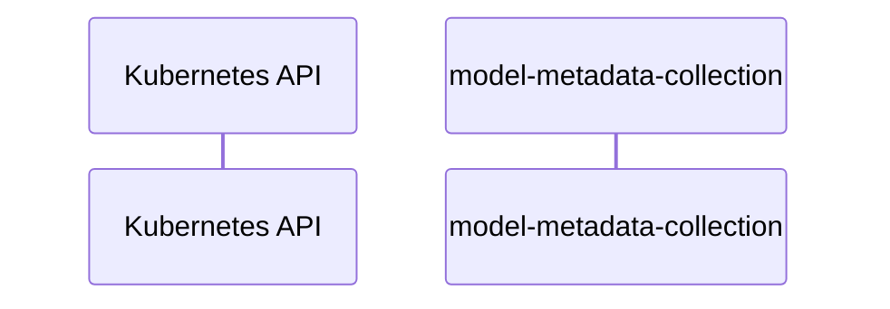

# model-metadata-collection: Dataflow

## Controller Watches

Kubernetes resources this controller monitors for changes. Each watch triggers reconciliation when the watched resource is created, updated, or deleted.

No controller watches found.

## Reconciliation Flow

How the controller interacts with the Kubernetes API during reconciliation.

### HTTP Endpoints

| Method | Path | Source |
|--------|------|--------|
| * | / | [`.gopath-loader/pkg/mod/github.com/gorilla/mux@v1.8.1/doc.go:33`](https://github.com/opendatahub-io/model-metadata-collection/blob/118484ad80275f8c483ceabe6a6f7fbc488251d7/.gopath-loader/pkg/mod/github.com/gorilla/mux@v1.8.1/doc.go#L33) |
| * | / | [`.gopath-loader/pkg/mod/github.com/docker/docker@v28.3.3+incompatible/contrib/httpserver/server.go:10`](https://github.com/opendatahub-io/model-metadata-collection/blob/118484ad80275f8c483ceabe6a6f7fbc488251d7/.gopath-loader/pkg/mod/github.com/docker/docker@v28.3.3+incompatible/contrib/httpserver/server.go#L10) |
| * | / | [`.gopath-loader/pkg/mod/golang.org/toolchain@v0.0.1-go1.25.7.linux-amd64/src/cmd/trace/main.go:188`](https://github.com/opendatahub-io/model-metadata-collection/blob/118484ad80275f8c483ceabe6a6f7fbc488251d7/.gopath-loader/pkg/mod/golang.org/toolchain@v0.0.1-go1.25.7.linux-amd64/src/cmd/trace/main.go#L188) |
| * | / | [`.gomod-cache/golang.org/toolchain@v0.0.1-go1.25.7.linux-amd64/src/cmd/trace/main.go:188`](https://github.com/opendatahub-io/model-metadata-collection/blob/118484ad80275f8c483ceabe6a6f7fbc488251d7/.gomod-cache/golang.org/toolchain@v0.0.1-go1.25.7.linux-amd64/src/cmd/trace/main.go#L188) |
| * | / | [`.gomod-cache/golang.org/toolchain@v0.0.1-go1.25.7.linux-amd64/src/net/http/triv.go:130`](https://github.com/opendatahub-io/model-metadata-collection/blob/118484ad80275f8c483ceabe6a6f7fbc488251d7/.gomod-cache/golang.org/toolchain@v0.0.1-go1.25.7.linux-amd64/src/net/http/triv.go#L130) |
| * | / | [`.gomod-cache/github.com/gorilla/mux@v1.8.1/doc.go:33`](https://github.com/opendatahub-io/model-metadata-collection/blob/118484ad80275f8c483ceabe6a6f7fbc488251d7/.gomod-cache/github.com/gorilla/mux@v1.8.1/doc.go#L33) |
| * | / | [`.gopath-loader/pkg/mod/golang.org/toolchain@v0.0.1-go1.25.7.linux-amd64/src/net/http/triv.go:130`](https://github.com/opendatahub-io/model-metadata-collection/blob/118484ad80275f8c483ceabe6a6f7fbc488251d7/.gopath-loader/pkg/mod/golang.org/toolchain@v0.0.1-go1.25.7.linux-amd64/src/net/http/triv.go#L130) |
| * | / | [`.gomod-cache/github.com/docker/docker@v28.3.3+incompatible/contrib/httpserver/server.go:10`](https://github.com/opendatahub-io/model-metadata-collection/blob/118484ad80275f8c483ceabe6a6f7fbc488251d7/.gomod-cache/github.com/docker/docker@v28.3.3+incompatible/contrib/httpserver/server.go#L10) |
| * | /LogDriver.Capabilities | [`.gomod-cache/github.com/docker/docker@v28.3.3+incompatible/integration/plugin/logging/cmd/discard/driver.go:68`](https://github.com/opendatahub-io/model-metadata-collection/blob/118484ad80275f8c483ceabe6a6f7fbc488251d7/.gomod-cache/github.com/docker/docker@v28.3.3+incompatible/integration/plugin/logging/cmd/discard/driver.go#L68) |
| * | /LogDriver.Capabilities | [`.gopath-loader/pkg/mod/github.com/docker/docker@v28.3.3+incompatible/integration/plugin/logging/cmd/discard/driver.go:68`](https://github.com/opendatahub-io/model-metadata-collection/blob/118484ad80275f8c483ceabe6a6f7fbc488251d7/.gopath-loader/pkg/mod/github.com/docker/docker@v28.3.3+incompatible/integration/plugin/logging/cmd/discard/driver.go#L68) |
| * | /LogDriver.StartLogging | [`.gopath-loader/pkg/mod/github.com/docker/docker@v28.3.3+incompatible/integration/plugin/logging/cmd/discard/driver.go:33`](https://github.com/opendatahub-io/model-metadata-collection/blob/118484ad80275f8c483ceabe6a6f7fbc488251d7/.gopath-loader/pkg/mod/github.com/docker/docker@v28.3.3+incompatible/integration/plugin/logging/cmd/discard/driver.go#L33) |
| * | /LogDriver.StartLogging | [`.gomod-cache/github.com/docker/docker@v28.3.3+incompatible/integration/plugin/logging/cmd/discard/driver.go:33`](https://github.com/opendatahub-io/model-metadata-collection/blob/118484ad80275f8c483ceabe6a6f7fbc488251d7/.gomod-cache/github.com/docker/docker@v28.3.3+incompatible/integration/plugin/logging/cmd/discard/driver.go#L33) |
| * | /LogDriver.StartLogging | [`.gomod-cache/github.com/docker/docker@v28.3.3+incompatible/integration/plugin/logging/cmd/close_on_start/main.go:23`](https://github.com/opendatahub-io/model-metadata-collection/blob/118484ad80275f8c483ceabe6a6f7fbc488251d7/.gomod-cache/github.com/docker/docker@v28.3.3+incompatible/integration/plugin/logging/cmd/close_on_start/main.go#L23) |
| * | /LogDriver.StartLogging | [`.gopath-loader/pkg/mod/github.com/docker/docker@v28.3.3+incompatible/integration/plugin/logging/cmd/close_on_start/main.go:23`](https://github.com/opendatahub-io/model-metadata-collection/blob/118484ad80275f8c483ceabe6a6f7fbc488251d7/.gopath-loader/pkg/mod/github.com/docker/docker@v28.3.3+incompatible/integration/plugin/logging/cmd/close_on_start/main.go#L23) |
| * | /LogDriver.StopLogging | [`.gomod-cache/github.com/docker/docker@v28.3.3+incompatible/integration/plugin/logging/cmd/discard/driver.go:53`](https://github.com/opendatahub-io/model-metadata-collection/blob/118484ad80275f8c483ceabe6a6f7fbc488251d7/.gomod-cache/github.com/docker/docker@v28.3.3+incompatible/integration/plugin/logging/cmd/discard/driver.go#L53) |
| * | /LogDriver.StopLogging | [`.gopath-loader/pkg/mod/github.com/docker/docker@v28.3.3+incompatible/integration/plugin/logging/cmd/discard/driver.go:53`](https://github.com/opendatahub-io/model-metadata-collection/blob/118484ad80275f8c483ceabe6a6f7fbc488251d7/.gopath-loader/pkg/mod/github.com/docker/docker@v28.3.3+incompatible/integration/plugin/logging/cmd/discard/driver.go#L53) |
| * | /Plugin.Activate | [`.gomod-cache/github.com/docker/docker@v28.3.3+incompatible/testutil/fixtures/plugin/basic/basic.go:31`](https://github.com/opendatahub-io/model-metadata-collection/blob/118484ad80275f8c483ceabe6a6f7fbc488251d7/.gomod-cache/github.com/docker/docker@v28.3.3+incompatible/testutil/fixtures/plugin/basic/basic.go#L31) |
| * | /Plugin.Activate | [`.gopath-loader/pkg/mod/github.com/docker/docker@v28.3.3+incompatible/testutil/fixtures/plugin/basic/basic.go:31`](https://github.com/opendatahub-io/model-metadata-collection/blob/118484ad80275f8c483ceabe6a6f7fbc488251d7/.gopath-loader/pkg/mod/github.com/docker/docker@v28.3.3+incompatible/testutil/fixtures/plugin/basic/basic.go#L31) |
| * | /VolumeDriver.Create | [`.gopath-loader/pkg/mod/github.com/docker/docker@v28.3.3+incompatible/volume/testutils/testutils.go:153`](https://github.com/opendatahub-io/model-metadata-collection/blob/118484ad80275f8c483ceabe6a6f7fbc488251d7/.gopath-loader/pkg/mod/github.com/docker/docker@v28.3.3+incompatible/volume/testutils/testutils.go#L153) |
| * | /VolumeDriver.Create | [`.gomod-cache/github.com/docker/docker@v28.3.3+incompatible/volume/testutils/testutils.go:153`](https://github.com/opendatahub-io/model-metadata-collection/blob/118484ad80275f8c483ceabe6a6f7fbc488251d7/.gomod-cache/github.com/docker/docker@v28.3.3+incompatible/volume/testutils/testutils.go#L153) |
| * | /args | [`.gomod-cache/golang.org/toolchain@v0.0.1-go1.25.7.linux-amd64/src/net/http/triv.go:136`](https://github.com/opendatahub-io/model-metadata-collection/blob/118484ad80275f8c483ceabe6a6f7fbc488251d7/.gomod-cache/golang.org/toolchain@v0.0.1-go1.25.7.linux-amd64/src/net/http/triv.go#L136) |
| * | /args | [`.gopath-loader/pkg/mod/golang.org/toolchain@v0.0.1-go1.25.7.linux-amd64/src/net/http/triv.go:136`](https://github.com/opendatahub-io/model-metadata-collection/blob/118484ad80275f8c483ceabe6a6f7fbc488251d7/.gopath-loader/pkg/mod/golang.org/toolchain@v0.0.1-go1.25.7.linux-amd64/src/net/http/triv.go#L136) |
| * | /bar | [`.gopath-loader/pkg/mod/golang.org/toolchain@v0.0.1-go1.25.7.linux-amd64/src/net/http/doc.go:67`](https://github.com/opendatahub-io/model-metadata-collection/blob/118484ad80275f8c483ceabe6a6f7fbc488251d7/.gopath-loader/pkg/mod/golang.org/toolchain@v0.0.1-go1.25.7.linux-amd64/src/net/http/doc.go#L67) |
| * | /bar | [`.gomod-cache/golang.org/toolchain@v0.0.1-go1.25.7.linux-amd64/src/net/http/doc.go:67`](https://github.com/opendatahub-io/model-metadata-collection/blob/118484ad80275f8c483ceabe6a6f7fbc488251d7/.gomod-cache/golang.org/toolchain@v0.0.1-go1.25.7.linux-amd64/src/net/http/doc.go#L67) |
| * | /block | [`.gopath-loader/pkg/mod/golang.org/toolchain@v0.0.1-go1.25.7.linux-amd64/src/cmd/trace/main.go:210`](https://github.com/opendatahub-io/model-metadata-collection/blob/118484ad80275f8c483ceabe6a6f7fbc488251d7/.gopath-loader/pkg/mod/golang.org/toolchain@v0.0.1-go1.25.7.linux-amd64/src/cmd/trace/main.go#L210) |
| * | /block | [`.gomod-cache/golang.org/toolchain@v0.0.1-go1.25.7.linux-amd64/src/cmd/trace/main.go:210`](https://github.com/opendatahub-io/model-metadata-collection/blob/118484ad80275f8c483ceabe6a6f7fbc488251d7/.gomod-cache/golang.org/toolchain@v0.0.1-go1.25.7.linux-amd64/src/cmd/trace/main.go#L210) |
| * | /chan | [`.gomod-cache/golang.org/toolchain@v0.0.1-go1.25.7.linux-amd64/src/net/http/triv.go:134`](https://github.com/opendatahub-io/model-metadata-collection/blob/118484ad80275f8c483ceabe6a6f7fbc488251d7/.gomod-cache/golang.org/toolchain@v0.0.1-go1.25.7.linux-amd64/src/net/http/triv.go#L134) |
| * | /chan | [`.gopath-loader/pkg/mod/golang.org/toolchain@v0.0.1-go1.25.7.linux-amd64/src/net/http/triv.go:134`](https://github.com/opendatahub-io/model-metadata-collection/blob/118484ad80275f8c483ceabe6a6f7fbc488251d7/.gopath-loader/pkg/mod/golang.org/toolchain@v0.0.1-go1.25.7.linux-amd64/src/net/http/triv.go#L134) |
| * | /counter | [`.gomod-cache/golang.org/toolchain@v0.0.1-go1.25.7.linux-amd64/src/net/http/triv.go:129`](https://github.com/opendatahub-io/model-metadata-collection/blob/118484ad80275f8c483ceabe6a6f7fbc488251d7/.gomod-cache/golang.org/toolchain@v0.0.1-go1.25.7.linux-amd64/src/net/http/triv.go#L129) |
| * | /counter | [`.gopath-loader/pkg/mod/golang.org/toolchain@v0.0.1-go1.25.7.linux-amd64/src/net/http/triv.go:129`](https://github.com/opendatahub-io/model-metadata-collection/blob/118484ad80275f8c483ceabe6a6f7fbc488251d7/.gopath-loader/pkg/mod/golang.org/toolchain@v0.0.1-go1.25.7.linux-amd64/src/net/http/triv.go#L129) |
| * | /date | [`.gopath-loader/pkg/mod/golang.org/toolchain@v0.0.1-go1.25.7.linux-amd64/src/net/http/triv.go:138`](https://github.com/opendatahub-io/model-metadata-collection/blob/118484ad80275f8c483ceabe6a6f7fbc488251d7/.gopath-loader/pkg/mod/golang.org/toolchain@v0.0.1-go1.25.7.linux-amd64/src/net/http/triv.go#L138) |
| * | /date | [`.gomod-cache/golang.org/toolchain@v0.0.1-go1.25.7.linux-amd64/src/net/http/triv.go:138`](https://github.com/opendatahub-io/model-metadata-collection/blob/118484ad80275f8c483ceabe6a6f7fbc488251d7/.gomod-cache/golang.org/toolchain@v0.0.1-go1.25.7.linux-amd64/src/net/http/triv.go#L138) |
| * | /debug/health | [`.gomod-cache/github.com/docker/distribution@v2.8.3+incompatible/health/health.go:305`](https://github.com/opendatahub-io/model-metadata-collection/blob/118484ad80275f8c483ceabe6a6f7fbc488251d7/.gomod-cache/github.com/docker/distribution@v2.8.3+incompatible/health/health.go#L305) |
| * | /debug/health | [`.gopath-loader/pkg/mod/github.com/docker/distribution@v2.8.3+incompatible/health/health.go:305`](https://github.com/opendatahub-io/model-metadata-collection/blob/118484ad80275f8c483ceabe6a6f7fbc488251d7/.gopath-loader/pkg/mod/github.com/docker/distribution@v2.8.3+incompatible/health/health.go#L305) |
| * | /debug/health/down | [`.gopath-loader/pkg/mod/github.com/docker/distribution@v2.8.3+incompatible/health/api/api.go:35`](https://github.com/opendatahub-io/model-metadata-collection/blob/118484ad80275f8c483ceabe6a6f7fbc488251d7/.gopath-loader/pkg/mod/github.com/docker/distribution@v2.8.3+incompatible/health/api/api.go#L35) |
| * | /debug/health/down | [`.gomod-cache/github.com/docker/distribution@v2.8.3+incompatible/health/api/api.go:35`](https://github.com/opendatahub-io/model-metadata-collection/blob/118484ad80275f8c483ceabe6a6f7fbc488251d7/.gomod-cache/github.com/docker/distribution@v2.8.3+incompatible/health/api/api.go#L35) |
| * | /debug/health/up | [`.gomod-cache/github.com/docker/distribution@v2.8.3+incompatible/health/api/api.go:36`](https://github.com/opendatahub-io/model-metadata-collection/blob/118484ad80275f8c483ceabe6a6f7fbc488251d7/.gomod-cache/github.com/docker/distribution@v2.8.3+incompatible/health/api/api.go#L36) |
| * | /debug/health/up | [`.gopath-loader/pkg/mod/github.com/docker/distribution@v2.8.3+incompatible/health/api/api.go:36`](https://github.com/opendatahub-io/model-metadata-collection/blob/118484ad80275f8c483ceabe6a6f7fbc488251d7/.gopath-loader/pkg/mod/github.com/docker/distribution@v2.8.3+incompatible/health/api/api.go#L36) |
| * | /debug/vars | [`.gomod-cache/golang.org/toolchain@v0.0.1-go1.25.7.linux-amd64/src/expvar/expvar.go:382`](https://github.com/opendatahub-io/model-metadata-collection/blob/118484ad80275f8c483ceabe6a6f7fbc488251d7/.gomod-cache/golang.org/toolchain@v0.0.1-go1.25.7.linux-amd64/src/expvar/expvar.go#L382) |
| * | /debug/vars | [`.gopath-loader/pkg/mod/golang.org/toolchain@v0.0.1-go1.25.7.linux-amd64/src/expvar/expvar.go:382`](https://github.com/opendatahub-io/model-metadata-collection/blob/118484ad80275f8c483ceabe6a6f7fbc488251d7/.gopath-loader/pkg/mod/golang.org/toolchain@v0.0.1-go1.25.7.linux-amd64/src/expvar/expvar.go#L382) |
| * | /flags | [`.gopath-loader/pkg/mod/golang.org/toolchain@v0.0.1-go1.25.7.linux-amd64/src/net/http/triv.go:135`](https://github.com/opendatahub-io/model-metadata-collection/blob/118484ad80275f8c483ceabe6a6f7fbc488251d7/.gopath-loader/pkg/mod/golang.org/toolchain@v0.0.1-go1.25.7.linux-amd64/src/net/http/triv.go#L135) |
| * | /flags | [`.gomod-cache/golang.org/toolchain@v0.0.1-go1.25.7.linux-amd64/src/net/http/triv.go:135`](https://github.com/opendatahub-io/model-metadata-collection/blob/118484ad80275f8c483ceabe6a6f7fbc488251d7/.gomod-cache/golang.org/toolchain@v0.0.1-go1.25.7.linux-amd64/src/net/http/triv.go#L135) |
| * | /foo | [`.gomod-cache/golang.org/toolchain@v0.0.1-go1.25.7.linux-amd64/src/net/http/doc.go:65`](https://github.com/opendatahub-io/model-metadata-collection/blob/118484ad80275f8c483ceabe6a6f7fbc488251d7/.gomod-cache/golang.org/toolchain@v0.0.1-go1.25.7.linux-amd64/src/net/http/doc.go#L65) |
| * | /foo | [`.gopath-loader/pkg/mod/golang.org/toolchain@v0.0.1-go1.25.7.linux-amd64/src/net/http/doc.go:65`](https://github.com/opendatahub-io/model-metadata-collection/blob/118484ad80275f8c483ceabe6a6f7fbc488251d7/.gopath-loader/pkg/mod/golang.org/toolchain@v0.0.1-go1.25.7.linux-amd64/src/net/http/doc.go#L65) |
| * | /go/ | [`.gopath-loader/pkg/mod/golang.org/toolchain@v0.0.1-go1.25.7.linux-amd64/src/net/http/triv.go:132`](https://github.com/opendatahub-io/model-metadata-collection/blob/118484ad80275f8c483ceabe6a6f7fbc488251d7/.gopath-loader/pkg/mod/golang.org/toolchain@v0.0.1-go1.25.7.linux-amd64/src/net/http/triv.go#L132) |
| * | /go/ | [`.gomod-cache/golang.org/toolchain@v0.0.1-go1.25.7.linux-amd64/src/net/http/triv.go:132`](https://github.com/opendatahub-io/model-metadata-collection/blob/118484ad80275f8c483ceabe6a6f7fbc488251d7/.gomod-cache/golang.org/toolchain@v0.0.1-go1.25.7.linux-amd64/src/net/http/triv.go#L132) |
| * | /go/hello | [`.gopath-loader/pkg/mod/golang.org/toolchain@v0.0.1-go1.25.7.linux-amd64/src/net/http/triv.go:137`](https://github.com/opendatahub-io/model-metadata-collection/blob/118484ad80275f8c483ceabe6a6f7fbc488251d7/.gopath-loader/pkg/mod/golang.org/toolchain@v0.0.1-go1.25.7.linux-amd64/src/net/http/triv.go#L137) |
| * | /go/hello | [`.gomod-cache/golang.org/toolchain@v0.0.1-go1.25.7.linux-amd64/src/net/http/triv.go:137`](https://github.com/opendatahub-io/model-metadata-collection/blob/118484ad80275f8c483ceabe6a6f7fbc488251d7/.gomod-cache/golang.org/toolchain@v0.0.1-go1.25.7.linux-amd64/src/net/http/triv.go#L137) |
| * | /goroutine | [`.gomod-cache/golang.org/toolchain@v0.0.1-go1.25.7.linux-amd64/src/cmd/trace/main.go:203`](https://github.com/opendatahub-io/model-metadata-collection/blob/118484ad80275f8c483ceabe6a6f7fbc488251d7/.gomod-cache/golang.org/toolchain@v0.0.1-go1.25.7.linux-amd64/src/cmd/trace/main.go#L203) |
| * | /goroutine | [`.gopath-loader/pkg/mod/golang.org/toolchain@v0.0.1-go1.25.7.linux-amd64/src/cmd/trace/main.go:203`](https://github.com/opendatahub-io/model-metadata-collection/blob/118484ad80275f8c483ceabe6a6f7fbc488251d7/.gopath-loader/pkg/mod/golang.org/toolchain@v0.0.1-go1.25.7.linux-amd64/src/cmd/trace/main.go#L203) |
| * | /goroutines | [`.gomod-cache/golang.org/toolchain@v0.0.1-go1.25.7.linux-amd64/src/cmd/trace/main.go:202`](https://github.com/opendatahub-io/model-metadata-collection/blob/118484ad80275f8c483ceabe6a6f7fbc488251d7/.gomod-cache/golang.org/toolchain@v0.0.1-go1.25.7.linux-amd64/src/cmd/trace/main.go#L202) |
| * | /goroutines | [`.gopath-loader/pkg/mod/golang.org/toolchain@v0.0.1-go1.25.7.linux-amd64/src/cmd/trace/main.go:202`](https://github.com/opendatahub-io/model-metadata-collection/blob/118484ad80275f8c483ceabe6a6f7fbc488251d7/.gopath-loader/pkg/mod/golang.org/toolchain@v0.0.1-go1.25.7.linux-amd64/src/cmd/trace/main.go#L202) |
| * | /io | [`.gopath-loader/pkg/mod/golang.org/toolchain@v0.0.1-go1.25.7.linux-amd64/src/cmd/trace/main.go:209`](https://github.com/opendatahub-io/model-metadata-collection/blob/118484ad80275f8c483ceabe6a6f7fbc488251d7/.gopath-loader/pkg/mod/golang.org/toolchain@v0.0.1-go1.25.7.linux-amd64/src/cmd/trace/main.go#L209) |
| * | /io | [`.gomod-cache/golang.org/toolchain@v0.0.1-go1.25.7.linux-amd64/src/cmd/trace/main.go:209`](https://github.com/opendatahub-io/model-metadata-collection/blob/118484ad80275f8c483ceabe6a6f7fbc488251d7/.gomod-cache/golang.org/toolchain@v0.0.1-go1.25.7.linux-amd64/src/cmd/trace/main.go#L209) |
| * | /jsontrace | [`.gopath-loader/pkg/mod/golang.org/toolchain@v0.0.1-go1.25.7.linux-amd64/src/cmd/trace/main.go:198`](https://github.com/opendatahub-io/model-metadata-collection/blob/118484ad80275f8c483ceabe6a6f7fbc488251d7/.gopath-loader/pkg/mod/golang.org/toolchain@v0.0.1-go1.25.7.linux-amd64/src/cmd/trace/main.go#L198) |
| * | /jsontrace | [`.gomod-cache/golang.org/toolchain@v0.0.1-go1.25.7.linux-amd64/src/cmd/trace/main.go:198`](https://github.com/opendatahub-io/model-metadata-collection/blob/118484ad80275f8c483ceabe6a6f7fbc488251d7/.gomod-cache/golang.org/toolchain@v0.0.1-go1.25.7.linux-amd64/src/cmd/trace/main.go#L198) |
| * | /metrics | [`.gomod-cache/github.com/docker/docker@v28.3.3+incompatible/internal/metrics/plugin_unix.go:119`](https://github.com/opendatahub-io/model-metadata-collection/blob/118484ad80275f8c483ceabe6a6f7fbc488251d7/.gomod-cache/github.com/docker/docker@v28.3.3+incompatible/internal/metrics/plugin_unix.go#L119) |
| * | /metrics | [`.gopath-loader/pkg/mod/github.com/docker/docker@v28.3.3+incompatible/cmd/dockerd/metrics.go:26`](https://github.com/opendatahub-io/model-metadata-collection/blob/118484ad80275f8c483ceabe6a6f7fbc488251d7/.gopath-loader/pkg/mod/github.com/docker/docker@v28.3.3+incompatible/cmd/dockerd/metrics.go#L26) |
| * | /metrics | [`.gopath-loader/pkg/mod/github.com/docker/docker@v28.3.3+incompatible/internal/metrics/plugin_unix.go:119`](https://github.com/opendatahub-io/model-metadata-collection/blob/118484ad80275f8c483ceabe6a6f7fbc488251d7/.gopath-loader/pkg/mod/github.com/docker/docker@v28.3.3+incompatible/internal/metrics/plugin_unix.go#L119) |
| * | /metrics | [`.gomod-cache/github.com/docker/docker@v28.3.3+incompatible/cmd/dockerd/metrics.go:26`](https://github.com/opendatahub-io/model-metadata-collection/blob/118484ad80275f8c483ceabe6a6f7fbc488251d7/.gomod-cache/github.com/docker/docker@v28.3.3+incompatible/cmd/dockerd/metrics.go#L26) |
| * | /mmu | [`.gopath-loader/pkg/mod/golang.org/toolchain@v0.0.1-go1.25.7.linux-amd64/src/cmd/trace/main.go:206`](https://github.com/opendatahub-io/model-metadata-collection/blob/118484ad80275f8c483ceabe6a6f7fbc488251d7/.gopath-loader/pkg/mod/golang.org/toolchain@v0.0.1-go1.25.7.linux-amd64/src/cmd/trace/main.go#L206) |
| * | /mmu | [`.gomod-cache/golang.org/toolchain@v0.0.1-go1.25.7.linux-amd64/src/cmd/trace/main.go:206`](https://github.com/opendatahub-io/model-metadata-collection/blob/118484ad80275f8c483ceabe6a6f7fbc488251d7/.gomod-cache/golang.org/toolchain@v0.0.1-go1.25.7.linux-amd64/src/cmd/trace/main.go#L206) |
| * | /proc/self/fd/ | [`.gopath-loader/pkg/mod/github.com/docker/docker@v28.3.3+incompatible/internal/safepath/join_linux.go:47`](https://github.com/opendatahub-io/model-metadata-collection/blob/118484ad80275f8c483ceabe6a6f7fbc488251d7/.gopath-loader/pkg/mod/github.com/docker/docker@v28.3.3+incompatible/internal/safepath/join_linux.go#L47) |
| * | /proc/self/fd/ | [`.gomod-cache/github.com/docker/docker@v28.3.3+incompatible/internal/safepath/join_linux.go:47`](https://github.com/opendatahub-io/model-metadata-collection/blob/118484ad80275f8c483ceabe6a6f7fbc488251d7/.gomod-cache/github.com/docker/docker@v28.3.3+incompatible/internal/safepath/join_linux.go#L47) |
| * | /regionblock | [`.gomod-cache/golang.org/toolchain@v0.0.1-go1.25.7.linux-amd64/src/cmd/trace/main.go:216`](https://github.com/opendatahub-io/model-metadata-collection/blob/118484ad80275f8c483ceabe6a6f7fbc488251d7/.gomod-cache/golang.org/toolchain@v0.0.1-go1.25.7.linux-amd64/src/cmd/trace/main.go#L216) |
| * | /regionblock | [`.gopath-loader/pkg/mod/golang.org/toolchain@v0.0.1-go1.25.7.linux-amd64/src/cmd/trace/main.go:216`](https://github.com/opendatahub-io/model-metadata-collection/blob/118484ad80275f8c483ceabe6a6f7fbc488251d7/.gopath-loader/pkg/mod/golang.org/toolchain@v0.0.1-go1.25.7.linux-amd64/src/cmd/trace/main.go#L216) |
| * | /regionio | [`.gomod-cache/golang.org/toolchain@v0.0.1-go1.25.7.linux-amd64/src/cmd/trace/main.go:215`](https://github.com/opendatahub-io/model-metadata-collection/blob/118484ad80275f8c483ceabe6a6f7fbc488251d7/.gomod-cache/golang.org/toolchain@v0.0.1-go1.25.7.linux-amd64/src/cmd/trace/main.go#L215) |
| * | /regionio | [`.gopath-loader/pkg/mod/golang.org/toolchain@v0.0.1-go1.25.7.linux-amd64/src/cmd/trace/main.go:215`](https://github.com/opendatahub-io/model-metadata-collection/blob/118484ad80275f8c483ceabe6a6f7fbc488251d7/.gopath-loader/pkg/mod/golang.org/toolchain@v0.0.1-go1.25.7.linux-amd64/src/cmd/trace/main.go#L215) |
| * | /regionsched | [`.gomod-cache/golang.org/toolchain@v0.0.1-go1.25.7.linux-amd64/src/cmd/trace/main.go:218`](https://github.com/opendatahub-io/model-metadata-collection/blob/118484ad80275f8c483ceabe6a6f7fbc488251d7/.gomod-cache/golang.org/toolchain@v0.0.1-go1.25.7.linux-amd64/src/cmd/trace/main.go#L218) |
| * | /regionsched | [`.gopath-loader/pkg/mod/golang.org/toolchain@v0.0.1-go1.25.7.linux-amd64/src/cmd/trace/main.go:218`](https://github.com/opendatahub-io/model-metadata-collection/blob/118484ad80275f8c483ceabe6a6f7fbc488251d7/.gopath-loader/pkg/mod/golang.org/toolchain@v0.0.1-go1.25.7.linux-amd64/src/cmd/trace/main.go#L218) |
| * | /regionsyscall | [`.gopath-loader/pkg/mod/golang.org/toolchain@v0.0.1-go1.25.7.linux-amd64/src/cmd/trace/main.go:217`](https://github.com/opendatahub-io/model-metadata-collection/blob/118484ad80275f8c483ceabe6a6f7fbc488251d7/.gopath-loader/pkg/mod/golang.org/toolchain@v0.0.1-go1.25.7.linux-amd64/src/cmd/trace/main.go#L217) |
| * | /regionsyscall | [`.gomod-cache/golang.org/toolchain@v0.0.1-go1.25.7.linux-amd64/src/cmd/trace/main.go:217`](https://github.com/opendatahub-io/model-metadata-collection/blob/118484ad80275f8c483ceabe6a6f7fbc488251d7/.gomod-cache/golang.org/toolchain@v0.0.1-go1.25.7.linux-amd64/src/cmd/trace/main.go#L217) |
| * | /sched | [`.gomod-cache/golang.org/toolchain@v0.0.1-go1.25.7.linux-amd64/src/cmd/trace/main.go:212`](https://github.com/opendatahub-io/model-metadata-collection/blob/118484ad80275f8c483ceabe6a6f7fbc488251d7/.gomod-cache/golang.org/toolchain@v0.0.1-go1.25.7.linux-amd64/src/cmd/trace/main.go#L212) |
| * | /sched | [`.gopath-loader/pkg/mod/golang.org/toolchain@v0.0.1-go1.25.7.linux-amd64/src/cmd/trace/main.go:212`](https://github.com/opendatahub-io/model-metadata-collection/blob/118484ad80275f8c483ceabe6a6f7fbc488251d7/.gopath-loader/pkg/mod/golang.org/toolchain@v0.0.1-go1.25.7.linux-amd64/src/cmd/trace/main.go#L212) |
| * | /static/ | [`.gopath-loader/pkg/mod/golang.org/toolchain@v0.0.1-go1.25.7.linux-amd64/src/cmd/trace/main.go:199`](https://github.com/opendatahub-io/model-metadata-collection/blob/118484ad80275f8c483ceabe6a6f7fbc488251d7/.gopath-loader/pkg/mod/golang.org/toolchain@v0.0.1-go1.25.7.linux-amd64/src/cmd/trace/main.go#L199) |
| * | /static/ | [`.gomod-cache/golang.org/toolchain@v0.0.1-go1.25.7.linux-amd64/src/cmd/trace/main.go:199`](https://github.com/opendatahub-io/model-metadata-collection/blob/118484ad80275f8c483ceabe6a6f7fbc488251d7/.gomod-cache/golang.org/toolchain@v0.0.1-go1.25.7.linux-amd64/src/cmd/trace/main.go#L199) |
| * | /syscall | [`.gomod-cache/golang.org/toolchain@v0.0.1-go1.25.7.linux-amd64/src/cmd/trace/main.go:211`](https://github.com/opendatahub-io/model-metadata-collection/blob/118484ad80275f8c483ceabe6a6f7fbc488251d7/.gomod-cache/golang.org/toolchain@v0.0.1-go1.25.7.linux-amd64/src/cmd/trace/main.go#L211) |
| * | /syscall | [`.gopath-loader/pkg/mod/golang.org/toolchain@v0.0.1-go1.25.7.linux-amd64/src/cmd/trace/main.go:211`](https://github.com/opendatahub-io/model-metadata-collection/blob/118484ad80275f8c483ceabe6a6f7fbc488251d7/.gopath-loader/pkg/mod/golang.org/toolchain@v0.0.1-go1.25.7.linux-amd64/src/cmd/trace/main.go#L211) |
| * | /trace | [`.gomod-cache/golang.org/toolchain@v0.0.1-go1.25.7.linux-amd64/src/cmd/trace/main.go:197`](https://github.com/opendatahub-io/model-metadata-collection/blob/118484ad80275f8c483ceabe6a6f7fbc488251d7/.gomod-cache/golang.org/toolchain@v0.0.1-go1.25.7.linux-amd64/src/cmd/trace/main.go#L197) |
| * | /trace | [`.gopath-loader/pkg/mod/golang.org/toolchain@v0.0.1-go1.25.7.linux-amd64/src/cmd/trace/main.go:197`](https://github.com/opendatahub-io/model-metadata-collection/blob/118484ad80275f8c483ceabe6a6f7fbc488251d7/.gopath-loader/pkg/mod/golang.org/toolchain@v0.0.1-go1.25.7.linux-amd64/src/cmd/trace/main.go#L197) |
| * | /userregion | [`.gopath-loader/pkg/mod/golang.org/toolchain@v0.0.1-go1.25.7.linux-amd64/src/cmd/trace/main.go:222`](https://github.com/opendatahub-io/model-metadata-collection/blob/118484ad80275f8c483ceabe6a6f7fbc488251d7/.gopath-loader/pkg/mod/golang.org/toolchain@v0.0.1-go1.25.7.linux-amd64/src/cmd/trace/main.go#L222) |
| * | /userregion | [`.gomod-cache/golang.org/toolchain@v0.0.1-go1.25.7.linux-amd64/src/cmd/trace/main.go:222`](https://github.com/opendatahub-io/model-metadata-collection/blob/118484ad80275f8c483ceabe6a6f7fbc488251d7/.gomod-cache/golang.org/toolchain@v0.0.1-go1.25.7.linux-amd64/src/cmd/trace/main.go#L222) |
| * | /userregions | [`.gopath-loader/pkg/mod/golang.org/toolchain@v0.0.1-go1.25.7.linux-amd64/src/cmd/trace/main.go:221`](https://github.com/opendatahub-io/model-metadata-collection/blob/118484ad80275f8c483ceabe6a6f7fbc488251d7/.gopath-loader/pkg/mod/golang.org/toolchain@v0.0.1-go1.25.7.linux-amd64/src/cmd/trace/main.go#L221) |
| * | /userregions | [`.gomod-cache/golang.org/toolchain@v0.0.1-go1.25.7.linux-amd64/src/cmd/trace/main.go:221`](https://github.com/opendatahub-io/model-metadata-collection/blob/118484ad80275f8c483ceabe6a6f7fbc488251d7/.gomod-cache/golang.org/toolchain@v0.0.1-go1.25.7.linux-amd64/src/cmd/trace/main.go#L221) |
| * | /usertask | [`.gopath-loader/pkg/mod/golang.org/toolchain@v0.0.1-go1.25.7.linux-amd64/src/cmd/trace/main.go:226`](https://github.com/opendatahub-io/model-metadata-collection/blob/118484ad80275f8c483ceabe6a6f7fbc488251d7/.gopath-loader/pkg/mod/golang.org/toolchain@v0.0.1-go1.25.7.linux-amd64/src/cmd/trace/main.go#L226) |
| * | /usertask | [`.gomod-cache/golang.org/toolchain@v0.0.1-go1.25.7.linux-amd64/src/cmd/trace/main.go:226`](https://github.com/opendatahub-io/model-metadata-collection/blob/118484ad80275f8c483ceabe6a6f7fbc488251d7/.gomod-cache/golang.org/toolchain@v0.0.1-go1.25.7.linux-amd64/src/cmd/trace/main.go#L226) |
| * | /usertasks | [`.gopath-loader/pkg/mod/golang.org/toolchain@v0.0.1-go1.25.7.linux-amd64/src/cmd/trace/main.go:225`](https://github.com/opendatahub-io/model-metadata-collection/blob/118484ad80275f8c483ceabe6a6f7fbc488251d7/.gopath-loader/pkg/mod/golang.org/toolchain@v0.0.1-go1.25.7.linux-amd64/src/cmd/trace/main.go#L225) |
| * | /usertasks | [`.gomod-cache/golang.org/toolchain@v0.0.1-go1.25.7.linux-amd64/src/cmd/trace/main.go:225`](https://github.com/opendatahub-io/model-metadata-collection/blob/118484ad80275f8c483ceabe6a6f7fbc488251d7/.gomod-cache/golang.org/toolchain@v0.0.1-go1.25.7.linux-amd64/src/cmd/trace/main.go#L225) |
| * | /watchedtableentries | [`.gomod-cache/github.com/docker/docker@v28.3.3+incompatible/libnetwork/cmd/networkdb-test/dummyclient/dummyClient.go:20`](https://github.com/opendatahub-io/model-metadata-collection/blob/118484ad80275f8c483ceabe6a6f7fbc488251d7/.gomod-cache/github.com/docker/docker@v28.3.3+incompatible/libnetwork/cmd/networkdb-test/dummyclient/dummyClient.go#L20) |
| * | /watchedtableentries | [`.gopath-loader/pkg/mod/github.com/docker/docker@v28.3.3+incompatible/libnetwork/cmd/networkdb-test/dummyclient/dummyClient.go:20`](https://github.com/opendatahub-io/model-metadata-collection/blob/118484ad80275f8c483ceabe6a6f7fbc488251d7/.gopath-loader/pkg/mod/github.com/docker/docker@v28.3.3+incompatible/libnetwork/cmd/networkdb-test/dummyclient/dummyClient.go#L20) |
| * | /watchtable | [`.gopath-loader/pkg/mod/github.com/docker/docker@v28.3.3+incompatible/libnetwork/cmd/networkdb-test/dummyclient/dummyClient.go:19`](https://github.com/opendatahub-io/model-metadata-collection/blob/118484ad80275f8c483ceabe6a6f7fbc488251d7/.gopath-loader/pkg/mod/github.com/docker/docker@v28.3.3+incompatible/libnetwork/cmd/networkdb-test/dummyclient/dummyClient.go#L19) |
| * | /watchtable | [`.gomod-cache/github.com/docker/docker@v28.3.3+incompatible/libnetwork/cmd/networkdb-test/dummyclient/dummyClient.go:19`](https://github.com/opendatahub-io/model-metadata-collection/blob/118484ad80275f8c483ceabe6a6f7fbc488251d7/.gomod-cache/github.com/docker/docker@v28.3.3+incompatible/libnetwork/cmd/networkdb-test/dummyclient/dummyClient.go#L19) |
| * | G | [`.gopath-loader/pkg/mod/golang.org/toolchain@v0.0.1-go1.25.7.linux-amd64/src/testing/slogtest/slogtest.go:97`](https://github.com/opendatahub-io/model-metadata-collection/blob/118484ad80275f8c483ceabe6a6f7fbc488251d7/.gopath-loader/pkg/mod/golang.org/toolchain@v0.0.1-go1.25.7.linux-amd64/src/testing/slogtest/slogtest.go#L97) |
| * | G | [`.gomod-cache/golang.org/toolchain@v0.0.1-go1.25.7.linux-amd64/src/testing/slogtest/slogtest.go:109`](https://github.com/opendatahub-io/model-metadata-collection/blob/118484ad80275f8c483ceabe6a6f7fbc488251d7/.gomod-cache/golang.org/toolchain@v0.0.1-go1.25.7.linux-amd64/src/testing/slogtest/slogtest.go#L109) |
| * | G | [`.gomod-cache/golang.org/toolchain@v0.0.1-go1.25.7.linux-amd64/src/testing/slogtest/slogtest.go:97`](https://github.com/opendatahub-io/model-metadata-collection/blob/118484ad80275f8c483ceabe6a6f7fbc488251d7/.gomod-cache/golang.org/toolchain@v0.0.1-go1.25.7.linux-amd64/src/testing/slogtest/slogtest.go#L97) |
| * | G | [`.gopath-loader/pkg/mod/golang.org/toolchain@v0.0.1-go1.25.7.linux-amd64/src/testing/slogtest/slogtest.go:109`](https://github.com/opendatahub-io/model-metadata-collection/blob/118484ad80275f8c483ceabe6a6f7fbc488251d7/.gopath-loader/pkg/mod/golang.org/toolchain@v0.0.1-go1.25.7.linux-amd64/src/testing/slogtest/slogtest.go#L109) |
| * | G | [`.gopath-loader/pkg/mod/golang.org/toolchain@v0.0.1-go1.25.7.linux-amd64/src/testing/slogtest/slogtest.go:203`](https://github.com/opendatahub-io/model-metadata-collection/blob/118484ad80275f8c483ceabe6a6f7fbc488251d7/.gopath-loader/pkg/mod/golang.org/toolchain@v0.0.1-go1.25.7.linux-amd64/src/testing/slogtest/slogtest.go#L203) |
| * | G | [`.gopath-loader/pkg/mod/golang.org/toolchain@v0.0.1-go1.25.7.linux-amd64/src/testing/slogtest/slogtest.go:225`](https://github.com/opendatahub-io/model-metadata-collection/blob/118484ad80275f8c483ceabe6a6f7fbc488251d7/.gopath-loader/pkg/mod/golang.org/toolchain@v0.0.1-go1.25.7.linux-amd64/src/testing/slogtest/slogtest.go#L225) |
| * | G | [`.gomod-cache/golang.org/toolchain@v0.0.1-go1.25.7.linux-amd64/src/testing/slogtest/slogtest.go:225`](https://github.com/opendatahub-io/model-metadata-collection/blob/118484ad80275f8c483ceabe6a6f7fbc488251d7/.gomod-cache/golang.org/toolchain@v0.0.1-go1.25.7.linux-amd64/src/testing/slogtest/slogtest.go#L225) |
| * | G | [`.gomod-cache/golang.org/toolchain@v0.0.1-go1.25.7.linux-amd64/src/testing/slogtest/slogtest.go:203`](https://github.com/opendatahub-io/model-metadata-collection/blob/118484ad80275f8c483ceabe6a6f7fbc488251d7/.gomod-cache/golang.org/toolchain@v0.0.1-go1.25.7.linux-amd64/src/testing/slogtest/slogtest.go#L203) |
| * | GET /debug/vars | [`.gomod-cache/golang.org/toolchain@v0.0.1-go1.25.7.linux-amd64/src/expvar/expvar.go:384`](https://github.com/opendatahub-io/model-metadata-collection/blob/118484ad80275f8c483ceabe6a6f7fbc488251d7/.gomod-cache/golang.org/toolchain@v0.0.1-go1.25.7.linux-amd64/src/expvar/expvar.go#L384) |
| * | GET /debug/vars | [`.gopath-loader/pkg/mod/golang.org/toolchain@v0.0.1-go1.25.7.linux-amd64/src/expvar/expvar.go:384`](https://github.com/opendatahub-io/model-metadata-collection/blob/118484ad80275f8c483ceabe6a6f7fbc488251d7/.gopath-loader/pkg/mod/golang.org/toolchain@v0.0.1-go1.25.7.linux-amd64/src/expvar/expvar.go#L384) |
| * | overlay | [`.gopath-loader/pkg/mod/github.com/docker/docker@v28.3.3+incompatible/daemon/graphdriver/overlay2/check.go:83`](https://github.com/opendatahub-io/model-metadata-collection/blob/118484ad80275f8c483ceabe6a6f7fbc488251d7/.gopath-loader/pkg/mod/github.com/docker/docker@v28.3.3+incompatible/daemon/graphdriver/overlay2/check.go#L83) |
| * | overlay | [`.gomod-cache/github.com/docker/docker@v28.3.3+incompatible/daemon/graphdriver/overlayutils/overlayutils.go:73`](https://github.com/opendatahub-io/model-metadata-collection/blob/118484ad80275f8c483ceabe6a6f7fbc488251d7/.gomod-cache/github.com/docker/docker@v28.3.3+incompatible/daemon/graphdriver/overlayutils/overlayutils.go#L73) |
| * | overlay | [`.gopath-loader/pkg/mod/github.com/containers/storage@v1.59.1/drivers/overlay/check.go:307`](https://github.com/opendatahub-io/model-metadata-collection/blob/118484ad80275f8c483ceabe6a6f7fbc488251d7/.gopath-loader/pkg/mod/github.com/containers/storage@v1.59.1/drivers/overlay/check.go#L307) |
| * | overlay | [`.gopath-loader/pkg/mod/github.com/docker/docker@v28.3.3+incompatible/daemon/graphdriver/overlayutils/overlayutils.go:73`](https://github.com/opendatahub-io/model-metadata-collection/blob/118484ad80275f8c483ceabe6a6f7fbc488251d7/.gopath-loader/pkg/mod/github.com/docker/docker@v28.3.3+incompatible/daemon/graphdriver/overlayutils/overlayutils.go#L73) |
| * | overlay | [`.gomod-cache/github.com/containers/storage@v1.59.1/drivers/overlay/check.go:158`](https://github.com/opendatahub-io/model-metadata-collection/blob/118484ad80275f8c483ceabe6a6f7fbc488251d7/.gomod-cache/github.com/containers/storage@v1.59.1/drivers/overlay/check.go#L158) |
| * | overlay | [`.gopath-loader/pkg/mod/github.com/containers/storage@v1.59.1/drivers/overlay/check.go:215`](https://github.com/opendatahub-io/model-metadata-collection/blob/118484ad80275f8c483ceabe6a6f7fbc488251d7/.gopath-loader/pkg/mod/github.com/containers/storage@v1.59.1/drivers/overlay/check.go#L215) |
| * | overlay | [`.gopath-loader/pkg/mod/github.com/containers/storage@v1.59.1/drivers/overlay/check.go:158`](https://github.com/opendatahub-io/model-metadata-collection/blob/118484ad80275f8c483ceabe6a6f7fbc488251d7/.gopath-loader/pkg/mod/github.com/containers/storage@v1.59.1/drivers/overlay/check.go#L158) |
| * | overlay | [`.gopath-loader/pkg/mod/github.com/containers/storage@v1.59.1/drivers/overlay/check.go:74`](https://github.com/opendatahub-io/model-metadata-collection/blob/118484ad80275f8c483ceabe6a6f7fbc488251d7/.gopath-loader/pkg/mod/github.com/containers/storage@v1.59.1/drivers/overlay/check.go#L74) |
| * | overlay | [`.gopath-loader/pkg/mod/github.com/containers/storage@v1.59.1/drivers/overlay/overlay.go:763`](https://github.com/opendatahub-io/model-metadata-collection/blob/118484ad80275f8c483ceabe6a6f7fbc488251d7/.gopath-loader/pkg/mod/github.com/containers/storage@v1.59.1/drivers/overlay/overlay.go#L763) |
| * | overlay | [`.gomod-cache/github.com/containers/storage@v1.59.1/drivers/overlay/check.go:215`](https://github.com/opendatahub-io/model-metadata-collection/blob/118484ad80275f8c483ceabe6a6f7fbc488251d7/.gomod-cache/github.com/containers/storage@v1.59.1/drivers/overlay/check.go#L215) |
| * | overlay | [`.gopath-loader/pkg/mod/github.com/containers/storage@v1.59.1/drivers/overlay/overlay.go:747`](https://github.com/opendatahub-io/model-metadata-collection/blob/118484ad80275f8c483ceabe6a6f7fbc488251d7/.gopath-loader/pkg/mod/github.com/containers/storage@v1.59.1/drivers/overlay/overlay.go#L747) |
| * | overlay | [`.gopath-loader/pkg/mod/github.com/containers/storage@v1.59.1/drivers/overlay/check.go:273`](https://github.com/opendatahub-io/model-metadata-collection/blob/118484ad80275f8c483ceabe6a6f7fbc488251d7/.gopath-loader/pkg/mod/github.com/containers/storage@v1.59.1/drivers/overlay/check.go#L273) |
| * | overlay | [`.gomod-cache/github.com/containers/storage@v1.59.1/drivers/overlay/check.go:74`](https://github.com/opendatahub-io/model-metadata-collection/blob/118484ad80275f8c483ceabe6a6f7fbc488251d7/.gomod-cache/github.com/containers/storage@v1.59.1/drivers/overlay/check.go#L74) |
| * | overlay | [`.gomod-cache/github.com/containers/storage@v1.59.1/drivers/overlay/check.go:273`](https://github.com/opendatahub-io/model-metadata-collection/blob/118484ad80275f8c483ceabe6a6f7fbc488251d7/.gomod-cache/github.com/containers/storage@v1.59.1/drivers/overlay/check.go#L273) |
| * | overlay | [`.gomod-cache/github.com/docker/docker@v28.3.3+incompatible/daemon/graphdriver/overlay2/check.go:83`](https://github.com/opendatahub-io/model-metadata-collection/blob/118484ad80275f8c483ceabe6a6f7fbc488251d7/.gomod-cache/github.com/docker/docker@v28.3.3+incompatible/daemon/graphdriver/overlay2/check.go#L83) |
| * | overlay | [`.gomod-cache/github.com/containers/storage@v1.59.1/drivers/overlay/check.go:307`](https://github.com/opendatahub-io/model-metadata-collection/blob/118484ad80275f8c483ceabe6a6f7fbc488251d7/.gomod-cache/github.com/containers/storage@v1.59.1/drivers/overlay/check.go#L307) |
| * | overlay | [`.gomod-cache/github.com/containers/storage@v1.59.1/drivers/overlay/overlay.go:747`](https://github.com/opendatahub-io/model-metadata-collection/blob/118484ad80275f8c483ceabe6a6f7fbc488251d7/.gomod-cache/github.com/containers/storage@v1.59.1/drivers/overlay/overlay.go#L747) |
| * | overlay | [`.gomod-cache/github.com/containers/storage@v1.59.1/drivers/overlay/overlay.go:763`](https://github.com/opendatahub-io/model-metadata-collection/blob/118484ad80275f8c483ceabe6a6f7fbc488251d7/.gomod-cache/github.com/containers/storage@v1.59.1/drivers/overlay/overlay.go#L763) |
| * | request | [`.gomod-cache/golang.org/toolchain@v0.0.1-go1.25.7.linux-amd64/src/log/slog/doc.go:137`](https://github.com/opendatahub-io/model-metadata-collection/blob/118484ad80275f8c483ceabe6a6f7fbc488251d7/.gomod-cache/golang.org/toolchain@v0.0.1-go1.25.7.linux-amd64/src/log/slog/doc.go#L137) |
| * | request | [`.gopath-loader/pkg/mod/golang.org/toolchain@v0.0.1-go1.25.7.linux-amd64/src/log/slog/doc.go:137`](https://github.com/opendatahub-io/model-metadata-collection/blob/118484ad80275f8c483ceabe6a6f7fbc488251d7/.gopath-loader/pkg/mod/golang.org/toolchain@v0.0.1-go1.25.7.linux-amd64/src/log/slog/doc.go#L137) |
| * | shm | [`.gomod-cache/github.com/docker/docker@v28.3.3+incompatible/daemon/container_operations_unix.go:266`](https://github.com/opendatahub-io/model-metadata-collection/blob/118484ad80275f8c483ceabe6a6f7fbc488251d7/.gomod-cache/github.com/docker/docker@v28.3.3+incompatible/daemon/container_operations_unix.go#L266) |
| * | shm | [`.gopath-loader/pkg/mod/github.com/docker/docker@v28.3.3+incompatible/daemon/container_operations_unix.go:266`](https://github.com/opendatahub-io/model-metadata-collection/blob/118484ad80275f8c483ceabe6a6f7fbc488251d7/.gopath-loader/pkg/mod/github.com/docker/docker@v28.3.3+incompatible/daemon/container_operations_unix.go#L266) |
| * | sysfs | [`.gopath-loader/pkg/mod/github.com/docker/docker@v28.3.3+incompatible/libnetwork/drivers/overlay/ov_network.go:502`](https://github.com/opendatahub-io/model-metadata-collection/blob/118484ad80275f8c483ceabe6a6f7fbc488251d7/.gopath-loader/pkg/mod/github.com/docker/docker@v28.3.3+incompatible/libnetwork/drivers/overlay/ov_network.go#L502) |
| * | sysfs | [`.gomod-cache/github.com/docker/docker@v28.3.3+incompatible/libnetwork/drivers/overlay/ov_network.go:502`](https://github.com/opendatahub-io/model-metadata-collection/blob/118484ad80275f8c483ceabe6a6f7fbc488251d7/.gomod-cache/github.com/docker/docker@v28.3.3+incompatible/libnetwork/drivers/overlay/ov_network.go#L502) |
| * | tmpfs | [`.gopath-loader/pkg/mod/github.com/docker/docker@v28.3.3+incompatible/daemon/container_operations_unix.go:437`](https://github.com/opendatahub-io/model-metadata-collection/blob/118484ad80275f8c483ceabe6a6f7fbc488251d7/.gopath-loader/pkg/mod/github.com/docker/docker@v28.3.3+incompatible/daemon/container_operations_unix.go#L437) |
| * | tmpfs | [`.gomod-cache/github.com/docker/docker@v28.3.3+incompatible/daemon/container_operations_unix.go:419`](https://github.com/opendatahub-io/model-metadata-collection/blob/118484ad80275f8c483ceabe6a6f7fbc488251d7/.gomod-cache/github.com/docker/docker@v28.3.3+incompatible/daemon/container_operations_unix.go#L419) |
| * | tmpfs | [`.gomod-cache/github.com/docker/docker@v28.3.3+incompatible/daemon/container_operations_unix.go:437`](https://github.com/opendatahub-io/model-metadata-collection/blob/118484ad80275f8c483ceabe6a6f7fbc488251d7/.gomod-cache/github.com/docker/docker@v28.3.3+incompatible/daemon/container_operations_unix.go#L437) |
| * | tmpfs | [`.gopath-loader/pkg/mod/github.com/docker/docker@v28.3.3+incompatible/daemon/container_operations_unix.go:419`](https://github.com/opendatahub-io/model-metadata-collection/blob/118484ad80275f8c483ceabe6a6f7fbc488251d7/.gopath-loader/pkg/mod/github.com/docker/docker@v28.3.3+incompatible/daemon/container_operations_unix.go#L419) |

## Configuration

ConfigMaps and Helm values that control this component's runtime behavior.

