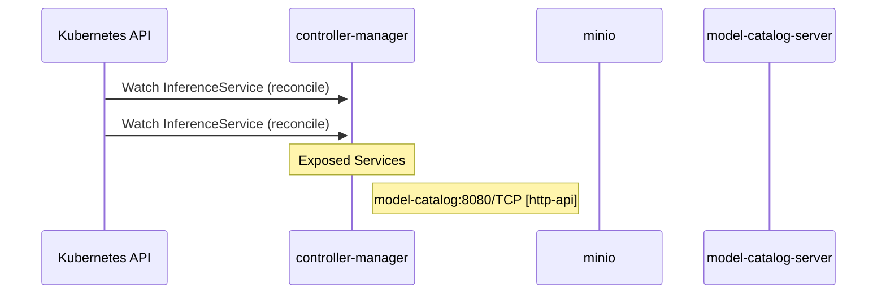

# model-registry: Dataflow

## Controller Watches

Kubernetes resources this controller monitors for changes. Each watch triggers reconciliation when the watched resource is created, updated, or deleted.

| Type | GVK | Source |
|------|-----|--------|
| For | serving/v1beta1/InferenceService | [`cmd/controller/internal/controllers/inferenceservice_controller.go:44`](https://github.com/kubeflow/model-registry/blob/fc7ab609764b013f0c6c7bd10c9ec9ef4f672972/cmd/controller/internal/controllers/inferenceservice_controller.go#L44) |
| For | serving/v1beta1/InferenceService | [`pkg/inferenceservice-controller/controller.go:239`](https://github.com/kubeflow/model-registry/blob/fc7ab609764b013f0c6c7bd10c9ec9ef4f672972/pkg/inferenceservice-controller/controller.go#L239) |

## Reconciliation Flow

How the controller interacts with the Kubernetes API during reconciliation.

### HTTP Endpoints

| Method | Path | Source |
|--------|------|--------|
| * | / | [`.gopath-loader/pkg/mod/golang.org/toolchain@v0.0.1-go1.25.7.linux-amd64/src/cmd/trace/main.go:188`](https://github.com/kubeflow/model-registry/blob/fc7ab609764b013f0c6c7bd10c9ec9ef4f672972/.gopath-loader/pkg/mod/golang.org/toolchain@v0.0.1-go1.25.7.linux-amd64/src/cmd/trace/main.go#L188) |
| * | / | [`.gomod-cache/golang.org/toolchain@v0.0.1-go1.25.7.linux-amd64/src/cmd/trace/main.go:188`](https://github.com/kubeflow/model-registry/blob/fc7ab609764b013f0c6c7bd10c9ec9ef4f672972/.gomod-cache/golang.org/toolchain@v0.0.1-go1.25.7.linux-amd64/src/cmd/trace/main.go#L188) |
| * | / | [`.gopath-loader/pkg/mod/golang.org/toolchain@v0.0.1-go1.25.7.linux-amd64/src/net/http/triv.go:130`](https://github.com/kubeflow/model-registry/blob/fc7ab609764b013f0c6c7bd10c9ec9ef4f672972/.gopath-loader/pkg/mod/golang.org/toolchain@v0.0.1-go1.25.7.linux-amd64/src/net/http/triv.go#L130) |
| * | / | [`.gomod-cache/golang.org/toolchain@v0.0.1-go1.25.7.linux-amd64/src/net/http/triv.go:130`](https://github.com/kubeflow/model-registry/blob/fc7ab609764b013f0c6c7bd10c9ec9ef4f672972/.gomod-cache/golang.org/toolchain@v0.0.1-go1.25.7.linux-amd64/src/net/http/triv.go#L130) |
| * | /args | [`.gopath-loader/pkg/mod/golang.org/toolchain@v0.0.1-go1.25.7.linux-amd64/src/net/http/triv.go:136`](https://github.com/kubeflow/model-registry/blob/fc7ab609764b013f0c6c7bd10c9ec9ef4f672972/.gopath-loader/pkg/mod/golang.org/toolchain@v0.0.1-go1.25.7.linux-amd64/src/net/http/triv.go#L136) |
| * | /args | [`.gomod-cache/golang.org/toolchain@v0.0.1-go1.25.7.linux-amd64/src/net/http/triv.go:136`](https://github.com/kubeflow/model-registry/blob/fc7ab609764b013f0c6c7bd10c9ec9ef4f672972/.gomod-cache/golang.org/toolchain@v0.0.1-go1.25.7.linux-amd64/src/net/http/triv.go#L136) |
| * | /bar | [`.gopath-loader/pkg/mod/golang.org/toolchain@v0.0.1-go1.25.7.linux-amd64/src/net/http/doc.go:67`](https://github.com/kubeflow/model-registry/blob/fc7ab609764b013f0c6c7bd10c9ec9ef4f672972/.gopath-loader/pkg/mod/golang.org/toolchain@v0.0.1-go1.25.7.linux-amd64/src/net/http/doc.go#L67) |
| * | /bar | [`.gomod-cache/golang.org/toolchain@v0.0.1-go1.25.7.linux-amd64/src/net/http/doc.go:67`](https://github.com/kubeflow/model-registry/blob/fc7ab609764b013f0c6c7bd10c9ec9ef4f672972/.gomod-cache/golang.org/toolchain@v0.0.1-go1.25.7.linux-amd64/src/net/http/doc.go#L67) |
| * | /block | [`.gopath-loader/pkg/mod/golang.org/toolchain@v0.0.1-go1.25.7.linux-amd64/src/cmd/trace/main.go:210`](https://github.com/kubeflow/model-registry/blob/fc7ab609764b013f0c6c7bd10c9ec9ef4f672972/.gopath-loader/pkg/mod/golang.org/toolchain@v0.0.1-go1.25.7.linux-amd64/src/cmd/trace/main.go#L210) |
| * | /block | [`.gomod-cache/golang.org/toolchain@v0.0.1-go1.25.7.linux-amd64/src/cmd/trace/main.go:210`](https://github.com/kubeflow/model-registry/blob/fc7ab609764b013f0c6c7bd10c9ec9ef4f672972/.gomod-cache/golang.org/toolchain@v0.0.1-go1.25.7.linux-amd64/src/cmd/trace/main.go#L210) |
| * | /chan | [`.gopath-loader/pkg/mod/golang.org/toolchain@v0.0.1-go1.25.7.linux-amd64/src/net/http/triv.go:134`](https://github.com/kubeflow/model-registry/blob/fc7ab609764b013f0c6c7bd10c9ec9ef4f672972/.gopath-loader/pkg/mod/golang.org/toolchain@v0.0.1-go1.25.7.linux-amd64/src/net/http/triv.go#L134) |
| * | /chan | [`.gomod-cache/golang.org/toolchain@v0.0.1-go1.25.7.linux-amd64/src/net/http/triv.go:134`](https://github.com/kubeflow/model-registry/blob/fc7ab609764b013f0c6c7bd10c9ec9ef4f672972/.gomod-cache/golang.org/toolchain@v0.0.1-go1.25.7.linux-amd64/src/net/http/triv.go#L134) |
| * | /counter | [`.gomod-cache/golang.org/toolchain@v0.0.1-go1.25.7.linux-amd64/src/net/http/triv.go:129`](https://github.com/kubeflow/model-registry/blob/fc7ab609764b013f0c6c7bd10c9ec9ef4f672972/.gomod-cache/golang.org/toolchain@v0.0.1-go1.25.7.linux-amd64/src/net/http/triv.go#L129) |
| * | /counter | [`.gopath-loader/pkg/mod/golang.org/toolchain@v0.0.1-go1.25.7.linux-amd64/src/net/http/triv.go:129`](https://github.com/kubeflow/model-registry/blob/fc7ab609764b013f0c6c7bd10c9ec9ef4f672972/.gopath-loader/pkg/mod/golang.org/toolchain@v0.0.1-go1.25.7.linux-amd64/src/net/http/triv.go#L129) |
| * | /date | [`.gomod-cache/golang.org/toolchain@v0.0.1-go1.25.7.linux-amd64/src/net/http/triv.go:138`](https://github.com/kubeflow/model-registry/blob/fc7ab609764b013f0c6c7bd10c9ec9ef4f672972/.gomod-cache/golang.org/toolchain@v0.0.1-go1.25.7.linux-amd64/src/net/http/triv.go#L138) |
| * | /date | [`.gopath-loader/pkg/mod/golang.org/toolchain@v0.0.1-go1.25.7.linux-amd64/src/net/http/triv.go:138`](https://github.com/kubeflow/model-registry/blob/fc7ab609764b013f0c6c7bd10c9ec9ef4f672972/.gopath-loader/pkg/mod/golang.org/toolchain@v0.0.1-go1.25.7.linux-amd64/src/net/http/triv.go#L138) |
| * | /debug/vars | [`.gomod-cache/golang.org/toolchain@v0.0.1-go1.25.7.linux-amd64/src/expvar/expvar.go:382`](https://github.com/kubeflow/model-registry/blob/fc7ab609764b013f0c6c7bd10c9ec9ef4f672972/.gomod-cache/golang.org/toolchain@v0.0.1-go1.25.7.linux-amd64/src/expvar/expvar.go#L382) |
| * | /debug/vars | [`.gopath-loader/pkg/mod/golang.org/toolchain@v0.0.1-go1.25.7.linux-amd64/src/expvar/expvar.go:382`](https://github.com/kubeflow/model-registry/blob/fc7ab609764b013f0c6c7bd10c9ec9ef4f672972/.gopath-loader/pkg/mod/golang.org/toolchain@v0.0.1-go1.25.7.linux-amd64/src/expvar/expvar.go#L382) |
| * | /flags | [`.gomod-cache/golang.org/toolchain@v0.0.1-go1.25.7.linux-amd64/src/net/http/triv.go:135`](https://github.com/kubeflow/model-registry/blob/fc7ab609764b013f0c6c7bd10c9ec9ef4f672972/.gomod-cache/golang.org/toolchain@v0.0.1-go1.25.7.linux-amd64/src/net/http/triv.go#L135) |
| * | /flags | [`.gopath-loader/pkg/mod/golang.org/toolchain@v0.0.1-go1.25.7.linux-amd64/src/net/http/triv.go:135`](https://github.com/kubeflow/model-registry/blob/fc7ab609764b013f0c6c7bd10c9ec9ef4f672972/.gopath-loader/pkg/mod/golang.org/toolchain@v0.0.1-go1.25.7.linux-amd64/src/net/http/triv.go#L135) |
| * | /foo | [`.gopath-loader/pkg/mod/golang.org/toolchain@v0.0.1-go1.25.7.linux-amd64/src/net/http/doc.go:65`](https://github.com/kubeflow/model-registry/blob/fc7ab609764b013f0c6c7bd10c9ec9ef4f672972/.gopath-loader/pkg/mod/golang.org/toolchain@v0.0.1-go1.25.7.linux-amd64/src/net/http/doc.go#L65) |
| * | /foo | [`.gomod-cache/golang.org/toolchain@v0.0.1-go1.25.7.linux-amd64/src/net/http/doc.go:65`](https://github.com/kubeflow/model-registry/blob/fc7ab609764b013f0c6c7bd10c9ec9ef4f672972/.gomod-cache/golang.org/toolchain@v0.0.1-go1.25.7.linux-amd64/src/net/http/doc.go#L65) |
| * | /go/ | [`.gomod-cache/golang.org/toolchain@v0.0.1-go1.25.7.linux-amd64/src/net/http/triv.go:132`](https://github.com/kubeflow/model-registry/blob/fc7ab609764b013f0c6c7bd10c9ec9ef4f672972/.gomod-cache/golang.org/toolchain@v0.0.1-go1.25.7.linux-amd64/src/net/http/triv.go#L132) |
| * | /go/ | [`.gopath-loader/pkg/mod/golang.org/toolchain@v0.0.1-go1.25.7.linux-amd64/src/net/http/triv.go:132`](https://github.com/kubeflow/model-registry/blob/fc7ab609764b013f0c6c7bd10c9ec9ef4f672972/.gopath-loader/pkg/mod/golang.org/toolchain@v0.0.1-go1.25.7.linux-amd64/src/net/http/triv.go#L132) |
| * | /go/hello | [`.gopath-loader/pkg/mod/golang.org/toolchain@v0.0.1-go1.25.7.linux-amd64/src/net/http/triv.go:137`](https://github.com/kubeflow/model-registry/blob/fc7ab609764b013f0c6c7bd10c9ec9ef4f672972/.gopath-loader/pkg/mod/golang.org/toolchain@v0.0.1-go1.25.7.linux-amd64/src/net/http/triv.go#L137) |
| * | /go/hello | [`.gomod-cache/golang.org/toolchain@v0.0.1-go1.25.7.linux-amd64/src/net/http/triv.go:137`](https://github.com/kubeflow/model-registry/blob/fc7ab609764b013f0c6c7bd10c9ec9ef4f672972/.gomod-cache/golang.org/toolchain@v0.0.1-go1.25.7.linux-amd64/src/net/http/triv.go#L137) |
| * | /goroutine | [`.gomod-cache/golang.org/toolchain@v0.0.1-go1.25.7.linux-amd64/src/cmd/trace/main.go:203`](https://github.com/kubeflow/model-registry/blob/fc7ab609764b013f0c6c7bd10c9ec9ef4f672972/.gomod-cache/golang.org/toolchain@v0.0.1-go1.25.7.linux-amd64/src/cmd/trace/main.go#L203) |
| * | /goroutine | [`.gopath-loader/pkg/mod/golang.org/toolchain@v0.0.1-go1.25.7.linux-amd64/src/cmd/trace/main.go:203`](https://github.com/kubeflow/model-registry/blob/fc7ab609764b013f0c6c7bd10c9ec9ef4f672972/.gopath-loader/pkg/mod/golang.org/toolchain@v0.0.1-go1.25.7.linux-amd64/src/cmd/trace/main.go#L203) |
| * | /goroutines | [`.gopath-loader/pkg/mod/golang.org/toolchain@v0.0.1-go1.25.7.linux-amd64/src/cmd/trace/main.go:202`](https://github.com/kubeflow/model-registry/blob/fc7ab609764b013f0c6c7bd10c9ec9ef4f672972/.gopath-loader/pkg/mod/golang.org/toolchain@v0.0.1-go1.25.7.linux-amd64/src/cmd/trace/main.go#L202) |
| * | /goroutines | [`.gomod-cache/golang.org/toolchain@v0.0.1-go1.25.7.linux-amd64/src/cmd/trace/main.go:202`](https://github.com/kubeflow/model-registry/blob/fc7ab609764b013f0c6c7bd10c9ec9ef4f672972/.gomod-cache/golang.org/toolchain@v0.0.1-go1.25.7.linux-amd64/src/cmd/trace/main.go#L202) |
| * | /io | [`.gopath-loader/pkg/mod/golang.org/toolchain@v0.0.1-go1.25.7.linux-amd64/src/cmd/trace/main.go:209`](https://github.com/kubeflow/model-registry/blob/fc7ab609764b013f0c6c7bd10c9ec9ef4f672972/.gopath-loader/pkg/mod/golang.org/toolchain@v0.0.1-go1.25.7.linux-amd64/src/cmd/trace/main.go#L209) |
| * | /io | [`.gomod-cache/golang.org/toolchain@v0.0.1-go1.25.7.linux-amd64/src/cmd/trace/main.go:209`](https://github.com/kubeflow/model-registry/blob/fc7ab609764b013f0c6c7bd10c9ec9ef4f672972/.gomod-cache/golang.org/toolchain@v0.0.1-go1.25.7.linux-amd64/src/cmd/trace/main.go#L209) |
| * | /jsontrace | [`.gomod-cache/golang.org/toolchain@v0.0.1-go1.25.7.linux-amd64/src/cmd/trace/main.go:198`](https://github.com/kubeflow/model-registry/blob/fc7ab609764b013f0c6c7bd10c9ec9ef4f672972/.gomod-cache/golang.org/toolchain@v0.0.1-go1.25.7.linux-amd64/src/cmd/trace/main.go#L198) |
| * | /jsontrace | [`.gopath-loader/pkg/mod/golang.org/toolchain@v0.0.1-go1.25.7.linux-amd64/src/cmd/trace/main.go:198`](https://github.com/kubeflow/model-registry/blob/fc7ab609764b013f0c6c7bd10c9ec9ef4f672972/.gopath-loader/pkg/mod/golang.org/toolchain@v0.0.1-go1.25.7.linux-amd64/src/cmd/trace/main.go#L198) |
| * | /mmu | [`.gomod-cache/golang.org/toolchain@v0.0.1-go1.25.7.linux-amd64/src/cmd/trace/main.go:206`](https://github.com/kubeflow/model-registry/blob/fc7ab609764b013f0c6c7bd10c9ec9ef4f672972/.gomod-cache/golang.org/toolchain@v0.0.1-go1.25.7.linux-amd64/src/cmd/trace/main.go#L206) |
| * | /mmu | [`.gopath-loader/pkg/mod/golang.org/toolchain@v0.0.1-go1.25.7.linux-amd64/src/cmd/trace/main.go:206`](https://github.com/kubeflow/model-registry/blob/fc7ab609764b013f0c6c7bd10c9ec9ef4f672972/.gopath-loader/pkg/mod/golang.org/toolchain@v0.0.1-go1.25.7.linux-amd64/src/cmd/trace/main.go#L206) |
| * | /regionblock | [`.gopath-loader/pkg/mod/golang.org/toolchain@v0.0.1-go1.25.7.linux-amd64/src/cmd/trace/main.go:216`](https://github.com/kubeflow/model-registry/blob/fc7ab609764b013f0c6c7bd10c9ec9ef4f672972/.gopath-loader/pkg/mod/golang.org/toolchain@v0.0.1-go1.25.7.linux-amd64/src/cmd/trace/main.go#L216) |
| * | /regionblock | [`.gomod-cache/golang.org/toolchain@v0.0.1-go1.25.7.linux-amd64/src/cmd/trace/main.go:216`](https://github.com/kubeflow/model-registry/blob/fc7ab609764b013f0c6c7bd10c9ec9ef4f672972/.gomod-cache/golang.org/toolchain@v0.0.1-go1.25.7.linux-amd64/src/cmd/trace/main.go#L216) |
| * | /regionio | [`.gomod-cache/golang.org/toolchain@v0.0.1-go1.25.7.linux-amd64/src/cmd/trace/main.go:215`](https://github.com/kubeflow/model-registry/blob/fc7ab609764b013f0c6c7bd10c9ec9ef4f672972/.gomod-cache/golang.org/toolchain@v0.0.1-go1.25.7.linux-amd64/src/cmd/trace/main.go#L215) |
| * | /regionio | [`.gopath-loader/pkg/mod/golang.org/toolchain@v0.0.1-go1.25.7.linux-amd64/src/cmd/trace/main.go:215`](https://github.com/kubeflow/model-registry/blob/fc7ab609764b013f0c6c7bd10c9ec9ef4f672972/.gopath-loader/pkg/mod/golang.org/toolchain@v0.0.1-go1.25.7.linux-amd64/src/cmd/trace/main.go#L215) |
| * | /regionsched | [`.gopath-loader/pkg/mod/golang.org/toolchain@v0.0.1-go1.25.7.linux-amd64/src/cmd/trace/main.go:218`](https://github.com/kubeflow/model-registry/blob/fc7ab609764b013f0c6c7bd10c9ec9ef4f672972/.gopath-loader/pkg/mod/golang.org/toolchain@v0.0.1-go1.25.7.linux-amd64/src/cmd/trace/main.go#L218) |
| * | /regionsched | [`.gomod-cache/golang.org/toolchain@v0.0.1-go1.25.7.linux-amd64/src/cmd/trace/main.go:218`](https://github.com/kubeflow/model-registry/blob/fc7ab609764b013f0c6c7bd10c9ec9ef4f672972/.gomod-cache/golang.org/toolchain@v0.0.1-go1.25.7.linux-amd64/src/cmd/trace/main.go#L218) |
| * | /regionsyscall | [`.gopath-loader/pkg/mod/golang.org/toolchain@v0.0.1-go1.25.7.linux-amd64/src/cmd/trace/main.go:217`](https://github.com/kubeflow/model-registry/blob/fc7ab609764b013f0c6c7bd10c9ec9ef4f672972/.gopath-loader/pkg/mod/golang.org/toolchain@v0.0.1-go1.25.7.linux-amd64/src/cmd/trace/main.go#L217) |
| * | /regionsyscall | [`.gomod-cache/golang.org/toolchain@v0.0.1-go1.25.7.linux-amd64/src/cmd/trace/main.go:217`](https://github.com/kubeflow/model-registry/blob/fc7ab609764b013f0c6c7bd10c9ec9ef4f672972/.gomod-cache/golang.org/toolchain@v0.0.1-go1.25.7.linux-amd64/src/cmd/trace/main.go#L217) |
| * | /road | [`.gopath-loader/pkg/mod/github.com/go-chi/chi/v5@v5.2.5/_examples/router-walk/main.go:17`](https://github.com/kubeflow/model-registry/blob/fc7ab609764b013f0c6c7bd10c9ec9ef4f672972/.gopath-loader/pkg/mod/github.com/go-chi/chi/v5@v5.2.5/_examples/router-walk/main.go#L17) |
| * | /road | [`.gomod-cache/github.com/go-chi/chi/v5@v5.2.5/_examples/router-walk/main.go:17`](https://github.com/kubeflow/model-registry/blob/fc7ab609764b013f0c6c7bd10c9ec9ef4f672972/.gomod-cache/github.com/go-chi/chi/v5@v5.2.5/_examples/router-walk/main.go#L17) |
| * | /sched | [`.gomod-cache/golang.org/toolchain@v0.0.1-go1.25.7.linux-amd64/src/cmd/trace/main.go:212`](https://github.com/kubeflow/model-registry/blob/fc7ab609764b013f0c6c7bd10c9ec9ef4f672972/.gomod-cache/golang.org/toolchain@v0.0.1-go1.25.7.linux-amd64/src/cmd/trace/main.go#L212) |
| * | /sched | [`.gopath-loader/pkg/mod/golang.org/toolchain@v0.0.1-go1.25.7.linux-amd64/src/cmd/trace/main.go:212`](https://github.com/kubeflow/model-registry/blob/fc7ab609764b013f0c6c7bd10c9ec9ef4f672972/.gopath-loader/pkg/mod/golang.org/toolchain@v0.0.1-go1.25.7.linux-amd64/src/cmd/trace/main.go#L212) |
| * | /static/ | [`.gopath-loader/pkg/mod/golang.org/toolchain@v0.0.1-go1.25.7.linux-amd64/src/cmd/trace/main.go:199`](https://github.com/kubeflow/model-registry/blob/fc7ab609764b013f0c6c7bd10c9ec9ef4f672972/.gopath-loader/pkg/mod/golang.org/toolchain@v0.0.1-go1.25.7.linux-amd64/src/cmd/trace/main.go#L199) |
| * | /static/ | [`.gomod-cache/golang.org/toolchain@v0.0.1-go1.25.7.linux-amd64/src/cmd/trace/main.go:199`](https://github.com/kubeflow/model-registry/blob/fc7ab609764b013f0c6c7bd10c9ec9ef4f672972/.gomod-cache/golang.org/toolchain@v0.0.1-go1.25.7.linux-amd64/src/cmd/trace/main.go#L199) |
| * | /syscall | [`.gomod-cache/golang.org/toolchain@v0.0.1-go1.25.7.linux-amd64/src/cmd/trace/main.go:211`](https://github.com/kubeflow/model-registry/blob/fc7ab609764b013f0c6c7bd10c9ec9ef4f672972/.gomod-cache/golang.org/toolchain@v0.0.1-go1.25.7.linux-amd64/src/cmd/trace/main.go#L211) |
| * | /syscall | [`.gopath-loader/pkg/mod/golang.org/toolchain@v0.0.1-go1.25.7.linux-amd64/src/cmd/trace/main.go:211`](https://github.com/kubeflow/model-registry/blob/fc7ab609764b013f0c6c7bd10c9ec9ef4f672972/.gopath-loader/pkg/mod/golang.org/toolchain@v0.0.1-go1.25.7.linux-amd64/src/cmd/trace/main.go#L211) |
| * | /todos | [`.gomod-cache/github.com/go-chi/chi/v5@v5.2.5/_examples/todos-resource/main.go:27`](https://github.com/kubeflow/model-registry/blob/fc7ab609764b013f0c6c7bd10c9ec9ef4f672972/.gomod-cache/github.com/go-chi/chi/v5@v5.2.5/_examples/todos-resource/main.go#L27) |
| * | /todos | [`.gopath-loader/pkg/mod/github.com/go-chi/chi/v5@v5.2.5/_examples/todos-resource/main.go:27`](https://github.com/kubeflow/model-registry/blob/fc7ab609764b013f0c6c7bd10c9ec9ef4f672972/.gopath-loader/pkg/mod/github.com/go-chi/chi/v5@v5.2.5/_examples/todos-resource/main.go#L27) |
| * | /trace | [`.gopath-loader/pkg/mod/golang.org/toolchain@v0.0.1-go1.25.7.linux-amd64/src/cmd/trace/main.go:197`](https://github.com/kubeflow/model-registry/blob/fc7ab609764b013f0c6c7bd10c9ec9ef4f672972/.gopath-loader/pkg/mod/golang.org/toolchain@v0.0.1-go1.25.7.linux-amd64/src/cmd/trace/main.go#L197) |
| * | /trace | [`.gomod-cache/golang.org/toolchain@v0.0.1-go1.25.7.linux-amd64/src/cmd/trace/main.go:197`](https://github.com/kubeflow/model-registry/blob/fc7ab609764b013f0c6c7bd10c9ec9ef4f672972/.gomod-cache/golang.org/toolchain@v0.0.1-go1.25.7.linux-amd64/src/cmd/trace/main.go#L197) |
| * | /userregion | [`.gomod-cache/golang.org/toolchain@v0.0.1-go1.25.7.linux-amd64/src/cmd/trace/main.go:222`](https://github.com/kubeflow/model-registry/blob/fc7ab609764b013f0c6c7bd10c9ec9ef4f672972/.gomod-cache/golang.org/toolchain@v0.0.1-go1.25.7.linux-amd64/src/cmd/trace/main.go#L222) |
| * | /userregion | [`.gopath-loader/pkg/mod/golang.org/toolchain@v0.0.1-go1.25.7.linux-amd64/src/cmd/trace/main.go:222`](https://github.com/kubeflow/model-registry/blob/fc7ab609764b013f0c6c7bd10c9ec9ef4f672972/.gopath-loader/pkg/mod/golang.org/toolchain@v0.0.1-go1.25.7.linux-amd64/src/cmd/trace/main.go#L222) |
| * | /userregions | [`.gomod-cache/golang.org/toolchain@v0.0.1-go1.25.7.linux-amd64/src/cmd/trace/main.go:221`](https://github.com/kubeflow/model-registry/blob/fc7ab609764b013f0c6c7bd10c9ec9ef4f672972/.gomod-cache/golang.org/toolchain@v0.0.1-go1.25.7.linux-amd64/src/cmd/trace/main.go#L221) |
| * | /userregions | [`.gopath-loader/pkg/mod/golang.org/toolchain@v0.0.1-go1.25.7.linux-amd64/src/cmd/trace/main.go:221`](https://github.com/kubeflow/model-registry/blob/fc7ab609764b013f0c6c7bd10c9ec9ef4f672972/.gopath-loader/pkg/mod/golang.org/toolchain@v0.0.1-go1.25.7.linux-amd64/src/cmd/trace/main.go#L221) |
| * | /users | [`.gopath-loader/pkg/mod/github.com/go-chi/chi/v5@v5.2.5/_examples/todos-resource/main.go:26`](https://github.com/kubeflow/model-registry/blob/fc7ab609764b013f0c6c7bd10c9ec9ef4f672972/.gopath-loader/pkg/mod/github.com/go-chi/chi/v5@v5.2.5/_examples/todos-resource/main.go#L26) |
| * | /users | [`.gomod-cache/github.com/go-chi/chi/v5@v5.2.5/_examples/todos-resource/main.go:26`](https://github.com/kubeflow/model-registry/blob/fc7ab609764b013f0c6c7bd10c9ec9ef4f672972/.gomod-cache/github.com/go-chi/chi/v5@v5.2.5/_examples/todos-resource/main.go#L26) |
| * | /usertask | [`.gomod-cache/golang.org/toolchain@v0.0.1-go1.25.7.linux-amd64/src/cmd/trace/main.go:226`](https://github.com/kubeflow/model-registry/blob/fc7ab609764b013f0c6c7bd10c9ec9ef4f672972/.gomod-cache/golang.org/toolchain@v0.0.1-go1.25.7.linux-amd64/src/cmd/trace/main.go#L226) |
| * | /usertask | [`.gopath-loader/pkg/mod/golang.org/toolchain@v0.0.1-go1.25.7.linux-amd64/src/cmd/trace/main.go:226`](https://github.com/kubeflow/model-registry/blob/fc7ab609764b013f0c6c7bd10c9ec9ef4f672972/.gopath-loader/pkg/mod/golang.org/toolchain@v0.0.1-go1.25.7.linux-amd64/src/cmd/trace/main.go#L226) |
| * | /usertasks | [`.gomod-cache/golang.org/toolchain@v0.0.1-go1.25.7.linux-amd64/src/cmd/trace/main.go:225`](https://github.com/kubeflow/model-registry/blob/fc7ab609764b013f0c6c7bd10c9ec9ef4f672972/.gomod-cache/golang.org/toolchain@v0.0.1-go1.25.7.linux-amd64/src/cmd/trace/main.go#L225) |
| * | /usertasks | [`.gopath-loader/pkg/mod/golang.org/toolchain@v0.0.1-go1.25.7.linux-amd64/src/cmd/trace/main.go:225`](https://github.com/kubeflow/model-registry/blob/fc7ab609764b013f0c6c7bd10c9ec9ef4f672972/.gopath-loader/pkg/mod/golang.org/toolchain@v0.0.1-go1.25.7.linux-amd64/src/cmd/trace/main.go#L225) |
| * | /{id} | [`.gopath-loader/pkg/mod/github.com/go-chi/chi/v5@v5.2.5/_examples/todos-resource/users.go:20`](https://github.com/kubeflow/model-registry/blob/fc7ab609764b013f0c6c7bd10c9ec9ef4f672972/.gopath-loader/pkg/mod/github.com/go-chi/chi/v5@v5.2.5/_examples/todos-resource/users.go#L20) |
| * | /{id} | [`.gopath-loader/pkg/mod/github.com/go-chi/chi/v5@v5.2.5/_examples/todos-resource/todos.go:20`](https://github.com/kubeflow/model-registry/blob/fc7ab609764b013f0c6c7bd10c9ec9ef4f672972/.gopath-loader/pkg/mod/github.com/go-chi/chi/v5@v5.2.5/_examples/todos-resource/todos.go#L20) |
| * | /{id} | [`.gomod-cache/github.com/go-chi/chi/v5@v5.2.5/_examples/todos-resource/todos.go:20`](https://github.com/kubeflow/model-registry/blob/fc7ab609764b013f0c6c7bd10c9ec9ef4f672972/.gomod-cache/github.com/go-chi/chi/v5@v5.2.5/_examples/todos-resource/todos.go#L20) |
| * | /{id} | [`.gomod-cache/github.com/go-chi/chi/v5@v5.2.5/_examples/todos-resource/users.go:20`](https://github.com/kubeflow/model-registry/blob/fc7ab609764b013f0c6c7bd10c9ec9ef4f672972/.gomod-cache/github.com/go-chi/chi/v5@v5.2.5/_examples/todos-resource/users.go#L20) |
| * | G | [`.gomod-cache/golang.org/toolchain@v0.0.1-go1.25.7.linux-amd64/src/testing/slogtest/slogtest.go:97`](https://github.com/kubeflow/model-registry/blob/fc7ab609764b013f0c6c7bd10c9ec9ef4f672972/.gomod-cache/golang.org/toolchain@v0.0.1-go1.25.7.linux-amd64/src/testing/slogtest/slogtest.go#L97) |
| * | G | [`.gomod-cache/golang.org/x/exp@v0.0.0-20250808145144-a408d31f581a/slog/slogtest/slogtest.go:171`](https://github.com/kubeflow/model-registry/blob/fc7ab609764b013f0c6c7bd10c9ec9ef4f672972/.gomod-cache/golang.org/x/exp@v0.0.0-20250808145144-a408d31f581a/slog/slogtest/slogtest.go#L171) |
| * | G | [`.gopath-loader/pkg/mod/golang.org/x/exp@v0.0.0-20250808145144-a408d31f581a/slog/slogtest/slogtest.go:191`](https://github.com/kubeflow/model-registry/blob/fc7ab609764b013f0c6c7bd10c9ec9ef4f672972/.gopath-loader/pkg/mod/golang.org/x/exp@v0.0.0-20250808145144-a408d31f581a/slog/slogtest/slogtest.go#L191) |
| * | G | [`.gopath-loader/pkg/mod/golang.org/x/exp@v0.0.0-20250808145144-a408d31f581a/slog/slogtest/slogtest.go:171`](https://github.com/kubeflow/model-registry/blob/fc7ab609764b013f0c6c7bd10c9ec9ef4f672972/.gopath-loader/pkg/mod/golang.org/x/exp@v0.0.0-20250808145144-a408d31f581a/slog/slogtest/slogtest.go#L171) |
| * | G | [`.gomod-cache/golang.org/toolchain@v0.0.1-go1.25.7.linux-amd64/src/testing/slogtest/slogtest.go:225`](https://github.com/kubeflow/model-registry/blob/fc7ab609764b013f0c6c7bd10c9ec9ef4f672972/.gomod-cache/golang.org/toolchain@v0.0.1-go1.25.7.linux-amd64/src/testing/slogtest/slogtest.go#L225) |
| * | G | [`.gomod-cache/golang.org/toolchain@v0.0.1-go1.25.7.linux-amd64/src/testing/slogtest/slogtest.go:203`](https://github.com/kubeflow/model-registry/blob/fc7ab609764b013f0c6c7bd10c9ec9ef4f672972/.gomod-cache/golang.org/toolchain@v0.0.1-go1.25.7.linux-amd64/src/testing/slogtest/slogtest.go#L203) |
| * | G | [`.gomod-cache/golang.org/toolchain@v0.0.1-go1.25.7.linux-amd64/src/testing/slogtest/slogtest.go:109`](https://github.com/kubeflow/model-registry/blob/fc7ab609764b013f0c6c7bd10c9ec9ef4f672972/.gomod-cache/golang.org/toolchain@v0.0.1-go1.25.7.linux-amd64/src/testing/slogtest/slogtest.go#L109) |
| * | G | [`.gomod-cache/golang.org/x/exp@v0.0.0-20250808145144-a408d31f581a/slog/slogtest/slogtest.go:102`](https://github.com/kubeflow/model-registry/blob/fc7ab609764b013f0c6c7bd10c9ec9ef4f672972/.gomod-cache/golang.org/x/exp@v0.0.0-20250808145144-a408d31f581a/slog/slogtest/slogtest.go#L102) |
| * | G | [`.gopath-loader/pkg/mod/golang.org/x/exp@v0.0.0-20250808145144-a408d31f581a/slog/slogtest/slogtest.go:113`](https://github.com/kubeflow/model-registry/blob/fc7ab609764b013f0c6c7bd10c9ec9ef4f672972/.gopath-loader/pkg/mod/golang.org/x/exp@v0.0.0-20250808145144-a408d31f581a/slog/slogtest/slogtest.go#L113) |
| * | G | [`.gopath-loader/pkg/mod/golang.org/x/exp@v0.0.0-20250808145144-a408d31f581a/slog/slogtest/slogtest.go:102`](https://github.com/kubeflow/model-registry/blob/fc7ab609764b013f0c6c7bd10c9ec9ef4f672972/.gopath-loader/pkg/mod/golang.org/x/exp@v0.0.0-20250808145144-a408d31f581a/slog/slogtest/slogtest.go#L102) |
| * | G | [`.gomod-cache/golang.org/x/exp@v0.0.0-20250808145144-a408d31f581a/slog/slogtest/slogtest.go:113`](https://github.com/kubeflow/model-registry/blob/fc7ab609764b013f0c6c7bd10c9ec9ef4f672972/.gomod-cache/golang.org/x/exp@v0.0.0-20250808145144-a408d31f581a/slog/slogtest/slogtest.go#L113) |
| * | G | [`.gopath-loader/pkg/mod/golang.org/toolchain@v0.0.1-go1.25.7.linux-amd64/src/testing/slogtest/slogtest.go:225`](https://github.com/kubeflow/model-registry/blob/fc7ab609764b013f0c6c7bd10c9ec9ef4f672972/.gopath-loader/pkg/mod/golang.org/toolchain@v0.0.1-go1.25.7.linux-amd64/src/testing/slogtest/slogtest.go#L225) |
| * | G | [`.gomod-cache/golang.org/x/exp@v0.0.0-20250808145144-a408d31f581a/slog/slogtest/slogtest.go:191`](https://github.com/kubeflow/model-registry/blob/fc7ab609764b013f0c6c7bd10c9ec9ef4f672972/.gomod-cache/golang.org/x/exp@v0.0.0-20250808145144-a408d31f581a/slog/slogtest/slogtest.go#L191) |
| * | G | [`.gopath-loader/pkg/mod/golang.org/toolchain@v0.0.1-go1.25.7.linux-amd64/src/testing/slogtest/slogtest.go:97`](https://github.com/kubeflow/model-registry/blob/fc7ab609764b013f0c6c7bd10c9ec9ef4f672972/.gopath-loader/pkg/mod/golang.org/toolchain@v0.0.1-go1.25.7.linux-amd64/src/testing/slogtest/slogtest.go#L97) |
| * | G | [`.gopath-loader/pkg/mod/golang.org/toolchain@v0.0.1-go1.25.7.linux-amd64/src/testing/slogtest/slogtest.go:109`](https://github.com/kubeflow/model-registry/blob/fc7ab609764b013f0c6c7bd10c9ec9ef4f672972/.gopath-loader/pkg/mod/golang.org/toolchain@v0.0.1-go1.25.7.linux-amd64/src/testing/slogtest/slogtest.go#L109) |
| * | G | [`.gopath-loader/pkg/mod/golang.org/toolchain@v0.0.1-go1.25.7.linux-amd64/src/testing/slogtest/slogtest.go:203`](https://github.com/kubeflow/model-registry/blob/fc7ab609764b013f0c6c7bd10c9ec9ef4f672972/.gopath-loader/pkg/mod/golang.org/toolchain@v0.0.1-go1.25.7.linux-amd64/src/testing/slogtest/slogtest.go#L203) |
| * | GET /debug/vars | [`.gopath-loader/pkg/mod/golang.org/toolchain@v0.0.1-go1.25.7.linux-amd64/src/expvar/expvar.go:384`](https://github.com/kubeflow/model-registry/blob/fc7ab609764b013f0c6c7bd10c9ec9ef4f672972/.gopath-loader/pkg/mod/golang.org/toolchain@v0.0.1-go1.25.7.linux-amd64/src/expvar/expvar.go#L384) |
| * | GET /debug/vars | [`.gomod-cache/golang.org/toolchain@v0.0.1-go1.25.7.linux-amd64/src/expvar/expvar.go:384`](https://github.com/kubeflow/model-registry/blob/fc7ab609764b013f0c6c7bd10c9ec9ef4f672972/.gomod-cache/golang.org/toolchain@v0.0.1-go1.25.7.linux-amd64/src/expvar/expvar.go#L384) |
| * | request | [`.gopath-loader/pkg/mod/golang.org/x/exp@v0.0.0-20250808145144-a408d31f581a/slog/doc.go:137`](https://github.com/kubeflow/model-registry/blob/fc7ab609764b013f0c6c7bd10c9ec9ef4f672972/.gopath-loader/pkg/mod/golang.org/x/exp@v0.0.0-20250808145144-a408d31f581a/slog/doc.go#L137) |
| * | request | [`.gomod-cache/golang.org/toolchain@v0.0.1-go1.25.7.linux-amd64/src/log/slog/doc.go:137`](https://github.com/kubeflow/model-registry/blob/fc7ab609764b013f0c6c7bd10c9ec9ef4f672972/.gomod-cache/golang.org/toolchain@v0.0.1-go1.25.7.linux-amd64/src/log/slog/doc.go#L137) |
| * | request | [`.gomod-cache/golang.org/x/exp@v0.0.0-20250808145144-a408d31f581a/slog/doc.go:137`](https://github.com/kubeflow/model-registry/blob/fc7ab609764b013f0c6c7bd10c9ec9ef4f672972/.gomod-cache/golang.org/x/exp@v0.0.0-20250808145144-a408d31f581a/slog/doc.go#L137) |
| * | request | [`.gopath-loader/pkg/mod/golang.org/toolchain@v0.0.1-go1.25.7.linux-amd64/src/log/slog/doc.go:137`](https://github.com/kubeflow/model-registry/blob/fc7ab609764b013f0c6c7bd10c9ec9ef4f672972/.gopath-loader/pkg/mod/golang.org/toolchain@v0.0.1-go1.25.7.linux-amd64/src/log/slog/doc.go#L137) |

## Configuration

ConfigMaps and Helm values that control this component's runtime behavior.

### ConfigMaps

| Name | Data Keys | Source |
|------|-----------|--------|
| auth-proxy-config | nginx.conf | [`manifests/kustomize/options/ui/overlays/standalone/auth-proxy-configmap.yaml`](https://github.com/kubeflow/model-registry/blob/fc7ab609764b013f0c6c7bd10c9ec9ef4f672972/manifests/kustomize/options/ui/overlays/standalone/auth-proxy-configmap.yaml) |
| model-registry-configmap | MODEL_REGISTRY_DATA_STORE_TYPE, MODEL_REGISTRY_REST_SERVICE_HOST, MODEL_REGISTRY_REST_SERVICE_PORT | [`manifests/kustomize/base/model-registry-configmap.yaml`](https://github.com/kubeflow/model-registry/blob/fc7ab609764b013f0c6c7bd10c9ec9ef4f672972/manifests/kustomize/base/model-registry-configmap.yaml) |

