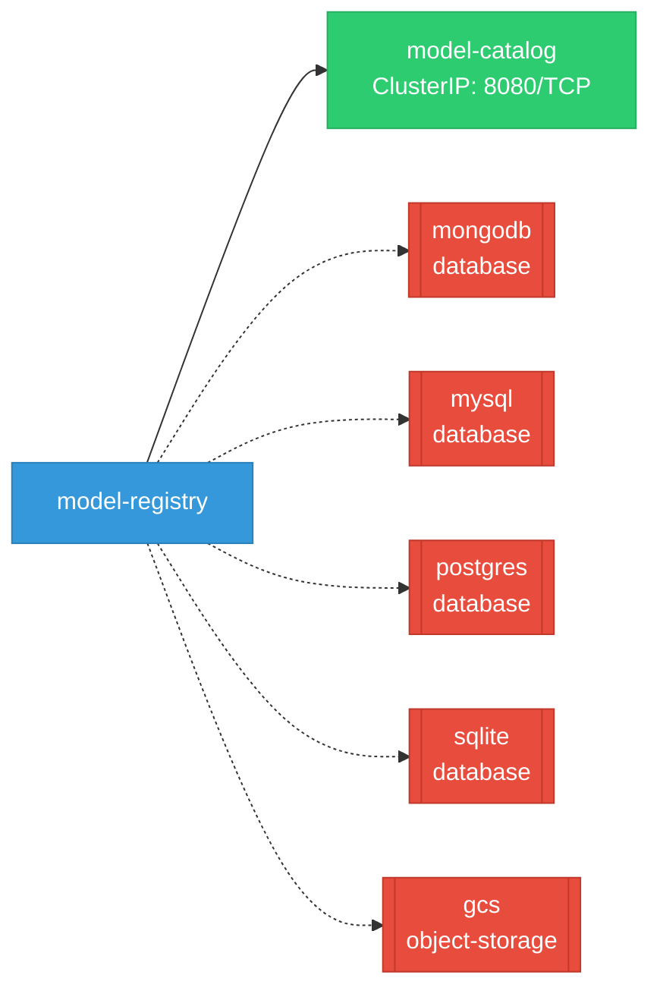

# model-registry: Network

## Service Map

### Services

| Name | Type | Ports | Source |
|------|------|-------|--------|
| model-catalog | ClusterIP | 8080/TCP | [`manifests/kustomize/options/catalog/base/service.yaml`](https://github.com/kubeflow/model-registry/blob/2bccb683c2f077c6d39db5588d7cb908885ac975/manifests/kustomize/options/catalog/base/service.yaml) |

!!! warning "No Network Policies"
    No NetworkPolicy resources found. All pod-to-pod traffic is allowed by default.

