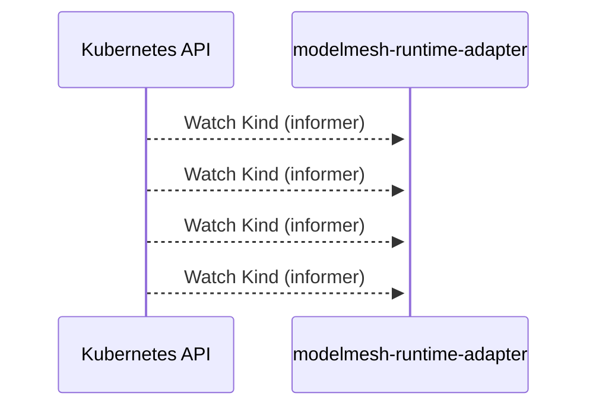

# modelmesh-runtime-adapter: Dataflow

## Controller Watches

Kubernetes resources this controller monitors for changes. Each watch triggers reconciliation when the watched resource is created, updated, or deleted.

| Type | GVK | Source |
|------|-----|--------|
| Watches | sigs.k8s.io/controller-runtime/pkg/source/Kind | [`.gomod-cache/sigs.k8s.io/controller-runtime@v0.14.6/pkg/builder/controller.go:82`](https://github.com/kserve/modelmesh-runtime-adapter/blob/7ccca8eaf90ce2aff1110d59d84e94241cceb2ea/.gomod-cache/sigs.k8s.io/controller-runtime@v0.14.6/pkg/builder/controller.go#L82) |
| Watches | sigs.k8s.io/controller-runtime/pkg/source/Kind | [`.gomod-cache/sigs.k8s.io/controller-runtime@v0.14.6/pkg/builder/controller.go:106`](https://github.com/kserve/modelmesh-runtime-adapter/blob/7ccca8eaf90ce2aff1110d59d84e94241cceb2ea/.gomod-cache/sigs.k8s.io/controller-runtime@v0.14.6/pkg/builder/controller.go#L106) |
| Watches | sigs.k8s.io/controller-runtime/pkg/source/Kind | [`.gopath-loader/pkg/mod/sigs.k8s.io/controller-runtime@v0.14.6/pkg/builder/controller.go:82`](https://github.com/kserve/modelmesh-runtime-adapter/blob/7ccca8eaf90ce2aff1110d59d84e94241cceb2ea/.gopath-loader/pkg/mod/sigs.k8s.io/controller-runtime@v0.14.6/pkg/builder/controller.go#L82) |
| Watches | sigs.k8s.io/controller-runtime/pkg/source/Kind | [`.gopath-loader/pkg/mod/sigs.k8s.io/controller-runtime@v0.14.6/pkg/builder/controller.go:106`](https://github.com/kserve/modelmesh-runtime-adapter/blob/7ccca8eaf90ce2aff1110d59d84e94241cceb2ea/.gopath-loader/pkg/mod/sigs.k8s.io/controller-runtime@v0.14.6/pkg/builder/controller.go#L106) |

## Reconciliation Flow

How the controller interacts with the Kubernetes API during reconciliation.

### HTTP Endpoints

| Method | Path | Source |
|--------|------|--------|
| * | / | [`.gopath-loader/pkg/mod/google.golang.org/appengine@v1.6.7/demos/helloworld/helloworld.go:22`](https://github.com/kserve/modelmesh-runtime-adapter/blob/7ccca8eaf90ce2aff1110d59d84e94241cceb2ea/.gopath-loader/pkg/mod/google.golang.org/appengine@v1.6.7/demos/helloworld/helloworld.go#L22) |
| * | / | [`.gopath-loader/pkg/mod/github.com/!i!b!m/ibm-cos-sdk-go@v1.9.1/awstesting/custom_ca_bundle.go:32`](https://github.com/kserve/modelmesh-runtime-adapter/blob/7ccca8eaf90ce2aff1110d59d84e94241cceb2ea/.gopath-loader/pkg/mod/github.com/!i!b!m/ibm-cos-sdk-go@v1.9.1/awstesting/custom_ca_bundle.go#L32) |
| * | / | [`.gomod-cache/github.com/!i!b!m/ibm-cos-sdk-go@v1.9.1/awstesting/custom_ca_bundle.go:32`](https://github.com/kserve/modelmesh-runtime-adapter/blob/7ccca8eaf90ce2aff1110d59d84e94241cceb2ea/.gomod-cache/github.com/!i!b!m/ibm-cos-sdk-go@v1.9.1/awstesting/custom_ca_bundle.go#L32) |
| * | / | [`.gomod-cache/google.golang.org/appengine@v1.6.7/demos/guestbook/guestbook.go:32`](https://github.com/kserve/modelmesh-runtime-adapter/blob/7ccca8eaf90ce2aff1110d59d84e94241cceb2ea/.gomod-cache/google.golang.org/appengine@v1.6.7/demos/guestbook/guestbook.go#L32) |
| * | / | [`.gomod-cache/google.golang.org/appengine@v1.6.7/demos/helloworld/helloworld.go:22`](https://github.com/kserve/modelmesh-runtime-adapter/blob/7ccca8eaf90ce2aff1110d59d84e94241cceb2ea/.gomod-cache/google.golang.org/appengine@v1.6.7/demos/helloworld/helloworld.go#L22) |
| * | / | [`.gomod-cache/golang.org/x/net@v0.33.0/webdav/litmus_test_server.go:83`](https://github.com/kserve/modelmesh-runtime-adapter/blob/7ccca8eaf90ce2aff1110d59d84e94241cceb2ea/.gomod-cache/golang.org/x/net@v0.33.0/webdav/litmus_test_server.go#L83) |
| * | / | [`.gopath-loader/pkg/mod/golang.org/x/net@v0.33.0/webdav/litmus_test_server.go:83`](https://github.com/kserve/modelmesh-runtime-adapter/blob/7ccca8eaf90ce2aff1110d59d84e94241cceb2ea/.gopath-loader/pkg/mod/golang.org/x/net@v0.33.0/webdav/litmus_test_server.go#L83) |
| * | / | [`.gopath-loader/pkg/mod/google.golang.org/appengine@v1.6.7/demos/guestbook/guestbook.go:32`](https://github.com/kserve/modelmesh-runtime-adapter/blob/7ccca8eaf90ce2aff1110d59d84e94241cceb2ea/.gopath-loader/pkg/mod/google.golang.org/appengine@v1.6.7/demos/guestbook/guestbook.go#L32) |
| * | /_ah/background | [`.gomod-cache/google.golang.org/appengine@v1.6.7/runtime/runtime.go:70`](https://github.com/kserve/modelmesh-runtime-adapter/blob/7ccca8eaf90ce2aff1110d59d84e94241cceb2ea/.gomod-cache/google.golang.org/appengine@v1.6.7/runtime/runtime.go#L70) |
| * | /_ah/background | [`.gopath-loader/pkg/mod/google.golang.org/appengine@v1.6.7/runtime/runtime.go:70`](https://github.com/kserve/modelmesh-runtime-adapter/blob/7ccca8eaf90ce2aff1110d59d84e94241cceb2ea/.gopath-loader/pkg/mod/google.golang.org/appengine@v1.6.7/runtime/runtime.go#L70) |
| * | /_ah/remote_api | [`.gopath-loader/pkg/mod/google.golang.org/appengine@v1.6.7/remote_api/remote_api.go:28`](https://github.com/kserve/modelmesh-runtime-adapter/blob/7ccca8eaf90ce2aff1110d59d84e94241cceb2ea/.gopath-loader/pkg/mod/google.golang.org/appengine@v1.6.7/remote_api/remote_api.go#L28) |
| * | /_ah/remote_api | [`.gomod-cache/google.golang.org/appengine@v1.6.7/remote_api/remote_api.go:28`](https://github.com/kserve/modelmesh-runtime-adapter/blob/7ccca8eaf90ce2aff1110d59d84e94241cceb2ea/.gomod-cache/google.golang.org/appengine@v1.6.7/remote_api/remote_api.go#L28) |
| * | /_ah/xmpp/message/chat/ | [`.gopath-loader/pkg/mod/google.golang.org/appengine@v1.6.7/xmpp/xmpp.go:87`](https://github.com/kserve/modelmesh-runtime-adapter/blob/7ccca8eaf90ce2aff1110d59d84e94241cceb2ea/.gopath-loader/pkg/mod/google.golang.org/appengine@v1.6.7/xmpp/xmpp.go#L87) |
| * | /_ah/xmpp/message/chat/ | [`.gomod-cache/google.golang.org/appengine@v1.6.7/xmpp/xmpp.go:87`](https://github.com/kserve/modelmesh-runtime-adapter/blob/7ccca8eaf90ce2aff1110d59d84e94241cceb2ea/.gomod-cache/google.golang.org/appengine@v1.6.7/xmpp/xmpp.go#L87) |
| * | /authority.cer | [`.gomod-cache/cloud.google.com/go@v0.110.0/httpreplay/cmd/httpr/httpr.go:69`](https://github.com/kserve/modelmesh-runtime-adapter/blob/7ccca8eaf90ce2aff1110d59d84e94241cceb2ea/.gomod-cache/cloud.google.com/go@v0.110.0/httpreplay/cmd/httpr/httpr.go#L69) |
| * | /authority.cer | [`.gopath-loader/pkg/mod/cloud.google.com/go@v0.110.0/httpreplay/cmd/httpr/httpr.go:69`](https://github.com/kserve/modelmesh-runtime-adapter/blob/7ccca8eaf90ce2aff1110d59d84e94241cceb2ea/.gopath-loader/pkg/mod/cloud.google.com/go@v0.110.0/httpreplay/cmd/httpr/httpr.go#L69) |
| * | /initial | [`.gopath-loader/pkg/mod/cloud.google.com/go@v0.110.0/httpreplay/cmd/httpr/httpr.go:70`](https://github.com/kserve/modelmesh-runtime-adapter/blob/7ccca8eaf90ce2aff1110d59d84e94241cceb2ea/.gopath-loader/pkg/mod/cloud.google.com/go@v0.110.0/httpreplay/cmd/httpr/httpr.go#L70) |
| * | /initial | [`.gomod-cache/cloud.google.com/go@v0.110.0/httpreplay/cmd/httpr/httpr.go:70`](https://github.com/kserve/modelmesh-runtime-adapter/blob/7ccca8eaf90ce2aff1110d59d84e94241cceb2ea/.gomod-cache/cloud.google.com/go@v0.110.0/httpreplay/cmd/httpr/httpr.go#L70) |
| * | /sign | [`.gopath-loader/pkg/mod/google.golang.org/appengine@v1.6.7/demos/guestbook/guestbook.go:33`](https://github.com/kserve/modelmesh-runtime-adapter/blob/7ccca8eaf90ce2aff1110d59d84e94241cceb2ea/.gopath-loader/pkg/mod/google.golang.org/appengine@v1.6.7/demos/guestbook/guestbook.go#L33) |
| * | /sign | [`.gomod-cache/google.golang.org/appengine@v1.6.7/demos/guestbook/guestbook.go:33`](https://github.com/kserve/modelmesh-runtime-adapter/blob/7ccca8eaf90ce2aff1110d59d84e94241cceb2ea/.gomod-cache/google.golang.org/appengine@v1.6.7/demos/guestbook/guestbook.go#L33) |
| * | header | [`.gomod-cache/golang.org/x/net@v0.33.0/quic/qlog.go:167`](https://github.com/kserve/modelmesh-runtime-adapter/blob/7ccca8eaf90ce2aff1110d59d84e94241cceb2ea/.gomod-cache/golang.org/x/net@v0.33.0/quic/qlog.go#L167) |
| * | header | [`.gomod-cache/golang.org/x/net@v0.33.0/quic/qlog.go:269`](https://github.com/kserve/modelmesh-runtime-adapter/blob/7ccca8eaf90ce2aff1110d59d84e94241cceb2ea/.gomod-cache/golang.org/x/net@v0.33.0/quic/qlog.go#L269) |
| * | header | [`.gopath-loader/pkg/mod/golang.org/x/net@v0.33.0/quic/qlog.go:269`](https://github.com/kserve/modelmesh-runtime-adapter/blob/7ccca8eaf90ce2aff1110d59d84e94241cceb2ea/.gopath-loader/pkg/mod/golang.org/x/net@v0.33.0/quic/qlog.go#L269) |
| * | header | [`.gopath-loader/pkg/mod/golang.org/x/net@v0.33.0/quic/qlog.go:167`](https://github.com/kserve/modelmesh-runtime-adapter/blob/7ccca8eaf90ce2aff1110d59d84e94241cceb2ea/.gopath-loader/pkg/mod/golang.org/x/net@v0.33.0/quic/qlog.go#L167) |
| * | header | [`.gopath-loader/pkg/mod/golang.org/x/net@v0.33.0/quic/qlog.go:189`](https://github.com/kserve/modelmesh-runtime-adapter/blob/7ccca8eaf90ce2aff1110d59d84e94241cceb2ea/.gopath-loader/pkg/mod/golang.org/x/net@v0.33.0/quic/qlog.go#L189) |
| * | header | [`.gomod-cache/golang.org/x/net@v0.33.0/quic/qlog.go:213`](https://github.com/kserve/modelmesh-runtime-adapter/blob/7ccca8eaf90ce2aff1110d59d84e94241cceb2ea/.gomod-cache/golang.org/x/net@v0.33.0/quic/qlog.go#L213) |
| * | header | [`.gopath-loader/pkg/mod/golang.org/x/net@v0.33.0/quic/qlog.go:213`](https://github.com/kserve/modelmesh-runtime-adapter/blob/7ccca8eaf90ce2aff1110d59d84e94241cceb2ea/.gopath-loader/pkg/mod/golang.org/x/net@v0.33.0/quic/qlog.go#L213) |
| * | header | [`.gomod-cache/golang.org/x/net@v0.33.0/quic/qlog.go:189`](https://github.com/kserve/modelmesh-runtime-adapter/blob/7ccca8eaf90ce2aff1110d59d84e94241cceb2ea/.gomod-cache/golang.org/x/net@v0.33.0/quic/qlog.go#L189) |
| * | raw | [`.gomod-cache/golang.org/x/net@v0.33.0/quic/qlog.go:219`](https://github.com/kserve/modelmesh-runtime-adapter/blob/7ccca8eaf90ce2aff1110d59d84e94241cceb2ea/.gomod-cache/golang.org/x/net@v0.33.0/quic/qlog.go#L219) |
| * | raw | [`.gopath-loader/pkg/mod/golang.org/x/net@v0.33.0/quic/qlog.go:219`](https://github.com/kserve/modelmesh-runtime-adapter/blob/7ccca8eaf90ce2aff1110d59d84e94241cceb2ea/.gopath-loader/pkg/mod/golang.org/x/net@v0.33.0/quic/qlog.go#L219) |
| * | raw | [`.gopath-loader/pkg/mod/golang.org/x/net@v0.33.0/quic/qlog.go:195`](https://github.com/kserve/modelmesh-runtime-adapter/blob/7ccca8eaf90ce2aff1110d59d84e94241cceb2ea/.gopath-loader/pkg/mod/golang.org/x/net@v0.33.0/quic/qlog.go#L195) |
| * | raw | [`.gopath-loader/pkg/mod/golang.org/x/net@v0.33.0/quic/qlog.go:174`](https://github.com/kserve/modelmesh-runtime-adapter/blob/7ccca8eaf90ce2aff1110d59d84e94241cceb2ea/.gopath-loader/pkg/mod/golang.org/x/net@v0.33.0/quic/qlog.go#L174) |
| * | raw | [`.gomod-cache/golang.org/x/net@v0.33.0/quic/qlog.go:195`](https://github.com/kserve/modelmesh-runtime-adapter/blob/7ccca8eaf90ce2aff1110d59d84e94241cceb2ea/.gomod-cache/golang.org/x/net@v0.33.0/quic/qlog.go#L195) |
| * | raw | [`.gomod-cache/golang.org/x/net@v0.33.0/quic/qlog.go:174`](https://github.com/kserve/modelmesh-runtime-adapter/blob/7ccca8eaf90ce2aff1110d59d84e94241cceb2ea/.gomod-cache/golang.org/x/net@v0.33.0/quic/qlog.go#L174) |
| * | vantage_point | [`.gopath-loader/pkg/mod/golang.org/x/net@v0.33.0/quic/qlog.go:98`](https://github.com/kserve/modelmesh-runtime-adapter/blob/7ccca8eaf90ce2aff1110d59d84e94241cceb2ea/.gopath-loader/pkg/mod/golang.org/x/net@v0.33.0/quic/qlog.go#L98) |
| * | vantage_point | [`.gomod-cache/golang.org/x/net@v0.33.0/quic/qlog.go:98`](https://github.com/kserve/modelmesh-runtime-adapter/blob/7ccca8eaf90ce2aff1110d59d84e94241cceb2ea/.gomod-cache/golang.org/x/net@v0.33.0/quic/qlog.go#L98) |

## Configuration

ConfigMaps and Helm values that control this component's runtime behavior.

