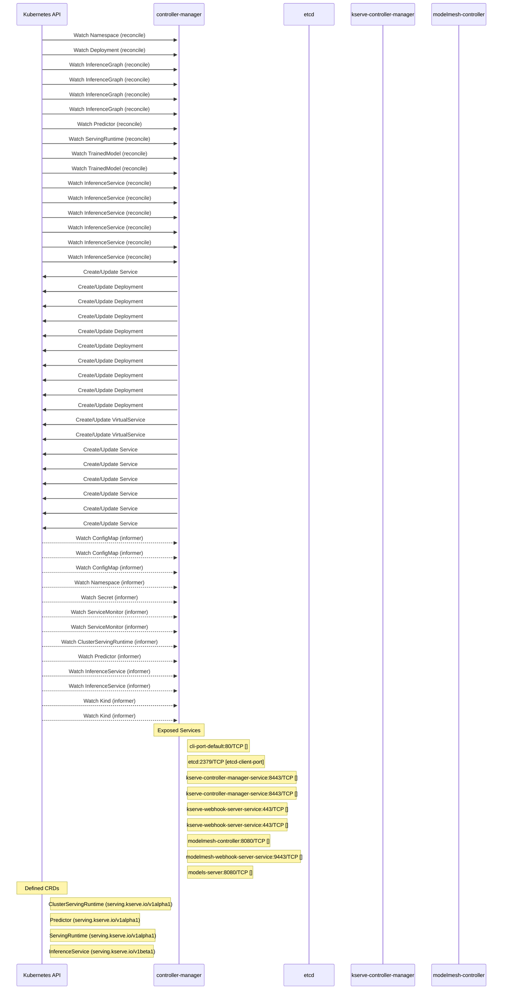

# modelmesh-serving: Dataflow

## Controller Watches

Kubernetes resources this controller monitors for changes. Each watch triggers reconciliation when the watched resource is created, updated, or deleted.

| Type | GVK | Source |
|------|-----|--------|
| For | /v1/Namespace | [`controllers/service_controller.go:476`](https://github.com/kserve/modelmesh-serving/blob/4e16417034a9fc02561b6cdb0356d337805589b1/controllers/service_controller.go#L476) |
| For | apps/v1/Deployment | [`controllers/service_controller.go:449`](https://github.com/kserve/modelmesh-serving/blob/4e16417034a9fc02561b6cdb0356d337805589b1/controllers/service_controller.go#L449) |
| For | serving/v1alpha1/InferenceGraph | [`.gomod-cache/github.com/kserve/kserve@v0.12.0/pkg/controller/v1alpha1/inferencegraph/controller.go:271`](https://github.com/kserve/modelmesh-serving/blob/4e16417034a9fc02561b6cdb0356d337805589b1/.gomod-cache/github.com/kserve/kserve@v0.12.0/pkg/controller/v1alpha1/inferencegraph/controller.go#L271) |
| For | serving/v1alpha1/InferenceGraph | [`.gopath-loader/pkg/mod/github.com/kserve/kserve@v0.12.0/pkg/controller/v1alpha1/inferencegraph/controller.go:276`](https://github.com/kserve/modelmesh-serving/blob/4e16417034a9fc02561b6cdb0356d337805589b1/.gopath-loader/pkg/mod/github.com/kserve/kserve@v0.12.0/pkg/controller/v1alpha1/inferencegraph/controller.go#L276) |
| For | serving/v1alpha1/InferenceGraph | [`.gopath-loader/pkg/mod/github.com/kserve/kserve@v0.12.0/pkg/controller/v1alpha1/inferencegraph/controller.go:271`](https://github.com/kserve/modelmesh-serving/blob/4e16417034a9fc02561b6cdb0356d337805589b1/.gopath-loader/pkg/mod/github.com/kserve/kserve@v0.12.0/pkg/controller/v1alpha1/inferencegraph/controller.go#L271) |
| For | serving/v1alpha1/InferenceGraph | [`.gomod-cache/github.com/kserve/kserve@v0.12.0/pkg/controller/v1alpha1/inferencegraph/controller.go:276`](https://github.com/kserve/modelmesh-serving/blob/4e16417034a9fc02561b6cdb0356d337805589b1/.gomod-cache/github.com/kserve/kserve@v0.12.0/pkg/controller/v1alpha1/inferencegraph/controller.go#L276) |
| For | serving/v1alpha1/Predictor | [`controllers/predictor_controller.go:594`](https://github.com/kserve/modelmesh-serving/blob/4e16417034a9fc02561b6cdb0356d337805589b1/controllers/predictor_controller.go#L594) |
| For | serving/v1alpha1/ServingRuntime | [`controllers/servingruntime_controller.go:607`](https://github.com/kserve/modelmesh-serving/blob/4e16417034a9fc02561b6cdb0356d337805589b1/controllers/servingruntime_controller.go#L607) |
| For | serving/v1alpha1/TrainedModel | [`.gopath-loader/pkg/mod/github.com/kserve/kserve@v0.12.0/pkg/controller/v1alpha1/trainedmodel/controller.go:300`](https://github.com/kserve/modelmesh-serving/blob/4e16417034a9fc02561b6cdb0356d337805589b1/.gopath-loader/pkg/mod/github.com/kserve/kserve@v0.12.0/pkg/controller/v1alpha1/trainedmodel/controller.go#L300) |
| For | serving/v1alpha1/TrainedModel | [`.gomod-cache/github.com/kserve/kserve@v0.12.0/pkg/controller/v1alpha1/trainedmodel/controller.go:300`](https://github.com/kserve/modelmesh-serving/blob/4e16417034a9fc02561b6cdb0356d337805589b1/.gomod-cache/github.com/kserve/kserve@v0.12.0/pkg/controller/v1alpha1/trainedmodel/controller.go#L300) |
| For | serving/v1beta1/InferenceService | [`.gomod-cache/github.com/kserve/kserve@v0.12.0/pkg/controller/v1beta1/inferenceservice/controller.go:306`](https://github.com/kserve/modelmesh-serving/blob/4e16417034a9fc02561b6cdb0356d337805589b1/.gomod-cache/github.com/kserve/kserve@v0.12.0/pkg/controller/v1beta1/inferenceservice/controller.go#L306) |
| For | serving/v1beta1/InferenceService | [`.gopath-loader/pkg/mod/github.com/kserve/kserve@v0.12.0/pkg/controller/v1beta1/inferenceservice/controller.go:301`](https://github.com/kserve/modelmesh-serving/blob/4e16417034a9fc02561b6cdb0356d337805589b1/.gopath-loader/pkg/mod/github.com/kserve/kserve@v0.12.0/pkg/controller/v1beta1/inferenceservice/controller.go#L301) |
| For | serving/v1beta1/InferenceService | [`.gomod-cache/github.com/kserve/kserve@v0.12.0/pkg/controller/v1beta1/inferenceservice/controller.go:313`](https://github.com/kserve/modelmesh-serving/blob/4e16417034a9fc02561b6cdb0356d337805589b1/.gomod-cache/github.com/kserve/kserve@v0.12.0/pkg/controller/v1beta1/inferenceservice/controller.go#L313) |
| For | serving/v1beta1/InferenceService | [`.gopath-loader/pkg/mod/github.com/kserve/kserve@v0.12.0/pkg/controller/v1beta1/inferenceservice/controller.go:313`](https://github.com/kserve/modelmesh-serving/blob/4e16417034a9fc02561b6cdb0356d337805589b1/.gopath-loader/pkg/mod/github.com/kserve/kserve@v0.12.0/pkg/controller/v1beta1/inferenceservice/controller.go#L313) |
| For | serving/v1beta1/InferenceService | [`.gomod-cache/github.com/kserve/kserve@v0.12.0/pkg/controller/v1beta1/inferenceservice/controller.go:301`](https://github.com/kserve/modelmesh-serving/blob/4e16417034a9fc02561b6cdb0356d337805589b1/.gomod-cache/github.com/kserve/kserve@v0.12.0/pkg/controller/v1beta1/inferenceservice/controller.go#L301) |
| For | serving/v1beta1/InferenceService | [`.gopath-loader/pkg/mod/github.com/kserve/kserve@v0.12.0/pkg/controller/v1beta1/inferenceservice/controller.go:306`](https://github.com/kserve/modelmesh-serving/blob/4e16417034a9fc02561b6cdb0356d337805589b1/.gopath-loader/pkg/mod/github.com/kserve/kserve@v0.12.0/pkg/controller/v1beta1/inferenceservice/controller.go#L306) |
| Owns | /v1/Service | [`controllers/service_controller.go:433`](https://github.com/kserve/modelmesh-serving/blob/4e16417034a9fc02561b6cdb0356d337805589b1/controllers/service_controller.go#L433) |
| Owns | apps/v1/Deployment | [`.gomod-cache/github.com/kserve/kserve@v0.12.0/pkg/controller/v1beta1/inferenceservice/controller.go:302`](https://github.com/kserve/modelmesh-serving/blob/4e16417034a9fc02561b6cdb0356d337805589b1/.gomod-cache/github.com/kserve/kserve@v0.12.0/pkg/controller/v1beta1/inferenceservice/controller.go#L302) |
| Owns | apps/v1/Deployment | [`.gomod-cache/github.com/kserve/kserve@v0.12.0/pkg/controller/v1alpha1/inferencegraph/controller.go:272`](https://github.com/kserve/modelmesh-serving/blob/4e16417034a9fc02561b6cdb0356d337805589b1/.gomod-cache/github.com/kserve/kserve@v0.12.0/pkg/controller/v1alpha1/inferencegraph/controller.go#L272) |
| Owns | apps/v1/Deployment | [`.gopath-loader/pkg/mod/github.com/kserve/kserve@v0.12.0/pkg/controller/v1beta1/inferenceservice/controller.go:302`](https://github.com/kserve/modelmesh-serving/blob/4e16417034a9fc02561b6cdb0356d337805589b1/.gopath-loader/pkg/mod/github.com/kserve/kserve@v0.12.0/pkg/controller/v1beta1/inferenceservice/controller.go#L302) |
| Owns | apps/v1/Deployment | [`controllers/servingruntime_controller.go:608`](https://github.com/kserve/modelmesh-serving/blob/4e16417034a9fc02561b6cdb0356d337805589b1/controllers/servingruntime_controller.go#L608) |
| Owns | apps/v1/Deployment | [`.gopath-loader/pkg/mod/github.com/kserve/kserve@v0.12.0/pkg/controller/v1beta1/inferenceservice/controller.go:309`](https://github.com/kserve/modelmesh-serving/blob/4e16417034a9fc02561b6cdb0356d337805589b1/.gopath-loader/pkg/mod/github.com/kserve/kserve@v0.12.0/pkg/controller/v1beta1/inferenceservice/controller.go#L309) |
| Owns | apps/v1/Deployment | [`.gopath-loader/pkg/mod/github.com/kserve/kserve@v0.12.0/pkg/controller/v1beta1/inferenceservice/controller.go:315`](https://github.com/kserve/modelmesh-serving/blob/4e16417034a9fc02561b6cdb0356d337805589b1/.gopath-loader/pkg/mod/github.com/kserve/kserve@v0.12.0/pkg/controller/v1beta1/inferenceservice/controller.go#L315) |
| Owns | apps/v1/Deployment | [`.gopath-loader/pkg/mod/github.com/kserve/kserve@v0.12.0/pkg/controller/v1alpha1/inferencegraph/controller.go:272`](https://github.com/kserve/modelmesh-serving/blob/4e16417034a9fc02561b6cdb0356d337805589b1/.gopath-loader/pkg/mod/github.com/kserve/kserve@v0.12.0/pkg/controller/v1alpha1/inferencegraph/controller.go#L272) |
| Owns | apps/v1/Deployment | [`.gomod-cache/github.com/kserve/kserve@v0.12.0/pkg/controller/v1beta1/inferenceservice/controller.go:315`](https://github.com/kserve/modelmesh-serving/blob/4e16417034a9fc02561b6cdb0356d337805589b1/.gomod-cache/github.com/kserve/kserve@v0.12.0/pkg/controller/v1beta1/inferenceservice/controller.go#L315) |
| Owns | apps/v1/Deployment | [`.gomod-cache/github.com/kserve/kserve@v0.12.0/pkg/controller/v1beta1/inferenceservice/controller.go:309`](https://github.com/kserve/modelmesh-serving/blob/4e16417034a9fc02561b6cdb0356d337805589b1/.gomod-cache/github.com/kserve/kserve@v0.12.0/pkg/controller/v1beta1/inferenceservice/controller.go#L309) |
| Owns | networking/v1beta1/VirtualService | [`.gopath-loader/pkg/mod/github.com/kserve/kserve@v0.12.0/pkg/controller/v1beta1/inferenceservice/controller.go:308`](https://github.com/kserve/modelmesh-serving/blob/4e16417034a9fc02561b6cdb0356d337805589b1/.gopath-loader/pkg/mod/github.com/kserve/kserve@v0.12.0/pkg/controller/v1beta1/inferenceservice/controller.go#L308) |
| Owns | networking/v1beta1/VirtualService | [`.gomod-cache/github.com/kserve/kserve@v0.12.0/pkg/controller/v1beta1/inferenceservice/controller.go:308`](https://github.com/kserve/modelmesh-serving/blob/4e16417034a9fc02561b6cdb0356d337805589b1/.gomod-cache/github.com/kserve/kserve@v0.12.0/pkg/controller/v1beta1/inferenceservice/controller.go#L308) |
| Owns | serving/v1/Service | [`.gomod-cache/github.com/kserve/kserve@v0.12.0/pkg/controller/v1alpha1/inferencegraph/controller.go:277`](https://github.com/kserve/modelmesh-serving/blob/4e16417034a9fc02561b6cdb0356d337805589b1/.gomod-cache/github.com/kserve/kserve@v0.12.0/pkg/controller/v1alpha1/inferencegraph/controller.go#L277) |
| Owns | serving/v1/Service | [`.gomod-cache/github.com/kserve/kserve@v0.12.0/pkg/controller/v1beta1/inferenceservice/controller.go:307`](https://github.com/kserve/modelmesh-serving/blob/4e16417034a9fc02561b6cdb0356d337805589b1/.gomod-cache/github.com/kserve/kserve@v0.12.0/pkg/controller/v1beta1/inferenceservice/controller.go#L307) |
| Owns | serving/v1/Service | [`.gopath-loader/pkg/mod/github.com/kserve/kserve@v0.12.0/pkg/controller/v1beta1/inferenceservice/controller.go:314`](https://github.com/kserve/modelmesh-serving/blob/4e16417034a9fc02561b6cdb0356d337805589b1/.gopath-loader/pkg/mod/github.com/kserve/kserve@v0.12.0/pkg/controller/v1beta1/inferenceservice/controller.go#L314) |
| Owns | serving/v1/Service | [`.gomod-cache/github.com/kserve/kserve@v0.12.0/pkg/controller/v1beta1/inferenceservice/controller.go:314`](https://github.com/kserve/modelmesh-serving/blob/4e16417034a9fc02561b6cdb0356d337805589b1/.gomod-cache/github.com/kserve/kserve@v0.12.0/pkg/controller/v1beta1/inferenceservice/controller.go#L314) |
| Owns | serving/v1/Service | [`.gopath-loader/pkg/mod/github.com/kserve/kserve@v0.12.0/pkg/controller/v1alpha1/inferencegraph/controller.go:277`](https://github.com/kserve/modelmesh-serving/blob/4e16417034a9fc02561b6cdb0356d337805589b1/.gopath-loader/pkg/mod/github.com/kserve/kserve@v0.12.0/pkg/controller/v1alpha1/inferencegraph/controller.go#L277) |
| Owns | serving/v1/Service | [`.gopath-loader/pkg/mod/github.com/kserve/kserve@v0.12.0/pkg/controller/v1beta1/inferenceservice/controller.go:307`](https://github.com/kserve/modelmesh-serving/blob/4e16417034a9fc02561b6cdb0356d337805589b1/.gopath-loader/pkg/mod/github.com/kserve/kserve@v0.12.0/pkg/controller/v1beta1/inferenceservice/controller.go#L307) |
| Watches | /v1/ConfigMap | [`controllers/service_controller.go:454`](https://github.com/kserve/modelmesh-serving/blob/4e16417034a9fc02561b6cdb0356d337805589b1/controllers/service_controller.go#L454) |
| Watches | /v1/ConfigMap | [`controllers/service_controller.go:477`](https://github.com/kserve/modelmesh-serving/blob/4e16417034a9fc02561b6cdb0356d337805589b1/controllers/service_controller.go#L477) |
| Watches | /v1/ConfigMap | [`controllers/servingruntime_controller.go:610`](https://github.com/kserve/modelmesh-serving/blob/4e16417034a9fc02561b6cdb0356d337805589b1/controllers/servingruntime_controller.go#L610) |
| Watches | /v1/Namespace | [`controllers/servingruntime_controller.go:626`](https://github.com/kserve/modelmesh-serving/blob/4e16417034a9fc02561b6cdb0356d337805589b1/controllers/servingruntime_controller.go#L626) |
| Watches | /v1/Secret | [`controllers/servingruntime_controller.go:650`](https://github.com/kserve/modelmesh-serving/blob/4e16417034a9fc02561b6cdb0356d337805589b1/controllers/servingruntime_controller.go#L650) |
| Watches | monitoring/v1/ServiceMonitor | [`controllers/service_controller.go:465`](https://github.com/kserve/modelmesh-serving/blob/4e16417034a9fc02561b6cdb0356d337805589b1/controllers/service_controller.go#L465) |
| Watches | monitoring/v1/ServiceMonitor | [`controllers/service_controller.go:499`](https://github.com/kserve/modelmesh-serving/blob/4e16417034a9fc02561b6cdb0356d337805589b1/controllers/service_controller.go#L499) |
| Watches | serving/v1alpha1/ClusterServingRuntime | [`controllers/servingruntime_controller.go:643`](https://github.com/kserve/modelmesh-serving/blob/4e16417034a9fc02561b6cdb0356d337805589b1/controllers/servingruntime_controller.go#L643) |
| Watches | serving/v1alpha1/Predictor | [`controllers/servingruntime_controller.go:619`](https://github.com/kserve/modelmesh-serving/blob/4e16417034a9fc02561b6cdb0356d337805589b1/controllers/servingruntime_controller.go#L619) |
| Watches | serving/v1beta1/InferenceService | [`controllers/servingruntime_controller.go:633`](https://github.com/kserve/modelmesh-serving/blob/4e16417034a9fc02561b6cdb0356d337805589b1/controllers/servingruntime_controller.go#L633) |
| Watches | serving/v1beta1/InferenceService | [`controllers/predictor_controller.go:602`](https://github.com/kserve/modelmesh-serving/blob/4e16417034a9fc02561b6cdb0356d337805589b1/controllers/predictor_controller.go#L602) |
| Watches | sigs.k8s.io/controller-runtime/pkg/source/Kind | [`.gomod-cache/sigs.k8s.io/controller-runtime@v0.16.3/pkg/builder/controller.go:83`](https://github.com/kserve/modelmesh-serving/blob/4e16417034a9fc02561b6cdb0356d337805589b1/.gomod-cache/sigs.k8s.io/controller-runtime@v0.16.3/pkg/builder/controller.go#L83) |
| Watches | sigs.k8s.io/controller-runtime/pkg/source/Kind | [`.gopath-loader/pkg/mod/sigs.k8s.io/controller-runtime@v0.16.3/pkg/builder/controller.go:83`](https://github.com/kserve/modelmesh-serving/blob/4e16417034a9fc02561b6cdb0356d337805589b1/.gopath-loader/pkg/mod/sigs.k8s.io/controller-runtime@v0.16.3/pkg/builder/controller.go#L83) |

### Programmatic Resource Operations

| Verb | Kind | Group | Condition |
|------|------|-------|----------|
| create | HorizontalPodAutoscaler | autoscaling |  |
| update | HorizontalPodAutoscaler | autoscaling |  |
| delete | HorizontalPodAutoscaler | autoscaling |  |
| delete | ConfigMap |  |  |
| create | ConfigMap |  |  |
| update | ConfigMap |  |  |
| delete | Service |  |  |
| create | Service |  |  |
| update | Service |  |  |
| delete | ServiceMonitor | monitoring |  |
| create | ServiceMonitor | monitoring |  |
| update | ServiceMonitor | monitoring |  |
| delete | Secret |  |  |

## Reconciliation Flow

How the controller interacts with the Kubernetes API during reconciliation.

### Webhooks

| Name | Type | Path | Failure Policy | Service | Overlays | Enable Condition | Sources |
|------|------|------|----------------|---------|----------|------------------|----------|
| conversion-unknown | conversion | /convert |  | /webhook-service |  |  | [`config/crd/patches/webhook_in_predictors.yaml`](https://github.com/kserve/modelmesh-serving/blob/4e16417034a9fc02561b6cdb0356d337805589b1/config/crd/patches/webhook_in_predictors.yaml), [`.gomod-cache/sigs.k8s.io/controller-runtime@v0.16.3/pkg/builder/webhook.go`](https://github.com/kserve/modelmesh-serving/blob/4e16417034a9fc02561b6cdb0356d337805589b1/.gomod-cache/sigs.k8s.io/controller-runtime@v0.16.3/pkg/builder/webhook.go), [`.gopath-loader/pkg/mod/sigs.k8s.io/controller-runtime@v0.16.3/pkg/builder/webhook.go`](https://github.com/kserve/modelmesh-serving/blob/4e16417034a9fc02561b6cdb0356d337805589b1/.gopath-loader/pkg/mod/sigs.k8s.io/controller-runtime@v0.16.3/pkg/builder/webhook.go) |
| conversion-unknown | conversion | /convert |  | /webhook-service |  |  | [`config/crd/patches/webhook_in_servingruntimes.yaml`](https://github.com/kserve/modelmesh-serving/blob/4e16417034a9fc02561b6cdb0356d337805589b1/config/crd/patches/webhook_in_servingruntimes.yaml), [`.gomod-cache/sigs.k8s.io/controller-runtime@v0.16.3/pkg/builder/webhook.go`](https://github.com/kserve/modelmesh-serving/blob/4e16417034a9fc02561b6cdb0356d337805589b1/.gomod-cache/sigs.k8s.io/controller-runtime@v0.16.3/pkg/builder/webhook.go), [`.gopath-loader/pkg/mod/sigs.k8s.io/controller-runtime@v0.16.3/pkg/builder/webhook.go`](https://github.com/kserve/modelmesh-serving/blob/4e16417034a9fc02561b6cdb0356d337805589b1/.gopath-loader/pkg/mod/sigs.k8s.io/controller-runtime@v0.16.3/pkg/builder/webhook.go) |
| servingruntime.modelmesh-webhook-server.default | validating | /validate-serving-modelmesh-io-v1alpha1-servingruntime | Fail | opendatahub/modelmesh-webhook-server-service | config/overlays/odh |  | [`config/webhook/manifests.yaml`](https://github.com/kserve/modelmesh-serving/blob/4e16417034a9fc02561b6cdb0356d337805589b1/config/webhook/manifests.yaml), [`kustomize:config/overlays/odh (modelmesh-servingruntime.serving.kserve.io)`](https://github.com/kserve/modelmesh-serving/blob/4e16417034a9fc02561b6cdb0356d337805589b1/kustomize:config/overlays/odh (modelmesh-servingruntime.serving.kserve.io)) |

### HTTP Endpoints

| Method | Path | Source |
|--------|------|--------|
| * | / | [`.gopath-loader/pkg/mod/golang.org/x/tools@v0.21.1-0.20240508182429-e35e4ccd0d2d/cmd/godoc/handlers.go:42`](https://github.com/kserve/modelmesh-serving/blob/4e16417034a9fc02561b6cdb0356d337805589b1/.gopath-loader/pkg/mod/golang.org/x/tools@v0.21.1-0.20240508182429-e35e4ccd0d2d/cmd/godoc/handlers.go#L42) |
| * | / | [`.gopath-loader/pkg/mod/knative.dev/pkg@v0.0.0-20231115001034-97c7258e3a98/webhook/webhook.go:211`](https://github.com/kserve/modelmesh-serving/blob/4e16417034a9fc02561b6cdb0356d337805589b1/.gopath-loader/pkg/mod/knative.dev/pkg@v0.0.0-20231115001034-97c7258e3a98/webhook/webhook.go#L211) |
| * | / | [`.gomod-cache/github.com/aws/aws-sdk-go@v1.48.0/awstesting/certificate_utils.go:218`](https://github.com/kserve/modelmesh-serving/blob/4e16417034a9fc02561b6cdb0356d337805589b1/.gomod-cache/github.com/aws/aws-sdk-go@v1.48.0/awstesting/certificate_utils.go#L218) |
| * | / | [`.gomod-cache/golang.org/x/tools@v0.21.1-0.20240508182429-e35e4ccd0d2d/cmd/godoc/handlers.go:42`](https://github.com/kserve/modelmesh-serving/blob/4e16417034a9fc02561b6cdb0356d337805589b1/.gomod-cache/golang.org/x/tools@v0.21.1-0.20240508182429-e35e4ccd0d2d/cmd/godoc/handlers.go#L42) |
| * | / | [`.gomod-cache/golang.org/x/tools@v0.21.1-0.20240508182429-e35e4ccd0d2d/cmd/present/dir.go:23`](https://github.com/kserve/modelmesh-serving/blob/4e16417034a9fc02561b6cdb0356d337805589b1/.gomod-cache/golang.org/x/tools@v0.21.1-0.20240508182429-e35e4ccd0d2d/cmd/present/dir.go#L23) |
| * | / | [`.gomod-cache/golang.org/x/tools@v0.21.1-0.20240508182429-e35e4ccd0d2d/go/types/internal/play/play.go:44`](https://github.com/kserve/modelmesh-serving/blob/4e16417034a9fc02561b6cdb0356d337805589b1/.gomod-cache/golang.org/x/tools@v0.21.1-0.20240508182429-e35e4ccd0d2d/go/types/internal/play/play.go#L44) |
| * | / | [`.gomod-cache/github.com/google/pprof@v0.0.0-20210720184732-4bb14d4b1be1/internal/driver/webui.go:204`](https://github.com/kserve/modelmesh-serving/blob/4e16417034a9fc02561b6cdb0356d337805589b1/.gomod-cache/github.com/google/pprof@v0.0.0-20210720184732-4bb14d4b1be1/internal/driver/webui.go#L204) |
| * | / | [`.gomod-cache/github.com/kserve/kserve@v0.12.0/cmd/router/main.go:354`](https://github.com/kserve/modelmesh-serving/blob/4e16417034a9fc02561b6cdb0356d337805589b1/.gomod-cache/github.com/kserve/kserve@v0.12.0/cmd/router/main.go#L354) |
| * | / | [`.gomod-cache/golang.org/x/tools@v0.21.1-0.20240508182429-e35e4ccd0d2d/godoc/pres.go:130`](https://github.com/kserve/modelmesh-serving/blob/4e16417034a9fc02561b6cdb0356d337805589b1/.gomod-cache/golang.org/x/tools@v0.21.1-0.20240508182429-e35e4ccd0d2d/godoc/pres.go#L130) |
| * | / | [`.gopath-loader/pkg/mod/golang.org/x/tools@v0.21.1-0.20240508182429-e35e4ccd0d2d/go/types/internal/play/play.go:44`](https://github.com/kserve/modelmesh-serving/blob/4e16417034a9fc02561b6cdb0356d337805589b1/.gopath-loader/pkg/mod/golang.org/x/tools@v0.21.1-0.20240508182429-e35e4ccd0d2d/go/types/internal/play/play.go#L44) |
| * | / | [`.gomod-cache/google.golang.org/appengine@v1.6.8/demos/guestbook/guestbook.go:32`](https://github.com/kserve/modelmesh-serving/blob/4e16417034a9fc02561b6cdb0356d337805589b1/.gomod-cache/google.golang.org/appengine@v1.6.8/demos/guestbook/guestbook.go#L32) |
| * | / | [`.gomod-cache/google.golang.org/appengine@v1.6.8/demos/helloworld/helloworld.go:23`](https://github.com/kserve/modelmesh-serving/blob/4e16417034a9fc02561b6cdb0356d337805589b1/.gomod-cache/google.golang.org/appengine@v1.6.8/demos/helloworld/helloworld.go#L23) |
| * | / | [`.gomod-cache/golang.org/x/tools@v0.21.1-0.20240508182429-e35e4ccd0d2d/cmd/godoc/handlers.go:31`](https://github.com/kserve/modelmesh-serving/blob/4e16417034a9fc02561b6cdb0356d337805589b1/.gomod-cache/golang.org/x/tools@v0.21.1-0.20240508182429-e35e4ccd0d2d/cmd/godoc/handlers.go#L31) |
| * | / | [`.gopath-loader/pkg/mod/github.com/google/pprof@v0.0.0-20210720184732-4bb14d4b1be1/internal/driver/webui.go:204`](https://github.com/kserve/modelmesh-serving/blob/4e16417034a9fc02561b6cdb0356d337805589b1/.gopath-loader/pkg/mod/github.com/google/pprof@v0.0.0-20210720184732-4bb14d4b1be1/internal/driver/webui.go#L204) |
| * | / | [`.gopath-loader/pkg/mod/google.golang.org/appengine@v1.6.8/demos/helloworld/helloworld.go:23`](https://github.com/kserve/modelmesh-serving/blob/4e16417034a9fc02561b6cdb0356d337805589b1/.gopath-loader/pkg/mod/google.golang.org/appengine@v1.6.8/demos/helloworld/helloworld.go#L23) |
| * | / | [`.gopath-loader/pkg/mod/golang.org/x/tools@v0.21.1-0.20240508182429-e35e4ccd0d2d/godoc/pres.go:130`](https://github.com/kserve/modelmesh-serving/blob/4e16417034a9fc02561b6cdb0356d337805589b1/.gopath-loader/pkg/mod/golang.org/x/tools@v0.21.1-0.20240508182429-e35e4ccd0d2d/godoc/pres.go#L130) |
| * | / | [`.gopath-loader/pkg/mod/google.golang.org/appengine@v1.6.8/demos/guestbook/guestbook.go:32`](https://github.com/kserve/modelmesh-serving/blob/4e16417034a9fc02561b6cdb0356d337805589b1/.gopath-loader/pkg/mod/google.golang.org/appengine@v1.6.8/demos/guestbook/guestbook.go#L32) |
| * | / | [`.gomod-cache/knative.dev/pkg@v0.0.0-20231115001034-97c7258e3a98/webhook/webhook.go:211`](https://github.com/kserve/modelmesh-serving/blob/4e16417034a9fc02561b6cdb0356d337805589b1/.gomod-cache/knative.dev/pkg@v0.0.0-20231115001034-97c7258e3a98/webhook/webhook.go#L211) |
| * | / | [`.gopath-loader/pkg/mod/golang.org/x/net@v0.33.0/webdav/litmus_test_server.go:83`](https://github.com/kserve/modelmesh-serving/blob/4e16417034a9fc02561b6cdb0356d337805589b1/.gopath-loader/pkg/mod/golang.org/x/net@v0.33.0/webdav/litmus_test_server.go#L83) |
| * | / | [`.gopath-loader/pkg/mod/golang.org/x/tools@v0.21.1-0.20240508182429-e35e4ccd0d2d/cmd/present/dir.go:23`](https://github.com/kserve/modelmesh-serving/blob/4e16417034a9fc02561b6cdb0356d337805589b1/.gopath-loader/pkg/mod/golang.org/x/tools@v0.21.1-0.20240508182429-e35e4ccd0d2d/cmd/present/dir.go#L23) |
| * | / | [`.gomod-cache/knative.dev/serving@v0.39.3/pkg/autoscaler/statserver/server.go:67`](https://github.com/kserve/modelmesh-serving/blob/4e16417034a9fc02561b6cdb0356d337805589b1/.gomod-cache/knative.dev/serving@v0.39.3/pkg/autoscaler/statserver/server.go#L67) |
| * | / | [`.gopath-loader/pkg/mod/github.com/kserve/kserve@v0.12.0/cmd/router/main.go:354`](https://github.com/kserve/modelmesh-serving/blob/4e16417034a9fc02561b6cdb0356d337805589b1/.gopath-loader/pkg/mod/github.com/kserve/kserve@v0.12.0/cmd/router/main.go#L354) |
| * | / | [`.gopath-loader/pkg/mod/golang.org/x/tools@v0.21.1-0.20240508182429-e35e4ccd0d2d/cmd/godoc/handlers.go:31`](https://github.com/kserve/modelmesh-serving/blob/4e16417034a9fc02561b6cdb0356d337805589b1/.gopath-loader/pkg/mod/golang.org/x/tools@v0.21.1-0.20240508182429-e35e4ccd0d2d/cmd/godoc/handlers.go#L31) |
| * | / | [`.gomod-cache/golang.org/x/net@v0.33.0/webdav/litmus_test_server.go:83`](https://github.com/kserve/modelmesh-serving/blob/4e16417034a9fc02561b6cdb0356d337805589b1/.gomod-cache/golang.org/x/net@v0.33.0/webdav/litmus_test_server.go#L83) |
| * | / | [`.gopath-loader/pkg/mod/knative.dev/serving@v0.39.3/pkg/autoscaler/statserver/server.go:67`](https://github.com/kserve/modelmesh-serving/blob/4e16417034a9fc02561b6cdb0356d337805589b1/.gopath-loader/pkg/mod/knative.dev/serving@v0.39.3/pkg/autoscaler/statserver/server.go#L67) |
| * | / | [`.gopath-loader/pkg/mod/github.com/aws/aws-sdk-go@v1.48.0/awstesting/certificate_utils.go:218`](https://github.com/kserve/modelmesh-serving/blob/4e16417034a9fc02561b6cdb0356d337805589b1/.gopath-loader/pkg/mod/github.com/aws/aws-sdk-go@v1.48.0/awstesting/certificate_utils.go#L218) |
| * | /_ah/background | [`.gopath-loader/pkg/mod/google.golang.org/appengine@v1.6.8/runtime/runtime.go:69`](https://github.com/kserve/modelmesh-serving/blob/4e16417034a9fc02561b6cdb0356d337805589b1/.gopath-loader/pkg/mod/google.golang.org/appengine@v1.6.8/runtime/runtime.go#L69) |
| * | /_ah/background | [`.gomod-cache/google.golang.org/appengine@v1.6.8/runtime/runtime.go:69`](https://github.com/kserve/modelmesh-serving/blob/4e16417034a9fc02561b6cdb0356d337805589b1/.gomod-cache/google.golang.org/appengine@v1.6.8/runtime/runtime.go#L69) |
| * | /_ah/remote_api | [`.gomod-cache/google.golang.org/appengine@v1.6.8/remote_api/remote_api.go:28`](https://github.com/kserve/modelmesh-serving/blob/4e16417034a9fc02561b6cdb0356d337805589b1/.gomod-cache/google.golang.org/appengine@v1.6.8/remote_api/remote_api.go#L28) |
| * | /_ah/remote_api | [`.gopath-loader/pkg/mod/google.golang.org/appengine@v1.6.8/remote_api/remote_api.go:28`](https://github.com/kserve/modelmesh-serving/blob/4e16417034a9fc02561b6cdb0356d337805589b1/.gopath-loader/pkg/mod/google.golang.org/appengine@v1.6.8/remote_api/remote_api.go#L28) |
| * | /_ah/xmpp/message/chat/ | [`.gopath-loader/pkg/mod/google.golang.org/appengine@v1.6.8/xmpp/xmpp.go:88`](https://github.com/kserve/modelmesh-serving/blob/4e16417034a9fc02561b6cdb0356d337805589b1/.gopath-loader/pkg/mod/google.golang.org/appengine@v1.6.8/xmpp/xmpp.go#L88) |
| * | /_ah/xmpp/message/chat/ | [`.gomod-cache/google.golang.org/appengine@v1.6.8/xmpp/xmpp.go:88`](https://github.com/kserve/modelmesh-serving/blob/4e16417034a9fc02561b6cdb0356d337805589b1/.gomod-cache/google.golang.org/appengine@v1.6.8/xmpp/xmpp.go#L88) |
| * | /abort | [`.gomod-cache/github.com/onsi/ginkgo/v2@v2.15.0/internal/parallel_support/http_server.go:63`](https://github.com/kserve/modelmesh-serving/blob/4e16417034a9fc02561b6cdb0356d337805589b1/.gomod-cache/github.com/onsi/ginkgo/v2@v2.15.0/internal/parallel_support/http_server.go#L63) |
| * | /abort | [`.gopath-loader/pkg/mod/github.com/onsi/ginkgo/v2@v2.15.0/internal/parallel_support/http_server.go:63`](https://github.com/kserve/modelmesh-serving/blob/4e16417034a9fc02561b6cdb0356d337805589b1/.gopath-loader/pkg/mod/github.com/onsi/ginkgo/v2@v2.15.0/internal/parallel_support/http_server.go#L63) |
| * | /aggregated-nonprimary-procs-report | [`.gopath-loader/pkg/mod/github.com/onsi/ginkgo/v2@v2.15.0/internal/parallel_support/http_server.go:60`](https://github.com/kserve/modelmesh-serving/blob/4e16417034a9fc02561b6cdb0356d337805589b1/.gopath-loader/pkg/mod/github.com/onsi/ginkgo/v2@v2.15.0/internal/parallel_support/http_server.go#L60) |
| * | /aggregated-nonprimary-procs-report | [`.gomod-cache/github.com/onsi/ginkgo/v2@v2.15.0/internal/parallel_support/http_server.go:60`](https://github.com/kserve/modelmesh-serving/blob/4e16417034a9fc02561b6cdb0356d337805589b1/.gomod-cache/github.com/onsi/ginkgo/v2@v2.15.0/internal/parallel_support/http_server.go#L60) |
| * | /authority.cer | [`.gopath-loader/pkg/mod/cloud.google.com/go@v0.110.10/httpreplay/cmd/httpr/httpr.go:76`](https://github.com/kserve/modelmesh-serving/blob/4e16417034a9fc02561b6cdb0356d337805589b1/.gopath-loader/pkg/mod/cloud.google.com/go@v0.110.10/httpreplay/cmd/httpr/httpr.go#L76) |
| * | /authority.cer | [`.gomod-cache/cloud.google.com/go@v0.110.10/httpreplay/cmd/httpr/httpr.go:76`](https://github.com/kserve/modelmesh-serving/blob/4e16417034a9fc02561b6cdb0356d337805589b1/.gomod-cache/cloud.google.com/go@v0.110.10/httpreplay/cmd/httpr/httpr.go#L76) |
| * | /before-suite-completed | [`.gomod-cache/github.com/onsi/ginkgo/v2@v2.15.0/internal/parallel_support/http_server.go:57`](https://github.com/kserve/modelmesh-serving/blob/4e16417034a9fc02561b6cdb0356d337805589b1/.gomod-cache/github.com/onsi/ginkgo/v2@v2.15.0/internal/parallel_support/http_server.go#L57) |
| * | /before-suite-completed | [`.gopath-loader/pkg/mod/github.com/onsi/ginkgo/v2@v2.15.0/internal/parallel_support/http_server.go:57`](https://github.com/kserve/modelmesh-serving/blob/4e16417034a9fc02561b6cdb0356d337805589b1/.gopath-loader/pkg/mod/github.com/onsi/ginkgo/v2@v2.15.0/internal/parallel_support/http_server.go#L57) |
| * | /before-suite-state | [`.gomod-cache/github.com/onsi/ginkgo/v2@v2.15.0/internal/parallel_support/http_server.go:58`](https://github.com/kserve/modelmesh-serving/blob/4e16417034a9fc02561b6cdb0356d337805589b1/.gomod-cache/github.com/onsi/ginkgo/v2@v2.15.0/internal/parallel_support/http_server.go#L58) |
| * | /before-suite-state | [`.gopath-loader/pkg/mod/github.com/onsi/ginkgo/v2@v2.15.0/internal/parallel_support/http_server.go:58`](https://github.com/kserve/modelmesh-serving/blob/4e16417034a9fc02561b6cdb0356d337805589b1/.gopath-loader/pkg/mod/github.com/onsi/ginkgo/v2@v2.15.0/internal/parallel_support/http_server.go#L58) |
| * | /compile | [`.gopath-loader/pkg/mod/golang.org/x/tools@v0.21.1-0.20240508182429-e35e4ccd0d2d/playground/playground.go:23`](https://github.com/kserve/modelmesh-serving/blob/4e16417034a9fc02561b6cdb0356d337805589b1/.gopath-loader/pkg/mod/golang.org/x/tools@v0.21.1-0.20240508182429-e35e4ccd0d2d/playground/playground.go#L23) |
| * | /compile | [`.gomod-cache/golang.org/x/tools@v0.21.1-0.20240508182429-e35e4ccd0d2d/playground/playground.go:23`](https://github.com/kserve/modelmesh-serving/blob/4e16417034a9fc02561b6cdb0356d337805589b1/.gomod-cache/golang.org/x/tools@v0.21.1-0.20240508182429-e35e4ccd0d2d/playground/playground.go#L23) |
| * | /counter | [`.gopath-loader/pkg/mod/github.com/onsi/ginkgo/v2@v2.15.0/internal/parallel_support/http_server.go:61`](https://github.com/kserve/modelmesh-serving/blob/4e16417034a9fc02561b6cdb0356d337805589b1/.gopath-loader/pkg/mod/github.com/onsi/ginkgo/v2@v2.15.0/internal/parallel_support/http_server.go#L61) |
| * | /counter | [`.gomod-cache/github.com/onsi/ginkgo/v2@v2.15.0/internal/parallel_support/http_server.go:61`](https://github.com/kserve/modelmesh-serving/blob/4e16417034a9fc02561b6cdb0356d337805589b1/.gomod-cache/github.com/onsi/ginkgo/v2@v2.15.0/internal/parallel_support/http_server.go#L61) |
| * | /debug/ | [`main.go:339`](https://github.com/kserve/modelmesh-serving/blob/4e16417034a9fc02561b6cdb0356d337805589b1/main.go#L339) |
| * | /debug/pprof/ | [`.gomod-cache/sigs.k8s.io/controller-runtime@v0.16.3/pkg/manager/internal.go:299`](https://github.com/kserve/modelmesh-serving/blob/4e16417034a9fc02561b6cdb0356d337805589b1/.gomod-cache/sigs.k8s.io/controller-runtime@v0.16.3/pkg/manager/internal.go#L299) |
| * | /debug/pprof/ | [`.gopath-loader/pkg/mod/sigs.k8s.io/controller-runtime@v0.16.3/pkg/manager/internal.go:299`](https://github.com/kserve/modelmesh-serving/blob/4e16417034a9fc02561b6cdb0356d337805589b1/.gopath-loader/pkg/mod/sigs.k8s.io/controller-runtime@v0.16.3/pkg/manager/internal.go#L299) |
| * | /debug/pprof/cmdline | [`.gomod-cache/sigs.k8s.io/controller-runtime@v0.16.3/pkg/manager/internal.go:300`](https://github.com/kserve/modelmesh-serving/blob/4e16417034a9fc02561b6cdb0356d337805589b1/.gomod-cache/sigs.k8s.io/controller-runtime@v0.16.3/pkg/manager/internal.go#L300) |
| * | /debug/pprof/cmdline | [`.gopath-loader/pkg/mod/sigs.k8s.io/controller-runtime@v0.16.3/pkg/manager/internal.go:300`](https://github.com/kserve/modelmesh-serving/blob/4e16417034a9fc02561b6cdb0356d337805589b1/.gopath-loader/pkg/mod/sigs.k8s.io/controller-runtime@v0.16.3/pkg/manager/internal.go#L300) |
| * | /debug/pprof/profile | [`.gopath-loader/pkg/mod/sigs.k8s.io/controller-runtime@v0.16.3/pkg/manager/internal.go:301`](https://github.com/kserve/modelmesh-serving/blob/4e16417034a9fc02561b6cdb0356d337805589b1/.gopath-loader/pkg/mod/sigs.k8s.io/controller-runtime@v0.16.3/pkg/manager/internal.go#L301) |
| * | /debug/pprof/profile | [`.gomod-cache/sigs.k8s.io/controller-runtime@v0.16.3/pkg/manager/internal.go:301`](https://github.com/kserve/modelmesh-serving/blob/4e16417034a9fc02561b6cdb0356d337805589b1/.gomod-cache/sigs.k8s.io/controller-runtime@v0.16.3/pkg/manager/internal.go#L301) |
| * | /debug/pprof/symbol | [`.gopath-loader/pkg/mod/sigs.k8s.io/controller-runtime@v0.16.3/pkg/manager/internal.go:302`](https://github.com/kserve/modelmesh-serving/blob/4e16417034a9fc02561b6cdb0356d337805589b1/.gopath-loader/pkg/mod/sigs.k8s.io/controller-runtime@v0.16.3/pkg/manager/internal.go#L302) |
| * | /debug/pprof/symbol | [`.gomod-cache/sigs.k8s.io/controller-runtime@v0.16.3/pkg/manager/internal.go:302`](https://github.com/kserve/modelmesh-serving/blob/4e16417034a9fc02561b6cdb0356d337805589b1/.gomod-cache/sigs.k8s.io/controller-runtime@v0.16.3/pkg/manager/internal.go#L302) |
| * | /debug/pprof/trace | [`.gopath-loader/pkg/mod/sigs.k8s.io/controller-runtime@v0.16.3/pkg/manager/internal.go:303`](https://github.com/kserve/modelmesh-serving/blob/4e16417034a9fc02561b6cdb0356d337805589b1/.gopath-loader/pkg/mod/sigs.k8s.io/controller-runtime@v0.16.3/pkg/manager/internal.go#L303) |
| * | /debug/pprof/trace | [`.gomod-cache/sigs.k8s.io/controller-runtime@v0.16.3/pkg/manager/internal.go:303`](https://github.com/kserve/modelmesh-serving/blob/4e16417034a9fc02561b6cdb0356d337805589b1/.gomod-cache/sigs.k8s.io/controller-runtime@v0.16.3/pkg/manager/internal.go#L303) |
| * | /did-run | [`.gopath-loader/pkg/mod/github.com/onsi/ginkgo/v2@v2.15.0/internal/parallel_support/http_server.go:49`](https://github.com/kserve/modelmesh-serving/blob/4e16417034a9fc02561b6cdb0356d337805589b1/.gopath-loader/pkg/mod/github.com/onsi/ginkgo/v2@v2.15.0/internal/parallel_support/http_server.go#L49) |
| * | /did-run | [`.gomod-cache/github.com/onsi/ginkgo/v2@v2.15.0/internal/parallel_support/http_server.go:49`](https://github.com/kserve/modelmesh-serving/blob/4e16417034a9fc02561b6cdb0356d337805589b1/.gomod-cache/github.com/onsi/ginkgo/v2@v2.15.0/internal/parallel_support/http_server.go#L49) |
| * | /emit-output | [`.gomod-cache/github.com/onsi/ginkgo/v2@v2.15.0/internal/parallel_support/http_server.go:51`](https://github.com/kserve/modelmesh-serving/blob/4e16417034a9fc02561b6cdb0356d337805589b1/.gomod-cache/github.com/onsi/ginkgo/v2@v2.15.0/internal/parallel_support/http_server.go#L51) |
| * | /emit-output | [`.gopath-loader/pkg/mod/github.com/onsi/ginkgo/v2@v2.15.0/internal/parallel_support/http_server.go:51`](https://github.com/kserve/modelmesh-serving/blob/4e16417034a9fc02561b6cdb0356d337805589b1/.gopath-loader/pkg/mod/github.com/onsi/ginkgo/v2@v2.15.0/internal/parallel_support/http_server.go#L51) |
| * | /fmt | [`.gomod-cache/golang.org/x/tools@v0.21.1-0.20240508182429-e35e4ccd0d2d/cmd/godoc/handlers.go:39`](https://github.com/kserve/modelmesh-serving/blob/4e16417034a9fc02561b6cdb0356d337805589b1/.gomod-cache/golang.org/x/tools@v0.21.1-0.20240508182429-e35e4ccd0d2d/cmd/godoc/handlers.go#L39) |
| * | /fmt | [`.gopath-loader/pkg/mod/golang.org/x/tools@v0.21.1-0.20240508182429-e35e4ccd0d2d/cmd/godoc/handlers.go:39`](https://github.com/kserve/modelmesh-serving/blob/4e16417034a9fc02561b6cdb0356d337805589b1/.gopath-loader/pkg/mod/golang.org/x/tools@v0.21.1-0.20240508182429-e35e4ccd0d2d/cmd/godoc/handlers.go#L39) |
| * | /have-nonprimary-procs-finished | [`.gomod-cache/github.com/onsi/ginkgo/v2@v2.15.0/internal/parallel_support/http_server.go:59`](https://github.com/kserve/modelmesh-serving/blob/4e16417034a9fc02561b6cdb0356d337805589b1/.gomod-cache/github.com/onsi/ginkgo/v2@v2.15.0/internal/parallel_support/http_server.go#L59) |
| * | /have-nonprimary-procs-finished | [`.gopath-loader/pkg/mod/github.com/onsi/ginkgo/v2@v2.15.0/internal/parallel_support/http_server.go:59`](https://github.com/kserve/modelmesh-serving/blob/4e16417034a9fc02561b6cdb0356d337805589b1/.gopath-loader/pkg/mod/github.com/onsi/ginkgo/v2@v2.15.0/internal/parallel_support/http_server.go#L59) |
| * | /health | [`.gopath-loader/pkg/mod/knative.dev/pkg@v0.0.0-20231115001034-97c7258e3a98/injection/health_check.go:55`](https://github.com/kserve/modelmesh-serving/blob/4e16417034a9fc02561b6cdb0356d337805589b1/.gopath-loader/pkg/mod/knative.dev/pkg@v0.0.0-20231115001034-97c7258e3a98/injection/health_check.go#L55) |
| * | /health | [`.gomod-cache/knative.dev/pkg@v0.0.0-20231115001034-97c7258e3a98/injection/health_check.go:55`](https://github.com/kserve/modelmesh-serving/blob/4e16417034a9fc02561b6cdb0356d337805589b1/.gomod-cache/knative.dev/pkg@v0.0.0-20231115001034-97c7258e3a98/injection/health_check.go#L55) |
| * | /initial | [`.gopath-loader/pkg/mod/cloud.google.com/go@v0.110.10/httpreplay/cmd/httpr/httpr.go:77`](https://github.com/kserve/modelmesh-serving/blob/4e16417034a9fc02561b6cdb0356d337805589b1/.gopath-loader/pkg/mod/cloud.google.com/go@v0.110.10/httpreplay/cmd/httpr/httpr.go#L77) |
| * | /initial | [`.gomod-cache/cloud.google.com/go@v0.110.10/httpreplay/cmd/httpr/httpr.go:77`](https://github.com/kserve/modelmesh-serving/blob/4e16417034a9fc02561b6cdb0356d337805589b1/.gomod-cache/cloud.google.com/go@v0.110.10/httpreplay/cmd/httpr/httpr.go#L77) |
| * | /main.css | [`.gopath-loader/pkg/mod/golang.org/x/tools@v0.21.1-0.20240508182429-e35e4ccd0d2d/go/types/internal/play/play.go:46`](https://github.com/kserve/modelmesh-serving/blob/4e16417034a9fc02561b6cdb0356d337805589b1/.gopath-loader/pkg/mod/golang.org/x/tools@v0.21.1-0.20240508182429-e35e4ccd0d2d/go/types/internal/play/play.go#L46) |
| * | /main.css | [`.gomod-cache/golang.org/x/tools@v0.21.1-0.20240508182429-e35e4ccd0d2d/go/types/internal/play/play.go:46`](https://github.com/kserve/modelmesh-serving/blob/4e16417034a9fc02561b6cdb0356d337805589b1/.gomod-cache/golang.org/x/tools@v0.21.1-0.20240508182429-e35e4ccd0d2d/go/types/internal/play/play.go#L46) |
| * | /main.js | [`.gomod-cache/golang.org/x/tools@v0.21.1-0.20240508182429-e35e4ccd0d2d/go/types/internal/play/play.go:45`](https://github.com/kserve/modelmesh-serving/blob/4e16417034a9fc02561b6cdb0356d337805589b1/.gomod-cache/golang.org/x/tools@v0.21.1-0.20240508182429-e35e4ccd0d2d/go/types/internal/play/play.go#L45) |
| * | /main.js | [`.gopath-loader/pkg/mod/golang.org/x/tools@v0.21.1-0.20240508182429-e35e4ccd0d2d/go/types/internal/play/play.go:45`](https://github.com/kserve/modelmesh-serving/blob/4e16417034a9fc02561b6cdb0356d337805589b1/.gopath-loader/pkg/mod/golang.org/x/tools@v0.21.1-0.20240508182429-e35e4ccd0d2d/go/types/internal/play/play.go#L45) |
| * | /opensearch.xml | [`.gomod-cache/golang.org/x/tools@v0.21.1-0.20240508182429-e35e4ccd0d2d/godoc/pres.go:133`](https://github.com/kserve/modelmesh-serving/blob/4e16417034a9fc02561b6cdb0356d337805589b1/.gomod-cache/golang.org/x/tools@v0.21.1-0.20240508182429-e35e4ccd0d2d/godoc/pres.go#L133) |
| * | /opensearch.xml | [`.gopath-loader/pkg/mod/golang.org/x/tools@v0.21.1-0.20240508182429-e35e4ccd0d2d/godoc/pres.go:133`](https://github.com/kserve/modelmesh-serving/blob/4e16417034a9fc02561b6cdb0356d337805589b1/.gopath-loader/pkg/mod/golang.org/x/tools@v0.21.1-0.20240508182429-e35e4ccd0d2d/godoc/pres.go#L133) |
| * | /pkg/C/ | [`.gomod-cache/golang.org/x/tools@v0.21.1-0.20240508182429-e35e4ccd0d2d/cmd/godoc/handlers.go:38`](https://github.com/kserve/modelmesh-serving/blob/4e16417034a9fc02561b6cdb0356d337805589b1/.gomod-cache/golang.org/x/tools@v0.21.1-0.20240508182429-e35e4ccd0d2d/cmd/godoc/handlers.go#L38) |
| * | /pkg/C/ | [`.gopath-loader/pkg/mod/golang.org/x/tools@v0.21.1-0.20240508182429-e35e4ccd0d2d/cmd/godoc/handlers.go:38`](https://github.com/kserve/modelmesh-serving/blob/4e16417034a9fc02561b6cdb0356d337805589b1/.gopath-loader/pkg/mod/golang.org/x/tools@v0.21.1-0.20240508182429-e35e4ccd0d2d/cmd/godoc/handlers.go#L38) |
| * | /play.js | [`.gomod-cache/golang.org/x/tools@v0.21.1-0.20240508182429-e35e4ccd0d2d/cmd/present/play.go:43`](https://github.com/kserve/modelmesh-serving/blob/4e16417034a9fc02561b6cdb0356d337805589b1/.gomod-cache/golang.org/x/tools@v0.21.1-0.20240508182429-e35e4ccd0d2d/cmd/present/play.go#L43) |
| * | /play.js | [`.gopath-loader/pkg/mod/golang.org/x/tools@v0.21.1-0.20240508182429-e35e4ccd0d2d/cmd/present/play.go:43`](https://github.com/kserve/modelmesh-serving/blob/4e16417034a9fc02561b6cdb0356d337805589b1/.gopath-loader/pkg/mod/golang.org/x/tools@v0.21.1-0.20240508182429-e35e4ccd0d2d/cmd/present/play.go#L43) |
| * | /progress-report | [`.gopath-loader/pkg/mod/github.com/onsi/ginkgo/v2@v2.15.0/internal/parallel_support/http_server.go:52`](https://github.com/kserve/modelmesh-serving/blob/4e16417034a9fc02561b6cdb0356d337805589b1/.gopath-loader/pkg/mod/github.com/onsi/ginkgo/v2@v2.15.0/internal/parallel_support/http_server.go#L52) |
| * | /progress-report | [`.gomod-cache/github.com/onsi/ginkgo/v2@v2.15.0/internal/parallel_support/http_server.go:52`](https://github.com/kserve/modelmesh-serving/blob/4e16417034a9fc02561b6cdb0356d337805589b1/.gomod-cache/github.com/onsi/ginkgo/v2@v2.15.0/internal/parallel_support/http_server.go#L52) |
| * | /readiness | [`.gopath-loader/pkg/mod/knative.dev/pkg@v0.0.0-20231115001034-97c7258e3a98/injection/health_check.go:54`](https://github.com/kserve/modelmesh-serving/blob/4e16417034a9fc02561b6cdb0356d337805589b1/.gopath-loader/pkg/mod/knative.dev/pkg@v0.0.0-20231115001034-97c7258e3a98/injection/health_check.go#L54) |
| * | /readiness | [`.gomod-cache/knative.dev/pkg@v0.0.0-20231115001034-97c7258e3a98/injection/health_check.go:54`](https://github.com/kserve/modelmesh-serving/blob/4e16417034a9fc02561b6cdb0356d337805589b1/.gomod-cache/knative.dev/pkg@v0.0.0-20231115001034-97c7258e3a98/injection/health_check.go#L54) |
| * | /report-before-suite-completed | [`.gopath-loader/pkg/mod/github.com/onsi/ginkgo/v2@v2.15.0/internal/parallel_support/http_server.go:55`](https://github.com/kserve/modelmesh-serving/blob/4e16417034a9fc02561b6cdb0356d337805589b1/.gopath-loader/pkg/mod/github.com/onsi/ginkgo/v2@v2.15.0/internal/parallel_support/http_server.go#L55) |
| * | /report-before-suite-completed | [`.gomod-cache/github.com/onsi/ginkgo/v2@v2.15.0/internal/parallel_support/http_server.go:55`](https://github.com/kserve/modelmesh-serving/blob/4e16417034a9fc02561b6cdb0356d337805589b1/.gomod-cache/github.com/onsi/ginkgo/v2@v2.15.0/internal/parallel_support/http_server.go#L55) |
| * | /report-before-suite-state | [`.gopath-loader/pkg/mod/github.com/onsi/ginkgo/v2@v2.15.0/internal/parallel_support/http_server.go:56`](https://github.com/kserve/modelmesh-serving/blob/4e16417034a9fc02561b6cdb0356d337805589b1/.gopath-loader/pkg/mod/github.com/onsi/ginkgo/v2@v2.15.0/internal/parallel_support/http_server.go#L56) |
| * | /report-before-suite-state | [`.gomod-cache/github.com/onsi/ginkgo/v2@v2.15.0/internal/parallel_support/http_server.go:56`](https://github.com/kserve/modelmesh-serving/blob/4e16417034a9fc02561b6cdb0356d337805589b1/.gomod-cache/github.com/onsi/ginkgo/v2@v2.15.0/internal/parallel_support/http_server.go#L56) |
| * | /search | [`.gomod-cache/golang.org/x/tools@v0.21.1-0.20240508182429-e35e4ccd0d2d/godoc/pres.go:131`](https://github.com/kserve/modelmesh-serving/blob/4e16417034a9fc02561b6cdb0356d337805589b1/.gomod-cache/golang.org/x/tools@v0.21.1-0.20240508182429-e35e4ccd0d2d/godoc/pres.go#L131) |
| * | /search | [`.gopath-loader/pkg/mod/golang.org/x/tools@v0.21.1-0.20240508182429-e35e4ccd0d2d/godoc/pres.go:131`](https://github.com/kserve/modelmesh-serving/blob/4e16417034a9fc02561b6cdb0356d337805589b1/.gopath-loader/pkg/mod/golang.org/x/tools@v0.21.1-0.20240508182429-e35e4ccd0d2d/godoc/pres.go#L131) |
| * | /select.json | [`.gomod-cache/golang.org/x/tools@v0.21.1-0.20240508182429-e35e4ccd0d2d/go/types/internal/play/play.go:47`](https://github.com/kserve/modelmesh-serving/blob/4e16417034a9fc02561b6cdb0356d337805589b1/.gomod-cache/golang.org/x/tools@v0.21.1-0.20240508182429-e35e4ccd0d2d/go/types/internal/play/play.go#L47) |
| * | /select.json | [`.gopath-loader/pkg/mod/golang.org/x/tools@v0.21.1-0.20240508182429-e35e4ccd0d2d/go/types/internal/play/play.go:47`](https://github.com/kserve/modelmesh-serving/blob/4e16417034a9fc02561b6cdb0356d337805589b1/.gopath-loader/pkg/mod/golang.org/x/tools@v0.21.1-0.20240508182429-e35e4ccd0d2d/go/types/internal/play/play.go#L47) |
| * | /sign | [`.gomod-cache/google.golang.org/appengine@v1.6.8/demos/guestbook/guestbook.go:33`](https://github.com/kserve/modelmesh-serving/blob/4e16417034a9fc02561b6cdb0356d337805589b1/.gomod-cache/google.golang.org/appengine@v1.6.8/demos/guestbook/guestbook.go#L33) |
| * | /sign | [`.gopath-loader/pkg/mod/google.golang.org/appengine@v1.6.8/demos/guestbook/guestbook.go:33`](https://github.com/kserve/modelmesh-serving/blob/4e16417034a9fc02561b6cdb0356d337805589b1/.gopath-loader/pkg/mod/google.golang.org/appengine@v1.6.8/demos/guestbook/guestbook.go#L33) |
| * | /socket | [`.gopath-loader/pkg/mod/golang.org/x/tools@v0.21.1-0.20240508182429-e35e4ccd0d2d/cmd/present/play.go:59`](https://github.com/kserve/modelmesh-serving/blob/4e16417034a9fc02561b6cdb0356d337805589b1/.gopath-loader/pkg/mod/golang.org/x/tools@v0.21.1-0.20240508182429-e35e4ccd0d2d/cmd/present/play.go#L59) |
| * | /socket | [`.gomod-cache/golang.org/x/tools@v0.21.1-0.20240508182429-e35e4ccd0d2d/cmd/present/play.go:59`](https://github.com/kserve/modelmesh-serving/blob/4e16417034a9fc02561b6cdb0356d337805589b1/.gomod-cache/golang.org/x/tools@v0.21.1-0.20240508182429-e35e4ccd0d2d/cmd/present/play.go#L59) |
| * | /src/pkg/ | [`.gopath-loader/pkg/mod/golang.org/x/tools@v0.21.1-0.20240508182429-e35e4ccd0d2d/godoc/redirect/redirect.go:21`](https://github.com/kserve/modelmesh-serving/blob/4e16417034a9fc02561b6cdb0356d337805589b1/.gopath-loader/pkg/mod/golang.org/x/tools@v0.21.1-0.20240508182429-e35e4ccd0d2d/godoc/redirect/redirect.go#L21) |
| * | /src/pkg/ | [`.gomod-cache/golang.org/x/tools@v0.21.1-0.20240508182429-e35e4ccd0d2d/godoc/redirect/redirect.go:21`](https://github.com/kserve/modelmesh-serving/blob/4e16417034a9fc02561b6cdb0356d337805589b1/.gomod-cache/golang.org/x/tools@v0.21.1-0.20240508182429-e35e4ccd0d2d/godoc/redirect/redirect.go#L21) |
| * | /static/ | [`.gopath-loader/pkg/mod/golang.org/x/tools@v0.21.1-0.20240508182429-e35e4ccd0d2d/cmd/present/main.go:98`](https://github.com/kserve/modelmesh-serving/blob/4e16417034a9fc02561b6cdb0356d337805589b1/.gopath-loader/pkg/mod/golang.org/x/tools@v0.21.1-0.20240508182429-e35e4ccd0d2d/cmd/present/main.go#L98) |
| * | /static/ | [`.gomod-cache/golang.org/x/tools@v0.21.1-0.20240508182429-e35e4ccd0d2d/cmd/present/main.go:98`](https://github.com/kserve/modelmesh-serving/blob/4e16417034a9fc02561b6cdb0356d337805589b1/.gomod-cache/golang.org/x/tools@v0.21.1-0.20240508182429-e35e4ccd0d2d/cmd/present/main.go#L98) |
| * | /suite-did-end | [`.gomod-cache/github.com/onsi/ginkgo/v2@v2.15.0/internal/parallel_support/http_server.go:50`](https://github.com/kserve/modelmesh-serving/blob/4e16417034a9fc02561b6cdb0356d337805589b1/.gomod-cache/github.com/onsi/ginkgo/v2@v2.15.0/internal/parallel_support/http_server.go#L50) |
| * | /suite-did-end | [`.gopath-loader/pkg/mod/github.com/onsi/ginkgo/v2@v2.15.0/internal/parallel_support/http_server.go:50`](https://github.com/kserve/modelmesh-serving/blob/4e16417034a9fc02561b6cdb0356d337805589b1/.gopath-loader/pkg/mod/github.com/onsi/ginkgo/v2@v2.15.0/internal/parallel_support/http_server.go#L50) |
| * | /suite-will-begin | [`.gopath-loader/pkg/mod/github.com/onsi/ginkgo/v2@v2.15.0/internal/parallel_support/http_server.go:48`](https://github.com/kserve/modelmesh-serving/blob/4e16417034a9fc02561b6cdb0356d337805589b1/.gopath-loader/pkg/mod/github.com/onsi/ginkgo/v2@v2.15.0/internal/parallel_support/http_server.go#L48) |
| * | /suite-will-begin | [`.gomod-cache/github.com/onsi/ginkgo/v2@v2.15.0/internal/parallel_support/http_server.go:48`](https://github.com/kserve/modelmesh-serving/blob/4e16417034a9fc02561b6cdb0356d337805589b1/.gomod-cache/github.com/onsi/ginkgo/v2@v2.15.0/internal/parallel_support/http_server.go#L48) |
| * | /ui/ | [`.gopath-loader/pkg/mod/github.com/google/pprof@v0.0.0-20210720184732-4bb14d4b1be1/internal/driver/webui.go:203`](https://github.com/kserve/modelmesh-serving/blob/4e16417034a9fc02561b6cdb0356d337805589b1/.gopath-loader/pkg/mod/github.com/google/pprof@v0.0.0-20210720184732-4bb14d4b1be1/internal/driver/webui.go#L203) |
| * | /ui/ | [`.gomod-cache/github.com/google/pprof@v0.0.0-20210720184732-4bb14d4b1be1/internal/driver/webui.go:203`](https://github.com/kserve/modelmesh-serving/blob/4e16417034a9fc02561b6cdb0356d337805589b1/.gomod-cache/github.com/google/pprof@v0.0.0-20210720184732-4bb14d4b1be1/internal/driver/webui.go#L203) |
| * | /up | [`.gopath-loader/pkg/mod/github.com/onsi/ginkgo/v2@v2.15.0/internal/parallel_support/http_server.go:62`](https://github.com/kserve/modelmesh-serving/blob/4e16417034a9fc02561b6cdb0356d337805589b1/.gopath-loader/pkg/mod/github.com/onsi/ginkgo/v2@v2.15.0/internal/parallel_support/http_server.go#L62) |
| * | /up | [`.gomod-cache/github.com/onsi/ginkgo/v2@v2.15.0/internal/parallel_support/http_server.go:62`](https://github.com/kserve/modelmesh-serving/blob/4e16417034a9fc02561b6cdb0356d337805589b1/.gomod-cache/github.com/onsi/ginkgo/v2@v2.15.0/internal/parallel_support/http_server.go#L62) |
| GET | /{user-id} | [`.gomod-cache/github.com/emicklei/go-restful/v3@v3.11.0/doc.go:83`](https://github.com/kserve/modelmesh-serving/blob/4e16417034a9fc02561b6cdb0356d337805589b1/.gomod-cache/github.com/emicklei/go-restful/v3@v3.11.0/doc.go#L83) |
| GET | /{user-id} | [`.gopath-loader/pkg/mod/github.com/emicklei/go-restful/v3@v3.11.0/doc.go:83`](https://github.com/kserve/modelmesh-serving/blob/4e16417034a9fc02561b6cdb0356d337805589b1/.gopath-loader/pkg/mod/github.com/emicklei/go-restful/v3@v3.11.0/doc.go#L83) |
| GET | /{user-id} | [`.gopath-loader/pkg/mod/github.com/emicklei/go-restful/v3@v3.11.0/doc.go:19`](https://github.com/kserve/modelmesh-serving/blob/4e16417034a9fc02561b6cdb0356d337805589b1/.gopath-loader/pkg/mod/github.com/emicklei/go-restful/v3@v3.11.0/doc.go#L19) |
| GET | /{user-id} | [`.gomod-cache/github.com/emicklei/go-restful/v3@v3.11.0/doc.go:19`](https://github.com/kserve/modelmesh-serving/blob/4e16417034a9fc02561b6cdb0356d337805589b1/.gomod-cache/github.com/emicklei/go-restful/v3@v3.11.0/doc.go#L19) |
| * | G | [`.gopath-loader/pkg/mod/golang.org/x/exp@v0.0.0-20231110203233-9a3e6036ecaa/slog/slogtest/slogtest.go:113`](https://github.com/kserve/modelmesh-serving/blob/4e16417034a9fc02561b6cdb0356d337805589b1/.gopath-loader/pkg/mod/golang.org/x/exp@v0.0.0-20231110203233-9a3e6036ecaa/slog/slogtest/slogtest.go#L113) |
| * | G | [`.gomod-cache/golang.org/x/exp@v0.0.0-20231110203233-9a3e6036ecaa/slog/slogtest/slogtest.go:102`](https://github.com/kserve/modelmesh-serving/blob/4e16417034a9fc02561b6cdb0356d337805589b1/.gomod-cache/golang.org/x/exp@v0.0.0-20231110203233-9a3e6036ecaa/slog/slogtest/slogtest.go#L102) |
| * | G | [`.gomod-cache/golang.org/x/exp@v0.0.0-20231110203233-9a3e6036ecaa/slog/slogtest/slogtest.go:113`](https://github.com/kserve/modelmesh-serving/blob/4e16417034a9fc02561b6cdb0356d337805589b1/.gomod-cache/golang.org/x/exp@v0.0.0-20231110203233-9a3e6036ecaa/slog/slogtest/slogtest.go#L113) |
| * | G | [`.gomod-cache/golang.org/x/exp@v0.0.0-20231110203233-9a3e6036ecaa/slog/slogtest/slogtest.go:171`](https://github.com/kserve/modelmesh-serving/blob/4e16417034a9fc02561b6cdb0356d337805589b1/.gomod-cache/golang.org/x/exp@v0.0.0-20231110203233-9a3e6036ecaa/slog/slogtest/slogtest.go#L171) |
| * | G | [`.gomod-cache/golang.org/x/exp@v0.0.0-20231110203233-9a3e6036ecaa/slog/slogtest/slogtest.go:191`](https://github.com/kserve/modelmesh-serving/blob/4e16417034a9fc02561b6cdb0356d337805589b1/.gomod-cache/golang.org/x/exp@v0.0.0-20231110203233-9a3e6036ecaa/slog/slogtest/slogtest.go#L191) |
| * | G | [`.gopath-loader/pkg/mod/golang.org/x/exp@v0.0.0-20231110203233-9a3e6036ecaa/slog/slogtest/slogtest.go:191`](https://github.com/kserve/modelmesh-serving/blob/4e16417034a9fc02561b6cdb0356d337805589b1/.gopath-loader/pkg/mod/golang.org/x/exp@v0.0.0-20231110203233-9a3e6036ecaa/slog/slogtest/slogtest.go#L191) |
| * | G | [`.gopath-loader/pkg/mod/golang.org/x/exp@v0.0.0-20231110203233-9a3e6036ecaa/slog/slogtest/slogtest.go:171`](https://github.com/kserve/modelmesh-serving/blob/4e16417034a9fc02561b6cdb0356d337805589b1/.gopath-loader/pkg/mod/golang.org/x/exp@v0.0.0-20231110203233-9a3e6036ecaa/slog/slogtest/slogtest.go#L171) |
| * | G | [`.gopath-loader/pkg/mod/golang.org/x/exp@v0.0.0-20231110203233-9a3e6036ecaa/slog/slogtest/slogtest.go:102`](https://github.com/kserve/modelmesh-serving/blob/4e16417034a9fc02561b6cdb0356d337805589b1/.gopath-loader/pkg/mod/golang.org/x/exp@v0.0.0-20231110203233-9a3e6036ecaa/slog/slogtest/slogtest.go#L102) |
| * | POST | [`.gomod-cache/go.etcd.io/etcd/api/v3@v3.5.9/etcdserverpb/gw/rpc.pb.gw.go:2839`](https://github.com/kserve/modelmesh-serving/blob/4e16417034a9fc02561b6cdb0356d337805589b1/.gomod-cache/go.etcd.io/etcd/api/v3@v3.5.9/etcdserverpb/gw/rpc.pb.gw.go#L2839) |
| * | POST | [`.gopath-loader/pkg/mod/go.etcd.io/etcd/api/v3@v3.5.9/etcdserverpb/gw/rpc.pb.gw.go:2324`](https://github.com/kserve/modelmesh-serving/blob/4e16417034a9fc02561b6cdb0356d337805589b1/.gopath-loader/pkg/mod/go.etcd.io/etcd/api/v3@v3.5.9/etcdserverpb/gw/rpc.pb.gw.go#L2324) |
| * | POST | [`.gomod-cache/go.etcd.io/etcd/api/v3@v3.5.9/etcdserverpb/gw/rpc.pb.gw.go:1563`](https://github.com/kserve/modelmesh-serving/blob/4e16417034a9fc02561b6cdb0356d337805589b1/.gomod-cache/go.etcd.io/etcd/api/v3@v3.5.9/etcdserverpb/gw/rpc.pb.gw.go#L1563) |
| * | POST | [`.gomod-cache/go.etcd.io/etcd/api/v3@v3.5.9/etcdserverpb/gw/rpc.pb.gw.go:1583`](https://github.com/kserve/modelmesh-serving/blob/4e16417034a9fc02561b6cdb0356d337805589b1/.gomod-cache/go.etcd.io/etcd/api/v3@v3.5.9/etcdserverpb/gw/rpc.pb.gw.go#L1583) |
| * | POST | [`.gomod-cache/go.etcd.io/etcd/api/v3@v3.5.9/etcdserverpb/gw/rpc.pb.gw.go:1603`](https://github.com/kserve/modelmesh-serving/blob/4e16417034a9fc02561b6cdb0356d337805589b1/.gomod-cache/go.etcd.io/etcd/api/v3@v3.5.9/etcdserverpb/gw/rpc.pb.gw.go#L1603) |
| * | POST | [`.gomod-cache/go.etcd.io/etcd/api/v3@v3.5.9/etcdserverpb/gw/rpc.pb.gw.go:1623`](https://github.com/kserve/modelmesh-serving/blob/4e16417034a9fc02561b6cdb0356d337805589b1/.gomod-cache/go.etcd.io/etcd/api/v3@v3.5.9/etcdserverpb/gw/rpc.pb.gw.go#L1623) |
| * | POST | [`.gomod-cache/go.etcd.io/etcd/api/v3@v3.5.9/etcdserverpb/gw/rpc.pb.gw.go:1643`](https://github.com/kserve/modelmesh-serving/blob/4e16417034a9fc02561b6cdb0356d337805589b1/.gomod-cache/go.etcd.io/etcd/api/v3@v3.5.9/etcdserverpb/gw/rpc.pb.gw.go#L1643) |
| * | POST | [`.gomod-cache/go.etcd.io/etcd/api/v3@v3.5.9/etcdserverpb/gw/rpc.pb.gw.go:1671`](https://github.com/kserve/modelmesh-serving/blob/4e16417034a9fc02561b6cdb0356d337805589b1/.gomod-cache/go.etcd.io/etcd/api/v3@v3.5.9/etcdserverpb/gw/rpc.pb.gw.go#L1671) |
| * | POST | [`.gomod-cache/go.etcd.io/etcd/api/v3@v3.5.9/etcdserverpb/gw/rpc.pb.gw.go:1686`](https://github.com/kserve/modelmesh-serving/blob/4e16417034a9fc02561b6cdb0356d337805589b1/.gomod-cache/go.etcd.io/etcd/api/v3@v3.5.9/etcdserverpb/gw/rpc.pb.gw.go#L1686) |
| * | POST | [`.gomod-cache/go.etcd.io/etcd/api/v3@v3.5.9/etcdserverpb/gw/rpc.pb.gw.go:1706`](https://github.com/kserve/modelmesh-serving/blob/4e16417034a9fc02561b6cdb0356d337805589b1/.gomod-cache/go.etcd.io/etcd/api/v3@v3.5.9/etcdserverpb/gw/rpc.pb.gw.go#L1706) |
| * | POST | [`.gomod-cache/go.etcd.io/etcd/api/v3@v3.5.9/etcdserverpb/gw/rpc.pb.gw.go:3678`](https://github.com/kserve/modelmesh-serving/blob/4e16417034a9fc02561b6cdb0356d337805589b1/.gomod-cache/go.etcd.io/etcd/api/v3@v3.5.9/etcdserverpb/gw/rpc.pb.gw.go#L3678) |
| * | POST | [`.gomod-cache/go.etcd.io/etcd/api/v3@v3.5.9/etcdserverpb/gw/rpc.pb.gw.go:3658`](https://github.com/kserve/modelmesh-serving/blob/4e16417034a9fc02561b6cdb0356d337805589b1/.gomod-cache/go.etcd.io/etcd/api/v3@v3.5.9/etcdserverpb/gw/rpc.pb.gw.go#L3658) |
| * | POST | [`.gomod-cache/go.etcd.io/etcd/api/v3@v3.5.9/etcdserverpb/gw/rpc.pb.gw.go:3638`](https://github.com/kserve/modelmesh-serving/blob/4e16417034a9fc02561b6cdb0356d337805589b1/.gomod-cache/go.etcd.io/etcd/api/v3@v3.5.9/etcdserverpb/gw/rpc.pb.gw.go#L3638) |
| * | POST | [`.gomod-cache/go.etcd.io/etcd/api/v3@v3.5.9/etcdserverpb/gw/rpc.pb.gw.go:3618`](https://github.com/kserve/modelmesh-serving/blob/4e16417034a9fc02561b6cdb0356d337805589b1/.gomod-cache/go.etcd.io/etcd/api/v3@v3.5.9/etcdserverpb/gw/rpc.pb.gw.go#L3618) |
| * | POST | [`.gomod-cache/go.etcd.io/etcd/api/v3@v3.5.9/etcdserverpb/gw/rpc.pb.gw.go:3598`](https://github.com/kserve/modelmesh-serving/blob/4e16417034a9fc02561b6cdb0356d337805589b1/.gomod-cache/go.etcd.io/etcd/api/v3@v3.5.9/etcdserverpb/gw/rpc.pb.gw.go#L3598) |
| * | POST | [`.gomod-cache/go.etcd.io/etcd/api/v3@v3.5.9/etcdserverpb/gw/rpc.pb.gw.go:3578`](https://github.com/kserve/modelmesh-serving/blob/4e16417034a9fc02561b6cdb0356d337805589b1/.gomod-cache/go.etcd.io/etcd/api/v3@v3.5.9/etcdserverpb/gw/rpc.pb.gw.go#L3578) |
| * | POST | [`.gomod-cache/go.etcd.io/etcd/api/v3@v3.5.9/etcdserverpb/gw/rpc.pb.gw.go:3558`](https://github.com/kserve/modelmesh-serving/blob/4e16417034a9fc02561b6cdb0356d337805589b1/.gomod-cache/go.etcd.io/etcd/api/v3@v3.5.9/etcdserverpb/gw/rpc.pb.gw.go#L3558) |
| * | POST | [`.gomod-cache/go.etcd.io/etcd/api/v3@v3.5.9/etcdserverpb/gw/rpc.pb.gw.go:3538`](https://github.com/kserve/modelmesh-serving/blob/4e16417034a9fc02561b6cdb0356d337805589b1/.gomod-cache/go.etcd.io/etcd/api/v3@v3.5.9/etcdserverpb/gw/rpc.pb.gw.go#L3538) |
| * | POST | [`.gomod-cache/go.etcd.io/etcd/api/v3@v3.5.9/etcdserverpb/gw/rpc.pb.gw.go:3518`](https://github.com/kserve/modelmesh-serving/blob/4e16417034a9fc02561b6cdb0356d337805589b1/.gomod-cache/go.etcd.io/etcd/api/v3@v3.5.9/etcdserverpb/gw/rpc.pb.gw.go#L3518) |
| * | POST | [`.gomod-cache/go.etcd.io/etcd/api/v3@v3.5.9/etcdserverpb/gw/rpc.pb.gw.go:3498`](https://github.com/kserve/modelmesh-serving/blob/4e16417034a9fc02561b6cdb0356d337805589b1/.gomod-cache/go.etcd.io/etcd/api/v3@v3.5.9/etcdserverpb/gw/rpc.pb.gw.go#L3498) |
| * | POST | [`.gomod-cache/go.etcd.io/etcd/api/v3@v3.5.9/etcdserverpb/gw/rpc.pb.gw.go:3478`](https://github.com/kserve/modelmesh-serving/blob/4e16417034a9fc02561b6cdb0356d337805589b1/.gomod-cache/go.etcd.io/etcd/api/v3@v3.5.9/etcdserverpb/gw/rpc.pb.gw.go#L3478) |
| * | POST | [`.gomod-cache/go.etcd.io/etcd/api/v3@v3.5.9/etcdserverpb/gw/rpc.pb.gw.go:3458`](https://github.com/kserve/modelmesh-serving/blob/4e16417034a9fc02561b6cdb0356d337805589b1/.gomod-cache/go.etcd.io/etcd/api/v3@v3.5.9/etcdserverpb/gw/rpc.pb.gw.go#L3458) |
| * | POST | [`.gomod-cache/go.etcd.io/etcd/api/v3@v3.5.9/etcdserverpb/gw/rpc.pb.gw.go:3438`](https://github.com/kserve/modelmesh-serving/blob/4e16417034a9fc02561b6cdb0356d337805589b1/.gomod-cache/go.etcd.io/etcd/api/v3@v3.5.9/etcdserverpb/gw/rpc.pb.gw.go#L3438) |
| * | POST | [`.gomod-cache/go.etcd.io/etcd/api/v3@v3.5.9/etcdserverpb/gw/rpc.pb.gw.go:3418`](https://github.com/kserve/modelmesh-serving/blob/4e16417034a9fc02561b6cdb0356d337805589b1/.gomod-cache/go.etcd.io/etcd/api/v3@v3.5.9/etcdserverpb/gw/rpc.pb.gw.go#L3418) |
| * | POST | [`.gomod-cache/go.etcd.io/etcd/api/v3@v3.5.9/etcdserverpb/gw/rpc.pb.gw.go:3398`](https://github.com/kserve/modelmesh-serving/blob/4e16417034a9fc02561b6cdb0356d337805589b1/.gomod-cache/go.etcd.io/etcd/api/v3@v3.5.9/etcdserverpb/gw/rpc.pb.gw.go#L3398) |
| * | POST | [`.gomod-cache/go.etcd.io/etcd/api/v3@v3.5.9/etcdserverpb/gw/rpc.pb.gw.go:3378`](https://github.com/kserve/modelmesh-serving/blob/4e16417034a9fc02561b6cdb0356d337805589b1/.gomod-cache/go.etcd.io/etcd/api/v3@v3.5.9/etcdserverpb/gw/rpc.pb.gw.go#L3378) |
| * | POST | [`.gomod-cache/go.etcd.io/etcd/api/v3@v3.5.9/etcdserverpb/gw/rpc.pb.gw.go:3358`](https://github.com/kserve/modelmesh-serving/blob/4e16417034a9fc02561b6cdb0356d337805589b1/.gomod-cache/go.etcd.io/etcd/api/v3@v3.5.9/etcdserverpb/gw/rpc.pb.gw.go#L3358) |
| * | POST | [`.gomod-cache/go.etcd.io/etcd/api/v3@v3.5.9/etcdserverpb/gw/rpc.pb.gw.go:3261`](https://github.com/kserve/modelmesh-serving/blob/4e16417034a9fc02561b6cdb0356d337805589b1/.gomod-cache/go.etcd.io/etcd/api/v3@v3.5.9/etcdserverpb/gw/rpc.pb.gw.go#L3261) |
| * | POST | [`.gomod-cache/go.etcd.io/etcd/api/v3@v3.5.9/etcdserverpb/gw/rpc.pb.gw.go:3241`](https://github.com/kserve/modelmesh-serving/blob/4e16417034a9fc02561b6cdb0356d337805589b1/.gomod-cache/go.etcd.io/etcd/api/v3@v3.5.9/etcdserverpb/gw/rpc.pb.gw.go#L3241) |
| * | POST | [`.gomod-cache/go.etcd.io/etcd/api/v3@v3.5.9/etcdserverpb/gw/rpc.pb.gw.go:3221`](https://github.com/kserve/modelmesh-serving/blob/4e16417034a9fc02561b6cdb0356d337805589b1/.gomod-cache/go.etcd.io/etcd/api/v3@v3.5.9/etcdserverpb/gw/rpc.pb.gw.go#L3221) |
| * | POST | [`.gomod-cache/go.etcd.io/etcd/api/v3@v3.5.9/etcdserverpb/gw/rpc.pb.gw.go:3201`](https://github.com/kserve/modelmesh-serving/blob/4e16417034a9fc02561b6cdb0356d337805589b1/.gomod-cache/go.etcd.io/etcd/api/v3@v3.5.9/etcdserverpb/gw/rpc.pb.gw.go#L3201) |
| * | POST | [`.gomod-cache/go.etcd.io/etcd/api/v3@v3.5.9/etcdserverpb/gw/rpc.pb.gw.go:3181`](https://github.com/kserve/modelmesh-serving/blob/4e16417034a9fc02561b6cdb0356d337805589b1/.gomod-cache/go.etcd.io/etcd/api/v3@v3.5.9/etcdserverpb/gw/rpc.pb.gw.go#L3181) |
| * | POST | [`.gomod-cache/go.etcd.io/etcd/api/v3@v3.5.9/etcdserverpb/gw/rpc.pb.gw.go:3161`](https://github.com/kserve/modelmesh-serving/blob/4e16417034a9fc02561b6cdb0356d337805589b1/.gomod-cache/go.etcd.io/etcd/api/v3@v3.5.9/etcdserverpb/gw/rpc.pb.gw.go#L3161) |
| * | POST | [`.gomod-cache/go.etcd.io/etcd/api/v3@v3.5.9/etcdserverpb/gw/rpc.pb.gw.go:3141`](https://github.com/kserve/modelmesh-serving/blob/4e16417034a9fc02561b6cdb0356d337805589b1/.gomod-cache/go.etcd.io/etcd/api/v3@v3.5.9/etcdserverpb/gw/rpc.pb.gw.go#L3141) |
| * | POST | [`.gomod-cache/go.etcd.io/etcd/api/v3@v3.5.9/etcdserverpb/gw/rpc.pb.gw.go:3121`](https://github.com/kserve/modelmesh-serving/blob/4e16417034a9fc02561b6cdb0356d337805589b1/.gomod-cache/go.etcd.io/etcd/api/v3@v3.5.9/etcdserverpb/gw/rpc.pb.gw.go#L3121) |
| * | POST | [`.gomod-cache/go.etcd.io/etcd/api/v3@v3.5.9/etcdserverpb/gw/rpc.pb.gw.go:3036`](https://github.com/kserve/modelmesh-serving/blob/4e16417034a9fc02561b6cdb0356d337805589b1/.gomod-cache/go.etcd.io/etcd/api/v3@v3.5.9/etcdserverpb/gw/rpc.pb.gw.go#L3036) |
| * | POST | [`.gomod-cache/go.etcd.io/etcd/api/v3@v3.5.9/etcdserverpb/gw/rpc.pb.gw.go:3016`](https://github.com/kserve/modelmesh-serving/blob/4e16417034a9fc02561b6cdb0356d337805589b1/.gomod-cache/go.etcd.io/etcd/api/v3@v3.5.9/etcdserverpb/gw/rpc.pb.gw.go#L3016) |
| * | POST | [`.gomod-cache/go.etcd.io/etcd/api/v3@v3.5.9/etcdserverpb/gw/rpc.pb.gw.go:2996`](https://github.com/kserve/modelmesh-serving/blob/4e16417034a9fc02561b6cdb0356d337805589b1/.gomod-cache/go.etcd.io/etcd/api/v3@v3.5.9/etcdserverpb/gw/rpc.pb.gw.go#L2996) |
| * | POST | [`.gomod-cache/go.etcd.io/etcd/api/v3@v3.5.9/etcdserverpb/gw/rpc.pb.gw.go:2976`](https://github.com/kserve/modelmesh-serving/blob/4e16417034a9fc02561b6cdb0356d337805589b1/.gomod-cache/go.etcd.io/etcd/api/v3@v3.5.9/etcdserverpb/gw/rpc.pb.gw.go#L2976) |
| * | POST | [`.gomod-cache/go.etcd.io/etcd/api/v3@v3.5.9/etcdserverpb/gw/rpc.pb.gw.go:2956`](https://github.com/kserve/modelmesh-serving/blob/4e16417034a9fc02561b6cdb0356d337805589b1/.gomod-cache/go.etcd.io/etcd/api/v3@v3.5.9/etcdserverpb/gw/rpc.pb.gw.go#L2956) |
| * | POST | [`.gomod-cache/go.etcd.io/etcd/api/v3@v3.5.9/etcdserverpb/gw/rpc.pb.gw.go:2859`](https://github.com/kserve/modelmesh-serving/blob/4e16417034a9fc02561b6cdb0356d337805589b1/.gomod-cache/go.etcd.io/etcd/api/v3@v3.5.9/etcdserverpb/gw/rpc.pb.gw.go#L2859) |
| * | POST | [`.gomod-cache/go.etcd.io/etcd/api/v3@v3.5.9/etcdserverpb/gw/rpc.pb.gw.go:2819`](https://github.com/kserve/modelmesh-serving/blob/4e16417034a9fc02561b6cdb0356d337805589b1/.gomod-cache/go.etcd.io/etcd/api/v3@v3.5.9/etcdserverpb/gw/rpc.pb.gw.go#L2819) |
| * | POST | [`.gomod-cache/go.etcd.io/etcd/api/v3@v3.5.9/etcdserverpb/gw/rpc.pb.gw.go:2799`](https://github.com/kserve/modelmesh-serving/blob/4e16417034a9fc02561b6cdb0356d337805589b1/.gomod-cache/go.etcd.io/etcd/api/v3@v3.5.9/etcdserverpb/gw/rpc.pb.gw.go#L2799) |
| * | POST | [`.gomod-cache/go.etcd.io/etcd/api/v3@v3.5.9/etcdserverpb/gw/rpc.pb.gw.go:2779`](https://github.com/kserve/modelmesh-serving/blob/4e16417034a9fc02561b6cdb0356d337805589b1/.gomod-cache/go.etcd.io/etcd/api/v3@v3.5.9/etcdserverpb/gw/rpc.pb.gw.go#L2779) |
| * | POST | [`.gomod-cache/go.etcd.io/etcd/api/v3@v3.5.9/etcdserverpb/gw/rpc.pb.gw.go:2759`](https://github.com/kserve/modelmesh-serving/blob/4e16417034a9fc02561b6cdb0356d337805589b1/.gomod-cache/go.etcd.io/etcd/api/v3@v3.5.9/etcdserverpb/gw/rpc.pb.gw.go#L2759) |
| * | POST | [`.gomod-cache/go.etcd.io/etcd/api/v3@v3.5.9/etcdserverpb/gw/rpc.pb.gw.go:2739`](https://github.com/kserve/modelmesh-serving/blob/4e16417034a9fc02561b6cdb0356d337805589b1/.gomod-cache/go.etcd.io/etcd/api/v3@v3.5.9/etcdserverpb/gw/rpc.pb.gw.go#L2739) |
| * | POST | [`.gomod-cache/go.etcd.io/etcd/api/v3@v3.5.9/etcdserverpb/gw/rpc.pb.gw.go:2719`](https://github.com/kserve/modelmesh-serving/blob/4e16417034a9fc02561b6cdb0356d337805589b1/.gomod-cache/go.etcd.io/etcd/api/v3@v3.5.9/etcdserverpb/gw/rpc.pb.gw.go#L2719) |
| * | POST | [`.gomod-cache/go.etcd.io/etcd/api/v3@v3.5.9/etcdserverpb/gw/rpc.pb.gw.go:2650`](https://github.com/kserve/modelmesh-serving/blob/4e16417034a9fc02561b6cdb0356d337805589b1/.gomod-cache/go.etcd.io/etcd/api/v3@v3.5.9/etcdserverpb/gw/rpc.pb.gw.go#L2650) |
| * | POST | [`.gomod-cache/go.etcd.io/etcd/api/v3@v3.5.9/etcdserverpb/gw/rpc.pb.gw.go:2565`](https://github.com/kserve/modelmesh-serving/blob/4e16417034a9fc02561b6cdb0356d337805589b1/.gomod-cache/go.etcd.io/etcd/api/v3@v3.5.9/etcdserverpb/gw/rpc.pb.gw.go#L2565) |
| * | POST | [`.gomod-cache/go.etcd.io/etcd/api/v3@v3.5.9/etcdserverpb/gw/rpc.pb.gw.go:2545`](https://github.com/kserve/modelmesh-serving/blob/4e16417034a9fc02561b6cdb0356d337805589b1/.gomod-cache/go.etcd.io/etcd/api/v3@v3.5.9/etcdserverpb/gw/rpc.pb.gw.go#L2545) |
| * | POST | [`.gomod-cache/go.etcd.io/etcd/api/v3@v3.5.9/etcdserverpb/gw/rpc.pb.gw.go:2525`](https://github.com/kserve/modelmesh-serving/blob/4e16417034a9fc02561b6cdb0356d337805589b1/.gomod-cache/go.etcd.io/etcd/api/v3@v3.5.9/etcdserverpb/gw/rpc.pb.gw.go#L2525) |
| * | POST | [`.gomod-cache/go.etcd.io/etcd/api/v3@v3.5.9/etcdserverpb/gw/rpc.pb.gw.go:2505`](https://github.com/kserve/modelmesh-serving/blob/4e16417034a9fc02561b6cdb0356d337805589b1/.gomod-cache/go.etcd.io/etcd/api/v3@v3.5.9/etcdserverpb/gw/rpc.pb.gw.go#L2505) |
| * | POST | [`.gomod-cache/go.etcd.io/etcd/api/v3@v3.5.9/etcdserverpb/gw/rpc.pb.gw.go:2485`](https://github.com/kserve/modelmesh-serving/blob/4e16417034a9fc02561b6cdb0356d337805589b1/.gomod-cache/go.etcd.io/etcd/api/v3@v3.5.9/etcdserverpb/gw/rpc.pb.gw.go#L2485) |
| * | POST | [`.gomod-cache/go.etcd.io/etcd/api/v3@v3.5.9/etcdserverpb/gw/rpc.pb.gw.go:2424`](https://github.com/kserve/modelmesh-serving/blob/4e16417034a9fc02561b6cdb0356d337805589b1/.gomod-cache/go.etcd.io/etcd/api/v3@v3.5.9/etcdserverpb/gw/rpc.pb.gw.go#L2424) |
| * | POST | [`.gomod-cache/go.etcd.io/etcd/api/v3@v3.5.9/etcdserverpb/gw/rpc.pb.gw.go:2404`](https://github.com/kserve/modelmesh-serving/blob/4e16417034a9fc02561b6cdb0356d337805589b1/.gomod-cache/go.etcd.io/etcd/api/v3@v3.5.9/etcdserverpb/gw/rpc.pb.gw.go#L2404) |
| * | POST | [`.gomod-cache/go.etcd.io/etcd/api/v3@v3.5.9/etcdserverpb/gw/rpc.pb.gw.go:2384`](https://github.com/kserve/modelmesh-serving/blob/4e16417034a9fc02561b6cdb0356d337805589b1/.gomod-cache/go.etcd.io/etcd/api/v3@v3.5.9/etcdserverpb/gw/rpc.pb.gw.go#L2384) |
| * | POST | [`.gomod-cache/go.etcd.io/etcd/api/v3@v3.5.9/etcdserverpb/gw/rpc.pb.gw.go:2364`](https://github.com/kserve/modelmesh-serving/blob/4e16417034a9fc02561b6cdb0356d337805589b1/.gomod-cache/go.etcd.io/etcd/api/v3@v3.5.9/etcdserverpb/gw/rpc.pb.gw.go#L2364) |
| * | POST | [`.gomod-cache/go.etcd.io/etcd/api/v3@v3.5.9/etcdserverpb/gw/rpc.pb.gw.go:2344`](https://github.com/kserve/modelmesh-serving/blob/4e16417034a9fc02561b6cdb0356d337805589b1/.gomod-cache/go.etcd.io/etcd/api/v3@v3.5.9/etcdserverpb/gw/rpc.pb.gw.go#L2344) |
| * | POST | [`.gomod-cache/go.etcd.io/etcd/api/v3@v3.5.9/etcdserverpb/gw/rpc.pb.gw.go:2324`](https://github.com/kserve/modelmesh-serving/blob/4e16417034a9fc02561b6cdb0356d337805589b1/.gomod-cache/go.etcd.io/etcd/api/v3@v3.5.9/etcdserverpb/gw/rpc.pb.gw.go#L2324) |
| * | POST | [`.gopath-loader/pkg/mod/go.etcd.io/etcd/api/v3@v3.5.9/etcdserverpb/gw/rpc.pb.gw.go:1563`](https://github.com/kserve/modelmesh-serving/blob/4e16417034a9fc02561b6cdb0356d337805589b1/.gopath-loader/pkg/mod/go.etcd.io/etcd/api/v3@v3.5.9/etcdserverpb/gw/rpc.pb.gw.go#L1563) |
| * | POST | [`.gopath-loader/pkg/mod/go.etcd.io/etcd/api/v3@v3.5.9/etcdserverpb/gw/rpc.pb.gw.go:1583`](https://github.com/kserve/modelmesh-serving/blob/4e16417034a9fc02561b6cdb0356d337805589b1/.gopath-loader/pkg/mod/go.etcd.io/etcd/api/v3@v3.5.9/etcdserverpb/gw/rpc.pb.gw.go#L1583) |
| * | POST | [`.gopath-loader/pkg/mod/go.etcd.io/etcd/api/v3@v3.5.9/etcdserverpb/gw/rpc.pb.gw.go:1603`](https://github.com/kserve/modelmesh-serving/blob/4e16417034a9fc02561b6cdb0356d337805589b1/.gopath-loader/pkg/mod/go.etcd.io/etcd/api/v3@v3.5.9/etcdserverpb/gw/rpc.pb.gw.go#L1603) |
| * | POST | [`.gopath-loader/pkg/mod/go.etcd.io/etcd/api/v3@v3.5.9/etcdserverpb/gw/rpc.pb.gw.go:1623`](https://github.com/kserve/modelmesh-serving/blob/4e16417034a9fc02561b6cdb0356d337805589b1/.gopath-loader/pkg/mod/go.etcd.io/etcd/api/v3@v3.5.9/etcdserverpb/gw/rpc.pb.gw.go#L1623) |
| * | POST | [`.gopath-loader/pkg/mod/go.etcd.io/etcd/api/v3@v3.5.9/etcdserverpb/gw/rpc.pb.gw.go:1643`](https://github.com/kserve/modelmesh-serving/blob/4e16417034a9fc02561b6cdb0356d337805589b1/.gopath-loader/pkg/mod/go.etcd.io/etcd/api/v3@v3.5.9/etcdserverpb/gw/rpc.pb.gw.go#L1643) |
| * | POST | [`.gopath-loader/pkg/mod/go.etcd.io/etcd/api/v3@v3.5.9/etcdserverpb/gw/rpc.pb.gw.go:1671`](https://github.com/kserve/modelmesh-serving/blob/4e16417034a9fc02561b6cdb0356d337805589b1/.gopath-loader/pkg/mod/go.etcd.io/etcd/api/v3@v3.5.9/etcdserverpb/gw/rpc.pb.gw.go#L1671) |
| * | POST | [`.gopath-loader/pkg/mod/go.etcd.io/etcd/api/v3@v3.5.9/etcdserverpb/gw/rpc.pb.gw.go:1686`](https://github.com/kserve/modelmesh-serving/blob/4e16417034a9fc02561b6cdb0356d337805589b1/.gopath-loader/pkg/mod/go.etcd.io/etcd/api/v3@v3.5.9/etcdserverpb/gw/rpc.pb.gw.go#L1686) |
| * | POST | [`.gopath-loader/pkg/mod/go.etcd.io/etcd/api/v3@v3.5.9/etcdserverpb/gw/rpc.pb.gw.go:1706`](https://github.com/kserve/modelmesh-serving/blob/4e16417034a9fc02561b6cdb0356d337805589b1/.gopath-loader/pkg/mod/go.etcd.io/etcd/api/v3@v3.5.9/etcdserverpb/gw/rpc.pb.gw.go#L1706) |
| * | POST | [`.gopath-loader/pkg/mod/go.etcd.io/etcd/api/v3@v3.5.9/etcdserverpb/gw/rpc.pb.gw.go:1726`](https://github.com/kserve/modelmesh-serving/blob/4e16417034a9fc02561b6cdb0356d337805589b1/.gopath-loader/pkg/mod/go.etcd.io/etcd/api/v3@v3.5.9/etcdserverpb/gw/rpc.pb.gw.go#L1726) |
| * | POST | [`.gopath-loader/pkg/mod/go.etcd.io/etcd/api/v3@v3.5.9/etcdserverpb/gw/rpc.pb.gw.go:1746`](https://github.com/kserve/modelmesh-serving/blob/4e16417034a9fc02561b6cdb0356d337805589b1/.gopath-loader/pkg/mod/go.etcd.io/etcd/api/v3@v3.5.9/etcdserverpb/gw/rpc.pb.gw.go#L1746) |
| * | POST | [`.gopath-loader/pkg/mod/go.etcd.io/etcd/api/v3@v3.5.9/etcdserverpb/gw/rpc.pb.gw.go:1753`](https://github.com/kserve/modelmesh-serving/blob/4e16417034a9fc02561b6cdb0356d337805589b1/.gopath-loader/pkg/mod/go.etcd.io/etcd/api/v3@v3.5.9/etcdserverpb/gw/rpc.pb.gw.go#L1753) |
| * | POST | [`.gopath-loader/pkg/mod/go.etcd.io/etcd/api/v3@v3.5.9/etcdserverpb/gw/rpc.pb.gw.go:1773`](https://github.com/kserve/modelmesh-serving/blob/4e16417034a9fc02561b6cdb0356d337805589b1/.gopath-loader/pkg/mod/go.etcd.io/etcd/api/v3@v3.5.9/etcdserverpb/gw/rpc.pb.gw.go#L1773) |
| * | POST | [`.gopath-loader/pkg/mod/go.etcd.io/etcd/api/v3@v3.5.9/etcdserverpb/gw/rpc.pb.gw.go:1793`](https://github.com/kserve/modelmesh-serving/blob/4e16417034a9fc02561b6cdb0356d337805589b1/.gopath-loader/pkg/mod/go.etcd.io/etcd/api/v3@v3.5.9/etcdserverpb/gw/rpc.pb.gw.go#L1793) |
| * | POST | [`.gopath-loader/pkg/mod/go.etcd.io/etcd/api/v3@v3.5.9/etcdserverpb/gw/rpc.pb.gw.go:1813`](https://github.com/kserve/modelmesh-serving/blob/4e16417034a9fc02561b6cdb0356d337805589b1/.gopath-loader/pkg/mod/go.etcd.io/etcd/api/v3@v3.5.9/etcdserverpb/gw/rpc.pb.gw.go#L1813) |
| * | POST | [`.gopath-loader/pkg/mod/go.etcd.io/etcd/api/v3@v3.5.9/etcdserverpb/gw/rpc.pb.gw.go:1841`](https://github.com/kserve/modelmesh-serving/blob/4e16417034a9fc02561b6cdb0356d337805589b1/.gopath-loader/pkg/mod/go.etcd.io/etcd/api/v3@v3.5.9/etcdserverpb/gw/rpc.pb.gw.go#L1841) |
| * | POST | [`.gopath-loader/pkg/mod/go.etcd.io/etcd/api/v3@v3.5.9/etcdserverpb/gw/rpc.pb.gw.go:1861`](https://github.com/kserve/modelmesh-serving/blob/4e16417034a9fc02561b6cdb0356d337805589b1/.gopath-loader/pkg/mod/go.etcd.io/etcd/api/v3@v3.5.9/etcdserverpb/gw/rpc.pb.gw.go#L1861) |
| * | POST | [`.gopath-loader/pkg/mod/go.etcd.io/etcd/api/v3@v3.5.9/etcdserverpb/gw/rpc.pb.gw.go:1881`](https://github.com/kserve/modelmesh-serving/blob/4e16417034a9fc02561b6cdb0356d337805589b1/.gopath-loader/pkg/mod/go.etcd.io/etcd/api/v3@v3.5.9/etcdserverpb/gw/rpc.pb.gw.go#L1881) |
| * | POST | [`.gopath-loader/pkg/mod/go.etcd.io/etcd/api/v3@v3.5.9/etcdserverpb/gw/rpc.pb.gw.go:1901`](https://github.com/kserve/modelmesh-serving/blob/4e16417034a9fc02561b6cdb0356d337805589b1/.gopath-loader/pkg/mod/go.etcd.io/etcd/api/v3@v3.5.9/etcdserverpb/gw/rpc.pb.gw.go#L1901) |
| * | POST | [`.gopath-loader/pkg/mod/go.etcd.io/etcd/api/v3@v3.5.9/etcdserverpb/gw/rpc.pb.gw.go:1921`](https://github.com/kserve/modelmesh-serving/blob/4e16417034a9fc02561b6cdb0356d337805589b1/.gopath-loader/pkg/mod/go.etcd.io/etcd/api/v3@v3.5.9/etcdserverpb/gw/rpc.pb.gw.go#L1921) |
| * | POST | [`.gopath-loader/pkg/mod/go.etcd.io/etcd/api/v3@v3.5.9/etcdserverpb/gw/rpc.pb.gw.go:1949`](https://github.com/kserve/modelmesh-serving/blob/4e16417034a9fc02561b6cdb0356d337805589b1/.gopath-loader/pkg/mod/go.etcd.io/etcd/api/v3@v3.5.9/etcdserverpb/gw/rpc.pb.gw.go#L1949) |
| * | POST | [`.gopath-loader/pkg/mod/go.etcd.io/etcd/api/v3@v3.5.9/etcdserverpb/gw/rpc.pb.gw.go:1969`](https://github.com/kserve/modelmesh-serving/blob/4e16417034a9fc02561b6cdb0356d337805589b1/.gopath-loader/pkg/mod/go.etcd.io/etcd/api/v3@v3.5.9/etcdserverpb/gw/rpc.pb.gw.go#L1969) |
| * | POST | [`.gopath-loader/pkg/mod/go.etcd.io/etcd/api/v3@v3.5.9/etcdserverpb/gw/rpc.pb.gw.go:1989`](https://github.com/kserve/modelmesh-serving/blob/4e16417034a9fc02561b6cdb0356d337805589b1/.gopath-loader/pkg/mod/go.etcd.io/etcd/api/v3@v3.5.9/etcdserverpb/gw/rpc.pb.gw.go#L1989) |
| * | POST | [`.gopath-loader/pkg/mod/go.etcd.io/etcd/api/v3@v3.5.9/etcdserverpb/gw/rpc.pb.gw.go:2009`](https://github.com/kserve/modelmesh-serving/blob/4e16417034a9fc02561b6cdb0356d337805589b1/.gopath-loader/pkg/mod/go.etcd.io/etcd/api/v3@v3.5.9/etcdserverpb/gw/rpc.pb.gw.go#L2009) |
| * | POST | [`.gopath-loader/pkg/mod/go.etcd.io/etcd/api/v3@v3.5.9/etcdserverpb/gw/rpc.pb.gw.go:2029`](https://github.com/kserve/modelmesh-serving/blob/4e16417034a9fc02561b6cdb0356d337805589b1/.gopath-loader/pkg/mod/go.etcd.io/etcd/api/v3@v3.5.9/etcdserverpb/gw/rpc.pb.gw.go#L2029) |
| * | POST | [`.gopath-loader/pkg/mod/go.etcd.io/etcd/api/v3@v3.5.9/etcdserverpb/gw/rpc.pb.gw.go:2049`](https://github.com/kserve/modelmesh-serving/blob/4e16417034a9fc02561b6cdb0356d337805589b1/.gopath-loader/pkg/mod/go.etcd.io/etcd/api/v3@v3.5.9/etcdserverpb/gw/rpc.pb.gw.go#L2049) |
| * | POST | [`.gopath-loader/pkg/mod/go.etcd.io/etcd/api/v3@v3.5.9/etcdserverpb/gw/rpc.pb.gw.go:2056`](https://github.com/kserve/modelmesh-serving/blob/4e16417034a9fc02561b6cdb0356d337805589b1/.gopath-loader/pkg/mod/go.etcd.io/etcd/api/v3@v3.5.9/etcdserverpb/gw/rpc.pb.gw.go#L2056) |
| * | POST | [`.gopath-loader/pkg/mod/go.etcd.io/etcd/api/v3@v3.5.9/etcdserverpb/gw/rpc.pb.gw.go:2076`](https://github.com/kserve/modelmesh-serving/blob/4e16417034a9fc02561b6cdb0356d337805589b1/.gopath-loader/pkg/mod/go.etcd.io/etcd/api/v3@v3.5.9/etcdserverpb/gw/rpc.pb.gw.go#L2076) |
| * | POST | [`.gopath-loader/pkg/mod/go.etcd.io/etcd/api/v3@v3.5.9/etcdserverpb/gw/rpc.pb.gw.go:2104`](https://github.com/kserve/modelmesh-serving/blob/4e16417034a9fc02561b6cdb0356d337805589b1/.gopath-loader/pkg/mod/go.etcd.io/etcd/api/v3@v3.5.9/etcdserverpb/gw/rpc.pb.gw.go#L2104) |
| * | POST | [`.gopath-loader/pkg/mod/go.etcd.io/etcd/api/v3@v3.5.9/etcdserverpb/gw/rpc.pb.gw.go:2124`](https://github.com/kserve/modelmesh-serving/blob/4e16417034a9fc02561b6cdb0356d337805589b1/.gopath-loader/pkg/mod/go.etcd.io/etcd/api/v3@v3.5.9/etcdserverpb/gw/rpc.pb.gw.go#L2124) |
| * | POST | [`.gopath-loader/pkg/mod/go.etcd.io/etcd/api/v3@v3.5.9/etcdserverpb/gw/rpc.pb.gw.go:2144`](https://github.com/kserve/modelmesh-serving/blob/4e16417034a9fc02561b6cdb0356d337805589b1/.gopath-loader/pkg/mod/go.etcd.io/etcd/api/v3@v3.5.9/etcdserverpb/gw/rpc.pb.gw.go#L2144) |
| * | POST | [`.gopath-loader/pkg/mod/go.etcd.io/etcd/api/v3@v3.5.9/etcdserverpb/gw/rpc.pb.gw.go:2164`](https://github.com/kserve/modelmesh-serving/blob/4e16417034a9fc02561b6cdb0356d337805589b1/.gopath-loader/pkg/mod/go.etcd.io/etcd/api/v3@v3.5.9/etcdserverpb/gw/rpc.pb.gw.go#L2164) |
| * | POST | [`.gopath-loader/pkg/mod/go.etcd.io/etcd/api/v3@v3.5.9/etcdserverpb/gw/rpc.pb.gw.go:2184`](https://github.com/kserve/modelmesh-serving/blob/4e16417034a9fc02561b6cdb0356d337805589b1/.gopath-loader/pkg/mod/go.etcd.io/etcd/api/v3@v3.5.9/etcdserverpb/gw/rpc.pb.gw.go#L2184) |
| * | POST | [`.gopath-loader/pkg/mod/go.etcd.io/etcd/api/v3@v3.5.9/etcdserverpb/gw/rpc.pb.gw.go:2204`](https://github.com/kserve/modelmesh-serving/blob/4e16417034a9fc02561b6cdb0356d337805589b1/.gopath-loader/pkg/mod/go.etcd.io/etcd/api/v3@v3.5.9/etcdserverpb/gw/rpc.pb.gw.go#L2204) |
| * | POST | [`.gopath-loader/pkg/mod/go.etcd.io/etcd/api/v3@v3.5.9/etcdserverpb/gw/rpc.pb.gw.go:2224`](https://github.com/kserve/modelmesh-serving/blob/4e16417034a9fc02561b6cdb0356d337805589b1/.gopath-loader/pkg/mod/go.etcd.io/etcd/api/v3@v3.5.9/etcdserverpb/gw/rpc.pb.gw.go#L2224) |
| * | POST | [`.gopath-loader/pkg/mod/go.etcd.io/etcd/api/v3@v3.5.9/etcdserverpb/gw/rpc.pb.gw.go:2244`](https://github.com/kserve/modelmesh-serving/blob/4e16417034a9fc02561b6cdb0356d337805589b1/.gopath-loader/pkg/mod/go.etcd.io/etcd/api/v3@v3.5.9/etcdserverpb/gw/rpc.pb.gw.go#L2244) |
| * | POST | [`.gopath-loader/pkg/mod/go.etcd.io/etcd/api/v3@v3.5.9/etcdserverpb/gw/rpc.pb.gw.go:2264`](https://github.com/kserve/modelmesh-serving/blob/4e16417034a9fc02561b6cdb0356d337805589b1/.gopath-loader/pkg/mod/go.etcd.io/etcd/api/v3@v3.5.9/etcdserverpb/gw/rpc.pb.gw.go#L2264) |
| * | POST | [`.gopath-loader/pkg/mod/go.etcd.io/etcd/api/v3@v3.5.9/etcdserverpb/gw/rpc.pb.gw.go:2284`](https://github.com/kserve/modelmesh-serving/blob/4e16417034a9fc02561b6cdb0356d337805589b1/.gopath-loader/pkg/mod/go.etcd.io/etcd/api/v3@v3.5.9/etcdserverpb/gw/rpc.pb.gw.go#L2284) |
| * | POST | [`.gopath-loader/pkg/mod/go.etcd.io/etcd/api/v3@v3.5.9/etcdserverpb/gw/rpc.pb.gw.go:2304`](https://github.com/kserve/modelmesh-serving/blob/4e16417034a9fc02561b6cdb0356d337805589b1/.gopath-loader/pkg/mod/go.etcd.io/etcd/api/v3@v3.5.9/etcdserverpb/gw/rpc.pb.gw.go#L2304) |
| * | POST | [`.gomod-cache/go.etcd.io/etcd/api/v3@v3.5.9/etcdserverpb/gw/rpc.pb.gw.go:1726`](https://github.com/kserve/modelmesh-serving/blob/4e16417034a9fc02561b6cdb0356d337805589b1/.gomod-cache/go.etcd.io/etcd/api/v3@v3.5.9/etcdserverpb/gw/rpc.pb.gw.go#L1726) |
| * | POST | [`.gopath-loader/pkg/mod/go.etcd.io/etcd/api/v3@v3.5.9/etcdserverpb/gw/rpc.pb.gw.go:2344`](https://github.com/kserve/modelmesh-serving/blob/4e16417034a9fc02561b6cdb0356d337805589b1/.gopath-loader/pkg/mod/go.etcd.io/etcd/api/v3@v3.5.9/etcdserverpb/gw/rpc.pb.gw.go#L2344) |
| * | POST | [`.gopath-loader/pkg/mod/go.etcd.io/etcd/api/v3@v3.5.9/etcdserverpb/gw/rpc.pb.gw.go:2364`](https://github.com/kserve/modelmesh-serving/blob/4e16417034a9fc02561b6cdb0356d337805589b1/.gopath-loader/pkg/mod/go.etcd.io/etcd/api/v3@v3.5.9/etcdserverpb/gw/rpc.pb.gw.go#L2364) |
| * | POST | [`.gopath-loader/pkg/mod/go.etcd.io/etcd/api/v3@v3.5.9/etcdserverpb/gw/rpc.pb.gw.go:2384`](https://github.com/kserve/modelmesh-serving/blob/4e16417034a9fc02561b6cdb0356d337805589b1/.gopath-loader/pkg/mod/go.etcd.io/etcd/api/v3@v3.5.9/etcdserverpb/gw/rpc.pb.gw.go#L2384) |
| * | POST | [`.gopath-loader/pkg/mod/go.etcd.io/etcd/api/v3@v3.5.9/etcdserverpb/gw/rpc.pb.gw.go:2404`](https://github.com/kserve/modelmesh-serving/blob/4e16417034a9fc02561b6cdb0356d337805589b1/.gopath-loader/pkg/mod/go.etcd.io/etcd/api/v3@v3.5.9/etcdserverpb/gw/rpc.pb.gw.go#L2404) |
| * | POST | [`.gopath-loader/pkg/mod/go.etcd.io/etcd/api/v3@v3.5.9/etcdserverpb/gw/rpc.pb.gw.go:2424`](https://github.com/kserve/modelmesh-serving/blob/4e16417034a9fc02561b6cdb0356d337805589b1/.gopath-loader/pkg/mod/go.etcd.io/etcd/api/v3@v3.5.9/etcdserverpb/gw/rpc.pb.gw.go#L2424) |
| * | POST | [`.gopath-loader/pkg/mod/go.etcd.io/etcd/api/v3@v3.5.9/etcdserverpb/gw/rpc.pb.gw.go:2485`](https://github.com/kserve/modelmesh-serving/blob/4e16417034a9fc02561b6cdb0356d337805589b1/.gopath-loader/pkg/mod/go.etcd.io/etcd/api/v3@v3.5.9/etcdserverpb/gw/rpc.pb.gw.go#L2485) |
| * | POST | [`.gopath-loader/pkg/mod/go.etcd.io/etcd/api/v3@v3.5.9/etcdserverpb/gw/rpc.pb.gw.go:2505`](https://github.com/kserve/modelmesh-serving/blob/4e16417034a9fc02561b6cdb0356d337805589b1/.gopath-loader/pkg/mod/go.etcd.io/etcd/api/v3@v3.5.9/etcdserverpb/gw/rpc.pb.gw.go#L2505) |
| * | POST | [`.gopath-loader/pkg/mod/go.etcd.io/etcd/api/v3@v3.5.9/etcdserverpb/gw/rpc.pb.gw.go:2525`](https://github.com/kserve/modelmesh-serving/blob/4e16417034a9fc02561b6cdb0356d337805589b1/.gopath-loader/pkg/mod/go.etcd.io/etcd/api/v3@v3.5.9/etcdserverpb/gw/rpc.pb.gw.go#L2525) |
| * | POST | [`.gopath-loader/pkg/mod/go.etcd.io/etcd/api/v3@v3.5.9/etcdserverpb/gw/rpc.pb.gw.go:2545`](https://github.com/kserve/modelmesh-serving/blob/4e16417034a9fc02561b6cdb0356d337805589b1/.gopath-loader/pkg/mod/go.etcd.io/etcd/api/v3@v3.5.9/etcdserverpb/gw/rpc.pb.gw.go#L2545) |
| * | POST | [`.gopath-loader/pkg/mod/go.etcd.io/etcd/api/v3@v3.5.9/etcdserverpb/gw/rpc.pb.gw.go:2565`](https://github.com/kserve/modelmesh-serving/blob/4e16417034a9fc02561b6cdb0356d337805589b1/.gopath-loader/pkg/mod/go.etcd.io/etcd/api/v3@v3.5.9/etcdserverpb/gw/rpc.pb.gw.go#L2565) |
| * | POST | [`.gopath-loader/pkg/mod/go.etcd.io/etcd/api/v3@v3.5.9/etcdserverpb/gw/rpc.pb.gw.go:2650`](https://github.com/kserve/modelmesh-serving/blob/4e16417034a9fc02561b6cdb0356d337805589b1/.gopath-loader/pkg/mod/go.etcd.io/etcd/api/v3@v3.5.9/etcdserverpb/gw/rpc.pb.gw.go#L2650) |
| * | POST | [`.gopath-loader/pkg/mod/go.etcd.io/etcd/api/v3@v3.5.9/etcdserverpb/gw/rpc.pb.gw.go:2719`](https://github.com/kserve/modelmesh-serving/blob/4e16417034a9fc02561b6cdb0356d337805589b1/.gopath-loader/pkg/mod/go.etcd.io/etcd/api/v3@v3.5.9/etcdserverpb/gw/rpc.pb.gw.go#L2719) |
| * | POST | [`.gopath-loader/pkg/mod/go.etcd.io/etcd/api/v3@v3.5.9/etcdserverpb/gw/rpc.pb.gw.go:2739`](https://github.com/kserve/modelmesh-serving/blob/4e16417034a9fc02561b6cdb0356d337805589b1/.gopath-loader/pkg/mod/go.etcd.io/etcd/api/v3@v3.5.9/etcdserverpb/gw/rpc.pb.gw.go#L2739) |
| * | POST | [`.gopath-loader/pkg/mod/go.etcd.io/etcd/api/v3@v3.5.9/etcdserverpb/gw/rpc.pb.gw.go:2759`](https://github.com/kserve/modelmesh-serving/blob/4e16417034a9fc02561b6cdb0356d337805589b1/.gopath-loader/pkg/mod/go.etcd.io/etcd/api/v3@v3.5.9/etcdserverpb/gw/rpc.pb.gw.go#L2759) |
| * | POST | [`.gopath-loader/pkg/mod/go.etcd.io/etcd/api/v3@v3.5.9/etcdserverpb/gw/rpc.pb.gw.go:2779`](https://github.com/kserve/modelmesh-serving/blob/4e16417034a9fc02561b6cdb0356d337805589b1/.gopath-loader/pkg/mod/go.etcd.io/etcd/api/v3@v3.5.9/etcdserverpb/gw/rpc.pb.gw.go#L2779) |
| * | POST | [`.gopath-loader/pkg/mod/go.etcd.io/etcd/api/v3@v3.5.9/etcdserverpb/gw/rpc.pb.gw.go:2799`](https://github.com/kserve/modelmesh-serving/blob/4e16417034a9fc02561b6cdb0356d337805589b1/.gopath-loader/pkg/mod/go.etcd.io/etcd/api/v3@v3.5.9/etcdserverpb/gw/rpc.pb.gw.go#L2799) |
| * | POST | [`.gopath-loader/pkg/mod/go.etcd.io/etcd/api/v3@v3.5.9/etcdserverpb/gw/rpc.pb.gw.go:2819`](https://github.com/kserve/modelmesh-serving/blob/4e16417034a9fc02561b6cdb0356d337805589b1/.gopath-loader/pkg/mod/go.etcd.io/etcd/api/v3@v3.5.9/etcdserverpb/gw/rpc.pb.gw.go#L2819) |
| * | POST | [`.gopath-loader/pkg/mod/go.etcd.io/etcd/api/v3@v3.5.9/etcdserverpb/gw/rpc.pb.gw.go:2839`](https://github.com/kserve/modelmesh-serving/blob/4e16417034a9fc02561b6cdb0356d337805589b1/.gopath-loader/pkg/mod/go.etcd.io/etcd/api/v3@v3.5.9/etcdserverpb/gw/rpc.pb.gw.go#L2839) |
| * | POST | [`.gopath-loader/pkg/mod/go.etcd.io/etcd/api/v3@v3.5.9/etcdserverpb/gw/rpc.pb.gw.go:2859`](https://github.com/kserve/modelmesh-serving/blob/4e16417034a9fc02561b6cdb0356d337805589b1/.gopath-loader/pkg/mod/go.etcd.io/etcd/api/v3@v3.5.9/etcdserverpb/gw/rpc.pb.gw.go#L2859) |
| * | POST | [`.gopath-loader/pkg/mod/go.etcd.io/etcd/api/v3@v3.5.9/etcdserverpb/gw/rpc.pb.gw.go:2956`](https://github.com/kserve/modelmesh-serving/blob/4e16417034a9fc02561b6cdb0356d337805589b1/.gopath-loader/pkg/mod/go.etcd.io/etcd/api/v3@v3.5.9/etcdserverpb/gw/rpc.pb.gw.go#L2956) |
| * | POST | [`.gopath-loader/pkg/mod/go.etcd.io/etcd/api/v3@v3.5.9/etcdserverpb/gw/rpc.pb.gw.go:2976`](https://github.com/kserve/modelmesh-serving/blob/4e16417034a9fc02561b6cdb0356d337805589b1/.gopath-loader/pkg/mod/go.etcd.io/etcd/api/v3@v3.5.9/etcdserverpb/gw/rpc.pb.gw.go#L2976) |
| * | POST | [`.gopath-loader/pkg/mod/go.etcd.io/etcd/api/v3@v3.5.9/etcdserverpb/gw/rpc.pb.gw.go:2996`](https://github.com/kserve/modelmesh-serving/blob/4e16417034a9fc02561b6cdb0356d337805589b1/.gopath-loader/pkg/mod/go.etcd.io/etcd/api/v3@v3.5.9/etcdserverpb/gw/rpc.pb.gw.go#L2996) |
| * | POST | [`.gopath-loader/pkg/mod/go.etcd.io/etcd/api/v3@v3.5.9/etcdserverpb/gw/rpc.pb.gw.go:3016`](https://github.com/kserve/modelmesh-serving/blob/4e16417034a9fc02561b6cdb0356d337805589b1/.gopath-loader/pkg/mod/go.etcd.io/etcd/api/v3@v3.5.9/etcdserverpb/gw/rpc.pb.gw.go#L3016) |
| * | POST | [`.gopath-loader/pkg/mod/go.etcd.io/etcd/api/v3@v3.5.9/etcdserverpb/gw/rpc.pb.gw.go:3036`](https://github.com/kserve/modelmesh-serving/blob/4e16417034a9fc02561b6cdb0356d337805589b1/.gopath-loader/pkg/mod/go.etcd.io/etcd/api/v3@v3.5.9/etcdserverpb/gw/rpc.pb.gw.go#L3036) |
| * | POST | [`.gopath-loader/pkg/mod/go.etcd.io/etcd/api/v3@v3.5.9/etcdserverpb/gw/rpc.pb.gw.go:3121`](https://github.com/kserve/modelmesh-serving/blob/4e16417034a9fc02561b6cdb0356d337805589b1/.gopath-loader/pkg/mod/go.etcd.io/etcd/api/v3@v3.5.9/etcdserverpb/gw/rpc.pb.gw.go#L3121) |
| * | POST | [`.gopath-loader/pkg/mod/go.etcd.io/etcd/api/v3@v3.5.9/etcdserverpb/gw/rpc.pb.gw.go:3141`](https://github.com/kserve/modelmesh-serving/blob/4e16417034a9fc02561b6cdb0356d337805589b1/.gopath-loader/pkg/mod/go.etcd.io/etcd/api/v3@v3.5.9/etcdserverpb/gw/rpc.pb.gw.go#L3141) |
| * | POST | [`.gopath-loader/pkg/mod/go.etcd.io/etcd/api/v3@v3.5.9/etcdserverpb/gw/rpc.pb.gw.go:3161`](https://github.com/kserve/modelmesh-serving/blob/4e16417034a9fc02561b6cdb0356d337805589b1/.gopath-loader/pkg/mod/go.etcd.io/etcd/api/v3@v3.5.9/etcdserverpb/gw/rpc.pb.gw.go#L3161) |
| * | POST | [`.gopath-loader/pkg/mod/go.etcd.io/etcd/api/v3@v3.5.9/etcdserverpb/gw/rpc.pb.gw.go:3181`](https://github.com/kserve/modelmesh-serving/blob/4e16417034a9fc02561b6cdb0356d337805589b1/.gopath-loader/pkg/mod/go.etcd.io/etcd/api/v3@v3.5.9/etcdserverpb/gw/rpc.pb.gw.go#L3181) |
| * | POST | [`.gopath-loader/pkg/mod/go.etcd.io/etcd/api/v3@v3.5.9/etcdserverpb/gw/rpc.pb.gw.go:3201`](https://github.com/kserve/modelmesh-serving/blob/4e16417034a9fc02561b6cdb0356d337805589b1/.gopath-loader/pkg/mod/go.etcd.io/etcd/api/v3@v3.5.9/etcdserverpb/gw/rpc.pb.gw.go#L3201) |
| * | POST | [`.gopath-loader/pkg/mod/go.etcd.io/etcd/api/v3@v3.5.9/etcdserverpb/gw/rpc.pb.gw.go:3221`](https://github.com/kserve/modelmesh-serving/blob/4e16417034a9fc02561b6cdb0356d337805589b1/.gopath-loader/pkg/mod/go.etcd.io/etcd/api/v3@v3.5.9/etcdserverpb/gw/rpc.pb.gw.go#L3221) |
| * | POST | [`.gopath-loader/pkg/mod/go.etcd.io/etcd/api/v3@v3.5.9/etcdserverpb/gw/rpc.pb.gw.go:3241`](https://github.com/kserve/modelmesh-serving/blob/4e16417034a9fc02561b6cdb0356d337805589b1/.gopath-loader/pkg/mod/go.etcd.io/etcd/api/v3@v3.5.9/etcdserverpb/gw/rpc.pb.gw.go#L3241) |
| * | POST | [`.gopath-loader/pkg/mod/go.etcd.io/etcd/api/v3@v3.5.9/etcdserverpb/gw/rpc.pb.gw.go:3261`](https://github.com/kserve/modelmesh-serving/blob/4e16417034a9fc02561b6cdb0356d337805589b1/.gopath-loader/pkg/mod/go.etcd.io/etcd/api/v3@v3.5.9/etcdserverpb/gw/rpc.pb.gw.go#L3261) |
| * | POST | [`.gopath-loader/pkg/mod/go.etcd.io/etcd/api/v3@v3.5.9/etcdserverpb/gw/rpc.pb.gw.go:3358`](https://github.com/kserve/modelmesh-serving/blob/4e16417034a9fc02561b6cdb0356d337805589b1/.gopath-loader/pkg/mod/go.etcd.io/etcd/api/v3@v3.5.9/etcdserverpb/gw/rpc.pb.gw.go#L3358) |
| * | POST | [`.gopath-loader/pkg/mod/go.etcd.io/etcd/api/v3@v3.5.9/etcdserverpb/gw/rpc.pb.gw.go:3378`](https://github.com/kserve/modelmesh-serving/blob/4e16417034a9fc02561b6cdb0356d337805589b1/.gopath-loader/pkg/mod/go.etcd.io/etcd/api/v3@v3.5.9/etcdserverpb/gw/rpc.pb.gw.go#L3378) |
| * | POST | [`.gopath-loader/pkg/mod/go.etcd.io/etcd/api/v3@v3.5.9/etcdserverpb/gw/rpc.pb.gw.go:3398`](https://github.com/kserve/modelmesh-serving/blob/4e16417034a9fc02561b6cdb0356d337805589b1/.gopath-loader/pkg/mod/go.etcd.io/etcd/api/v3@v3.5.9/etcdserverpb/gw/rpc.pb.gw.go#L3398) |
| * | POST | [`.gopath-loader/pkg/mod/go.etcd.io/etcd/api/v3@v3.5.9/etcdserverpb/gw/rpc.pb.gw.go:3418`](https://github.com/kserve/modelmesh-serving/blob/4e16417034a9fc02561b6cdb0356d337805589b1/.gopath-loader/pkg/mod/go.etcd.io/etcd/api/v3@v3.5.9/etcdserverpb/gw/rpc.pb.gw.go#L3418) |
| * | POST | [`.gopath-loader/pkg/mod/go.etcd.io/etcd/api/v3@v3.5.9/etcdserverpb/gw/rpc.pb.gw.go:3438`](https://github.com/kserve/modelmesh-serving/blob/4e16417034a9fc02561b6cdb0356d337805589b1/.gopath-loader/pkg/mod/go.etcd.io/etcd/api/v3@v3.5.9/etcdserverpb/gw/rpc.pb.gw.go#L3438) |
| * | POST | [`.gopath-loader/pkg/mod/go.etcd.io/etcd/api/v3@v3.5.9/etcdserverpb/gw/rpc.pb.gw.go:3458`](https://github.com/kserve/modelmesh-serving/blob/4e16417034a9fc02561b6cdb0356d337805589b1/.gopath-loader/pkg/mod/go.etcd.io/etcd/api/v3@v3.5.9/etcdserverpb/gw/rpc.pb.gw.go#L3458) |
| * | POST | [`.gopath-loader/pkg/mod/go.etcd.io/etcd/api/v3@v3.5.9/etcdserverpb/gw/rpc.pb.gw.go:3478`](https://github.com/kserve/modelmesh-serving/blob/4e16417034a9fc02561b6cdb0356d337805589b1/.gopath-loader/pkg/mod/go.etcd.io/etcd/api/v3@v3.5.9/etcdserverpb/gw/rpc.pb.gw.go#L3478) |
| * | POST | [`.gopath-loader/pkg/mod/go.etcd.io/etcd/api/v3@v3.5.9/etcdserverpb/gw/rpc.pb.gw.go:3498`](https://github.com/kserve/modelmesh-serving/blob/4e16417034a9fc02561b6cdb0356d337805589b1/.gopath-loader/pkg/mod/go.etcd.io/etcd/api/v3@v3.5.9/etcdserverpb/gw/rpc.pb.gw.go#L3498) |
| * | POST | [`.gopath-loader/pkg/mod/go.etcd.io/etcd/api/v3@v3.5.9/etcdserverpb/gw/rpc.pb.gw.go:3518`](https://github.com/kserve/modelmesh-serving/blob/4e16417034a9fc02561b6cdb0356d337805589b1/.gopath-loader/pkg/mod/go.etcd.io/etcd/api/v3@v3.5.9/etcdserverpb/gw/rpc.pb.gw.go#L3518) |
| * | POST | [`.gopath-loader/pkg/mod/go.etcd.io/etcd/api/v3@v3.5.9/etcdserverpb/gw/rpc.pb.gw.go:3538`](https://github.com/kserve/modelmesh-serving/blob/4e16417034a9fc02561b6cdb0356d337805589b1/.gopath-loader/pkg/mod/go.etcd.io/etcd/api/v3@v3.5.9/etcdserverpb/gw/rpc.pb.gw.go#L3538) |
| * | POST | [`.gopath-loader/pkg/mod/go.etcd.io/etcd/api/v3@v3.5.9/etcdserverpb/gw/rpc.pb.gw.go:3558`](https://github.com/kserve/modelmesh-serving/blob/4e16417034a9fc02561b6cdb0356d337805589b1/.gopath-loader/pkg/mod/go.etcd.io/etcd/api/v3@v3.5.9/etcdserverpb/gw/rpc.pb.gw.go#L3558) |
| * | POST | [`.gopath-loader/pkg/mod/go.etcd.io/etcd/api/v3@v3.5.9/etcdserverpb/gw/rpc.pb.gw.go:3578`](https://github.com/kserve/modelmesh-serving/blob/4e16417034a9fc02561b6cdb0356d337805589b1/.gopath-loader/pkg/mod/go.etcd.io/etcd/api/v3@v3.5.9/etcdserverpb/gw/rpc.pb.gw.go#L3578) |
| * | POST | [`.gopath-loader/pkg/mod/go.etcd.io/etcd/api/v3@v3.5.9/etcdserverpb/gw/rpc.pb.gw.go:3598`](https://github.com/kserve/modelmesh-serving/blob/4e16417034a9fc02561b6cdb0356d337805589b1/.gopath-loader/pkg/mod/go.etcd.io/etcd/api/v3@v3.5.9/etcdserverpb/gw/rpc.pb.gw.go#L3598) |
| * | POST | [`.gopath-loader/pkg/mod/go.etcd.io/etcd/api/v3@v3.5.9/etcdserverpb/gw/rpc.pb.gw.go:3618`](https://github.com/kserve/modelmesh-serving/blob/4e16417034a9fc02561b6cdb0356d337805589b1/.gopath-loader/pkg/mod/go.etcd.io/etcd/api/v3@v3.5.9/etcdserverpb/gw/rpc.pb.gw.go#L3618) |
| * | POST | [`.gopath-loader/pkg/mod/go.etcd.io/etcd/api/v3@v3.5.9/etcdserverpb/gw/rpc.pb.gw.go:3638`](https://github.com/kserve/modelmesh-serving/blob/4e16417034a9fc02561b6cdb0356d337805589b1/.gopath-loader/pkg/mod/go.etcd.io/etcd/api/v3@v3.5.9/etcdserverpb/gw/rpc.pb.gw.go#L3638) |
| * | POST | [`.gopath-loader/pkg/mod/go.etcd.io/etcd/api/v3@v3.5.9/etcdserverpb/gw/rpc.pb.gw.go:3658`](https://github.com/kserve/modelmesh-serving/blob/4e16417034a9fc02561b6cdb0356d337805589b1/.gopath-loader/pkg/mod/go.etcd.io/etcd/api/v3@v3.5.9/etcdserverpb/gw/rpc.pb.gw.go#L3658) |
| * | POST | [`.gopath-loader/pkg/mod/go.etcd.io/etcd/api/v3@v3.5.9/etcdserverpb/gw/rpc.pb.gw.go:3678`](https://github.com/kserve/modelmesh-serving/blob/4e16417034a9fc02561b6cdb0356d337805589b1/.gopath-loader/pkg/mod/go.etcd.io/etcd/api/v3@v3.5.9/etcdserverpb/gw/rpc.pb.gw.go#L3678) |
| * | POST | [`.gomod-cache/go.etcd.io/etcd/api/v3@v3.5.9/etcdserverpb/gw/rpc.pb.gw.go:1746`](https://github.com/kserve/modelmesh-serving/blob/4e16417034a9fc02561b6cdb0356d337805589b1/.gomod-cache/go.etcd.io/etcd/api/v3@v3.5.9/etcdserverpb/gw/rpc.pb.gw.go#L1746) |
| * | POST | [`.gomod-cache/go.etcd.io/etcd/api/v3@v3.5.9/etcdserverpb/gw/rpc.pb.gw.go:2304`](https://github.com/kserve/modelmesh-serving/blob/4e16417034a9fc02561b6cdb0356d337805589b1/.gomod-cache/go.etcd.io/etcd/api/v3@v3.5.9/etcdserverpb/gw/rpc.pb.gw.go#L2304) |
| * | POST | [`.gomod-cache/go.etcd.io/etcd/api/v3@v3.5.9/etcdserverpb/gw/rpc.pb.gw.go:2284`](https://github.com/kserve/modelmesh-serving/blob/4e16417034a9fc02561b6cdb0356d337805589b1/.gomod-cache/go.etcd.io/etcd/api/v3@v3.5.9/etcdserverpb/gw/rpc.pb.gw.go#L2284) |
| * | POST | [`.gomod-cache/go.etcd.io/etcd/api/v3@v3.5.9/etcdserverpb/gw/rpc.pb.gw.go:2264`](https://github.com/kserve/modelmesh-serving/blob/4e16417034a9fc02561b6cdb0356d337805589b1/.gomod-cache/go.etcd.io/etcd/api/v3@v3.5.9/etcdserverpb/gw/rpc.pb.gw.go#L2264) |
| * | POST | [`.gomod-cache/go.etcd.io/etcd/api/v3@v3.5.9/etcdserverpb/gw/rpc.pb.gw.go:2244`](https://github.com/kserve/modelmesh-serving/blob/4e16417034a9fc02561b6cdb0356d337805589b1/.gomod-cache/go.etcd.io/etcd/api/v3@v3.5.9/etcdserverpb/gw/rpc.pb.gw.go#L2244) |
| * | POST | [`.gomod-cache/go.etcd.io/etcd/api/v3@v3.5.9/etcdserverpb/gw/rpc.pb.gw.go:1753`](https://github.com/kserve/modelmesh-serving/blob/4e16417034a9fc02561b6cdb0356d337805589b1/.gomod-cache/go.etcd.io/etcd/api/v3@v3.5.9/etcdserverpb/gw/rpc.pb.gw.go#L1753) |
| * | POST | [`.gomod-cache/go.etcd.io/etcd/api/v3@v3.5.9/etcdserverpb/gw/rpc.pb.gw.go:1773`](https://github.com/kserve/modelmesh-serving/blob/4e16417034a9fc02561b6cdb0356d337805589b1/.gomod-cache/go.etcd.io/etcd/api/v3@v3.5.9/etcdserverpb/gw/rpc.pb.gw.go#L1773) |
| * | POST | [`.gomod-cache/go.etcd.io/etcd/api/v3@v3.5.9/etcdserverpb/gw/rpc.pb.gw.go:1793`](https://github.com/kserve/modelmesh-serving/blob/4e16417034a9fc02561b6cdb0356d337805589b1/.gomod-cache/go.etcd.io/etcd/api/v3@v3.5.9/etcdserverpb/gw/rpc.pb.gw.go#L1793) |
| * | POST | [`.gomod-cache/go.etcd.io/etcd/api/v3@v3.5.9/etcdserverpb/gw/rpc.pb.gw.go:1813`](https://github.com/kserve/modelmesh-serving/blob/4e16417034a9fc02561b6cdb0356d337805589b1/.gomod-cache/go.etcd.io/etcd/api/v3@v3.5.9/etcdserverpb/gw/rpc.pb.gw.go#L1813) |
| * | POST | [`.gomod-cache/go.etcd.io/etcd/api/v3@v3.5.9/etcdserverpb/gw/rpc.pb.gw.go:1841`](https://github.com/kserve/modelmesh-serving/blob/4e16417034a9fc02561b6cdb0356d337805589b1/.gomod-cache/go.etcd.io/etcd/api/v3@v3.5.9/etcdserverpb/gw/rpc.pb.gw.go#L1841) |
| * | POST | [`.gomod-cache/go.etcd.io/etcd/api/v3@v3.5.9/etcdserverpb/gw/rpc.pb.gw.go:1861`](https://github.com/kserve/modelmesh-serving/blob/4e16417034a9fc02561b6cdb0356d337805589b1/.gomod-cache/go.etcd.io/etcd/api/v3@v3.5.9/etcdserverpb/gw/rpc.pb.gw.go#L1861) |
| * | POST | [`.gomod-cache/go.etcd.io/etcd/api/v3@v3.5.9/etcdserverpb/gw/rpc.pb.gw.go:1881`](https://github.com/kserve/modelmesh-serving/blob/4e16417034a9fc02561b6cdb0356d337805589b1/.gomod-cache/go.etcd.io/etcd/api/v3@v3.5.9/etcdserverpb/gw/rpc.pb.gw.go#L1881) |
| * | POST | [`.gomod-cache/go.etcd.io/etcd/api/v3@v3.5.9/etcdserverpb/gw/rpc.pb.gw.go:1901`](https://github.com/kserve/modelmesh-serving/blob/4e16417034a9fc02561b6cdb0356d337805589b1/.gomod-cache/go.etcd.io/etcd/api/v3@v3.5.9/etcdserverpb/gw/rpc.pb.gw.go#L1901) |
| * | POST | [`.gomod-cache/go.etcd.io/etcd/api/v3@v3.5.9/etcdserverpb/gw/rpc.pb.gw.go:2224`](https://github.com/kserve/modelmesh-serving/blob/4e16417034a9fc02561b6cdb0356d337805589b1/.gomod-cache/go.etcd.io/etcd/api/v3@v3.5.9/etcdserverpb/gw/rpc.pb.gw.go#L2224) |
| * | POST | [`.gomod-cache/go.etcd.io/etcd/api/v3@v3.5.9/etcdserverpb/gw/rpc.pb.gw.go:2204`](https://github.com/kserve/modelmesh-serving/blob/4e16417034a9fc02561b6cdb0356d337805589b1/.gomod-cache/go.etcd.io/etcd/api/v3@v3.5.9/etcdserverpb/gw/rpc.pb.gw.go#L2204) |
| * | POST | [`.gomod-cache/go.etcd.io/etcd/api/v3@v3.5.9/etcdserverpb/gw/rpc.pb.gw.go:2184`](https://github.com/kserve/modelmesh-serving/blob/4e16417034a9fc02561b6cdb0356d337805589b1/.gomod-cache/go.etcd.io/etcd/api/v3@v3.5.9/etcdserverpb/gw/rpc.pb.gw.go#L2184) |
| * | POST | [`.gomod-cache/go.etcd.io/etcd/api/v3@v3.5.9/etcdserverpb/gw/rpc.pb.gw.go:2164`](https://github.com/kserve/modelmesh-serving/blob/4e16417034a9fc02561b6cdb0356d337805589b1/.gomod-cache/go.etcd.io/etcd/api/v3@v3.5.9/etcdserverpb/gw/rpc.pb.gw.go#L2164) |
| * | POST | [`.gomod-cache/go.etcd.io/etcd/api/v3@v3.5.9/etcdserverpb/gw/rpc.pb.gw.go:2144`](https://github.com/kserve/modelmesh-serving/blob/4e16417034a9fc02561b6cdb0356d337805589b1/.gomod-cache/go.etcd.io/etcd/api/v3@v3.5.9/etcdserverpb/gw/rpc.pb.gw.go#L2144) |
| * | POST | [`.gomod-cache/go.etcd.io/etcd/api/v3@v3.5.9/etcdserverpb/gw/rpc.pb.gw.go:2124`](https://github.com/kserve/modelmesh-serving/blob/4e16417034a9fc02561b6cdb0356d337805589b1/.gomod-cache/go.etcd.io/etcd/api/v3@v3.5.9/etcdserverpb/gw/rpc.pb.gw.go#L2124) |
| * | POST | [`.gomod-cache/go.etcd.io/etcd/api/v3@v3.5.9/etcdserverpb/gw/rpc.pb.gw.go:2104`](https://github.com/kserve/modelmesh-serving/blob/4e16417034a9fc02561b6cdb0356d337805589b1/.gomod-cache/go.etcd.io/etcd/api/v3@v3.5.9/etcdserverpb/gw/rpc.pb.gw.go#L2104) |
| * | POST | [`.gomod-cache/go.etcd.io/etcd/api/v3@v3.5.9/etcdserverpb/gw/rpc.pb.gw.go:2076`](https://github.com/kserve/modelmesh-serving/blob/4e16417034a9fc02561b6cdb0356d337805589b1/.gomod-cache/go.etcd.io/etcd/api/v3@v3.5.9/etcdserverpb/gw/rpc.pb.gw.go#L2076) |
| * | POST | [`.gomod-cache/go.etcd.io/etcd/api/v3@v3.5.9/etcdserverpb/gw/rpc.pb.gw.go:2056`](https://github.com/kserve/modelmesh-serving/blob/4e16417034a9fc02561b6cdb0356d337805589b1/.gomod-cache/go.etcd.io/etcd/api/v3@v3.5.9/etcdserverpb/gw/rpc.pb.gw.go#L2056) |
| * | POST | [`.gomod-cache/go.etcd.io/etcd/api/v3@v3.5.9/etcdserverpb/gw/rpc.pb.gw.go:2049`](https://github.com/kserve/modelmesh-serving/blob/4e16417034a9fc02561b6cdb0356d337805589b1/.gomod-cache/go.etcd.io/etcd/api/v3@v3.5.9/etcdserverpb/gw/rpc.pb.gw.go#L2049) |
| * | POST | [`.gomod-cache/go.etcd.io/etcd/api/v3@v3.5.9/etcdserverpb/gw/rpc.pb.gw.go:2029`](https://github.com/kserve/modelmesh-serving/blob/4e16417034a9fc02561b6cdb0356d337805589b1/.gomod-cache/go.etcd.io/etcd/api/v3@v3.5.9/etcdserverpb/gw/rpc.pb.gw.go#L2029) |
| * | POST | [`.gomod-cache/go.etcd.io/etcd/api/v3@v3.5.9/etcdserverpb/gw/rpc.pb.gw.go:2009`](https://github.com/kserve/modelmesh-serving/blob/4e16417034a9fc02561b6cdb0356d337805589b1/.gomod-cache/go.etcd.io/etcd/api/v3@v3.5.9/etcdserverpb/gw/rpc.pb.gw.go#L2009) |
| * | POST | [`.gomod-cache/go.etcd.io/etcd/api/v3@v3.5.9/etcdserverpb/gw/rpc.pb.gw.go:1989`](https://github.com/kserve/modelmesh-serving/blob/4e16417034a9fc02561b6cdb0356d337805589b1/.gomod-cache/go.etcd.io/etcd/api/v3@v3.5.9/etcdserverpb/gw/rpc.pb.gw.go#L1989) |
| * | POST | [`.gomod-cache/go.etcd.io/etcd/api/v3@v3.5.9/etcdserverpb/gw/rpc.pb.gw.go:1969`](https://github.com/kserve/modelmesh-serving/blob/4e16417034a9fc02561b6cdb0356d337805589b1/.gomod-cache/go.etcd.io/etcd/api/v3@v3.5.9/etcdserverpb/gw/rpc.pb.gw.go#L1969) |
| * | POST | [`.gomod-cache/go.etcd.io/etcd/api/v3@v3.5.9/etcdserverpb/gw/rpc.pb.gw.go:1949`](https://github.com/kserve/modelmesh-serving/blob/4e16417034a9fc02561b6cdb0356d337805589b1/.gomod-cache/go.etcd.io/etcd/api/v3@v3.5.9/etcdserverpb/gw/rpc.pb.gw.go#L1949) |
| * | POST | [`.gomod-cache/go.etcd.io/etcd/api/v3@v3.5.9/etcdserverpb/gw/rpc.pb.gw.go:1921`](https://github.com/kserve/modelmesh-serving/blob/4e16417034a9fc02561b6cdb0356d337805589b1/.gomod-cache/go.etcd.io/etcd/api/v3@v3.5.9/etcdserverpb/gw/rpc.pb.gw.go#L1921) |
| * | header | [`.gomod-cache/golang.org/x/net@v0.33.0/quic/qlog.go:167`](https://github.com/kserve/modelmesh-serving/blob/4e16417034a9fc02561b6cdb0356d337805589b1/.gomod-cache/golang.org/x/net@v0.33.0/quic/qlog.go#L167) |
| * | header | [`.gomod-cache/golang.org/x/net@v0.33.0/quic/qlog.go:213`](https://github.com/kserve/modelmesh-serving/blob/4e16417034a9fc02561b6cdb0356d337805589b1/.gomod-cache/golang.org/x/net@v0.33.0/quic/qlog.go#L213) |
| * | header | [`.gopath-loader/pkg/mod/golang.org/x/net@v0.33.0/quic/qlog.go:213`](https://github.com/kserve/modelmesh-serving/blob/4e16417034a9fc02561b6cdb0356d337805589b1/.gopath-loader/pkg/mod/golang.org/x/net@v0.33.0/quic/qlog.go#L213) |
| * | header | [`.gomod-cache/golang.org/x/net@v0.33.0/quic/qlog.go:269`](https://github.com/kserve/modelmesh-serving/blob/4e16417034a9fc02561b6cdb0356d337805589b1/.gomod-cache/golang.org/x/net@v0.33.0/quic/qlog.go#L269) |
| * | header | [`.gopath-loader/pkg/mod/golang.org/x/net@v0.33.0/quic/qlog.go:189`](https://github.com/kserve/modelmesh-serving/blob/4e16417034a9fc02561b6cdb0356d337805589b1/.gopath-loader/pkg/mod/golang.org/x/net@v0.33.0/quic/qlog.go#L189) |
| * | header | [`.gomod-cache/golang.org/x/net@v0.33.0/quic/qlog.go:189`](https://github.com/kserve/modelmesh-serving/blob/4e16417034a9fc02561b6cdb0356d337805589b1/.gomod-cache/golang.org/x/net@v0.33.0/quic/qlog.go#L189) |
| * | header | [`.gopath-loader/pkg/mod/golang.org/x/net@v0.33.0/quic/qlog.go:167`](https://github.com/kserve/modelmesh-serving/blob/4e16417034a9fc02561b6cdb0356d337805589b1/.gopath-loader/pkg/mod/golang.org/x/net@v0.33.0/quic/qlog.go#L167) |
| * | header | [`.gopath-loader/pkg/mod/golang.org/x/net@v0.33.0/quic/qlog.go:269`](https://github.com/kserve/modelmesh-serving/blob/4e16417034a9fc02561b6cdb0356d337805589b1/.gopath-loader/pkg/mod/golang.org/x/net@v0.33.0/quic/qlog.go#L269) |
| * | raw | [`.gomod-cache/golang.org/x/net@v0.33.0/quic/qlog.go:174`](https://github.com/kserve/modelmesh-serving/blob/4e16417034a9fc02561b6cdb0356d337805589b1/.gomod-cache/golang.org/x/net@v0.33.0/quic/qlog.go#L174) |
| * | raw | [`.gopath-loader/pkg/mod/golang.org/x/net@v0.33.0/quic/qlog.go:219`](https://github.com/kserve/modelmesh-serving/blob/4e16417034a9fc02561b6cdb0356d337805589b1/.gopath-loader/pkg/mod/golang.org/x/net@v0.33.0/quic/qlog.go#L219) |
| * | raw | [`.gopath-loader/pkg/mod/golang.org/x/net@v0.33.0/quic/qlog.go:174`](https://github.com/kserve/modelmesh-serving/blob/4e16417034a9fc02561b6cdb0356d337805589b1/.gopath-loader/pkg/mod/golang.org/x/net@v0.33.0/quic/qlog.go#L174) |
| * | raw | [`.gomod-cache/golang.org/x/net@v0.33.0/quic/qlog.go:195`](https://github.com/kserve/modelmesh-serving/blob/4e16417034a9fc02561b6cdb0356d337805589b1/.gomod-cache/golang.org/x/net@v0.33.0/quic/qlog.go#L195) |
| * | raw | [`.gopath-loader/pkg/mod/golang.org/x/net@v0.33.0/quic/qlog.go:195`](https://github.com/kserve/modelmesh-serving/blob/4e16417034a9fc02561b6cdb0356d337805589b1/.gopath-loader/pkg/mod/golang.org/x/net@v0.33.0/quic/qlog.go#L195) |
| * | raw | [`.gomod-cache/golang.org/x/net@v0.33.0/quic/qlog.go:219`](https://github.com/kserve/modelmesh-serving/blob/4e16417034a9fc02561b6cdb0356d337805589b1/.gomod-cache/golang.org/x/net@v0.33.0/quic/qlog.go#L219) |
| * | request | [`.gomod-cache/golang.org/x/exp@v0.0.0-20231110203233-9a3e6036ecaa/slog/doc.go:137`](https://github.com/kserve/modelmesh-serving/blob/4e16417034a9fc02561b6cdb0356d337805589b1/.gomod-cache/golang.org/x/exp@v0.0.0-20231110203233-9a3e6036ecaa/slog/doc.go#L137) |
| * | request | [`.gopath-loader/pkg/mod/golang.org/x/exp@v0.0.0-20231110203233-9a3e6036ecaa/slog/doc.go:137`](https://github.com/kserve/modelmesh-serving/blob/4e16417034a9fc02561b6cdb0356d337805589b1/.gopath-loader/pkg/mod/golang.org/x/exp@v0.0.0-20231110203233-9a3e6036ecaa/slog/doc.go#L137) |
| * | vantage_point | [`.gomod-cache/golang.org/x/net@v0.33.0/quic/qlog.go:98`](https://github.com/kserve/modelmesh-serving/blob/4e16417034a9fc02561b6cdb0356d337805589b1/.gomod-cache/golang.org/x/net@v0.33.0/quic/qlog.go#L98) |
| * | vantage_point | [`.gopath-loader/pkg/mod/golang.org/x/net@v0.33.0/quic/qlog.go:98`](https://github.com/kserve/modelmesh-serving/blob/4e16417034a9fc02561b6cdb0356d337805589b1/.gopath-loader/pkg/mod/golang.org/x/net@v0.33.0/quic/qlog.go#L98) |

## Configuration

ConfigMaps and Helm values that control this component's runtime behavior.

### Helm

**Chart:** kserve-crd vv0.12.0

