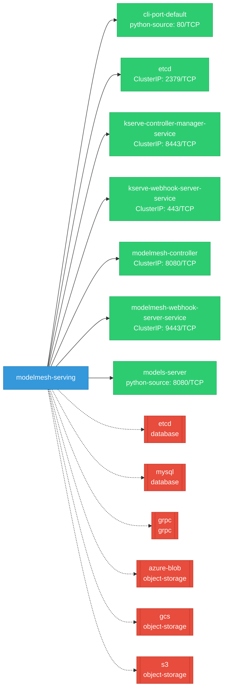
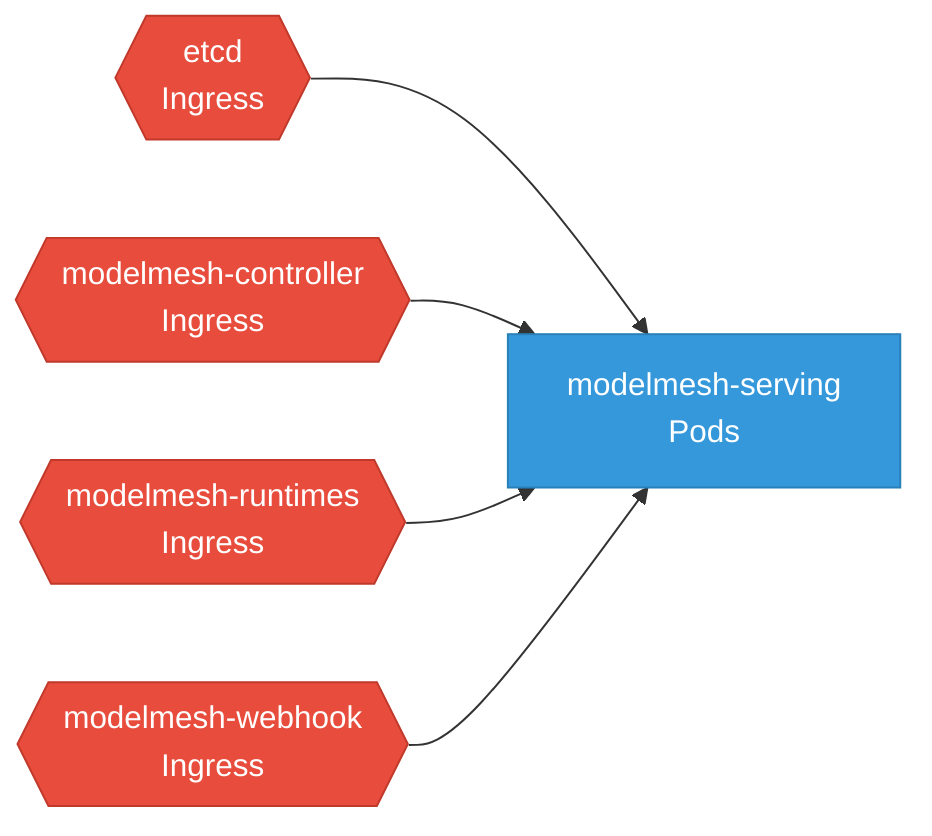

# modelmesh-serving: Network

## Service Map

*7 unique services (9 total, duplicates from test fixtures collapsed).*

### Services

| Name | Type | Ports | Source |
|------|------|-------|--------|
| cli-port-default | python-source | 80/TCP | [`.gomod-cache/github.com/kserve/kserve@v0.12.0/docs/samples/v1beta1/tensorflow/grpc_client.py:40`](https://github.com/kserve/modelmesh-serving/blob/4e16417034a9fc02561b6cdb0356d337805589b1/.gomod-cache/github.com/kserve/kserve@v0.12.0/docs/samples/v1beta1/tensorflow/grpc_client.py#L40) |
| etcd | ClusterIP | 2379/TCP | [`kustomize:config/overlays/odh`](https://github.com/kserve/modelmesh-serving/blob/4e16417034a9fc02561b6cdb0356d337805589b1/kustomize:config/overlays/odh) |
| kserve-controller-manager-service | ClusterIP | 8443/TCP | [`.gomod-cache/github.com/kserve/kserve@v0.12.0/config/manager/service.yaml`](https://github.com/kserve/modelmesh-serving/blob/4e16417034a9fc02561b6cdb0356d337805589b1/.gomod-cache/github.com/kserve/kserve@v0.12.0/config/manager/service.yaml) |
| kserve-controller-manager-service | ClusterIP | 8443/TCP | [`.gopath-loader/pkg/mod/github.com/kserve/kserve@v0.12.0/config/manager/service.yaml`](https://github.com/kserve/modelmesh-serving/blob/4e16417034a9fc02561b6cdb0356d337805589b1/.gopath-loader/pkg/mod/github.com/kserve/kserve@v0.12.0/config/manager/service.yaml) |
| kserve-webhook-server-service | ClusterIP | 443/TCP | [`.gomod-cache/github.com/kserve/kserve@v0.12.0/config/webhook/service.yaml`](https://github.com/kserve/modelmesh-serving/blob/4e16417034a9fc02561b6cdb0356d337805589b1/.gomod-cache/github.com/kserve/kserve@v0.12.0/config/webhook/service.yaml) |
| kserve-webhook-server-service | ClusterIP | 443/TCP | [`.gopath-loader/pkg/mod/github.com/kserve/kserve@v0.12.0/config/webhook/service.yaml`](https://github.com/kserve/modelmesh-serving/blob/4e16417034a9fc02561b6cdb0356d337805589b1/.gopath-loader/pkg/mod/github.com/kserve/kserve@v0.12.0/config/webhook/service.yaml) |
| modelmesh-controller | ClusterIP | 8080/TCP | [`kustomize:config/overlays/odh`](https://github.com/kserve/modelmesh-serving/blob/4e16417034a9fc02561b6cdb0356d337805589b1/kustomize:config/overlays/odh) |
| modelmesh-webhook-server-service | ClusterIP | 9443/TCP | [`kustomize:config/overlays/odh`](https://github.com/kserve/modelmesh-serving/blob/4e16417034a9fc02561b6cdb0356d337805589b1/kustomize:config/overlays/odh) |
| models-server | python-source | 8080/TCP | [`.gomod-cache/github.com/kserve/kserve@v0.12.0/docs/samples/fluid/docker/models.py:94`](https://github.com/kserve/modelmesh-serving/blob/4e16417034a9fc02561b6cdb0356d337805589b1/.gomod-cache/github.com/kserve/kserve@v0.12.0/docs/samples/fluid/docker/models.py#L94) |

### Network Policies

| Name | Policy Types | Source |
|------|-------------|--------|
| etcd | Ingress | [`kustomize:config/overlays/odh`](https://github.com/kserve/modelmesh-serving/blob/4e16417034a9fc02561b6cdb0356d337805589b1/kustomize:config/overlays/odh) |
| modelmesh-controller | Ingress | [`kustomize:config/overlays/odh`](https://github.com/kserve/modelmesh-serving/blob/4e16417034a9fc02561b6cdb0356d337805589b1/kustomize:config/overlays/odh) |
| modelmesh-runtimes | Ingress | [`config/rbac/common/networkpolicy-runtimes.yaml`](https://github.com/kserve/modelmesh-serving/blob/4e16417034a9fc02561b6cdb0356d337805589b1/config/rbac/common/networkpolicy-runtimes.yaml) |
| modelmesh-webhook | Ingress | [`kustomize:config/overlays/odh`](https://github.com/kserve/modelmesh-serving/blob/4e16417034a9fc02561b6cdb0356d337805589b1/kustomize:config/overlays/odh) |

## Network Policy Graph

Visual representation of NetworkPolicy rules. Ingress rules show what traffic is allowed into pods, egress rules show what traffic is allowed out.

