# notebooks-downstream

> **Architecture snapshot: 2026-05-15** (2026-05-15)

**Repository:** red-hat-data-services/notebooks-downstream  
**Analyzer:** arch-analyzer 0.2.0  
**Extracted:** 2026-05-15T09:50:09Z

## Summary

| Metric | Count |
|--------|-------|
| CRDs | 0 |
| Deployments | 13 |
| Services | 13 |
| Secrets | 0 |
| Cluster Roles | 0 |
| Controller Watches | 0 |

## Component Architecture

CRDs, controllers, and owned Kubernetes resources.

```mermaid
graph LR
    %% Component architecture for notebooks-downstream

    classDef crd fill:#e74c3c,stroke:#c0392b,color:#fff
    classDef controller fill:#3498db,stroke:#2980b9,color:#fff
    classDef owned fill:#2ecc71,stroke:#27ae60,color:#fff
    classDef external fill:#95a5a6,stroke:#7f8c8d,color:#fff
    classDef dep fill:#f39c12,stroke:#e67e22,color:#fff

    subgraph controller["notebooks-downstream Controller"]
        dep_1["notebook"]
        class dep_1 controller
        dep_2["notebook"]
        class dep_2 controller
        dep_3["notebook"]
        class dep_3 controller
        dep_4["notebook"]
        class dep_4 controller
        dep_5["notebook"]
        class dep_5 controller
        dep_6["notebook"]
        class dep_6 controller
        dep_7["notebook"]
        class dep_7 controller
        dep_8["notebook"]
        class dep_8 controller
        dep_9["notebook"]
        class dep_9 controller
        dep_10["notebook"]
        class dep_10 controller
        dep_11["notebook"]
        class dep_11 controller
        dep_12["notebook"]
        class dep_12 controller
        dep_13["notebook"]
        class dep_13 controller
    end
```

### CRDs

No CRDs defined.

## Dependencies

### Key External Dependencies

| Module | Version |
|--------|---------|

