# odh-cli: Dataflow

## Controller Watches

Kubernetes resources this controller monitors for changes. Each watch triggers reconciliation when the watched resource is created, updated, or deleted.

| Type | GVK | Source |
|------|-----|--------|
| For | config/v1/ClusterOperator | [`.gomod-cache/github.com/operator-framework/operator-lifecycle-manager@v0.40.0/pkg/controller/operators/openshift/clusteroperator_controller.go:78`](https://github.com/opendatahub-io/odh-cli/blob/4b5786955aad21009155d57e47e555a035e71208/.gomod-cache/github.com/operator-framework/operator-lifecycle-manager@v0.40.0/pkg/controller/operators/openshift/clusteroperator_controller.go#L78) |
| For | config/v1/ClusterOperator | [`.gopath-loader/pkg/mod/github.com/operator-framework/operator-lifecycle-manager@v0.40.0/pkg/controller/operators/openshift/clusteroperator_controller.go:78`](https://github.com/opendatahub-io/odh-cli/blob/4b5786955aad21009155d57e47e555a035e71208/.gopath-loader/pkg/mod/github.com/operator-framework/operator-lifecycle-manager@v0.40.0/pkg/controller/operators/openshift/clusteroperator_controller.go#L78) |
| For | operators/v1/Operator | [`.gopath-loader/pkg/mod/github.com/operator-framework/operator-lifecycle-manager@v0.40.0/pkg/controller/operators/operator_controller.go:65`](https://github.com/opendatahub-io/odh-cli/blob/4b5786955aad21009155d57e47e555a035e71208/.gopath-loader/pkg/mod/github.com/operator-framework/operator-lifecycle-manager@v0.40.0/pkg/controller/operators/operator_controller.go#L65) |
| For | operators/v1/Operator | [`.gomod-cache/github.com/operator-framework/operator-lifecycle-manager@v0.40.0/pkg/controller/operators/operator_controller.go:65`](https://github.com/opendatahub-io/odh-cli/blob/4b5786955aad21009155d57e47e555a035e71208/.gomod-cache/github.com/operator-framework/operator-lifecycle-manager@v0.40.0/pkg/controller/operators/operator_controller.go#L65) |
| For | operators/v1alpha1/ClusterServiceVersion | [`.gopath-loader/pkg/mod/github.com/operator-framework/operator-lifecycle-manager@v0.40.0/pkg/controller/operators/operatorconditiongenerator_controller.go:66`](https://github.com/opendatahub-io/odh-cli/blob/4b5786955aad21009155d57e47e555a035e71208/.gopath-loader/pkg/mod/github.com/operator-framework/operator-lifecycle-manager@v0.40.0/pkg/controller/operators/operatorconditiongenerator_controller.go#L66) |
| For | operators/v1alpha1/ClusterServiceVersion | [`.gomod-cache/github.com/operator-framework/operator-lifecycle-manager@v0.40.0/pkg/controller/operators/adoption_controller.go:67`](https://github.com/opendatahub-io/odh-cli/blob/4b5786955aad21009155d57e47e555a035e71208/.gomod-cache/github.com/operator-framework/operator-lifecycle-manager@v0.40.0/pkg/controller/operators/adoption_controller.go#L67) |
| For | operators/v1alpha1/ClusterServiceVersion | [`.gopath-loader/pkg/mod/github.com/operator-framework/operator-lifecycle-manager@v0.40.0/pkg/controller/operators/adoption_controller.go:67`](https://github.com/opendatahub-io/odh-cli/blob/4b5786955aad21009155d57e47e555a035e71208/.gopath-loader/pkg/mod/github.com/operator-framework/operator-lifecycle-manager@v0.40.0/pkg/controller/operators/adoption_controller.go#L67) |
| For | operators/v1alpha1/ClusterServiceVersion | [`.gomod-cache/github.com/operator-framework/operator-lifecycle-manager@v0.40.0/pkg/controller/operators/operatorconditiongenerator_controller.go:66`](https://github.com/opendatahub-io/odh-cli/blob/4b5786955aad21009155d57e47e555a035e71208/.gomod-cache/github.com/operator-framework/operator-lifecycle-manager@v0.40.0/pkg/controller/operators/operatorconditiongenerator_controller.go#L66) |
| For | operators/v1alpha1/Subscription | [`.gopath-loader/pkg/mod/github.com/operator-framework/operator-lifecycle-manager@v0.40.0/pkg/controller/operators/adoption_controller.go:54`](https://github.com/opendatahub-io/odh-cli/blob/4b5786955aad21009155d57e47e555a035e71208/.gopath-loader/pkg/mod/github.com/operator-framework/operator-lifecycle-manager@v0.40.0/pkg/controller/operators/adoption_controller.go#L54) |
| For | operators/v1alpha1/Subscription | [`.gomod-cache/github.com/operator-framework/operator-lifecycle-manager@v0.40.0/pkg/controller/operators/adoption_controller.go:54`](https://github.com/opendatahub-io/odh-cli/blob/4b5786955aad21009155d57e47e555a035e71208/.gomod-cache/github.com/operator-framework/operator-lifecycle-manager@v0.40.0/pkg/controller/operators/adoption_controller.go#L54) |
| For | operators/v2/OperatorCondition | [`.gopath-loader/pkg/mod/github.com/operator-framework/operator-lifecycle-manager@v0.40.0/pkg/controller/operators/operatorcondition_controller.go:47`](https://github.com/opendatahub-io/odh-cli/blob/4b5786955aad21009155d57e47e555a035e71208/.gopath-loader/pkg/mod/github.com/operator-framework/operator-lifecycle-manager@v0.40.0/pkg/controller/operators/operatorcondition_controller.go#L47) |
| For | operators/v2/OperatorCondition | [`.gomod-cache/github.com/operator-framework/operator-lifecycle-manager@v0.40.0/pkg/controller/operators/operatorcondition_controller.go:47`](https://github.com/opendatahub-io/odh-cli/blob/4b5786955aad21009155d57e47e555a035e71208/.gomod-cache/github.com/operator-framework/operator-lifecycle-manager@v0.40.0/pkg/controller/operators/operatorcondition_controller.go#L47) |
| Watches | /v1/ConfigMap | [`.gomod-cache/github.com/operator-framework/operator-lifecycle-manager@v0.40.0/pkg/controller/operators/adoption_controller.go:76`](https://github.com/opendatahub-io/odh-cli/blob/4b5786955aad21009155d57e47e555a035e71208/.gomod-cache/github.com/operator-framework/operator-lifecycle-manager@v0.40.0/pkg/controller/operators/adoption_controller.go#L76) |
| Watches | /v1/ConfigMap | [`.gopath-loader/pkg/mod/github.com/operator-framework/operator-lifecycle-manager@v0.40.0/pkg/controller/operators/operator_controller.go:78`](https://github.com/opendatahub-io/odh-cli/blob/4b5786955aad21009155d57e47e555a035e71208/.gopath-loader/pkg/mod/github.com/operator-framework/operator-lifecycle-manager@v0.40.0/pkg/controller/operators/operator_controller.go#L78) |
| Watches | /v1/ConfigMap | [`.gomod-cache/github.com/operator-framework/operator-lifecycle-manager@v0.40.0/pkg/controller/operators/operator_controller.go:78`](https://github.com/opendatahub-io/odh-cli/blob/4b5786955aad21009155d57e47e555a035e71208/.gomod-cache/github.com/operator-framework/operator-lifecycle-manager@v0.40.0/pkg/controller/operators/operator_controller.go#L78) |
| Watches | /v1/ConfigMap | [`.gopath-loader/pkg/mod/github.com/operator-framework/operator-lifecycle-manager@v0.40.0/pkg/controller/operators/adoption_controller.go:76`](https://github.com/opendatahub-io/odh-cli/blob/4b5786955aad21009155d57e47e555a035e71208/.gopath-loader/pkg/mod/github.com/operator-framework/operator-lifecycle-manager@v0.40.0/pkg/controller/operators/adoption_controller.go#L76) |
| Watches | /v1/Namespace | [`.gopath-loader/pkg/mod/github.com/operator-framework/operator-lifecycle-manager@v0.40.0/pkg/controller/operators/operator_controller.go:67`](https://github.com/opendatahub-io/odh-cli/blob/4b5786955aad21009155d57e47e555a035e71208/.gopath-loader/pkg/mod/github.com/operator-framework/operator-lifecycle-manager@v0.40.0/pkg/controller/operators/operator_controller.go#L67) |
| Watches | /v1/Namespace | [`.gopath-loader/pkg/mod/github.com/operator-framework/operator-lifecycle-manager@v0.40.0/pkg/controller/operators/adoption_controller.go:69`](https://github.com/opendatahub-io/odh-cli/blob/4b5786955aad21009155d57e47e555a035e71208/.gopath-loader/pkg/mod/github.com/operator-framework/operator-lifecycle-manager@v0.40.0/pkg/controller/operators/adoption_controller.go#L69) |
| Watches | /v1/Namespace | [`.gomod-cache/github.com/operator-framework/operator-lifecycle-manager@v0.40.0/pkg/controller/operators/adoption_controller.go:69`](https://github.com/opendatahub-io/odh-cli/blob/4b5786955aad21009155d57e47e555a035e71208/.gomod-cache/github.com/operator-framework/operator-lifecycle-manager@v0.40.0/pkg/controller/operators/adoption_controller.go#L69) |
| Watches | /v1/Namespace | [`.gomod-cache/github.com/operator-framework/operator-lifecycle-manager@v0.40.0/pkg/controller/operators/operator_controller.go:67`](https://github.com/opendatahub-io/odh-cli/blob/4b5786955aad21009155d57e47e555a035e71208/.gomod-cache/github.com/operator-framework/operator-lifecycle-manager@v0.40.0/pkg/controller/operators/operator_controller.go#L67) |
| Watches | /v1/Secret | [`.gopath-loader/pkg/mod/github.com/operator-framework/operator-lifecycle-manager@v0.40.0/pkg/controller/operators/operator_controller.go:77`](https://github.com/opendatahub-io/odh-cli/blob/4b5786955aad21009155d57e47e555a035e71208/.gopath-loader/pkg/mod/github.com/operator-framework/operator-lifecycle-manager@v0.40.0/pkg/controller/operators/operator_controller.go#L77) |
| Watches | /v1/Secret | [`.gomod-cache/github.com/operator-framework/operator-lifecycle-manager@v0.40.0/pkg/controller/operators/adoption_controller.go:75`](https://github.com/opendatahub-io/odh-cli/blob/4b5786955aad21009155d57e47e555a035e71208/.gomod-cache/github.com/operator-framework/operator-lifecycle-manager@v0.40.0/pkg/controller/operators/adoption_controller.go#L75) |
| Watches | /v1/Secret | [`.gopath-loader/pkg/mod/github.com/operator-framework/operator-lifecycle-manager@v0.40.0/pkg/controller/operators/adoption_controller.go:75`](https://github.com/opendatahub-io/odh-cli/blob/4b5786955aad21009155d57e47e555a035e71208/.gopath-loader/pkg/mod/github.com/operator-framework/operator-lifecycle-manager@v0.40.0/pkg/controller/operators/adoption_controller.go#L75) |
| Watches | /v1/Secret | [`.gomod-cache/github.com/operator-framework/operator-lifecycle-manager@v0.40.0/pkg/controller/operators/operator_controller.go:77`](https://github.com/opendatahub-io/odh-cli/blob/4b5786955aad21009155d57e47e555a035e71208/.gomod-cache/github.com/operator-framework/operator-lifecycle-manager@v0.40.0/pkg/controller/operators/operator_controller.go#L77) |
| Watches | /v1/Service | [`.gopath-loader/pkg/mod/github.com/operator-framework/operator-lifecycle-manager@v0.40.0/pkg/controller/operators/adoption_controller.go:70`](https://github.com/opendatahub-io/odh-cli/blob/4b5786955aad21009155d57e47e555a035e71208/.gopath-loader/pkg/mod/github.com/operator-framework/operator-lifecycle-manager@v0.40.0/pkg/controller/operators/adoption_controller.go#L70) |
| Watches | /v1/Service | [`.gomod-cache/github.com/operator-framework/operator-lifecycle-manager@v0.40.0/pkg/controller/operators/adoption_controller.go:70`](https://github.com/opendatahub-io/odh-cli/blob/4b5786955aad21009155d57e47e555a035e71208/.gomod-cache/github.com/operator-framework/operator-lifecycle-manager@v0.40.0/pkg/controller/operators/adoption_controller.go#L70) |
| Watches | /v1/ServiceAccount | [`.gopath-loader/pkg/mod/github.com/operator-framework/operator-lifecycle-manager@v0.40.0/pkg/controller/operators/adoption_controller.go:77`](https://github.com/opendatahub-io/odh-cli/blob/4b5786955aad21009155d57e47e555a035e71208/.gopath-loader/pkg/mod/github.com/operator-framework/operator-lifecycle-manager@v0.40.0/pkg/controller/operators/adoption_controller.go#L77) |
| Watches | /v1/ServiceAccount | [`.gomod-cache/github.com/operator-framework/operator-lifecycle-manager@v0.40.0/pkg/controller/operators/operator_controller.go:76`](https://github.com/opendatahub-io/odh-cli/blob/4b5786955aad21009155d57e47e555a035e71208/.gomod-cache/github.com/operator-framework/operator-lifecycle-manager@v0.40.0/pkg/controller/operators/operator_controller.go#L76) |
| Watches | /v1/ServiceAccount | [`.gopath-loader/pkg/mod/github.com/operator-framework/operator-lifecycle-manager@v0.40.0/pkg/controller/operators/operator_controller.go:76`](https://github.com/opendatahub-io/odh-cli/blob/4b5786955aad21009155d57e47e555a035e71208/.gopath-loader/pkg/mod/github.com/operator-framework/operator-lifecycle-manager@v0.40.0/pkg/controller/operators/operator_controller.go#L76) |
| Watches | /v1/ServiceAccount | [`.gomod-cache/github.com/operator-framework/operator-lifecycle-manager@v0.40.0/pkg/controller/operators/adoption_controller.go:77`](https://github.com/opendatahub-io/odh-cli/blob/4b5786955aad21009155d57e47e555a035e71208/.gomod-cache/github.com/operator-framework/operator-lifecycle-manager@v0.40.0/pkg/controller/operators/adoption_controller.go#L77) |
| Watches | apiextensions.k8s.io/v1/CustomResourceDefinition | [`.gomod-cache/github.com/operator-framework/operator-lifecycle-manager@v0.40.0/pkg/controller/operators/adoption_controller.go:71`](https://github.com/opendatahub-io/odh-cli/blob/4b5786955aad21009155d57e47e555a035e71208/.gomod-cache/github.com/operator-framework/operator-lifecycle-manager@v0.40.0/pkg/controller/operators/adoption_controller.go#L71) |
| Watches | apiextensions.k8s.io/v1/CustomResourceDefinition | [`.gopath-loader/pkg/mod/github.com/operator-framework/operator-lifecycle-manager@v0.40.0/pkg/controller/operators/adoption_controller.go:71`](https://github.com/opendatahub-io/odh-cli/blob/4b5786955aad21009155d57e47e555a035e71208/.gopath-loader/pkg/mod/github.com/operator-framework/operator-lifecycle-manager@v0.40.0/pkg/controller/operators/adoption_controller.go#L71) |
| Watches | apiextensions.k8s.io/v1/CustomResourceDefinition | [`.gopath-loader/pkg/mod/github.com/operator-framework/operator-lifecycle-manager@v0.40.0/pkg/controller/operators/operator_controller.go:68`](https://github.com/opendatahub-io/odh-cli/blob/4b5786955aad21009155d57e47e555a035e71208/.gopath-loader/pkg/mod/github.com/operator-framework/operator-lifecycle-manager@v0.40.0/pkg/controller/operators/operator_controller.go#L68) |
| Watches | apiextensions.k8s.io/v1/CustomResourceDefinition | [`.gomod-cache/github.com/operator-framework/operator-lifecycle-manager@v0.40.0/pkg/controller/operators/operator_controller.go:68`](https://github.com/opendatahub-io/odh-cli/blob/4b5786955aad21009155d57e47e555a035e71208/.gomod-cache/github.com/operator-framework/operator-lifecycle-manager@v0.40.0/pkg/controller/operators/operator_controller.go#L68) |
| Watches | apiregistration/v1/APIService | [`.gomod-cache/github.com/operator-framework/operator-lifecycle-manager@v0.40.0/pkg/controller/operators/adoption_controller.go:72`](https://github.com/opendatahub-io/odh-cli/blob/4b5786955aad21009155d57e47e555a035e71208/.gomod-cache/github.com/operator-framework/operator-lifecycle-manager@v0.40.0/pkg/controller/operators/adoption_controller.go#L72) |
| Watches | apiregistration/v1/APIService | [`.gopath-loader/pkg/mod/github.com/operator-framework/operator-lifecycle-manager@v0.40.0/pkg/controller/operators/adoption_controller.go:72`](https://github.com/opendatahub-io/odh-cli/blob/4b5786955aad21009155d57e47e555a035e71208/.gopath-loader/pkg/mod/github.com/operator-framework/operator-lifecycle-manager@v0.40.0/pkg/controller/operators/adoption_controller.go#L72) |
| Watches | apiregistration/v1/APIService | [`.gomod-cache/github.com/operator-framework/operator-lifecycle-manager@v0.40.0/pkg/controller/operators/operator_controller.go:69`](https://github.com/opendatahub-io/odh-cli/blob/4b5786955aad21009155d57e47e555a035e71208/.gomod-cache/github.com/operator-framework/operator-lifecycle-manager@v0.40.0/pkg/controller/operators/operator_controller.go#L69) |
| Watches | apiregistration/v1/APIService | [`.gopath-loader/pkg/mod/github.com/operator-framework/operator-lifecycle-manager@v0.40.0/pkg/controller/operators/operator_controller.go:69`](https://github.com/opendatahub-io/odh-cli/blob/4b5786955aad21009155d57e47e555a035e71208/.gopath-loader/pkg/mod/github.com/operator-framework/operator-lifecycle-manager@v0.40.0/pkg/controller/operators/operator_controller.go#L69) |
| Watches | apps/v1/Deployment | [`.gopath-loader/pkg/mod/github.com/operator-framework/operator-lifecycle-manager@v0.40.0/pkg/controller/operators/adoption_controller.go:68`](https://github.com/opendatahub-io/odh-cli/blob/4b5786955aad21009155d57e47e555a035e71208/.gopath-loader/pkg/mod/github.com/operator-framework/operator-lifecycle-manager@v0.40.0/pkg/controller/operators/adoption_controller.go#L68) |
| Watches | apps/v1/Deployment | [`.gomod-cache/github.com/operator-framework/operator-lifecycle-manager@v0.40.0/pkg/controller/operators/adoption_controller.go:68`](https://github.com/opendatahub-io/odh-cli/blob/4b5786955aad21009155d57e47e555a035e71208/.gomod-cache/github.com/operator-framework/operator-lifecycle-manager@v0.40.0/pkg/controller/operators/adoption_controller.go#L68) |
| Watches | apps/v1/Deployment | [`.gomod-cache/github.com/operator-framework/operator-lifecycle-manager@v0.40.0/pkg/controller/operators/operatorcondition_controller.go:50`](https://github.com/opendatahub-io/odh-cli/blob/4b5786955aad21009155d57e47e555a035e71208/.gomod-cache/github.com/operator-framework/operator-lifecycle-manager@v0.40.0/pkg/controller/operators/operatorcondition_controller.go#L50) |
| Watches | apps/v1/Deployment | [`.gopath-loader/pkg/mod/github.com/operator-framework/operator-lifecycle-manager@v0.40.0/pkg/controller/operators/operatorcondition_controller.go:50`](https://github.com/opendatahub-io/odh-cli/blob/4b5786955aad21009155d57e47e555a035e71208/.gopath-loader/pkg/mod/github.com/operator-framework/operator-lifecycle-manager@v0.40.0/pkg/controller/operators/operatorcondition_controller.go#L50) |
| Watches | apps/v1/Deployment | [`.gopath-loader/pkg/mod/github.com/operator-framework/operator-lifecycle-manager@v0.40.0/pkg/controller/operators/operator_controller.go:66`](https://github.com/opendatahub-io/odh-cli/blob/4b5786955aad21009155d57e47e555a035e71208/.gopath-loader/pkg/mod/github.com/operator-framework/operator-lifecycle-manager@v0.40.0/pkg/controller/operators/operator_controller.go#L66) |
| Watches | apps/v1/Deployment | [`.gomod-cache/github.com/operator-framework/operator-lifecycle-manager@v0.40.0/pkg/controller/operators/operator_controller.go:66`](https://github.com/opendatahub-io/odh-cli/blob/4b5786955aad21009155d57e47e555a035e71208/.gomod-cache/github.com/operator-framework/operator-lifecycle-manager@v0.40.0/pkg/controller/operators/operator_controller.go#L66) |
| Watches | operators/v1alpha1/ClusterServiceVersion | [`.gopath-loader/pkg/mod/github.com/operator-framework/operator-lifecycle-manager@v0.40.0/pkg/controller/operators/operator_controller.go:72`](https://github.com/opendatahub-io/odh-cli/blob/4b5786955aad21009155d57e47e555a035e71208/.gopath-loader/pkg/mod/github.com/operator-framework/operator-lifecycle-manager@v0.40.0/pkg/controller/operators/operator_controller.go#L72) |
| Watches | operators/v1alpha1/ClusterServiceVersion | [`.gomod-cache/github.com/operator-framework/operator-lifecycle-manager@v0.40.0/pkg/controller/operators/adoption_controller.go:55`](https://github.com/opendatahub-io/odh-cli/blob/4b5786955aad21009155d57e47e555a035e71208/.gomod-cache/github.com/operator-framework/operator-lifecycle-manager@v0.40.0/pkg/controller/operators/adoption_controller.go#L55) |
| Watches | operators/v1alpha1/ClusterServiceVersion | [`.gopath-loader/pkg/mod/github.com/operator-framework/operator-lifecycle-manager@v0.40.0/pkg/controller/operators/adoption_controller.go:55`](https://github.com/opendatahub-io/odh-cli/blob/4b5786955aad21009155d57e47e555a035e71208/.gopath-loader/pkg/mod/github.com/operator-framework/operator-lifecycle-manager@v0.40.0/pkg/controller/operators/adoption_controller.go#L55) |
| Watches | operators/v1alpha1/ClusterServiceVersion | [`.gomod-cache/github.com/operator-framework/operator-lifecycle-manager@v0.40.0/pkg/controller/operators/operator_controller.go:72`](https://github.com/opendatahub-io/odh-cli/blob/4b5786955aad21009155d57e47e555a035e71208/.gomod-cache/github.com/operator-framework/operator-lifecycle-manager@v0.40.0/pkg/controller/operators/operator_controller.go#L72) |
| Watches | operators/v1alpha1/InstallPlan | [`.gopath-loader/pkg/mod/github.com/operator-framework/operator-lifecycle-manager@v0.40.0/pkg/controller/operators/operator_controller.go:71`](https://github.com/opendatahub-io/odh-cli/blob/4b5786955aad21009155d57e47e555a035e71208/.gopath-loader/pkg/mod/github.com/operator-framework/operator-lifecycle-manager@v0.40.0/pkg/controller/operators/operator_controller.go#L71) |
| Watches | operators/v1alpha1/InstallPlan | [`.gomod-cache/github.com/operator-framework/operator-lifecycle-manager@v0.40.0/pkg/controller/operators/operator_controller.go:71`](https://github.com/opendatahub-io/odh-cli/blob/4b5786955aad21009155d57e47e555a035e71208/.gomod-cache/github.com/operator-framework/operator-lifecycle-manager@v0.40.0/pkg/controller/operators/operator_controller.go#L71) |
| Watches | operators/v1alpha1/InstallPlan | [`.gopath-loader/pkg/mod/github.com/operator-framework/operator-lifecycle-manager@v0.40.0/pkg/controller/operators/adoption_controller.go:56`](https://github.com/opendatahub-io/odh-cli/blob/4b5786955aad21009155d57e47e555a035e71208/.gopath-loader/pkg/mod/github.com/operator-framework/operator-lifecycle-manager@v0.40.0/pkg/controller/operators/adoption_controller.go#L56) |
| Watches | operators/v1alpha1/InstallPlan | [`.gomod-cache/github.com/operator-framework/operator-lifecycle-manager@v0.40.0/pkg/controller/operators/adoption_controller.go:56`](https://github.com/opendatahub-io/odh-cli/blob/4b5786955aad21009155d57e47e555a035e71208/.gomod-cache/github.com/operator-framework/operator-lifecycle-manager@v0.40.0/pkg/controller/operators/adoption_controller.go#L56) |
| Watches | operators/v1alpha1/Subscription | [`.gopath-loader/pkg/mod/github.com/operator-framework/operator-lifecycle-manager@v0.40.0/pkg/controller/operators/adoption_controller.go:73`](https://github.com/opendatahub-io/odh-cli/blob/4b5786955aad21009155d57e47e555a035e71208/.gopath-loader/pkg/mod/github.com/operator-framework/operator-lifecycle-manager@v0.40.0/pkg/controller/operators/adoption_controller.go#L73) |
| Watches | operators/v1alpha1/Subscription | [`.gomod-cache/github.com/operator-framework/operator-lifecycle-manager@v0.40.0/pkg/controller/operators/adoption_controller.go:73`](https://github.com/opendatahub-io/odh-cli/blob/4b5786955aad21009155d57e47e555a035e71208/.gomod-cache/github.com/operator-framework/operator-lifecycle-manager@v0.40.0/pkg/controller/operators/adoption_controller.go#L73) |
| Watches | operators/v1alpha1/Subscription | [`.gomod-cache/github.com/operator-framework/operator-lifecycle-manager@v0.40.0/pkg/controller/operators/operator_controller.go:70`](https://github.com/opendatahub-io/odh-cli/blob/4b5786955aad21009155d57e47e555a035e71208/.gomod-cache/github.com/operator-framework/operator-lifecycle-manager@v0.40.0/pkg/controller/operators/operator_controller.go#L70) |
| Watches | operators/v1alpha1/Subscription | [`.gopath-loader/pkg/mod/github.com/operator-framework/operator-lifecycle-manager@v0.40.0/pkg/controller/operators/operator_controller.go:70`](https://github.com/opendatahub-io/odh-cli/blob/4b5786955aad21009155d57e47e555a035e71208/.gopath-loader/pkg/mod/github.com/operator-framework/operator-lifecycle-manager@v0.40.0/pkg/controller/operators/operator_controller.go#L70) |
| Watches | operators/v2/OperatorCondition | [`.gopath-loader/pkg/mod/github.com/operator-framework/operator-lifecycle-manager@v0.40.0/pkg/controller/operators/operator_controller.go:73`](https://github.com/opendatahub-io/odh-cli/blob/4b5786955aad21009155d57e47e555a035e71208/.gopath-loader/pkg/mod/github.com/operator-framework/operator-lifecycle-manager@v0.40.0/pkg/controller/operators/operator_controller.go#L73) |
| Watches | operators/v2/OperatorCondition | [`.gomod-cache/github.com/operator-framework/operator-lifecycle-manager@v0.40.0/pkg/controller/operators/operatorconditiongenerator_controller.go:67`](https://github.com/opendatahub-io/odh-cli/blob/4b5786955aad21009155d57e47e555a035e71208/.gomod-cache/github.com/operator-framework/operator-lifecycle-manager@v0.40.0/pkg/controller/operators/operatorconditiongenerator_controller.go#L67) |
| Watches | operators/v2/OperatorCondition | [`.gopath-loader/pkg/mod/github.com/operator-framework/operator-lifecycle-manager@v0.40.0/pkg/controller/operators/operatorconditiongenerator_controller.go:67`](https://github.com/opendatahub-io/odh-cli/blob/4b5786955aad21009155d57e47e555a035e71208/.gopath-loader/pkg/mod/github.com/operator-framework/operator-lifecycle-manager@v0.40.0/pkg/controller/operators/operatorconditiongenerator_controller.go#L67) |
| Watches | operators/v2/OperatorCondition | [`.gomod-cache/github.com/operator-framework/operator-lifecycle-manager@v0.40.0/pkg/controller/operators/adoption_controller.go:74`](https://github.com/opendatahub-io/odh-cli/blob/4b5786955aad21009155d57e47e555a035e71208/.gomod-cache/github.com/operator-framework/operator-lifecycle-manager@v0.40.0/pkg/controller/operators/adoption_controller.go#L74) |
| Watches | operators/v2/OperatorCondition | [`.gopath-loader/pkg/mod/github.com/operator-framework/operator-lifecycle-manager@v0.40.0/pkg/controller/operators/adoption_controller.go:74`](https://github.com/opendatahub-io/odh-cli/blob/4b5786955aad21009155d57e47e555a035e71208/.gopath-loader/pkg/mod/github.com/operator-framework/operator-lifecycle-manager@v0.40.0/pkg/controller/operators/adoption_controller.go#L74) |
| Watches | operators/v2/OperatorCondition | [`.gomod-cache/github.com/operator-framework/operator-lifecycle-manager@v0.40.0/pkg/controller/operators/operator_controller.go:73`](https://github.com/opendatahub-io/odh-cli/blob/4b5786955aad21009155d57e47e555a035e71208/.gomod-cache/github.com/operator-framework/operator-lifecycle-manager@v0.40.0/pkg/controller/operators/operator_controller.go#L73) |
| Watches | rbac.authorization.k8s.io/v1/ClusterRole | [`.gopath-loader/pkg/mod/github.com/operator-framework/operator-lifecycle-manager@v0.40.0/pkg/controller/operators/operator_controller.go:81`](https://github.com/opendatahub-io/odh-cli/blob/4b5786955aad21009155d57e47e555a035e71208/.gopath-loader/pkg/mod/github.com/operator-framework/operator-lifecycle-manager@v0.40.0/pkg/controller/operators/operator_controller.go#L81) |
| Watches | rbac.authorization.k8s.io/v1/ClusterRole | [`.gopath-loader/pkg/mod/github.com/operator-framework/operator-lifecycle-manager@v0.40.0/pkg/controller/operators/adoption_controller.go:80`](https://github.com/opendatahub-io/odh-cli/blob/4b5786955aad21009155d57e47e555a035e71208/.gopath-loader/pkg/mod/github.com/operator-framework/operator-lifecycle-manager@v0.40.0/pkg/controller/operators/adoption_controller.go#L80) |
| Watches | rbac.authorization.k8s.io/v1/ClusterRole | [`.gomod-cache/github.com/operator-framework/operator-lifecycle-manager@v0.40.0/pkg/controller/operators/adoption_controller.go:80`](https://github.com/opendatahub-io/odh-cli/blob/4b5786955aad21009155d57e47e555a035e71208/.gomod-cache/github.com/operator-framework/operator-lifecycle-manager@v0.40.0/pkg/controller/operators/adoption_controller.go#L80) |
| Watches | rbac.authorization.k8s.io/v1/ClusterRole | [`.gomod-cache/github.com/operator-framework/operator-lifecycle-manager@v0.40.0/pkg/controller/operators/operator_controller.go:81`](https://github.com/opendatahub-io/odh-cli/blob/4b5786955aad21009155d57e47e555a035e71208/.gomod-cache/github.com/operator-framework/operator-lifecycle-manager@v0.40.0/pkg/controller/operators/operator_controller.go#L81) |
| Watches | rbac.authorization.k8s.io/v1/ClusterRoleBinding | [`.gomod-cache/github.com/operator-framework/operator-lifecycle-manager@v0.40.0/pkg/controller/operators/adoption_controller.go:81`](https://github.com/opendatahub-io/odh-cli/blob/4b5786955aad21009155d57e47e555a035e71208/.gomod-cache/github.com/operator-framework/operator-lifecycle-manager@v0.40.0/pkg/controller/operators/adoption_controller.go#L81) |
| Watches | rbac.authorization.k8s.io/v1/ClusterRoleBinding | [`.gomod-cache/github.com/operator-framework/operator-lifecycle-manager@v0.40.0/pkg/controller/operators/operator_controller.go:82`](https://github.com/opendatahub-io/odh-cli/blob/4b5786955aad21009155d57e47e555a035e71208/.gomod-cache/github.com/operator-framework/operator-lifecycle-manager@v0.40.0/pkg/controller/operators/operator_controller.go#L82) |
| Watches | rbac.authorization.k8s.io/v1/ClusterRoleBinding | [`.gopath-loader/pkg/mod/github.com/operator-framework/operator-lifecycle-manager@v0.40.0/pkg/controller/operators/adoption_controller.go:81`](https://github.com/opendatahub-io/odh-cli/blob/4b5786955aad21009155d57e47e555a035e71208/.gopath-loader/pkg/mod/github.com/operator-framework/operator-lifecycle-manager@v0.40.0/pkg/controller/operators/adoption_controller.go#L81) |
| Watches | rbac.authorization.k8s.io/v1/ClusterRoleBinding | [`.gopath-loader/pkg/mod/github.com/operator-framework/operator-lifecycle-manager@v0.40.0/pkg/controller/operators/operator_controller.go:82`](https://github.com/opendatahub-io/odh-cli/blob/4b5786955aad21009155d57e47e555a035e71208/.gopath-loader/pkg/mod/github.com/operator-framework/operator-lifecycle-manager@v0.40.0/pkg/controller/operators/operator_controller.go#L82) |
| Watches | rbac.authorization.k8s.io/v1/Role | [`.gopath-loader/pkg/mod/github.com/operator-framework/operator-lifecycle-manager@v0.40.0/pkg/controller/operators/operatorcondition_controller.go:48`](https://github.com/opendatahub-io/odh-cli/blob/4b5786955aad21009155d57e47e555a035e71208/.gopath-loader/pkg/mod/github.com/operator-framework/operator-lifecycle-manager@v0.40.0/pkg/controller/operators/operatorcondition_controller.go#L48) |
| Watches | rbac.authorization.k8s.io/v1/Role | [`.gomod-cache/github.com/operator-framework/operator-lifecycle-manager@v0.40.0/pkg/controller/operators/operator_controller.go:79`](https://github.com/opendatahub-io/odh-cli/blob/4b5786955aad21009155d57e47e555a035e71208/.gomod-cache/github.com/operator-framework/operator-lifecycle-manager@v0.40.0/pkg/controller/operators/operator_controller.go#L79) |
| Watches | rbac.authorization.k8s.io/v1/Role | [`.gomod-cache/github.com/operator-framework/operator-lifecycle-manager@v0.40.0/pkg/controller/operators/adoption_controller.go:78`](https://github.com/opendatahub-io/odh-cli/blob/4b5786955aad21009155d57e47e555a035e71208/.gomod-cache/github.com/operator-framework/operator-lifecycle-manager@v0.40.0/pkg/controller/operators/adoption_controller.go#L78) |
| Watches | rbac.authorization.k8s.io/v1/Role | [`.gopath-loader/pkg/mod/github.com/operator-framework/operator-lifecycle-manager@v0.40.0/pkg/controller/operators/operator_controller.go:79`](https://github.com/opendatahub-io/odh-cli/blob/4b5786955aad21009155d57e47e555a035e71208/.gopath-loader/pkg/mod/github.com/operator-framework/operator-lifecycle-manager@v0.40.0/pkg/controller/operators/operator_controller.go#L79) |
| Watches | rbac.authorization.k8s.io/v1/Role | [`.gomod-cache/github.com/operator-framework/operator-lifecycle-manager@v0.40.0/pkg/controller/operators/operatorcondition_controller.go:48`](https://github.com/opendatahub-io/odh-cli/blob/4b5786955aad21009155d57e47e555a035e71208/.gomod-cache/github.com/operator-framework/operator-lifecycle-manager@v0.40.0/pkg/controller/operators/operatorcondition_controller.go#L48) |
| Watches | rbac.authorization.k8s.io/v1/Role | [`.gopath-loader/pkg/mod/github.com/operator-framework/operator-lifecycle-manager@v0.40.0/pkg/controller/operators/adoption_controller.go:78`](https://github.com/opendatahub-io/odh-cli/blob/4b5786955aad21009155d57e47e555a035e71208/.gopath-loader/pkg/mod/github.com/operator-framework/operator-lifecycle-manager@v0.40.0/pkg/controller/operators/adoption_controller.go#L78) |
| Watches | rbac.authorization.k8s.io/v1/RoleBinding | [`.gopath-loader/pkg/mod/github.com/operator-framework/operator-lifecycle-manager@v0.40.0/pkg/controller/operators/operator_controller.go:80`](https://github.com/opendatahub-io/odh-cli/blob/4b5786955aad21009155d57e47e555a035e71208/.gopath-loader/pkg/mod/github.com/operator-framework/operator-lifecycle-manager@v0.40.0/pkg/controller/operators/operator_controller.go#L80) |
| Watches | rbac.authorization.k8s.io/v1/RoleBinding | [`.gopath-loader/pkg/mod/github.com/operator-framework/operator-lifecycle-manager@v0.40.0/pkg/controller/operators/adoption_controller.go:79`](https://github.com/opendatahub-io/odh-cli/blob/4b5786955aad21009155d57e47e555a035e71208/.gopath-loader/pkg/mod/github.com/operator-framework/operator-lifecycle-manager@v0.40.0/pkg/controller/operators/adoption_controller.go#L79) |
| Watches | rbac.authorization.k8s.io/v1/RoleBinding | [`.gopath-loader/pkg/mod/github.com/operator-framework/operator-lifecycle-manager@v0.40.0/pkg/controller/operators/operatorcondition_controller.go:49`](https://github.com/opendatahub-io/odh-cli/blob/4b5786955aad21009155d57e47e555a035e71208/.gopath-loader/pkg/mod/github.com/operator-framework/operator-lifecycle-manager@v0.40.0/pkg/controller/operators/operatorcondition_controller.go#L49) |
| Watches | rbac.authorization.k8s.io/v1/RoleBinding | [`.gomod-cache/github.com/operator-framework/operator-lifecycle-manager@v0.40.0/pkg/controller/operators/operatorcondition_controller.go:49`](https://github.com/opendatahub-io/odh-cli/blob/4b5786955aad21009155d57e47e555a035e71208/.gomod-cache/github.com/operator-framework/operator-lifecycle-manager@v0.40.0/pkg/controller/operators/operatorcondition_controller.go#L49) |
| Watches | rbac.authorization.k8s.io/v1/RoleBinding | [`.gomod-cache/github.com/operator-framework/operator-lifecycle-manager@v0.40.0/pkg/controller/operators/operator_controller.go:80`](https://github.com/opendatahub-io/odh-cli/blob/4b5786955aad21009155d57e47e555a035e71208/.gomod-cache/github.com/operator-framework/operator-lifecycle-manager@v0.40.0/pkg/controller/operators/operator_controller.go#L80) |
| Watches | rbac.authorization.k8s.io/v1/RoleBinding | [`.gomod-cache/github.com/operator-framework/operator-lifecycle-manager@v0.40.0/pkg/controller/operators/adoption_controller.go:79`](https://github.com/opendatahub-io/odh-cli/blob/4b5786955aad21009155d57e47e555a035e71208/.gomod-cache/github.com/operator-framework/operator-lifecycle-manager@v0.40.0/pkg/controller/operators/adoption_controller.go#L79) |

## Reconciliation Flow

How the controller interacts with the Kubernetes API during reconciliation.

```mermaid
sequenceDiagram
    %% Static dataflow for odh-cli

    participant KubernetesAPI as Kubernetes API
    participant the_deployment as the-deployment

    KubernetesAPI->>+the_deployment: Watch ClusterOperator (reconcile)
    KubernetesAPI->>+the_deployment: Watch ClusterOperator (reconcile)
    KubernetesAPI->>+the_deployment: Watch Operator (reconcile)
    KubernetesAPI->>+the_deployment: Watch Operator (reconcile)
    KubernetesAPI->>+the_deployment: Watch ClusterServiceVersion (reconcile)
    KubernetesAPI->>+the_deployment: Watch ClusterServiceVersion (reconcile)
    KubernetesAPI->>+the_deployment: Watch ClusterServiceVersion (reconcile)
    KubernetesAPI->>+the_deployment: Watch ClusterServiceVersion (reconcile)
    KubernetesAPI->>+the_deployment: Watch Subscription (reconcile)
    KubernetesAPI->>+the_deployment: Watch Subscription (reconcile)
    KubernetesAPI->>+the_deployment: Watch OperatorCondition (reconcile)
    KubernetesAPI->>+the_deployment: Watch OperatorCondition (reconcile)
    KubernetesAPI-->>+the_deployment: Watch ConfigMap (informer)
    KubernetesAPI-->>+the_deployment: Watch ConfigMap (informer)
    KubernetesAPI-->>+the_deployment: Watch ConfigMap (informer)
    KubernetesAPI-->>+the_deployment: Watch ConfigMap (informer)
    KubernetesAPI-->>+the_deployment: Watch Namespace (informer)
    KubernetesAPI-->>+the_deployment: Watch Namespace (informer)
    KubernetesAPI-->>+the_deployment: Watch Namespace (informer)
    KubernetesAPI-->>+the_deployment: Watch Namespace (informer)
    KubernetesAPI-->>+the_deployment: Watch Secret (informer)
    KubernetesAPI-->>+the_deployment: Watch Secret (informer)
    KubernetesAPI-->>+the_deployment: Watch Secret (informer)
    KubernetesAPI-->>+the_deployment: Watch Secret (informer)
    KubernetesAPI-->>+the_deployment: Watch Service (informer)
    KubernetesAPI-->>+the_deployment: Watch Service (informer)
    KubernetesAPI-->>+the_deployment: Watch ServiceAccount (informer)
    KubernetesAPI-->>+the_deployment: Watch ServiceAccount (informer)
    KubernetesAPI-->>+the_deployment: Watch ServiceAccount (informer)
    KubernetesAPI-->>+the_deployment: Watch ServiceAccount (informer)
    KubernetesAPI-->>+the_deployment: Watch CustomResourceDefinition (informer)
    KubernetesAPI-->>+the_deployment: Watch CustomResourceDefinition (informer)
    KubernetesAPI-->>+the_deployment: Watch CustomResourceDefinition (informer)
    KubernetesAPI-->>+the_deployment: Watch CustomResourceDefinition (informer)
    KubernetesAPI-->>+the_deployment: Watch APIService (informer)
    KubernetesAPI-->>+the_deployment: Watch APIService (informer)
    KubernetesAPI-->>+the_deployment: Watch APIService (informer)
    KubernetesAPI-->>+the_deployment: Watch APIService (informer)
    KubernetesAPI-->>+the_deployment: Watch Deployment (informer)
    KubernetesAPI-->>+the_deployment: Watch Deployment (informer)
    KubernetesAPI-->>+the_deployment: Watch Deployment (informer)
    KubernetesAPI-->>+the_deployment: Watch Deployment (informer)
    KubernetesAPI-->>+the_deployment: Watch Deployment (informer)
    KubernetesAPI-->>+the_deployment: Watch Deployment (informer)
    KubernetesAPI-->>+the_deployment: Watch ClusterServiceVersion (informer)
    KubernetesAPI-->>+the_deployment: Watch ClusterServiceVersion (informer)
    KubernetesAPI-->>+the_deployment: Watch ClusterServiceVersion (informer)
    KubernetesAPI-->>+the_deployment: Watch ClusterServiceVersion (informer)
    KubernetesAPI-->>+the_deployment: Watch InstallPlan (informer)
    KubernetesAPI-->>+the_deployment: Watch InstallPlan (informer)
    KubernetesAPI-->>+the_deployment: Watch InstallPlan (informer)
    KubernetesAPI-->>+the_deployment: Watch InstallPlan (informer)
    KubernetesAPI-->>+the_deployment: Watch Subscription (informer)
    KubernetesAPI-->>+the_deployment: Watch Subscription (informer)
    KubernetesAPI-->>+the_deployment: Watch Subscription (informer)
    KubernetesAPI-->>+the_deployment: Watch Subscription (informer)
    KubernetesAPI-->>+the_deployment: Watch OperatorCondition (informer)
    KubernetesAPI-->>+the_deployment: Watch OperatorCondition (informer)
    KubernetesAPI-->>+the_deployment: Watch OperatorCondition (informer)
    KubernetesAPI-->>+the_deployment: Watch OperatorCondition (informer)
    KubernetesAPI-->>+the_deployment: Watch OperatorCondition (informer)
    KubernetesAPI-->>+the_deployment: Watch OperatorCondition (informer)
    KubernetesAPI-->>+the_deployment: Watch ClusterRole (informer)
    KubernetesAPI-->>+the_deployment: Watch ClusterRole (informer)
    KubernetesAPI-->>+the_deployment: Watch ClusterRole (informer)
    KubernetesAPI-->>+the_deployment: Watch ClusterRole (informer)
    KubernetesAPI-->>+the_deployment: Watch ClusterRoleBinding (informer)
    KubernetesAPI-->>+the_deployment: Watch ClusterRoleBinding (informer)
    KubernetesAPI-->>+the_deployment: Watch ClusterRoleBinding (informer)
    KubernetesAPI-->>+the_deployment: Watch ClusterRoleBinding (informer)
    KubernetesAPI-->>+the_deployment: Watch Role (informer)
    KubernetesAPI-->>+the_deployment: Watch Role (informer)
    KubernetesAPI-->>+the_deployment: Watch Role (informer)
    KubernetesAPI-->>+the_deployment: Watch Role (informer)
    KubernetesAPI-->>+the_deployment: Watch Role (informer)
    KubernetesAPI-->>+the_deployment: Watch Role (informer)
    KubernetesAPI-->>+the_deployment: Watch RoleBinding (informer)
    KubernetesAPI-->>+the_deployment: Watch RoleBinding (informer)
    KubernetesAPI-->>+the_deployment: Watch RoleBinding (informer)
    KubernetesAPI-->>+the_deployment: Watch RoleBinding (informer)
    KubernetesAPI-->>+the_deployment: Watch RoleBinding (informer)
    KubernetesAPI-->>+the_deployment: Watch RoleBinding (informer)

    Note over the_deployment: Exposed Services
    Note right of the_deployment: the-service:8666/TCP []
    Note right of the_deployment: the-service:8666/TCP []
```

### HTTP Endpoints

| Method | Path | Source |
|--------|------|--------|
| * | / | [`.gopath-loader/pkg/mod/golang.org/x/net@v0.51.0/webdav/litmus_test_server.go:83`](https://github.com/opendatahub-io/odh-cli/blob/4b5786955aad21009155d57e47e555a035e71208/.gopath-loader/pkg/mod/golang.org/x/net@v0.51.0/webdav/litmus_test_server.go#L83) |
| * | / | [`.gomod-cache/golang.org/toolchain@v0.0.1-go1.25.7.linux-amd64/src/net/http/triv.go:130`](https://github.com/opendatahub-io/odh-cli/blob/4b5786955aad21009155d57e47e555a035e71208/.gomod-cache/golang.org/toolchain@v0.0.1-go1.25.7.linux-amd64/src/net/http/triv.go#L130) |
| * | / | [`.gomod-cache/golang.org/x/net@v0.51.0/webdav/litmus_test_server.go:83`](https://github.com/opendatahub-io/odh-cli/blob/4b5786955aad21009155d57e47e555a035e71208/.gomod-cache/golang.org/x/net@v0.51.0/webdav/litmus_test_server.go#L83) |
| * | / | [`.gopath-loader/pkg/mod/golang.org/toolchain@v0.0.1-go1.25.7.linux-amd64/src/cmd/trace/main.go:188`](https://github.com/opendatahub-io/odh-cli/blob/4b5786955aad21009155d57e47e555a035e71208/.gopath-loader/pkg/mod/golang.org/toolchain@v0.0.1-go1.25.7.linux-amd64/src/cmd/trace/main.go#L188) |
| * | / | [`.gomod-cache/golang.org/toolchain@v0.0.1-go1.25.7.linux-amd64/src/cmd/trace/main.go:188`](https://github.com/opendatahub-io/odh-cli/blob/4b5786955aad21009155d57e47e555a035e71208/.gomod-cache/golang.org/toolchain@v0.0.1-go1.25.7.linux-amd64/src/cmd/trace/main.go#L188) |
| * | / | [`.gopath-loader/pkg/mod/golang.org/toolchain@v0.0.1-go1.25.7.linux-amd64/src/net/http/triv.go:130`](https://github.com/opendatahub-io/odh-cli/blob/4b5786955aad21009155d57e47e555a035e71208/.gopath-loader/pkg/mod/golang.org/toolchain@v0.0.1-go1.25.7.linux-amd64/src/net/http/triv.go#L130) |
| GET | / | [`.gomod-cache/k8s.io/apiserver@v0.35.2/pkg/endpoints/discovery/legacy.go:59`](https://github.com/opendatahub-io/odh-cli/blob/4b5786955aad21009155d57e47e555a035e71208/.gomod-cache/k8s.io/apiserver@v0.35.2/pkg/endpoints/discovery/legacy.go#L59) |
| GET | / | [`.gomod-cache/k8s.io/apiserver@v0.35.2/pkg/server/routes/version.go:44`](https://github.com/opendatahub-io/odh-cli/blob/4b5786955aad21009155d57e47e555a035e71208/.gomod-cache/k8s.io/apiserver@v0.35.2/pkg/server/routes/version.go#L44) |
| GET | / | [`.gopath-loader/pkg/mod/k8s.io/apiserver@v0.35.2/pkg/server/routes/version.go:44`](https://github.com/opendatahub-io/odh-cli/blob/4b5786955aad21009155d57e47e555a035e71208/.gopath-loader/pkg/mod/k8s.io/apiserver@v0.35.2/pkg/server/routes/version.go#L44) |
| GET | / | [`.gopath-loader/pkg/mod/k8s.io/apiserver@v0.35.2/pkg/endpoints/discovery/version.go:67`](https://github.com/opendatahub-io/odh-cli/blob/4b5786955aad21009155d57e47e555a035e71208/.gopath-loader/pkg/mod/k8s.io/apiserver@v0.35.2/pkg/endpoints/discovery/version.go#L67) |
| GET | / | [`.gopath-loader/pkg/mod/k8s.io/apiserver@v0.35.2/pkg/endpoints/discovery/group.go:57`](https://github.com/opendatahub-io/odh-cli/blob/4b5786955aad21009155d57e47e555a035e71208/.gopath-loader/pkg/mod/k8s.io/apiserver@v0.35.2/pkg/endpoints/discovery/group.go#L57) |
| GET | / | [`.gopath-loader/pkg/mod/k8s.io/apiserver@v0.35.2/pkg/endpoints/discovery/legacy.go:59`](https://github.com/opendatahub-io/odh-cli/blob/4b5786955aad21009155d57e47e555a035e71208/.gopath-loader/pkg/mod/k8s.io/apiserver@v0.35.2/pkg/endpoints/discovery/legacy.go#L59) |
| GET | / | [`.gomod-cache/k8s.io/apiserver@v0.35.2/pkg/endpoints/discovery/aggregated/wrapper.go:73`](https://github.com/opendatahub-io/odh-cli/blob/4b5786955aad21009155d57e47e555a035e71208/.gomod-cache/k8s.io/apiserver@v0.35.2/pkg/endpoints/discovery/aggregated/wrapper.go#L73) |
| GET | / | [`.gomod-cache/k8s.io/apiserver@v0.35.2/pkg/endpoints/discovery/group.go:57`](https://github.com/opendatahub-io/odh-cli/blob/4b5786955aad21009155d57e47e555a035e71208/.gomod-cache/k8s.io/apiserver@v0.35.2/pkg/endpoints/discovery/group.go#L57) |
| GET | / | [`.gopath-loader/pkg/mod/k8s.io/apiserver@v0.35.2/pkg/endpoints/discovery/root.go:154`](https://github.com/opendatahub-io/odh-cli/blob/4b5786955aad21009155d57e47e555a035e71208/.gopath-loader/pkg/mod/k8s.io/apiserver@v0.35.2/pkg/endpoints/discovery/root.go#L154) |
| GET | / | [`.gopath-loader/pkg/mod/k8s.io/apiserver@v0.35.2/pkg/endpoints/discovery/aggregated/wrapper.go:73`](https://github.com/opendatahub-io/odh-cli/blob/4b5786955aad21009155d57e47e555a035e71208/.gopath-loader/pkg/mod/k8s.io/apiserver@v0.35.2/pkg/endpoints/discovery/aggregated/wrapper.go#L73) |
| GET | / | [`.gomod-cache/k8s.io/apiserver@v0.35.2/pkg/endpoints/discovery/version.go:67`](https://github.com/opendatahub-io/odh-cli/blob/4b5786955aad21009155d57e47e555a035e71208/.gomod-cache/k8s.io/apiserver@v0.35.2/pkg/endpoints/discovery/version.go#L67) |
| GET | / | [`.gomod-cache/k8s.io/apiserver@v0.35.2/pkg/endpoints/discovery/root.go:154`](https://github.com/opendatahub-io/odh-cli/blob/4b5786955aad21009155d57e47e555a035e71208/.gomod-cache/k8s.io/apiserver@v0.35.2/pkg/endpoints/discovery/root.go#L154) |
| * | /args | [`.gomod-cache/golang.org/toolchain@v0.0.1-go1.25.7.linux-amd64/src/net/http/triv.go:136`](https://github.com/opendatahub-io/odh-cli/blob/4b5786955aad21009155d57e47e555a035e71208/.gomod-cache/golang.org/toolchain@v0.0.1-go1.25.7.linux-amd64/src/net/http/triv.go#L136) |
| * | /args | [`.gopath-loader/pkg/mod/golang.org/toolchain@v0.0.1-go1.25.7.linux-amd64/src/net/http/triv.go:136`](https://github.com/opendatahub-io/odh-cli/blob/4b5786955aad21009155d57e47e555a035e71208/.gopath-loader/pkg/mod/golang.org/toolchain@v0.0.1-go1.25.7.linux-amd64/src/net/http/triv.go#L136) |
| * | /bar | [`.gomod-cache/golang.org/toolchain@v0.0.1-go1.25.7.linux-amd64/src/net/http/doc.go:67`](https://github.com/opendatahub-io/odh-cli/blob/4b5786955aad21009155d57e47e555a035e71208/.gomod-cache/golang.org/toolchain@v0.0.1-go1.25.7.linux-amd64/src/net/http/doc.go#L67) |
| * | /bar | [`.gopath-loader/pkg/mod/golang.org/toolchain@v0.0.1-go1.25.7.linux-amd64/src/net/http/doc.go:67`](https://github.com/opendatahub-io/odh-cli/blob/4b5786955aad21009155d57e47e555a035e71208/.gopath-loader/pkg/mod/golang.org/toolchain@v0.0.1-go1.25.7.linux-amd64/src/net/http/doc.go#L67) |
| * | /block | [`.gomod-cache/golang.org/toolchain@v0.0.1-go1.25.7.linux-amd64/src/cmd/trace/main.go:210`](https://github.com/opendatahub-io/odh-cli/blob/4b5786955aad21009155d57e47e555a035e71208/.gomod-cache/golang.org/toolchain@v0.0.1-go1.25.7.linux-amd64/src/cmd/trace/main.go#L210) |
| * | /block | [`.gopath-loader/pkg/mod/golang.org/toolchain@v0.0.1-go1.25.7.linux-amd64/src/cmd/trace/main.go:210`](https://github.com/opendatahub-io/odh-cli/blob/4b5786955aad21009155d57e47e555a035e71208/.gopath-loader/pkg/mod/golang.org/toolchain@v0.0.1-go1.25.7.linux-amd64/src/cmd/trace/main.go#L210) |
| * | /chan | [`.gopath-loader/pkg/mod/golang.org/toolchain@v0.0.1-go1.25.7.linux-amd64/src/net/http/triv.go:134`](https://github.com/opendatahub-io/odh-cli/blob/4b5786955aad21009155d57e47e555a035e71208/.gopath-loader/pkg/mod/golang.org/toolchain@v0.0.1-go1.25.7.linux-amd64/src/net/http/triv.go#L134) |
| * | /chan | [`.gomod-cache/golang.org/toolchain@v0.0.1-go1.25.7.linux-amd64/src/net/http/triv.go:134`](https://github.com/opendatahub-io/odh-cli/blob/4b5786955aad21009155d57e47e555a035e71208/.gomod-cache/golang.org/toolchain@v0.0.1-go1.25.7.linux-amd64/src/net/http/triv.go#L134) |
| * | /counter | [`.gopath-loader/pkg/mod/golang.org/toolchain@v0.0.1-go1.25.7.linux-amd64/src/net/http/triv.go:129`](https://github.com/opendatahub-io/odh-cli/blob/4b5786955aad21009155d57e47e555a035e71208/.gopath-loader/pkg/mod/golang.org/toolchain@v0.0.1-go1.25.7.linux-amd64/src/net/http/triv.go#L129) |
| * | /counter | [`.gomod-cache/golang.org/toolchain@v0.0.1-go1.25.7.linux-amd64/src/net/http/triv.go:129`](https://github.com/opendatahub-io/odh-cli/blob/4b5786955aad21009155d57e47e555a035e71208/.gomod-cache/golang.org/toolchain@v0.0.1-go1.25.7.linux-amd64/src/net/http/triv.go#L129) |
| * | /date | [`.gopath-loader/pkg/mod/golang.org/toolchain@v0.0.1-go1.25.7.linux-amd64/src/net/http/triv.go:138`](https://github.com/opendatahub-io/odh-cli/blob/4b5786955aad21009155d57e47e555a035e71208/.gopath-loader/pkg/mod/golang.org/toolchain@v0.0.1-go1.25.7.linux-amd64/src/net/http/triv.go#L138) |
| * | /date | [`.gomod-cache/golang.org/toolchain@v0.0.1-go1.25.7.linux-amd64/src/net/http/triv.go:138`](https://github.com/opendatahub-io/odh-cli/blob/4b5786955aad21009155d57e47e555a035e71208/.gomod-cache/golang.org/toolchain@v0.0.1-go1.25.7.linux-amd64/src/net/http/triv.go#L138) |
| * | /debug/flags | [`.gopath-loader/pkg/mod/k8s.io/apiserver@v0.35.2/pkg/server/routes/debugsocket.go:58`](https://github.com/opendatahub-io/odh-cli/blob/4b5786955aad21009155d57e47e555a035e71208/.gopath-loader/pkg/mod/k8s.io/apiserver@v0.35.2/pkg/server/routes/debugsocket.go#L58) |
| * | /debug/flags | [`.gomod-cache/k8s.io/apiserver@v0.35.2/pkg/server/routes/debugsocket.go:58`](https://github.com/opendatahub-io/odh-cli/blob/4b5786955aad21009155d57e47e555a035e71208/.gomod-cache/k8s.io/apiserver@v0.35.2/pkg/server/routes/debugsocket.go#L58) |
| * | /debug/flags/ | [`.gomod-cache/k8s.io/apiserver@v0.35.2/pkg/server/routes/debugsocket.go:59`](https://github.com/opendatahub-io/odh-cli/blob/4b5786955aad21009155d57e47e555a035e71208/.gomod-cache/k8s.io/apiserver@v0.35.2/pkg/server/routes/debugsocket.go#L59) |
| * | /debug/flags/ | [`.gopath-loader/pkg/mod/k8s.io/apiserver@v0.35.2/pkg/server/routes/debugsocket.go:59`](https://github.com/opendatahub-io/odh-cli/blob/4b5786955aad21009155d57e47e555a035e71208/.gopath-loader/pkg/mod/k8s.io/apiserver@v0.35.2/pkg/server/routes/debugsocket.go#L59) |
| * | /debug/pprof | [`.gomod-cache/k8s.io/apiserver@v0.35.2/pkg/server/routes/debugsocket.go:47`](https://github.com/opendatahub-io/odh-cli/blob/4b5786955aad21009155d57e47e555a035e71208/.gomod-cache/k8s.io/apiserver@v0.35.2/pkg/server/routes/debugsocket.go#L47) |
| * | /debug/pprof | [`.gopath-loader/pkg/mod/k8s.io/apiserver@v0.35.2/pkg/server/routes/debugsocket.go:47`](https://github.com/opendatahub-io/odh-cli/blob/4b5786955aad21009155d57e47e555a035e71208/.gopath-loader/pkg/mod/k8s.io/apiserver@v0.35.2/pkg/server/routes/debugsocket.go#L47) |
| * | /debug/pprof/ | [`.gomod-cache/sigs.k8s.io/controller-runtime@v0.23.3/pkg/manager/internal.go:329`](https://github.com/opendatahub-io/odh-cli/blob/4b5786955aad21009155d57e47e555a035e71208/.gomod-cache/sigs.k8s.io/controller-runtime@v0.23.3/pkg/manager/internal.go#L329) |
| * | /debug/pprof/ | [`.gomod-cache/k8s.io/apiserver@v0.35.2/pkg/server/routes/debugsocket.go:48`](https://github.com/opendatahub-io/odh-cli/blob/4b5786955aad21009155d57e47e555a035e71208/.gomod-cache/k8s.io/apiserver@v0.35.2/pkg/server/routes/debugsocket.go#L48) |
| * | /debug/pprof/ | [`.gomod-cache/github.com/operator-framework/operator-lifecycle-manager@v0.40.0/pkg/lib/profile/profile.go:53`](https://github.com/opendatahub-io/odh-cli/blob/4b5786955aad21009155d57e47e555a035e71208/.gomod-cache/github.com/operator-framework/operator-lifecycle-manager@v0.40.0/pkg/lib/profile/profile.go#L53) |
| * | /debug/pprof/ | [`.gopath-loader/pkg/mod/sigs.k8s.io/controller-runtime@v0.23.3/pkg/manager/internal.go:329`](https://github.com/opendatahub-io/odh-cli/blob/4b5786955aad21009155d57e47e555a035e71208/.gopath-loader/pkg/mod/sigs.k8s.io/controller-runtime@v0.23.3/pkg/manager/internal.go#L329) |
| * | /debug/pprof/ | [`.gopath-loader/pkg/mod/github.com/operator-framework/operator-lifecycle-manager@v0.40.0/pkg/lib/profile/profile.go:53`](https://github.com/opendatahub-io/odh-cli/blob/4b5786955aad21009155d57e47e555a035e71208/.gopath-loader/pkg/mod/github.com/operator-framework/operator-lifecycle-manager@v0.40.0/pkg/lib/profile/profile.go#L53) |
| * | /debug/pprof/ | [`.gopath-loader/pkg/mod/k8s.io/apiserver@v0.35.2/pkg/server/routes/debugsocket.go:48`](https://github.com/opendatahub-io/odh-cli/blob/4b5786955aad21009155d57e47e555a035e71208/.gopath-loader/pkg/mod/k8s.io/apiserver@v0.35.2/pkg/server/routes/debugsocket.go#L48) |
| * | /debug/pprof/cmdline | [`.gomod-cache/k8s.io/apiserver@v0.35.2/pkg/server/routes/debugsocket.go:49`](https://github.com/opendatahub-io/odh-cli/blob/4b5786955aad21009155d57e47e555a035e71208/.gomod-cache/k8s.io/apiserver@v0.35.2/pkg/server/routes/debugsocket.go#L49) |
| * | /debug/pprof/cmdline | [`.gomod-cache/sigs.k8s.io/controller-runtime@v0.23.3/pkg/manager/internal.go:330`](https://github.com/opendatahub-io/odh-cli/blob/4b5786955aad21009155d57e47e555a035e71208/.gomod-cache/sigs.k8s.io/controller-runtime@v0.23.3/pkg/manager/internal.go#L330) |
| * | /debug/pprof/cmdline | [`.gopath-loader/pkg/mod/github.com/operator-framework/operator-lifecycle-manager@v0.40.0/pkg/lib/profile/profile.go:56`](https://github.com/opendatahub-io/odh-cli/blob/4b5786955aad21009155d57e47e555a035e71208/.gopath-loader/pkg/mod/github.com/operator-framework/operator-lifecycle-manager@v0.40.0/pkg/lib/profile/profile.go#L56) |
| * | /debug/pprof/cmdline | [`.gopath-loader/pkg/mod/k8s.io/apiserver@v0.35.2/pkg/server/routes/debugsocket.go:49`](https://github.com/opendatahub-io/odh-cli/blob/4b5786955aad21009155d57e47e555a035e71208/.gopath-loader/pkg/mod/k8s.io/apiserver@v0.35.2/pkg/server/routes/debugsocket.go#L49) |
| * | /debug/pprof/cmdline | [`.gopath-loader/pkg/mod/sigs.k8s.io/controller-runtime@v0.23.3/pkg/manager/internal.go:330`](https://github.com/opendatahub-io/odh-cli/blob/4b5786955aad21009155d57e47e555a035e71208/.gopath-loader/pkg/mod/sigs.k8s.io/controller-runtime@v0.23.3/pkg/manager/internal.go#L330) |
| * | /debug/pprof/cmdline | [`.gomod-cache/github.com/operator-framework/operator-lifecycle-manager@v0.40.0/pkg/lib/profile/profile.go:56`](https://github.com/opendatahub-io/odh-cli/blob/4b5786955aad21009155d57e47e555a035e71208/.gomod-cache/github.com/operator-framework/operator-lifecycle-manager@v0.40.0/pkg/lib/profile/profile.go#L56) |
| * | /debug/pprof/profile | [`.gopath-loader/pkg/mod/sigs.k8s.io/controller-runtime@v0.23.3/pkg/manager/internal.go:331`](https://github.com/opendatahub-io/odh-cli/blob/4b5786955aad21009155d57e47e555a035e71208/.gopath-loader/pkg/mod/sigs.k8s.io/controller-runtime@v0.23.3/pkg/manager/internal.go#L331) |
| * | /debug/pprof/profile | [`.gopath-loader/pkg/mod/github.com/operator-framework/operator-lifecycle-manager@v0.40.0/pkg/lib/profile/profile.go:59`](https://github.com/opendatahub-io/odh-cli/blob/4b5786955aad21009155d57e47e555a035e71208/.gopath-loader/pkg/mod/github.com/operator-framework/operator-lifecycle-manager@v0.40.0/pkg/lib/profile/profile.go#L59) |
| * | /debug/pprof/profile | [`.gopath-loader/pkg/mod/k8s.io/apiserver@v0.35.2/pkg/server/routes/debugsocket.go:50`](https://github.com/opendatahub-io/odh-cli/blob/4b5786955aad21009155d57e47e555a035e71208/.gopath-loader/pkg/mod/k8s.io/apiserver@v0.35.2/pkg/server/routes/debugsocket.go#L50) |
| * | /debug/pprof/profile | [`.gomod-cache/k8s.io/apiserver@v0.35.2/pkg/server/routes/debugsocket.go:50`](https://github.com/opendatahub-io/odh-cli/blob/4b5786955aad21009155d57e47e555a035e71208/.gomod-cache/k8s.io/apiserver@v0.35.2/pkg/server/routes/debugsocket.go#L50) |
| * | /debug/pprof/profile | [`.gomod-cache/sigs.k8s.io/controller-runtime@v0.23.3/pkg/manager/internal.go:331`](https://github.com/opendatahub-io/odh-cli/blob/4b5786955aad21009155d57e47e555a035e71208/.gomod-cache/sigs.k8s.io/controller-runtime@v0.23.3/pkg/manager/internal.go#L331) |
| * | /debug/pprof/profile | [`.gomod-cache/github.com/operator-framework/operator-lifecycle-manager@v0.40.0/pkg/lib/profile/profile.go:59`](https://github.com/opendatahub-io/odh-cli/blob/4b5786955aad21009155d57e47e555a035e71208/.gomod-cache/github.com/operator-framework/operator-lifecycle-manager@v0.40.0/pkg/lib/profile/profile.go#L59) |
| * | /debug/pprof/symbol | [`.gopath-loader/pkg/mod/k8s.io/apiserver@v0.35.2/pkg/server/routes/debugsocket.go:51`](https://github.com/opendatahub-io/odh-cli/blob/4b5786955aad21009155d57e47e555a035e71208/.gopath-loader/pkg/mod/k8s.io/apiserver@v0.35.2/pkg/server/routes/debugsocket.go#L51) |
| * | /debug/pprof/symbol | [`.gopath-loader/pkg/mod/github.com/operator-framework/operator-lifecycle-manager@v0.40.0/pkg/lib/profile/profile.go:62`](https://github.com/opendatahub-io/odh-cli/blob/4b5786955aad21009155d57e47e555a035e71208/.gopath-loader/pkg/mod/github.com/operator-framework/operator-lifecycle-manager@v0.40.0/pkg/lib/profile/profile.go#L62) |
| * | /debug/pprof/symbol | [`.gopath-loader/pkg/mod/sigs.k8s.io/controller-runtime@v0.23.3/pkg/manager/internal.go:332`](https://github.com/opendatahub-io/odh-cli/blob/4b5786955aad21009155d57e47e555a035e71208/.gopath-loader/pkg/mod/sigs.k8s.io/controller-runtime@v0.23.3/pkg/manager/internal.go#L332) |
| * | /debug/pprof/symbol | [`.gomod-cache/github.com/operator-framework/operator-lifecycle-manager@v0.40.0/pkg/lib/profile/profile.go:62`](https://github.com/opendatahub-io/odh-cli/blob/4b5786955aad21009155d57e47e555a035e71208/.gomod-cache/github.com/operator-framework/operator-lifecycle-manager@v0.40.0/pkg/lib/profile/profile.go#L62) |
| * | /debug/pprof/symbol | [`.gomod-cache/sigs.k8s.io/controller-runtime@v0.23.3/pkg/manager/internal.go:332`](https://github.com/opendatahub-io/odh-cli/blob/4b5786955aad21009155d57e47e555a035e71208/.gomod-cache/sigs.k8s.io/controller-runtime@v0.23.3/pkg/manager/internal.go#L332) |
| * | /debug/pprof/symbol | [`.gomod-cache/k8s.io/apiserver@v0.35.2/pkg/server/routes/debugsocket.go:51`](https://github.com/opendatahub-io/odh-cli/blob/4b5786955aad21009155d57e47e555a035e71208/.gomod-cache/k8s.io/apiserver@v0.35.2/pkg/server/routes/debugsocket.go#L51) |
| * | /debug/pprof/trace | [`.gomod-cache/k8s.io/apiserver@v0.35.2/pkg/server/routes/debugsocket.go:52`](https://github.com/opendatahub-io/odh-cli/blob/4b5786955aad21009155d57e47e555a035e71208/.gomod-cache/k8s.io/apiserver@v0.35.2/pkg/server/routes/debugsocket.go#L52) |
| * | /debug/pprof/trace | [`.gomod-cache/github.com/operator-framework/operator-lifecycle-manager@v0.40.0/pkg/lib/profile/profile.go:65`](https://github.com/opendatahub-io/odh-cli/blob/4b5786955aad21009155d57e47e555a035e71208/.gomod-cache/github.com/operator-framework/operator-lifecycle-manager@v0.40.0/pkg/lib/profile/profile.go#L65) |
| * | /debug/pprof/trace | [`.gopath-loader/pkg/mod/github.com/operator-framework/operator-lifecycle-manager@v0.40.0/pkg/lib/profile/profile.go:65`](https://github.com/opendatahub-io/odh-cli/blob/4b5786955aad21009155d57e47e555a035e71208/.gopath-loader/pkg/mod/github.com/operator-framework/operator-lifecycle-manager@v0.40.0/pkg/lib/profile/profile.go#L65) |
| * | /debug/pprof/trace | [`.gopath-loader/pkg/mod/sigs.k8s.io/controller-runtime@v0.23.3/pkg/manager/internal.go:333`](https://github.com/opendatahub-io/odh-cli/blob/4b5786955aad21009155d57e47e555a035e71208/.gopath-loader/pkg/mod/sigs.k8s.io/controller-runtime@v0.23.3/pkg/manager/internal.go#L333) |
| * | /debug/pprof/trace | [`.gomod-cache/sigs.k8s.io/controller-runtime@v0.23.3/pkg/manager/internal.go:333`](https://github.com/opendatahub-io/odh-cli/blob/4b5786955aad21009155d57e47e555a035e71208/.gomod-cache/sigs.k8s.io/controller-runtime@v0.23.3/pkg/manager/internal.go#L333) |
| * | /debug/pprof/trace | [`.gopath-loader/pkg/mod/k8s.io/apiserver@v0.35.2/pkg/server/routes/debugsocket.go:52`](https://github.com/opendatahub-io/odh-cli/blob/4b5786955aad21009155d57e47e555a035e71208/.gopath-loader/pkg/mod/k8s.io/apiserver@v0.35.2/pkg/server/routes/debugsocket.go#L52) |
| * | /debug/vars | [`.gomod-cache/golang.org/toolchain@v0.0.1-go1.25.7.linux-amd64/src/expvar/expvar.go:382`](https://github.com/opendatahub-io/odh-cli/blob/4b5786955aad21009155d57e47e555a035e71208/.gomod-cache/golang.org/toolchain@v0.0.1-go1.25.7.linux-amd64/src/expvar/expvar.go#L382) |
| * | /debug/vars | [`.gopath-loader/pkg/mod/golang.org/toolchain@v0.0.1-go1.25.7.linux-amd64/src/expvar/expvar.go:382`](https://github.com/opendatahub-io/odh-cli/blob/4b5786955aad21009155d57e47e555a035e71208/.gopath-loader/pkg/mod/golang.org/toolchain@v0.0.1-go1.25.7.linux-amd64/src/expvar/expvar.go#L382) |
| * | /flags | [`.gomod-cache/golang.org/toolchain@v0.0.1-go1.25.7.linux-amd64/src/net/http/triv.go:135`](https://github.com/opendatahub-io/odh-cli/blob/4b5786955aad21009155d57e47e555a035e71208/.gomod-cache/golang.org/toolchain@v0.0.1-go1.25.7.linux-amd64/src/net/http/triv.go#L135) |
| * | /flags | [`.gopath-loader/pkg/mod/golang.org/toolchain@v0.0.1-go1.25.7.linux-amd64/src/net/http/triv.go:135`](https://github.com/opendatahub-io/odh-cli/blob/4b5786955aad21009155d57e47e555a035e71208/.gopath-loader/pkg/mod/golang.org/toolchain@v0.0.1-go1.25.7.linux-amd64/src/net/http/triv.go#L135) |
| * | /foo | [`.gopath-loader/pkg/mod/golang.org/toolchain@v0.0.1-go1.25.7.linux-amd64/src/net/http/doc.go:65`](https://github.com/opendatahub-io/odh-cli/blob/4b5786955aad21009155d57e47e555a035e71208/.gopath-loader/pkg/mod/golang.org/toolchain@v0.0.1-go1.25.7.linux-amd64/src/net/http/doc.go#L65) |
| * | /foo | [`.gomod-cache/golang.org/toolchain@v0.0.1-go1.25.7.linux-amd64/src/net/http/doc.go:65`](https://github.com/opendatahub-io/odh-cli/blob/4b5786955aad21009155d57e47e555a035e71208/.gomod-cache/golang.org/toolchain@v0.0.1-go1.25.7.linux-amd64/src/net/http/doc.go#L65) |
| * | /go/ | [`.gopath-loader/pkg/mod/golang.org/toolchain@v0.0.1-go1.25.7.linux-amd64/src/net/http/triv.go:132`](https://github.com/opendatahub-io/odh-cli/blob/4b5786955aad21009155d57e47e555a035e71208/.gopath-loader/pkg/mod/golang.org/toolchain@v0.0.1-go1.25.7.linux-amd64/src/net/http/triv.go#L132) |
| * | /go/ | [`.gomod-cache/golang.org/toolchain@v0.0.1-go1.25.7.linux-amd64/src/net/http/triv.go:132`](https://github.com/opendatahub-io/odh-cli/blob/4b5786955aad21009155d57e47e555a035e71208/.gomod-cache/golang.org/toolchain@v0.0.1-go1.25.7.linux-amd64/src/net/http/triv.go#L132) |
| * | /go/hello | [`.gopath-loader/pkg/mod/golang.org/toolchain@v0.0.1-go1.25.7.linux-amd64/src/net/http/triv.go:137`](https://github.com/opendatahub-io/odh-cli/blob/4b5786955aad21009155d57e47e555a035e71208/.gopath-loader/pkg/mod/golang.org/toolchain@v0.0.1-go1.25.7.linux-amd64/src/net/http/triv.go#L137) |
| * | /go/hello | [`.gomod-cache/golang.org/toolchain@v0.0.1-go1.25.7.linux-amd64/src/net/http/triv.go:137`](https://github.com/opendatahub-io/odh-cli/blob/4b5786955aad21009155d57e47e555a035e71208/.gomod-cache/golang.org/toolchain@v0.0.1-go1.25.7.linux-amd64/src/net/http/triv.go#L137) |
| * | /goroutine | [`.gopath-loader/pkg/mod/golang.org/toolchain@v0.0.1-go1.25.7.linux-amd64/src/cmd/trace/main.go:203`](https://github.com/opendatahub-io/odh-cli/blob/4b5786955aad21009155d57e47e555a035e71208/.gopath-loader/pkg/mod/golang.org/toolchain@v0.0.1-go1.25.7.linux-amd64/src/cmd/trace/main.go#L203) |
| * | /goroutine | [`.gomod-cache/golang.org/toolchain@v0.0.1-go1.25.7.linux-amd64/src/cmd/trace/main.go:203`](https://github.com/opendatahub-io/odh-cli/blob/4b5786955aad21009155d57e47e555a035e71208/.gomod-cache/golang.org/toolchain@v0.0.1-go1.25.7.linux-amd64/src/cmd/trace/main.go#L203) |
| * | /goroutines | [`.gomod-cache/golang.org/toolchain@v0.0.1-go1.25.7.linux-amd64/src/cmd/trace/main.go:202`](https://github.com/opendatahub-io/odh-cli/blob/4b5786955aad21009155d57e47e555a035e71208/.gomod-cache/golang.org/toolchain@v0.0.1-go1.25.7.linux-amd64/src/cmd/trace/main.go#L202) |
| * | /goroutines | [`.gopath-loader/pkg/mod/golang.org/toolchain@v0.0.1-go1.25.7.linux-amd64/src/cmd/trace/main.go:202`](https://github.com/opendatahub-io/odh-cli/blob/4b5786955aad21009155d57e47e555a035e71208/.gopath-loader/pkg/mod/golang.org/toolchain@v0.0.1-go1.25.7.linux-amd64/src/cmd/trace/main.go#L202) |
| * | /healthz | [`.gomod-cache/github.com/operator-framework/operator-lifecycle-manager@v0.40.0/pkg/lib/server/server.go:123`](https://github.com/opendatahub-io/odh-cli/blob/4b5786955aad21009155d57e47e555a035e71208/.gomod-cache/github.com/operator-framework/operator-lifecycle-manager@v0.40.0/pkg/lib/server/server.go#L123) |
| * | /healthz | [`.gopath-loader/pkg/mod/github.com/operator-framework/operator-lifecycle-manager@v0.40.0/pkg/lib/server/server.go:123`](https://github.com/opendatahub-io/odh-cli/blob/4b5786955aad21009155d57e47e555a035e71208/.gopath-loader/pkg/mod/github.com/operator-framework/operator-lifecycle-manager@v0.40.0/pkg/lib/server/server.go#L123) |
| * | /io | [`.gomod-cache/golang.org/toolchain@v0.0.1-go1.25.7.linux-amd64/src/cmd/trace/main.go:209`](https://github.com/opendatahub-io/odh-cli/blob/4b5786955aad21009155d57e47e555a035e71208/.gomod-cache/golang.org/toolchain@v0.0.1-go1.25.7.linux-amd64/src/cmd/trace/main.go#L209) |
| * | /io | [`.gopath-loader/pkg/mod/golang.org/toolchain@v0.0.1-go1.25.7.linux-amd64/src/cmd/trace/main.go:209`](https://github.com/opendatahub-io/odh-cli/blob/4b5786955aad21009155d57e47e555a035e71208/.gopath-loader/pkg/mod/golang.org/toolchain@v0.0.1-go1.25.7.linux-amd64/src/cmd/trace/main.go#L209) |
| * | /jsontrace | [`.gopath-loader/pkg/mod/golang.org/toolchain@v0.0.1-go1.25.7.linux-amd64/src/cmd/trace/main.go:198`](https://github.com/opendatahub-io/odh-cli/blob/4b5786955aad21009155d57e47e555a035e71208/.gopath-loader/pkg/mod/golang.org/toolchain@v0.0.1-go1.25.7.linux-amd64/src/cmd/trace/main.go#L198) |
| * | /jsontrace | [`.gomod-cache/golang.org/toolchain@v0.0.1-go1.25.7.linux-amd64/src/cmd/trace/main.go:198`](https://github.com/opendatahub-io/odh-cli/blob/4b5786955aad21009155d57e47e555a035e71208/.gomod-cache/golang.org/toolchain@v0.0.1-go1.25.7.linux-amd64/src/cmd/trace/main.go#L198) |
| * | /metrics | [`.gomod-cache/github.com/operator-framework/operator-lifecycle-manager@v0.40.0/pkg/lib/server/server.go:157`](https://github.com/opendatahub-io/odh-cli/blob/4b5786955aad21009155d57e47e555a035e71208/.gomod-cache/github.com/operator-framework/operator-lifecycle-manager@v0.40.0/pkg/lib/server/server.go#L157) |
| * | /metrics | [`.gopath-loader/pkg/mod/github.com/operator-framework/operator-lifecycle-manager@v0.40.0/pkg/lib/server/server.go:157`](https://github.com/opendatahub-io/odh-cli/blob/4b5786955aad21009155d57e47e555a035e71208/.gopath-loader/pkg/mod/github.com/operator-framework/operator-lifecycle-manager@v0.40.0/pkg/lib/server/server.go#L157) |
| * | /metrics | [`.gomod-cache/github.com/operator-framework/operator-lifecycle-manager@v0.40.0/pkg/lib/server/server.go:155`](https://github.com/opendatahub-io/odh-cli/blob/4b5786955aad21009155d57e47e555a035e71208/.gomod-cache/github.com/operator-framework/operator-lifecycle-manager@v0.40.0/pkg/lib/server/server.go#L155) |
| * | /metrics | [`.gomod-cache/github.com/operator-framework/operator-lifecycle-manager@v0.40.0/pkg/lib/server/server.go:162`](https://github.com/opendatahub-io/odh-cli/blob/4b5786955aad21009155d57e47e555a035e71208/.gomod-cache/github.com/operator-framework/operator-lifecycle-manager@v0.40.0/pkg/lib/server/server.go#L162) |
| * | /metrics | [`.gopath-loader/pkg/mod/github.com/operator-framework/operator-lifecycle-manager@v0.40.0/pkg/lib/server/server.go:162`](https://github.com/opendatahub-io/odh-cli/blob/4b5786955aad21009155d57e47e555a035e71208/.gopath-loader/pkg/mod/github.com/operator-framework/operator-lifecycle-manager@v0.40.0/pkg/lib/server/server.go#L162) |
| * | /metrics | [`.gopath-loader/pkg/mod/github.com/operator-framework/operator-lifecycle-manager@v0.40.0/pkg/lib/server/server.go:155`](https://github.com/opendatahub-io/odh-cli/blob/4b5786955aad21009155d57e47e555a035e71208/.gopath-loader/pkg/mod/github.com/operator-framework/operator-lifecycle-manager@v0.40.0/pkg/lib/server/server.go#L155) |
| * | /mmu | [`.gopath-loader/pkg/mod/golang.org/toolchain@v0.0.1-go1.25.7.linux-amd64/src/cmd/trace/main.go:206`](https://github.com/opendatahub-io/odh-cli/blob/4b5786955aad21009155d57e47e555a035e71208/.gopath-loader/pkg/mod/golang.org/toolchain@v0.0.1-go1.25.7.linux-amd64/src/cmd/trace/main.go#L206) |
| * | /mmu | [`.gomod-cache/golang.org/toolchain@v0.0.1-go1.25.7.linux-amd64/src/cmd/trace/main.go:206`](https://github.com/opendatahub-io/odh-cli/blob/4b5786955aad21009155d57e47e555a035e71208/.gomod-cache/golang.org/toolchain@v0.0.1-go1.25.7.linux-amd64/src/cmd/trace/main.go#L206) |
| * | /regionblock | [`.gomod-cache/golang.org/toolchain@v0.0.1-go1.25.7.linux-amd64/src/cmd/trace/main.go:216`](https://github.com/opendatahub-io/odh-cli/blob/4b5786955aad21009155d57e47e555a035e71208/.gomod-cache/golang.org/toolchain@v0.0.1-go1.25.7.linux-amd64/src/cmd/trace/main.go#L216) |
| * | /regionblock | [`.gopath-loader/pkg/mod/golang.org/toolchain@v0.0.1-go1.25.7.linux-amd64/src/cmd/trace/main.go:216`](https://github.com/opendatahub-io/odh-cli/blob/4b5786955aad21009155d57e47e555a035e71208/.gopath-loader/pkg/mod/golang.org/toolchain@v0.0.1-go1.25.7.linux-amd64/src/cmd/trace/main.go#L216) |
| * | /regionio | [`.gomod-cache/golang.org/toolchain@v0.0.1-go1.25.7.linux-amd64/src/cmd/trace/main.go:215`](https://github.com/opendatahub-io/odh-cli/blob/4b5786955aad21009155d57e47e555a035e71208/.gomod-cache/golang.org/toolchain@v0.0.1-go1.25.7.linux-amd64/src/cmd/trace/main.go#L215) |
| * | /regionio | [`.gopath-loader/pkg/mod/golang.org/toolchain@v0.0.1-go1.25.7.linux-amd64/src/cmd/trace/main.go:215`](https://github.com/opendatahub-io/odh-cli/blob/4b5786955aad21009155d57e47e555a035e71208/.gopath-loader/pkg/mod/golang.org/toolchain@v0.0.1-go1.25.7.linux-amd64/src/cmd/trace/main.go#L215) |
| * | /regionsched | [`.gomod-cache/golang.org/toolchain@v0.0.1-go1.25.7.linux-amd64/src/cmd/trace/main.go:218`](https://github.com/opendatahub-io/odh-cli/blob/4b5786955aad21009155d57e47e555a035e71208/.gomod-cache/golang.org/toolchain@v0.0.1-go1.25.7.linux-amd64/src/cmd/trace/main.go#L218) |
| * | /regionsched | [`.gopath-loader/pkg/mod/golang.org/toolchain@v0.0.1-go1.25.7.linux-amd64/src/cmd/trace/main.go:218`](https://github.com/opendatahub-io/odh-cli/blob/4b5786955aad21009155d57e47e555a035e71208/.gopath-loader/pkg/mod/golang.org/toolchain@v0.0.1-go1.25.7.linux-amd64/src/cmd/trace/main.go#L218) |
| * | /regionsyscall | [`.gomod-cache/golang.org/toolchain@v0.0.1-go1.25.7.linux-amd64/src/cmd/trace/main.go:217`](https://github.com/opendatahub-io/odh-cli/blob/4b5786955aad21009155d57e47e555a035e71208/.gomod-cache/golang.org/toolchain@v0.0.1-go1.25.7.linux-amd64/src/cmd/trace/main.go#L217) |
| * | /regionsyscall | [`.gopath-loader/pkg/mod/golang.org/toolchain@v0.0.1-go1.25.7.linux-amd64/src/cmd/trace/main.go:217`](https://github.com/opendatahub-io/odh-cli/blob/4b5786955aad21009155d57e47e555a035e71208/.gopath-loader/pkg/mod/golang.org/toolchain@v0.0.1-go1.25.7.linux-amd64/src/cmd/trace/main.go#L217) |
| * | /sched | [`.gomod-cache/golang.org/toolchain@v0.0.1-go1.25.7.linux-amd64/src/cmd/trace/main.go:212`](https://github.com/opendatahub-io/odh-cli/blob/4b5786955aad21009155d57e47e555a035e71208/.gomod-cache/golang.org/toolchain@v0.0.1-go1.25.7.linux-amd64/src/cmd/trace/main.go#L212) |
| * | /sched | [`.gopath-loader/pkg/mod/golang.org/toolchain@v0.0.1-go1.25.7.linux-amd64/src/cmd/trace/main.go:212`](https://github.com/opendatahub-io/odh-cli/blob/4b5786955aad21009155d57e47e555a035e71208/.gopath-loader/pkg/mod/golang.org/toolchain@v0.0.1-go1.25.7.linux-amd64/src/cmd/trace/main.go#L212) |
| * | /static/ | [`.gomod-cache/golang.org/toolchain@v0.0.1-go1.25.7.linux-amd64/src/cmd/trace/main.go:199`](https://github.com/opendatahub-io/odh-cli/blob/4b5786955aad21009155d57e47e555a035e71208/.gomod-cache/golang.org/toolchain@v0.0.1-go1.25.7.linux-amd64/src/cmd/trace/main.go#L199) |
| * | /static/ | [`.gopath-loader/pkg/mod/golang.org/toolchain@v0.0.1-go1.25.7.linux-amd64/src/cmd/trace/main.go:199`](https://github.com/opendatahub-io/odh-cli/blob/4b5786955aad21009155d57e47e555a035e71208/.gopath-loader/pkg/mod/golang.org/toolchain@v0.0.1-go1.25.7.linux-amd64/src/cmd/trace/main.go#L199) |
| * | /syscall | [`.gomod-cache/golang.org/toolchain@v0.0.1-go1.25.7.linux-amd64/src/cmd/trace/main.go:211`](https://github.com/opendatahub-io/odh-cli/blob/4b5786955aad21009155d57e47e555a035e71208/.gomod-cache/golang.org/toolchain@v0.0.1-go1.25.7.linux-amd64/src/cmd/trace/main.go#L211) |
| * | /syscall | [`.gopath-loader/pkg/mod/golang.org/toolchain@v0.0.1-go1.25.7.linux-amd64/src/cmd/trace/main.go:211`](https://github.com/opendatahub-io/odh-cli/blob/4b5786955aad21009155d57e47e555a035e71208/.gopath-loader/pkg/mod/golang.org/toolchain@v0.0.1-go1.25.7.linux-amd64/src/cmd/trace/main.go#L211) |
| * | /trace | [`.gomod-cache/golang.org/toolchain@v0.0.1-go1.25.7.linux-amd64/src/cmd/trace/main.go:197`](https://github.com/opendatahub-io/odh-cli/blob/4b5786955aad21009155d57e47e555a035e71208/.gomod-cache/golang.org/toolchain@v0.0.1-go1.25.7.linux-amd64/src/cmd/trace/main.go#L197) |
| * | /trace | [`.gopath-loader/pkg/mod/golang.org/toolchain@v0.0.1-go1.25.7.linux-amd64/src/cmd/trace/main.go:197`](https://github.com/opendatahub-io/odh-cli/blob/4b5786955aad21009155d57e47e555a035e71208/.gopath-loader/pkg/mod/golang.org/toolchain@v0.0.1-go1.25.7.linux-amd64/src/cmd/trace/main.go#L197) |
| * | /userregion | [`.gomod-cache/golang.org/toolchain@v0.0.1-go1.25.7.linux-amd64/src/cmd/trace/main.go:222`](https://github.com/opendatahub-io/odh-cli/blob/4b5786955aad21009155d57e47e555a035e71208/.gomod-cache/golang.org/toolchain@v0.0.1-go1.25.7.linux-amd64/src/cmd/trace/main.go#L222) |
| * | /userregion | [`.gopath-loader/pkg/mod/golang.org/toolchain@v0.0.1-go1.25.7.linux-amd64/src/cmd/trace/main.go:222`](https://github.com/opendatahub-io/odh-cli/blob/4b5786955aad21009155d57e47e555a035e71208/.gopath-loader/pkg/mod/golang.org/toolchain@v0.0.1-go1.25.7.linux-amd64/src/cmd/trace/main.go#L222) |
| * | /userregions | [`.gopath-loader/pkg/mod/golang.org/toolchain@v0.0.1-go1.25.7.linux-amd64/src/cmd/trace/main.go:221`](https://github.com/opendatahub-io/odh-cli/blob/4b5786955aad21009155d57e47e555a035e71208/.gopath-loader/pkg/mod/golang.org/toolchain@v0.0.1-go1.25.7.linux-amd64/src/cmd/trace/main.go#L221) |
| * | /userregions | [`.gomod-cache/golang.org/toolchain@v0.0.1-go1.25.7.linux-amd64/src/cmd/trace/main.go:221`](https://github.com/opendatahub-io/odh-cli/blob/4b5786955aad21009155d57e47e555a035e71208/.gomod-cache/golang.org/toolchain@v0.0.1-go1.25.7.linux-amd64/src/cmd/trace/main.go#L221) |
| * | /usertask | [`.gomod-cache/golang.org/toolchain@v0.0.1-go1.25.7.linux-amd64/src/cmd/trace/main.go:226`](https://github.com/opendatahub-io/odh-cli/blob/4b5786955aad21009155d57e47e555a035e71208/.gomod-cache/golang.org/toolchain@v0.0.1-go1.25.7.linux-amd64/src/cmd/trace/main.go#L226) |
| * | /usertask | [`.gopath-loader/pkg/mod/golang.org/toolchain@v0.0.1-go1.25.7.linux-amd64/src/cmd/trace/main.go:226`](https://github.com/opendatahub-io/odh-cli/blob/4b5786955aad21009155d57e47e555a035e71208/.gopath-loader/pkg/mod/golang.org/toolchain@v0.0.1-go1.25.7.linux-amd64/src/cmd/trace/main.go#L226) |
| * | /usertasks | [`.gomod-cache/golang.org/toolchain@v0.0.1-go1.25.7.linux-amd64/src/cmd/trace/main.go:225`](https://github.com/opendatahub-io/odh-cli/blob/4b5786955aad21009155d57e47e555a035e71208/.gomod-cache/golang.org/toolchain@v0.0.1-go1.25.7.linux-amd64/src/cmd/trace/main.go#L225) |
| * | /usertasks | [`.gopath-loader/pkg/mod/golang.org/toolchain@v0.0.1-go1.25.7.linux-amd64/src/cmd/trace/main.go:225`](https://github.com/opendatahub-io/odh-cli/blob/4b5786955aad21009155d57e47e555a035e71208/.gopath-loader/pkg/mod/golang.org/toolchain@v0.0.1-go1.25.7.linux-amd64/src/cmd/trace/main.go#L225) |
| GET | /{user-id} | [`.gomod-cache/github.com/emicklei/go-restful/v3@v3.13.0/doc.go:19`](https://github.com/opendatahub-io/odh-cli/blob/4b5786955aad21009155d57e47e555a035e71208/.gomod-cache/github.com/emicklei/go-restful/v3@v3.13.0/doc.go#L19) |
| GET | /{user-id} | [`.gopath-loader/pkg/mod/github.com/emicklei/go-restful/v3@v3.13.0/doc.go:19`](https://github.com/opendatahub-io/odh-cli/blob/4b5786955aad21009155d57e47e555a035e71208/.gopath-loader/pkg/mod/github.com/emicklei/go-restful/v3@v3.13.0/doc.go#L19) |
| GET | /{user-id} | [`.gomod-cache/github.com/emicklei/go-restful/v3@v3.13.0/doc.go:82`](https://github.com/opendatahub-io/odh-cli/blob/4b5786955aad21009155d57e47e555a035e71208/.gomod-cache/github.com/emicklei/go-restful/v3@v3.13.0/doc.go#L82) |
| GET | /{user-id} | [`.gopath-loader/pkg/mod/github.com/emicklei/go-restful/v3@v3.13.0/doc.go:82`](https://github.com/opendatahub-io/odh-cli/blob/4b5786955aad21009155d57e47e555a035e71208/.gopath-loader/pkg/mod/github.com/emicklei/go-restful/v3@v3.13.0/doc.go#L82) |
| * | G | [`.gopath-loader/pkg/mod/golang.org/toolchain@v0.0.1-go1.25.7.linux-amd64/src/testing/slogtest/slogtest.go:97`](https://github.com/opendatahub-io/odh-cli/blob/4b5786955aad21009155d57e47e555a035e71208/.gopath-loader/pkg/mod/golang.org/toolchain@v0.0.1-go1.25.7.linux-amd64/src/testing/slogtest/slogtest.go#L97) |
| * | G | [`.gopath-loader/pkg/mod/golang.org/toolchain@v0.0.1-go1.25.7.linux-amd64/src/testing/slogtest/slogtest.go:109`](https://github.com/opendatahub-io/odh-cli/blob/4b5786955aad21009155d57e47e555a035e71208/.gopath-loader/pkg/mod/golang.org/toolchain@v0.0.1-go1.25.7.linux-amd64/src/testing/slogtest/slogtest.go#L109) |
| * | G | [`.gopath-loader/pkg/mod/golang.org/toolchain@v0.0.1-go1.25.7.linux-amd64/src/testing/slogtest/slogtest.go:225`](https://github.com/opendatahub-io/odh-cli/blob/4b5786955aad21009155d57e47e555a035e71208/.gopath-loader/pkg/mod/golang.org/toolchain@v0.0.1-go1.25.7.linux-amd64/src/testing/slogtest/slogtest.go#L225) |
| * | G | [`.gopath-loader/pkg/mod/golang.org/toolchain@v0.0.1-go1.25.7.linux-amd64/src/testing/slogtest/slogtest.go:203`](https://github.com/opendatahub-io/odh-cli/blob/4b5786955aad21009155d57e47e555a035e71208/.gopath-loader/pkg/mod/golang.org/toolchain@v0.0.1-go1.25.7.linux-amd64/src/testing/slogtest/slogtest.go#L203) |
| * | G | [`.gomod-cache/golang.org/toolchain@v0.0.1-go1.25.7.linux-amd64/src/testing/slogtest/slogtest.go:97`](https://github.com/opendatahub-io/odh-cli/blob/4b5786955aad21009155d57e47e555a035e71208/.gomod-cache/golang.org/toolchain@v0.0.1-go1.25.7.linux-amd64/src/testing/slogtest/slogtest.go#L97) |
| * | G | [`.gomod-cache/golang.org/toolchain@v0.0.1-go1.25.7.linux-amd64/src/testing/slogtest/slogtest.go:109`](https://github.com/opendatahub-io/odh-cli/blob/4b5786955aad21009155d57e47e555a035e71208/.gomod-cache/golang.org/toolchain@v0.0.1-go1.25.7.linux-amd64/src/testing/slogtest/slogtest.go#L109) |
| * | G | [`.gomod-cache/golang.org/toolchain@v0.0.1-go1.25.7.linux-amd64/src/testing/slogtest/slogtest.go:203`](https://github.com/opendatahub-io/odh-cli/blob/4b5786955aad21009155d57e47e555a035e71208/.gomod-cache/golang.org/toolchain@v0.0.1-go1.25.7.linux-amd64/src/testing/slogtest/slogtest.go#L203) |
| * | G | [`.gomod-cache/golang.org/toolchain@v0.0.1-go1.25.7.linux-amd64/src/testing/slogtest/slogtest.go:225`](https://github.com/opendatahub-io/odh-cli/blob/4b5786955aad21009155d57e47e555a035e71208/.gomod-cache/golang.org/toolchain@v0.0.1-go1.25.7.linux-amd64/src/testing/slogtest/slogtest.go#L225) |
| * | GET /debug/vars | [`.gomod-cache/golang.org/toolchain@v0.0.1-go1.25.7.linux-amd64/src/expvar/expvar.go:384`](https://github.com/opendatahub-io/odh-cli/blob/4b5786955aad21009155d57e47e555a035e71208/.gomod-cache/golang.org/toolchain@v0.0.1-go1.25.7.linux-amd64/src/expvar/expvar.go#L384) |
| * | GET /debug/vars | [`.gopath-loader/pkg/mod/golang.org/toolchain@v0.0.1-go1.25.7.linux-amd64/src/expvar/expvar.go:384`](https://github.com/opendatahub-io/odh-cli/blob/4b5786955aad21009155d57e47e555a035e71208/.gopath-loader/pkg/mod/golang.org/toolchain@v0.0.1-go1.25.7.linux-amd64/src/expvar/expvar.go#L384) |
| * | header | [`.gopath-loader/pkg/mod/golang.org/x/net@v0.51.0/quic/qlog.go:187`](https://github.com/opendatahub-io/odh-cli/blob/4b5786955aad21009155d57e47e555a035e71208/.gopath-loader/pkg/mod/golang.org/x/net@v0.51.0/quic/qlog.go#L187) |
| * | header | [`.gomod-cache/golang.org/x/net@v0.51.0/quic/qlog.go:267`](https://github.com/opendatahub-io/odh-cli/blob/4b5786955aad21009155d57e47e555a035e71208/.gomod-cache/golang.org/x/net@v0.51.0/quic/qlog.go#L267) |
| * | header | [`.gomod-cache/golang.org/x/net@v0.51.0/quic/qlog.go:211`](https://github.com/opendatahub-io/odh-cli/blob/4b5786955aad21009155d57e47e555a035e71208/.gomod-cache/golang.org/x/net@v0.51.0/quic/qlog.go#L211) |
| * | header | [`.gopath-loader/pkg/mod/golang.org/x/net@v0.51.0/quic/qlog.go:165`](https://github.com/opendatahub-io/odh-cli/blob/4b5786955aad21009155d57e47e555a035e71208/.gopath-loader/pkg/mod/golang.org/x/net@v0.51.0/quic/qlog.go#L165) |
| * | header | [`.gomod-cache/golang.org/x/net@v0.51.0/quic/qlog.go:187`](https://github.com/opendatahub-io/odh-cli/blob/4b5786955aad21009155d57e47e555a035e71208/.gomod-cache/golang.org/x/net@v0.51.0/quic/qlog.go#L187) |
| * | header | [`.gopath-loader/pkg/mod/golang.org/x/net@v0.51.0/quic/qlog.go:211`](https://github.com/opendatahub-io/odh-cli/blob/4b5786955aad21009155d57e47e555a035e71208/.gopath-loader/pkg/mod/golang.org/x/net@v0.51.0/quic/qlog.go#L211) |
| * | header | [`.gomod-cache/golang.org/x/net@v0.51.0/quic/qlog.go:165`](https://github.com/opendatahub-io/odh-cli/blob/4b5786955aad21009155d57e47e555a035e71208/.gomod-cache/golang.org/x/net@v0.51.0/quic/qlog.go#L165) |
| * | header | [`.gopath-loader/pkg/mod/golang.org/x/net@v0.51.0/quic/qlog.go:267`](https://github.com/opendatahub-io/odh-cli/blob/4b5786955aad21009155d57e47e555a035e71208/.gopath-loader/pkg/mod/golang.org/x/net@v0.51.0/quic/qlog.go#L267) |
| * | raw | [`.gomod-cache/golang.org/x/net@v0.51.0/quic/qlog.go:172`](https://github.com/opendatahub-io/odh-cli/blob/4b5786955aad21009155d57e47e555a035e71208/.gomod-cache/golang.org/x/net@v0.51.0/quic/qlog.go#L172) |
| * | raw | [`.gopath-loader/pkg/mod/golang.org/x/net@v0.51.0/quic/qlog.go:217`](https://github.com/opendatahub-io/odh-cli/blob/4b5786955aad21009155d57e47e555a035e71208/.gopath-loader/pkg/mod/golang.org/x/net@v0.51.0/quic/qlog.go#L217) |
| * | raw | [`.gomod-cache/golang.org/x/net@v0.51.0/quic/qlog.go:217`](https://github.com/opendatahub-io/odh-cli/blob/4b5786955aad21009155d57e47e555a035e71208/.gomod-cache/golang.org/x/net@v0.51.0/quic/qlog.go#L217) |
| * | raw | [`.gopath-loader/pkg/mod/golang.org/x/net@v0.51.0/quic/qlog.go:193`](https://github.com/opendatahub-io/odh-cli/blob/4b5786955aad21009155d57e47e555a035e71208/.gopath-loader/pkg/mod/golang.org/x/net@v0.51.0/quic/qlog.go#L193) |
| * | raw | [`.gopath-loader/pkg/mod/golang.org/x/net@v0.51.0/quic/qlog.go:172`](https://github.com/opendatahub-io/odh-cli/blob/4b5786955aad21009155d57e47e555a035e71208/.gopath-loader/pkg/mod/golang.org/x/net@v0.51.0/quic/qlog.go#L172) |
| * | raw | [`.gomod-cache/golang.org/x/net@v0.51.0/quic/qlog.go:193`](https://github.com/opendatahub-io/odh-cli/blob/4b5786955aad21009155d57e47e555a035e71208/.gomod-cache/golang.org/x/net@v0.51.0/quic/qlog.go#L193) |
| * | request | [`.gomod-cache/golang.org/toolchain@v0.0.1-go1.25.7.linux-amd64/src/log/slog/doc.go:137`](https://github.com/opendatahub-io/odh-cli/blob/4b5786955aad21009155d57e47e555a035e71208/.gomod-cache/golang.org/toolchain@v0.0.1-go1.25.7.linux-amd64/src/log/slog/doc.go#L137) |
| * | request | [`.gopath-loader/pkg/mod/golang.org/toolchain@v0.0.1-go1.25.7.linux-amd64/src/log/slog/doc.go:137`](https://github.com/opendatahub-io/odh-cli/blob/4b5786955aad21009155d57e47e555a035e71208/.gopath-loader/pkg/mod/golang.org/toolchain@v0.0.1-go1.25.7.linux-amd64/src/log/slog/doc.go#L137) |
| * | vantage_point | [`.gomod-cache/golang.org/x/net@v0.51.0/quic/qlog.go:96`](https://github.com/opendatahub-io/odh-cli/blob/4b5786955aad21009155d57e47e555a035e71208/.gomod-cache/golang.org/x/net@v0.51.0/quic/qlog.go#L96) |
| * | vantage_point | [`.gopath-loader/pkg/mod/golang.org/x/net@v0.51.0/quic/qlog.go:96`](https://github.com/opendatahub-io/odh-cli/blob/4b5786955aad21009155d57e47e555a035e71208/.gopath-loader/pkg/mod/golang.org/x/net@v0.51.0/quic/qlog.go#L96) |

## Configuration

ConfigMaps and Helm values that control this component's runtime behavior.

### Helm

**Chart:** olm v0.0.0-dev

