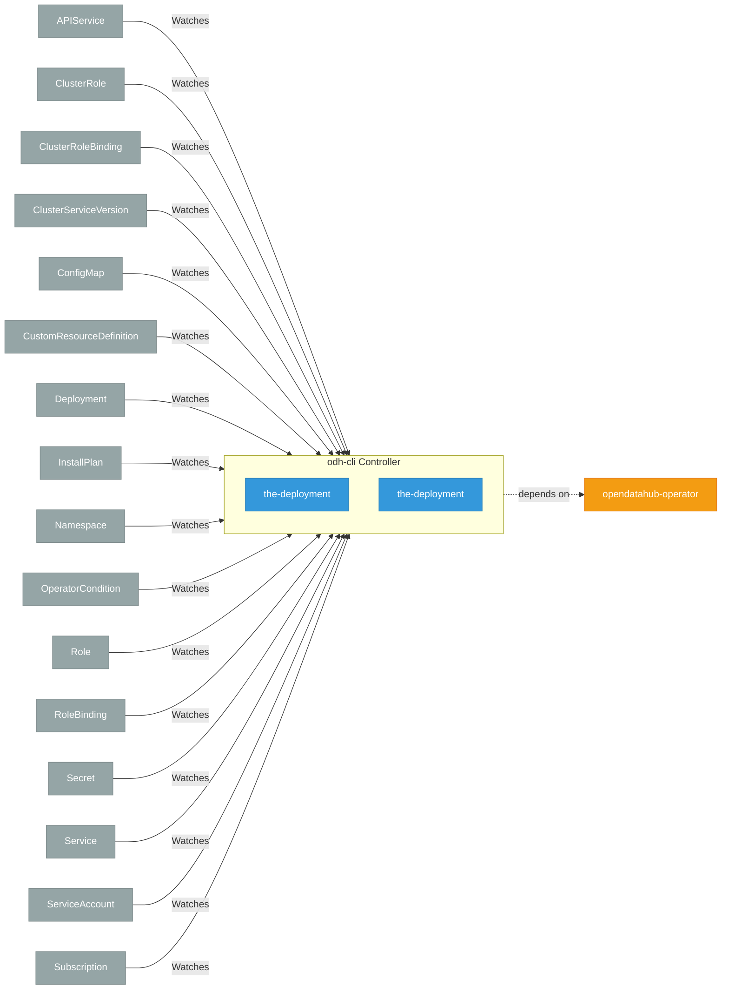

# odh-cli

> **Architecture snapshot: 2026-05-19** (2026-05-19)

**Repository:** opendatahub-io/odh-cli  
**Analyzer:** arch-analyzer 0.2.0  
**Extracted:** 2026-05-19T04:17:07Z

## Summary

| Metric | Count |
|--------|-------|
| CRDs | 0 |
| Deployments | 2 |
| Services | 2 |
| Secrets | 0 |
| Cluster Roles | 0 |
| Controller Watches | 82 |

## Component Architecture

CRDs, controllers, and owned Kubernetes resources.

### CRDs

No CRDs found in analyzed sources.

## Dependencies

### Internal Platform Dependencies

| Component | Interaction |
|-----------|-------------|
| opendatahub-operator | Go module dependency: github.com/opendatahub-io/opendatahub-operator/pkg/clusterhealth |

### Key External Dependencies

| Module | Version |
|--------|---------|
| github.com/go-logr/logr | v1.4.1 |
| github.com/go-logr/logr | v1.4.3 |
| github.com/go-logr/logr | v1.4.3 |
| github.com/go-logr/logr | v1.4.3 |
| github.com/go-logr/logr | v1.4.3 |
| github.com/go-logr/logr | v1.4.3 |
| github.com/go-logr/logr | v1.4.3 |
| github.com/go-logr/logr | v1.4.3 |
| github.com/go-logr/logr | v1.4.1 |
| github.com/go-logr/logr | v1.4.3 |
| github.com/go-logr/zapr | v1.3.0 |
| github.com/go-logr/zapr | v1.3.0 |
| github.com/operator-framework/api | v0.39.0 |
| github.com/operator-framework/api | v0.39.0 |
| github.com/operator-framework/api | v0.39.0 |
| github.com/operator-framework/operator-lifecycle-manager | v0.40.0 |
| github.com/operator-framework/operator-registry | v1.63.0 |
| github.com/operator-framework/operator-registry | v1.63.0 |
| github.com/prometheus/client_golang | v1.23.2 |
| github.com/prometheus/client_golang | v1.23.2 |
| github.com/prometheus/client_golang | v1.23.2 |
| github.com/prometheus/client_golang | v1.23.2 |
| github.com/prometheus/client_model | v0.6.2 |
| github.com/prometheus/client_model | v0.6.2 |
| github.com/prometheus/client_model | v0.6.2 |
| github.com/prometheus/client_model | v0.6.2 |
| github.com/prometheus/common | v0.67.5 |
| github.com/prometheus/common | v0.67.5 |
| google.golang.org/grpc | v1.72.2 |
| google.golang.org/grpc | v1.72.2 |
| google.golang.org/grpc | v1.72.2 |
| google.golang.org/grpc | v1.78.0 |
| google.golang.org/grpc | v1.78.0 |
| google.golang.org/grpc | v1.72.2 |
| k8s.io/api | v0.35.2 |
| k8s.io/api | v0.35.2 |
| k8s.io/api | v0.35.2 |
| k8s.io/api | v0.35.2 |
| k8s.io/api | v0.35.0 |
| k8s.io/api | v0.35.0 |
| k8s.io/api | v0.35.0 |
| k8s.io/api | v0.35.2 |
| k8s.io/api | v0.35.0 |
| k8s.io/api | v0.35.2 |
| k8s.io/api | v0.35.2 |
| k8s.io/api | v0.35.2 |
| k8s.io/api | v0.35.2 |
| k8s.io/api | v0.35.2 |
| k8s.io/api | v0.35.0 |
| k8s.io/api | v0.35.2 |
| k8s.io/api | v0.35.0 |
| k8s.io/apiextensions-apiserver | v0.35.0 |
| k8s.io/apiextensions-apiserver | v0.35.0 |
| k8s.io/apiextensions-apiserver | v0.35.0 |
| k8s.io/apiextensions-apiserver | v0.35.0 |
| k8s.io/apiextensions-apiserver | v0.35.0 |
| k8s.io/apiextensions-apiserver | v0.35.2 |
| k8s.io/apiextensions-apiserver | v0.35.0 |
| k8s.io/apimachinery | v0.35.0 |
| k8s.io/apimachinery | v0.35.2 |
| k8s.io/apimachinery | v0.35.2 |
| k8s.io/apimachinery | v0.35.0 |
| k8s.io/apimachinery | v0.35.2 |
| k8s.io/apimachinery | v0.35.2 |
| k8s.io/apimachinery | v0.35.2 |
| k8s.io/apimachinery | v0.35.2 |
| k8s.io/apimachinery | v0.35.0 |
| k8s.io/apimachinery | v0.35.2 |
| k8s.io/apimachinery | v0.35.0 |
| k8s.io/apimachinery | v0.35.2 |
| k8s.io/apimachinery | v0.35.0 |
| k8s.io/apimachinery | v0.35.2 |
| k8s.io/apimachinery | v0.35.2 |
| k8s.io/apimachinery | v0.35.2 |
| k8s.io/apimachinery | v0.35.2 |
| k8s.io/apimachinery | v0.35.2 |
| k8s.io/apimachinery | v0.35.0 |
| k8s.io/apiserver | v0.35.2 |
| k8s.io/apiserver | v0.35.0 |
| k8s.io/apiserver | v0.35.0 |
| k8s.io/apiserver | v0.35.2 |
| k8s.io/apiserver | v0.35.0 |
| k8s.io/apiserver | v0.35.0 |
| k8s.io/client-go | v0.35.0 |
| k8s.io/client-go | v0.35.2 |
| k8s.io/client-go | v0.35.2 |
| k8s.io/client-go | v0.35.2 |
| k8s.io/client-go | v0.35.2 |
| k8s.io/client-go | v0.35.2 |
| k8s.io/client-go | v0.35.0 |
| k8s.io/client-go | v0.35.2 |
| k8s.io/client-go | v0.35.2 |
| k8s.io/client-go | v0.35.0 |
| k8s.io/client-go | v0.35.0 |
| k8s.io/client-go | v0.35.0 |
| k8s.io/client-go | v0.35.2 |
| k8s.io/client-go | v0.35.2 |
| k8s.io/client-go | v0.35.0 |
| sigs.k8s.io/controller-runtime | v0.23.1 |
| sigs.k8s.io/controller-runtime | v0.23.3 |
| sigs.k8s.io/controller-runtime | v0.22.4 |
| sigs.k8s.io/controller-runtime | v0.23.1 |
| sigs.k8s.io/controller-runtime | v0.22.4 |
| sigs.k8s.io/controller-runtime | v0.23.1 |
| sigs.k8s.io/controller-runtime | v0.23.1 |

