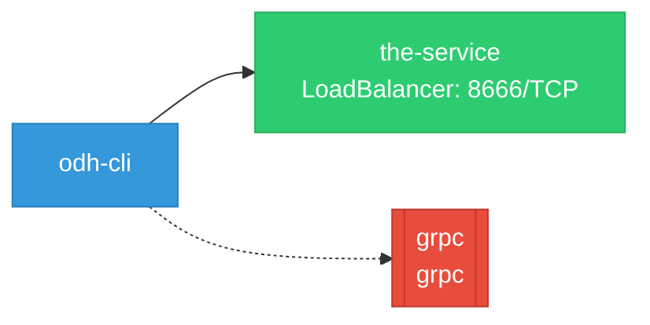

# odh-cli: Network

## Service Map

*1 unique services (2 total, duplicates from test fixtures collapsed).*

### Services

| Name | Type | Ports | Source |
|------|------|-------|--------|
| the-service | LoadBalancer | 8666/TCP | [`.gomod-cache/k8s.io/cli-runtime@v0.35.2/artifacts/kustomization/service.yaml`](https://github.com/opendatahub-io/odh-cli/blob/cf052b38ada18b2ce6c95f60bfe80dc488e0022c/.gomod-cache/k8s.io/cli-runtime@v0.35.2/artifacts/kustomization/service.yaml) |
| the-service | LoadBalancer | 8666/TCP | [`.gopath-loader/pkg/mod/k8s.io/cli-runtime@v0.35.2/artifacts/kustomization/service.yaml`](https://github.com/opendatahub-io/odh-cli/blob/cf052b38ada18b2ce6c95f60bfe80dc488e0022c/.gopath-loader/pkg/mod/k8s.io/cli-runtime@v0.35.2/artifacts/kustomization/service.yaml) |

!!! warning "No Network Policies"
    No NetworkPolicy resources found. All pod-to-pod traffic is allowed by default.

