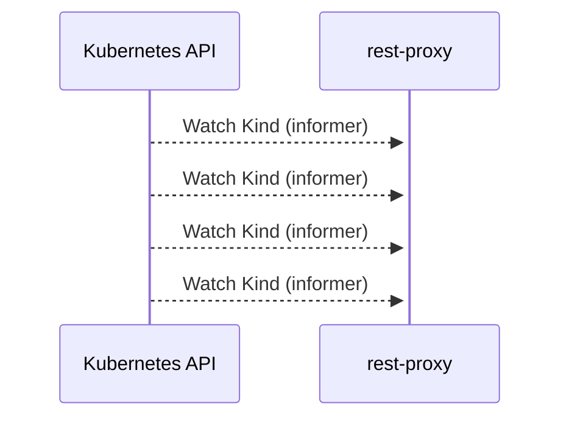

# rest-proxy: Dataflow

## Controller Watches

Kubernetes resources this controller monitors for changes. Each watch triggers reconciliation when the watched resource is created, updated, or deleted.

| Type | GVK | Source |
|------|-----|--------|
| Watches | sigs.k8s.io/controller-runtime/pkg/source/Kind | [`.gomod-cache/sigs.k8s.io/controller-runtime@v0.14.1/pkg/builder/controller.go:82`](https://github.com/kserve/rest-proxy/blob/471f9142d4608f3d927f62ebc37ebe050792ad3e/.gomod-cache/sigs.k8s.io/controller-runtime@v0.14.1/pkg/builder/controller.go#L82) |
| Watches | sigs.k8s.io/controller-runtime/pkg/source/Kind | [`.gomod-cache/sigs.k8s.io/controller-runtime@v0.14.1/pkg/builder/controller.go:106`](https://github.com/kserve/rest-proxy/blob/471f9142d4608f3d927f62ebc37ebe050792ad3e/.gomod-cache/sigs.k8s.io/controller-runtime@v0.14.1/pkg/builder/controller.go#L106) |
| Watches | sigs.k8s.io/controller-runtime/pkg/source/Kind | [`.gopath-loader/pkg/mod/sigs.k8s.io/controller-runtime@v0.14.1/pkg/builder/controller.go:82`](https://github.com/kserve/rest-proxy/blob/471f9142d4608f3d927f62ebc37ebe050792ad3e/.gopath-loader/pkg/mod/sigs.k8s.io/controller-runtime@v0.14.1/pkg/builder/controller.go#L82) |
| Watches | sigs.k8s.io/controller-runtime/pkg/source/Kind | [`.gopath-loader/pkg/mod/sigs.k8s.io/controller-runtime@v0.14.1/pkg/builder/controller.go:106`](https://github.com/kserve/rest-proxy/blob/471f9142d4608f3d927f62ebc37ebe050792ad3e/.gopath-loader/pkg/mod/sigs.k8s.io/controller-runtime@v0.14.1/pkg/builder/controller.go#L106) |

## Reconciliation Flow

How the controller interacts with the Kubernetes API during reconciliation.

### HTTP Endpoints

| Method | Path | Source |
|--------|------|--------|
| * | / | [`.gopath-loader/pkg/mod/golang.org/x/net@v0.33.0/webdav/litmus_test_server.go:83`](https://github.com/kserve/rest-proxy/blob/471f9142d4608f3d927f62ebc37ebe050792ad3e/.gopath-loader/pkg/mod/golang.org/x/net@v0.33.0/webdav/litmus_test_server.go#L83) |
| * | / | [`.gomod-cache/golang.org/x/net@v0.33.0/webdav/litmus_test_server.go:83`](https://github.com/kserve/rest-proxy/blob/471f9142d4608f3d927f62ebc37ebe050792ad3e/.gomod-cache/golang.org/x/net@v0.33.0/webdav/litmus_test_server.go#L83) |
| * | GET | [`gen/grpc_predict_v2.pb.gw.go:503`](https://github.com/kserve/rest-proxy/blob/471f9142d4608f3d927f62ebc37ebe050792ad3e/gen/grpc_predict_v2.pb.gw.go#L503) |
| * | GET | [`gen/grpc_predict_v2.pb.gw.go:481`](https://github.com/kserve/rest-proxy/blob/471f9142d4608f3d927f62ebc37ebe050792ad3e/gen/grpc_predict_v2.pb.gw.go#L481) |
| * | GET | [`gen/grpc_predict_v2.pb.gw.go:365`](https://github.com/kserve/rest-proxy/blob/471f9142d4608f3d927f62ebc37ebe050792ad3e/gen/grpc_predict_v2.pb.gw.go#L365) |
| * | GET | [`gen/grpc_predict_v2.pb.gw.go:340`](https://github.com/kserve/rest-proxy/blob/471f9142d4608f3d927f62ebc37ebe050792ad3e/gen/grpc_predict_v2.pb.gw.go#L340) |
| * | POST | [`gen/grpc_predict_v2.pb.gw.go:547`](https://github.com/kserve/rest-proxy/blob/471f9142d4608f3d927f62ebc37ebe050792ad3e/gen/grpc_predict_v2.pb.gw.go#L547) |
| * | POST | [`gen/grpc_predict_v2.pb.gw.go:525`](https://github.com/kserve/rest-proxy/blob/471f9142d4608f3d927f62ebc37ebe050792ad3e/gen/grpc_predict_v2.pb.gw.go#L525) |
| * | POST | [`gen/grpc_predict_v2.pb.gw.go:415`](https://github.com/kserve/rest-proxy/blob/471f9142d4608f3d927f62ebc37ebe050792ad3e/gen/grpc_predict_v2.pb.gw.go#L415) |
| * | POST | [`gen/grpc_predict_v2.pb.gw.go:390`](https://github.com/kserve/rest-proxy/blob/471f9142d4608f3d927f62ebc37ebe050792ad3e/gen/grpc_predict_v2.pb.gw.go#L390) |
| * | header | [`.gopath-loader/pkg/mod/golang.org/x/net@v0.33.0/quic/qlog.go:189`](https://github.com/kserve/rest-proxy/blob/471f9142d4608f3d927f62ebc37ebe050792ad3e/.gopath-loader/pkg/mod/golang.org/x/net@v0.33.0/quic/qlog.go#L189) |
| * | header | [`.gopath-loader/pkg/mod/golang.org/x/net@v0.33.0/quic/qlog.go:167`](https://github.com/kserve/rest-proxy/blob/471f9142d4608f3d927f62ebc37ebe050792ad3e/.gopath-loader/pkg/mod/golang.org/x/net@v0.33.0/quic/qlog.go#L167) |
| * | header | [`.gomod-cache/golang.org/x/net@v0.33.0/quic/qlog.go:167`](https://github.com/kserve/rest-proxy/blob/471f9142d4608f3d927f62ebc37ebe050792ad3e/.gomod-cache/golang.org/x/net@v0.33.0/quic/qlog.go#L167) |
| * | header | [`.gomod-cache/golang.org/x/net@v0.33.0/quic/qlog.go:189`](https://github.com/kserve/rest-proxy/blob/471f9142d4608f3d927f62ebc37ebe050792ad3e/.gomod-cache/golang.org/x/net@v0.33.0/quic/qlog.go#L189) |
| * | header | [`.gopath-loader/pkg/mod/golang.org/x/net@v0.33.0/quic/qlog.go:213`](https://github.com/kserve/rest-proxy/blob/471f9142d4608f3d927f62ebc37ebe050792ad3e/.gopath-loader/pkg/mod/golang.org/x/net@v0.33.0/quic/qlog.go#L213) |
| * | header | [`.gomod-cache/golang.org/x/net@v0.33.0/quic/qlog.go:213`](https://github.com/kserve/rest-proxy/blob/471f9142d4608f3d927f62ebc37ebe050792ad3e/.gomod-cache/golang.org/x/net@v0.33.0/quic/qlog.go#L213) |
| * | header | [`.gopath-loader/pkg/mod/golang.org/x/net@v0.33.0/quic/qlog.go:269`](https://github.com/kserve/rest-proxy/blob/471f9142d4608f3d927f62ebc37ebe050792ad3e/.gopath-loader/pkg/mod/golang.org/x/net@v0.33.0/quic/qlog.go#L269) |
| * | header | [`.gomod-cache/golang.org/x/net@v0.33.0/quic/qlog.go:269`](https://github.com/kserve/rest-proxy/blob/471f9142d4608f3d927f62ebc37ebe050792ad3e/.gomod-cache/golang.org/x/net@v0.33.0/quic/qlog.go#L269) |
| * | raw | [`.gopath-loader/pkg/mod/golang.org/x/net@v0.33.0/quic/qlog.go:174`](https://github.com/kserve/rest-proxy/blob/471f9142d4608f3d927f62ebc37ebe050792ad3e/.gopath-loader/pkg/mod/golang.org/x/net@v0.33.0/quic/qlog.go#L174) |
| * | raw | [`.gomod-cache/golang.org/x/net@v0.33.0/quic/qlog.go:219`](https://github.com/kserve/rest-proxy/blob/471f9142d4608f3d927f62ebc37ebe050792ad3e/.gomod-cache/golang.org/x/net@v0.33.0/quic/qlog.go#L219) |
| * | raw | [`.gopath-loader/pkg/mod/golang.org/x/net@v0.33.0/quic/qlog.go:219`](https://github.com/kserve/rest-proxy/blob/471f9142d4608f3d927f62ebc37ebe050792ad3e/.gopath-loader/pkg/mod/golang.org/x/net@v0.33.0/quic/qlog.go#L219) |
| * | raw | [`.gomod-cache/golang.org/x/net@v0.33.0/quic/qlog.go:195`](https://github.com/kserve/rest-proxy/blob/471f9142d4608f3d927f62ebc37ebe050792ad3e/.gomod-cache/golang.org/x/net@v0.33.0/quic/qlog.go#L195) |
| * | raw | [`.gopath-loader/pkg/mod/golang.org/x/net@v0.33.0/quic/qlog.go:195`](https://github.com/kserve/rest-proxy/blob/471f9142d4608f3d927f62ebc37ebe050792ad3e/.gopath-loader/pkg/mod/golang.org/x/net@v0.33.0/quic/qlog.go#L195) |
| * | raw | [`.gomod-cache/golang.org/x/net@v0.33.0/quic/qlog.go:174`](https://github.com/kserve/rest-proxy/blob/471f9142d4608f3d927f62ebc37ebe050792ad3e/.gomod-cache/golang.org/x/net@v0.33.0/quic/qlog.go#L174) |
| * | vantage_point | [`.gopath-loader/pkg/mod/golang.org/x/net@v0.33.0/quic/qlog.go:98`](https://github.com/kserve/rest-proxy/blob/471f9142d4608f3d927f62ebc37ebe050792ad3e/.gopath-loader/pkg/mod/golang.org/x/net@v0.33.0/quic/qlog.go#L98) |
| * | vantage_point | [`.gomod-cache/golang.org/x/net@v0.33.0/quic/qlog.go:98`](https://github.com/kserve/rest-proxy/blob/471f9142d4608f3d927f62ebc37ebe050792ad3e/.gomod-cache/golang.org/x/net@v0.33.0/quic/qlog.go#L98) |

## Configuration

ConfigMaps and Helm values that control this component's runtime behavior.

