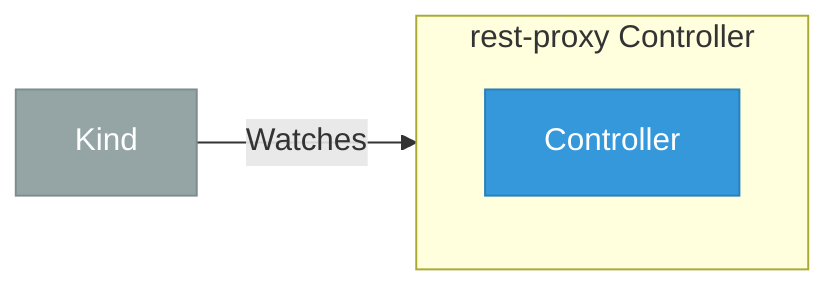

# rest-proxy

> **Architecture snapshot: 2026-05-15** (2026-05-15)

**Repository:** kserve/rest-proxy  
**Analyzer:** arch-analyzer 0.2.0  
**Extracted:** 2026-05-15T11:48:39Z

## Summary

| Metric | Count |
|--------|-------|
| CRDs | 0 |
| Deployments | 0 |
| Services | 0 |
| Secrets | 0 |
| Cluster Roles | 0 |
| Controller Watches | 4 |

## Component Architecture

CRDs, controllers, and owned Kubernetes resources.

### CRDs

No CRDs defined.

## Dependencies

### Key External Dependencies

| Module | Version |
|--------|---------|
| github.com/go-logr/logr | v1.4.1 |
| github.com/go-logr/logr | v1.2.3 |
| github.com/go-logr/logr | v1.2.2 |
| github.com/go-logr/logr | v1.2.2 |
| github.com/go-logr/logr | v1.4.1 |
| github.com/go-logr/logr | v1.2.3 |
| github.com/go-logr/zapr | v1.2.3 |
| github.com/go-logr/zapr | v1.2.3 |
| github.com/prometheus/client_golang | v1.14.0 |
| github.com/prometheus/client_golang | v1.14.0 |
| github.com/prometheus/client_model | v0.3.0 |
| github.com/prometheus/client_model | v0.3.0 |
| google.golang.org/grpc | v1.54.0 |
| google.golang.org/grpc | v1.56.3 |
| google.golang.org/grpc | v1.51.0 |
| google.golang.org/grpc | v1.54.0 |
| google.golang.org/grpc | v1.51.0 |
| k8s.io/api | v0.26.0 |
| k8s.io/api | v0.26.0 |
| k8s.io/apiextensions-apiserver | v0.26.0 |
| k8s.io/apiextensions-apiserver | v0.26.0 |
| k8s.io/apimachinery | v0.26.0 |
| k8s.io/apimachinery | v0.26.0 |
| k8s.io/client-go | v0.26.0 |
| k8s.io/client-go | v0.26.0 |
| sigs.k8s.io/controller-runtime | v0.14.1 |

