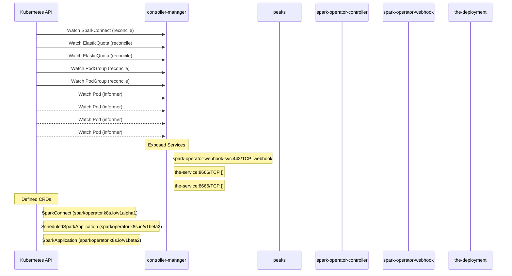

# spark-operator: Dataflow

## Controller Watches

Kubernetes resources this controller monitors for changes. Each watch triggers reconciliation when the watched resource is created, updated, or deleted.

| Type | GVK | Source |
|------|-----|--------|
| For | api/v1alpha1/SparkConnect | [`internal/controller/sparkconnect/reconciler.go:97`](https://github.com/kubeflow/spark-operator/blob/1ff69d896dc2b7c0769f5bde06d3ab6f25089228/internal/controller/sparkconnect/reconciler.go#L97) |
| For | scheduling/v1alpha1/ElasticQuota | [`.gomod-cache/sigs.k8s.io/scheduler-plugins@v0.32.7/pkg/controllers/elasticquota_controller.go:175`](https://github.com/kubeflow/spark-operator/blob/1ff69d896dc2b7c0769f5bde06d3ab6f25089228/.gomod-cache/sigs.k8s.io/scheduler-plugins@v0.32.7/pkg/controllers/elasticquota_controller.go#L175) |
| For | scheduling/v1alpha1/ElasticQuota | [`.gopath-loader/pkg/mod/sigs.k8s.io/scheduler-plugins@v0.32.7/pkg/controllers/elasticquota_controller.go:175`](https://github.com/kubeflow/spark-operator/blob/1ff69d896dc2b7c0769f5bde06d3ab6f25089228/.gopath-loader/pkg/mod/sigs.k8s.io/scheduler-plugins@v0.32.7/pkg/controllers/elasticquota_controller.go#L175) |
| For | scheduling/v1alpha1/PodGroup | [`.gomod-cache/sigs.k8s.io/scheduler-plugins@v0.32.7/pkg/controllers/podgroup_controller.go:193`](https://github.com/kubeflow/spark-operator/blob/1ff69d896dc2b7c0769f5bde06d3ab6f25089228/.gomod-cache/sigs.k8s.io/scheduler-plugins@v0.32.7/pkg/controllers/podgroup_controller.go#L193) |
| For | scheduling/v1alpha1/PodGroup | [`.gopath-loader/pkg/mod/sigs.k8s.io/scheduler-plugins@v0.32.7/pkg/controllers/podgroup_controller.go:193`](https://github.com/kubeflow/spark-operator/blob/1ff69d896dc2b7c0769f5bde06d3ab6f25089228/.gopath-loader/pkg/mod/sigs.k8s.io/scheduler-plugins@v0.32.7/pkg/controllers/podgroup_controller.go#L193) |
| Watches | /v1/Pod | [`.gomod-cache/sigs.k8s.io/scheduler-plugins@v0.32.7/pkg/controllers/elasticquota_controller.go:174`](https://github.com/kubeflow/spark-operator/blob/1ff69d896dc2b7c0769f5bde06d3ab6f25089228/.gomod-cache/sigs.k8s.io/scheduler-plugins@v0.32.7/pkg/controllers/elasticquota_controller.go#L174) |
| Watches | /v1/Pod | [`.gomod-cache/sigs.k8s.io/scheduler-plugins@v0.32.7/pkg/controllers/podgroup_controller.go:192`](https://github.com/kubeflow/spark-operator/blob/1ff69d896dc2b7c0769f5bde06d3ab6f25089228/.gomod-cache/sigs.k8s.io/scheduler-plugins@v0.32.7/pkg/controllers/podgroup_controller.go#L192) |
| Watches | /v1/Pod | [`.gopath-loader/pkg/mod/sigs.k8s.io/scheduler-plugins@v0.32.7/pkg/controllers/elasticquota_controller.go:174`](https://github.com/kubeflow/spark-operator/blob/1ff69d896dc2b7c0769f5bde06d3ab6f25089228/.gopath-loader/pkg/mod/sigs.k8s.io/scheduler-plugins@v0.32.7/pkg/controllers/elasticquota_controller.go#L174) |
| Watches | /v1/Pod | [`.gopath-loader/pkg/mod/sigs.k8s.io/scheduler-plugins@v0.32.7/pkg/controllers/podgroup_controller.go:192`](https://github.com/kubeflow/spark-operator/blob/1ff69d896dc2b7c0769f5bde06d3ab6f25089228/.gopath-loader/pkg/mod/sigs.k8s.io/scheduler-plugins@v0.32.7/pkg/controllers/podgroup_controller.go#L192) |

### Programmatic Resource Operations

| Verb | Kind | Group | Condition |
|------|------|-------|----------|
| delete | SparkApplication | api |  |

## Reconciliation Flow

How the controller interacts with the Kubernetes API during reconciliation.

### Webhooks

| Name | Type | Path | Failure Policy | Service | Overlays | Enable Condition | Sources |
|------|------|------|----------------|---------|----------|------------------|----------|
| conversion-unknown | conversion | /convert |  | system/webhook-service |  |  | [`config/crd/patches/webhook_in_sparkapplications.yaml`](https://github.com/kubeflow/spark-operator/blob/1ff69d896dc2b7c0769f5bde06d3ab6f25089228/config/crd/patches/webhook_in_sparkapplications.yaml), [`.gomod-cache/sigs.k8s.io/controller-runtime@v0.20.4/pkg/builder/webhook.go`](https://github.com/kubeflow/spark-operator/blob/1ff69d896dc2b7c0769f5bde06d3ab6f25089228/.gomod-cache/sigs.k8s.io/controller-runtime@v0.20.4/pkg/builder/webhook.go), [`.gopath-loader/pkg/mod/sigs.k8s.io/controller-runtime@v0.20.4/pkg/builder/webhook.go`](https://github.com/kubeflow/spark-operator/blob/1ff69d896dc2b7c0769f5bde06d3ab6f25089228/.gopath-loader/pkg/mod/sigs.k8s.io/controller-runtime@v0.20.4/pkg/builder/webhook.go) |
| mutate-pod.sparkoperator.k8s.io | mutating | /mutate--v1-pod | Fail | opendatahub/spark-operator-webhook-svc | config/overlays/odh |  | [`config/webhook/manifests.yaml`](https://github.com/kubeflow/spark-operator/blob/1ff69d896dc2b7c0769f5bde06d3ab6f25089228/config/webhook/manifests.yaml), [`kustomize:config/overlays/odh (spark-operator-webhook)`](https://github.com/kubeflow/spark-operator/blob/1ff69d896dc2b7c0769f5bde06d3ab6f25089228/kustomize:config/overlays/odh (spark-operator-webhook)) |
| mutate-scheduledsparkapplication.sparkoperator.k8s.io | mutating | /mutate-sparkoperator-k8s-io-v1beta2-scheduledsparkapplication | Fail | opendatahub/spark-operator-webhook-svc | config/overlays/odh |  | [`config/webhook/manifests.yaml`](https://github.com/kubeflow/spark-operator/blob/1ff69d896dc2b7c0769f5bde06d3ab6f25089228/config/webhook/manifests.yaml), [`kustomize:config/overlays/odh (spark-operator-webhook)`](https://github.com/kubeflow/spark-operator/blob/1ff69d896dc2b7c0769f5bde06d3ab6f25089228/kustomize:config/overlays/odh (spark-operator-webhook)) |
| mutate-sparkapplication.sparkoperator.k8s.io | mutating | /mutate-sparkoperator-k8s-io-v1beta2-sparkapplication | Fail | opendatahub/spark-operator-webhook-svc | config/overlays/odh |  | [`config/webhook/manifests.yaml`](https://github.com/kubeflow/spark-operator/blob/1ff69d896dc2b7c0769f5bde06d3ab6f25089228/config/webhook/manifests.yaml), [`kustomize:config/overlays/odh (spark-operator-webhook)`](https://github.com/kubeflow/spark-operator/blob/1ff69d896dc2b7c0769f5bde06d3ab6f25089228/kustomize:config/overlays/odh (spark-operator-webhook)) |
| validate-scheduledsparkapplication.sparkoperator.k8s.io | validating | /validate-sparkoperator-k8s-io-v1beta2-scheduledsparkapplication | Fail | opendatahub/spark-operator-webhook-svc | config/overlays/odh |  | [`config/webhook/manifests.yaml`](https://github.com/kubeflow/spark-operator/blob/1ff69d896dc2b7c0769f5bde06d3ab6f25089228/config/webhook/manifests.yaml), [`kustomize:config/overlays/odh (spark-operator-webhook)`](https://github.com/kubeflow/spark-operator/blob/1ff69d896dc2b7c0769f5bde06d3ab6f25089228/kustomize:config/overlays/odh (spark-operator-webhook)) |
| validate-sparkapplication.sparkoperator.k8s.io | validating | /validate-sparkoperator-k8s-io-v1beta2-sparkapplication | Fail | opendatahub/spark-operator-webhook-svc | config/overlays/odh |  | [`config/webhook/manifests.yaml`](https://github.com/kubeflow/spark-operator/blob/1ff69d896dc2b7c0769f5bde06d3ab6f25089228/config/webhook/manifests.yaml), [`kustomize:config/overlays/odh (spark-operator-webhook)`](https://github.com/kubeflow/spark-operator/blob/1ff69d896dc2b7c0769f5bde06d3ab6f25089228/kustomize:config/overlays/odh (spark-operator-webhook)) |

### HTTP Endpoints

| Method | Path | Source |
|--------|------|--------|
| * | / | [`.gopath-loader/pkg/mod/golang.org/x/tools@v0.37.0/go/types/internal/play/play.go:46`](https://github.com/kubeflow/spark-operator/blob/1ff69d896dc2b7c0769f5bde06d3ab6f25089228/.gopath-loader/pkg/mod/golang.org/x/tools@v0.37.0/go/types/internal/play/play.go#L46) |
| * | / | [`.gopath-loader/pkg/mod/github.com/google/pprof@v0.0.0-20250403155104-27863c87afa6/internal/driver/webui.go:212`](https://github.com/kubeflow/spark-operator/blob/1ff69d896dc2b7c0769f5bde06d3ab6f25089228/.gopath-loader/pkg/mod/github.com/google/pprof@v0.0.0-20250403155104-27863c87afa6/internal/driver/webui.go#L212) |
| * | / | [`.gomod-cache/golang.org/x/tools@v0.37.0/go/types/internal/play/play.go:46`](https://github.com/kubeflow/spark-operator/blob/1ff69d896dc2b7c0769f5bde06d3ab6f25089228/.gomod-cache/golang.org/x/tools@v0.37.0/go/types/internal/play/play.go#L46) |
| * | / | [`.gomod-cache/golang.org/x/tools@v0.37.0/cmd/present/dir.go:23`](https://github.com/kubeflow/spark-operator/blob/1ff69d896dc2b7c0769f5bde06d3ab6f25089228/.gomod-cache/golang.org/x/tools@v0.37.0/cmd/present/dir.go#L23) |
| * | / | [`.gomod-cache/golang.org/x/net@v0.44.0/webdav/litmus_test_server.go:83`](https://github.com/kubeflow/spark-operator/blob/1ff69d896dc2b7c0769f5bde06d3ab6f25089228/.gomod-cache/golang.org/x/net@v0.44.0/webdav/litmus_test_server.go#L83) |
| * | / | [`.gomod-cache/github.com/google/pprof@v0.0.0-20250403155104-27863c87afa6/internal/driver/webui.go:212`](https://github.com/kubeflow/spark-operator/blob/1ff69d896dc2b7c0769f5bde06d3ab6f25089228/.gomod-cache/github.com/google/pprof@v0.0.0-20250403155104-27863c87afa6/internal/driver/webui.go#L212) |
| * | / | [`.gopath-loader/pkg/mod/golang.org/x/net@v0.44.0/webdav/litmus_test_server.go:83`](https://github.com/kubeflow/spark-operator/blob/1ff69d896dc2b7c0769f5bde06d3ab6f25089228/.gopath-loader/pkg/mod/golang.org/x/net@v0.44.0/webdav/litmus_test_server.go#L83) |
| * | / | [`.gopath-loader/pkg/mod/golang.org/x/tools@v0.37.0/cmd/present/dir.go:23`](https://github.com/kubeflow/spark-operator/blob/1ff69d896dc2b7c0769f5bde06d3ab6f25089228/.gopath-loader/pkg/mod/golang.org/x/tools@v0.37.0/cmd/present/dir.go#L23) |
| GET | / | [`.gomod-cache/k8s.io/apiserver@v0.32.5/pkg/endpoints/discovery/group.go:57`](https://github.com/kubeflow/spark-operator/blob/1ff69d896dc2b7c0769f5bde06d3ab6f25089228/.gomod-cache/k8s.io/apiserver@v0.32.5/pkg/endpoints/discovery/group.go#L57) |
| GET | / | [`.gomod-cache/k8s.io/apiserver@v0.32.5/pkg/endpoints/discovery/version.go:67`](https://github.com/kubeflow/spark-operator/blob/1ff69d896dc2b7c0769f5bde06d3ab6f25089228/.gomod-cache/k8s.io/apiserver@v0.32.5/pkg/endpoints/discovery/version.go#L67) |
| GET | / | [`.gomod-cache/k8s.io/apiserver@v0.32.5/pkg/server/routes/version.go:44`](https://github.com/kubeflow/spark-operator/blob/1ff69d896dc2b7c0769f5bde06d3ab6f25089228/.gomod-cache/k8s.io/apiserver@v0.32.5/pkg/server/routes/version.go#L44) |
| GET | / | [`.gomod-cache/k8s.io/apiserver@v0.32.5/pkg/endpoints/discovery/root.go:154`](https://github.com/kubeflow/spark-operator/blob/1ff69d896dc2b7c0769f5bde06d3ab6f25089228/.gomod-cache/k8s.io/apiserver@v0.32.5/pkg/endpoints/discovery/root.go#L154) |
| GET | / | [`.gomod-cache/k8s.io/apiserver@v0.32.5/pkg/endpoints/discovery/legacy.go:59`](https://github.com/kubeflow/spark-operator/blob/1ff69d896dc2b7c0769f5bde06d3ab6f25089228/.gomod-cache/k8s.io/apiserver@v0.32.5/pkg/endpoints/discovery/legacy.go#L59) |
| GET | / | [`.gomod-cache/k8s.io/apiserver@v0.32.5/pkg/endpoints/discovery/aggregated/wrapper.go:62`](https://github.com/kubeflow/spark-operator/blob/1ff69d896dc2b7c0769f5bde06d3ab6f25089228/.gomod-cache/k8s.io/apiserver@v0.32.5/pkg/endpoints/discovery/aggregated/wrapper.go#L62) |
| GET | / | [`.gopath-loader/pkg/mod/k8s.io/apiserver@v0.32.5/pkg/server/routes/version.go:44`](https://github.com/kubeflow/spark-operator/blob/1ff69d896dc2b7c0769f5bde06d3ab6f25089228/.gopath-loader/pkg/mod/k8s.io/apiserver@v0.32.5/pkg/server/routes/version.go#L44) |
| GET | / | [`.gopath-loader/pkg/mod/k8s.io/apiserver@v0.32.5/pkg/endpoints/discovery/aggregated/wrapper.go:62`](https://github.com/kubeflow/spark-operator/blob/1ff69d896dc2b7c0769f5bde06d3ab6f25089228/.gopath-loader/pkg/mod/k8s.io/apiserver@v0.32.5/pkg/endpoints/discovery/aggregated/wrapper.go#L62) |
| GET | / | [`.gopath-loader/pkg/mod/k8s.io/apiserver@v0.32.5/pkg/endpoints/discovery/group.go:57`](https://github.com/kubeflow/spark-operator/blob/1ff69d896dc2b7c0769f5bde06d3ab6f25089228/.gopath-loader/pkg/mod/k8s.io/apiserver@v0.32.5/pkg/endpoints/discovery/group.go#L57) |
| GET | / | [`.gopath-loader/pkg/mod/k8s.io/apiserver@v0.32.5/pkg/endpoints/discovery/legacy.go:59`](https://github.com/kubeflow/spark-operator/blob/1ff69d896dc2b7c0769f5bde06d3ab6f25089228/.gopath-loader/pkg/mod/k8s.io/apiserver@v0.32.5/pkg/endpoints/discovery/legacy.go#L59) |
| GET | / | [`.gopath-loader/pkg/mod/k8s.io/apiserver@v0.32.5/pkg/endpoints/discovery/version.go:67`](https://github.com/kubeflow/spark-operator/blob/1ff69d896dc2b7c0769f5bde06d3ab6f25089228/.gopath-loader/pkg/mod/k8s.io/apiserver@v0.32.5/pkg/endpoints/discovery/version.go#L67) |
| GET | / | [`.gopath-loader/pkg/mod/k8s.io/apiserver@v0.32.5/pkg/endpoints/discovery/root.go:154`](https://github.com/kubeflow/spark-operator/blob/1ff69d896dc2b7c0769f5bde06d3ab6f25089228/.gopath-loader/pkg/mod/k8s.io/apiserver@v0.32.5/pkg/endpoints/discovery/root.go#L154) |
| * | /abort | [`.gopath-loader/pkg/mod/github.com/onsi/ginkgo/v2@v2.27.2/internal/parallel_support/http_server.go:63`](https://github.com/kubeflow/spark-operator/blob/1ff69d896dc2b7c0769f5bde06d3ab6f25089228/.gopath-loader/pkg/mod/github.com/onsi/ginkgo/v2@v2.27.2/internal/parallel_support/http_server.go#L63) |
| * | /abort | [`.gomod-cache/github.com/onsi/ginkgo/v2@v2.27.2/internal/parallel_support/http_server.go:63`](https://github.com/kubeflow/spark-operator/blob/1ff69d896dc2b7c0769f5bde06d3ab6f25089228/.gomod-cache/github.com/onsi/ginkgo/v2@v2.27.2/internal/parallel_support/http_server.go#L63) |
| * | /aggregated-nonprimary-procs-report | [`.gomod-cache/github.com/onsi/ginkgo/v2@v2.27.2/internal/parallel_support/http_server.go:60`](https://github.com/kubeflow/spark-operator/blob/1ff69d896dc2b7c0769f5bde06d3ab6f25089228/.gomod-cache/github.com/onsi/ginkgo/v2@v2.27.2/internal/parallel_support/http_server.go#L60) |
| * | /aggregated-nonprimary-procs-report | [`.gopath-loader/pkg/mod/github.com/onsi/ginkgo/v2@v2.27.2/internal/parallel_support/http_server.go:60`](https://github.com/kubeflow/spark-operator/blob/1ff69d896dc2b7c0769f5bde06d3ab6f25089228/.gopath-loader/pkg/mod/github.com/onsi/ginkgo/v2@v2.27.2/internal/parallel_support/http_server.go#L60) |
| * | /before-suite-completed | [`.gopath-loader/pkg/mod/github.com/onsi/ginkgo/v2@v2.27.2/internal/parallel_support/http_server.go:57`](https://github.com/kubeflow/spark-operator/blob/1ff69d896dc2b7c0769f5bde06d3ab6f25089228/.gopath-loader/pkg/mod/github.com/onsi/ginkgo/v2@v2.27.2/internal/parallel_support/http_server.go#L57) |
| * | /before-suite-completed | [`.gomod-cache/github.com/onsi/ginkgo/v2@v2.27.2/internal/parallel_support/http_server.go:57`](https://github.com/kubeflow/spark-operator/blob/1ff69d896dc2b7c0769f5bde06d3ab6f25089228/.gomod-cache/github.com/onsi/ginkgo/v2@v2.27.2/internal/parallel_support/http_server.go#L57) |
| * | /before-suite-state | [`.gopath-loader/pkg/mod/github.com/onsi/ginkgo/v2@v2.27.2/internal/parallel_support/http_server.go:58`](https://github.com/kubeflow/spark-operator/blob/1ff69d896dc2b7c0769f5bde06d3ab6f25089228/.gopath-loader/pkg/mod/github.com/onsi/ginkgo/v2@v2.27.2/internal/parallel_support/http_server.go#L58) |
| * | /before-suite-state | [`.gomod-cache/github.com/onsi/ginkgo/v2@v2.27.2/internal/parallel_support/http_server.go:58`](https://github.com/kubeflow/spark-operator/blob/1ff69d896dc2b7c0769f5bde06d3ab6f25089228/.gomod-cache/github.com/onsi/ginkgo/v2@v2.27.2/internal/parallel_support/http_server.go#L58) |
| * | /compile | [`.gopath-loader/pkg/mod/golang.org/x/tools@v0.37.0/playground/playground.go:23`](https://github.com/kubeflow/spark-operator/blob/1ff69d896dc2b7c0769f5bde06d3ab6f25089228/.gopath-loader/pkg/mod/golang.org/x/tools@v0.37.0/playground/playground.go#L23) |
| * | /compile | [`.gomod-cache/golang.org/x/tools@v0.37.0/playground/playground.go:23`](https://github.com/kubeflow/spark-operator/blob/1ff69d896dc2b7c0769f5bde06d3ab6f25089228/.gomod-cache/golang.org/x/tools@v0.37.0/playground/playground.go#L23) |
| * | /counter | [`.gopath-loader/pkg/mod/github.com/onsi/ginkgo/v2@v2.27.2/internal/parallel_support/http_server.go:61`](https://github.com/kubeflow/spark-operator/blob/1ff69d896dc2b7c0769f5bde06d3ab6f25089228/.gopath-loader/pkg/mod/github.com/onsi/ginkgo/v2@v2.27.2/internal/parallel_support/http_server.go#L61) |
| * | /counter | [`.gomod-cache/github.com/onsi/ginkgo/v2@v2.27.2/internal/parallel_support/http_server.go:61`](https://github.com/kubeflow/spark-operator/blob/1ff69d896dc2b7c0769f5bde06d3ab6f25089228/.gomod-cache/github.com/onsi/ginkgo/v2@v2.27.2/internal/parallel_support/http_server.go#L61) |
| * | /debug/flags | [`.gomod-cache/k8s.io/apiserver@v0.32.5/pkg/server/routes/debugsocket.go:55`](https://github.com/kubeflow/spark-operator/blob/1ff69d896dc2b7c0769f5bde06d3ab6f25089228/.gomod-cache/k8s.io/apiserver@v0.32.5/pkg/server/routes/debugsocket.go#L55) |
| * | /debug/flags | [`.gopath-loader/pkg/mod/k8s.io/apiserver@v0.32.5/pkg/server/routes/debugsocket.go:55`](https://github.com/kubeflow/spark-operator/blob/1ff69d896dc2b7c0769f5bde06d3ab6f25089228/.gopath-loader/pkg/mod/k8s.io/apiserver@v0.32.5/pkg/server/routes/debugsocket.go#L55) |
| * | /debug/flags/ | [`.gomod-cache/k8s.io/apiserver@v0.32.5/pkg/server/routes/debugsocket.go:56`](https://github.com/kubeflow/spark-operator/blob/1ff69d896dc2b7c0769f5bde06d3ab6f25089228/.gomod-cache/k8s.io/apiserver@v0.32.5/pkg/server/routes/debugsocket.go#L56) |
| * | /debug/flags/ | [`.gopath-loader/pkg/mod/k8s.io/apiserver@v0.32.5/pkg/server/routes/debugsocket.go:56`](https://github.com/kubeflow/spark-operator/blob/1ff69d896dc2b7c0769f5bde06d3ab6f25089228/.gopath-loader/pkg/mod/k8s.io/apiserver@v0.32.5/pkg/server/routes/debugsocket.go#L56) |
| * | /debug/pprof | [`.gopath-loader/pkg/mod/k8s.io/apiserver@v0.32.5/pkg/server/routes/debugsocket.go:44`](https://github.com/kubeflow/spark-operator/blob/1ff69d896dc2b7c0769f5bde06d3ab6f25089228/.gopath-loader/pkg/mod/k8s.io/apiserver@v0.32.5/pkg/server/routes/debugsocket.go#L44) |
| * | /debug/pprof | [`.gomod-cache/k8s.io/apiserver@v0.32.5/pkg/server/routes/debugsocket.go:44`](https://github.com/kubeflow/spark-operator/blob/1ff69d896dc2b7c0769f5bde06d3ab6f25089228/.gomod-cache/k8s.io/apiserver@v0.32.5/pkg/server/routes/debugsocket.go#L44) |
| * | /debug/pprof/ | [`.gomod-cache/k8s.io/apiserver@v0.32.5/pkg/server/routes/debugsocket.go:45`](https://github.com/kubeflow/spark-operator/blob/1ff69d896dc2b7c0769f5bde06d3ab6f25089228/.gomod-cache/k8s.io/apiserver@v0.32.5/pkg/server/routes/debugsocket.go#L45) |
| * | /debug/pprof/ | [`.gopath-loader/pkg/mod/sigs.k8s.io/controller-runtime@v0.20.4/pkg/manager/internal.go:316`](https://github.com/kubeflow/spark-operator/blob/1ff69d896dc2b7c0769f5bde06d3ab6f25089228/.gopath-loader/pkg/mod/sigs.k8s.io/controller-runtime@v0.20.4/pkg/manager/internal.go#L316) |
| * | /debug/pprof/ | [`.gopath-loader/pkg/mod/k8s.io/apiserver@v0.32.5/pkg/server/routes/debugsocket.go:45`](https://github.com/kubeflow/spark-operator/blob/1ff69d896dc2b7c0769f5bde06d3ab6f25089228/.gopath-loader/pkg/mod/k8s.io/apiserver@v0.32.5/pkg/server/routes/debugsocket.go#L45) |
| * | /debug/pprof/ | [`.gomod-cache/sigs.k8s.io/controller-runtime@v0.20.4/pkg/manager/internal.go:316`](https://github.com/kubeflow/spark-operator/blob/1ff69d896dc2b7c0769f5bde06d3ab6f25089228/.gomod-cache/sigs.k8s.io/controller-runtime@v0.20.4/pkg/manager/internal.go#L316) |
| * | /debug/pprof/cmdline | [`.gopath-loader/pkg/mod/k8s.io/apiserver@v0.32.5/pkg/server/routes/debugsocket.go:46`](https://github.com/kubeflow/spark-operator/blob/1ff69d896dc2b7c0769f5bde06d3ab6f25089228/.gopath-loader/pkg/mod/k8s.io/apiserver@v0.32.5/pkg/server/routes/debugsocket.go#L46) |
| * | /debug/pprof/cmdline | [`.gomod-cache/sigs.k8s.io/controller-runtime@v0.20.4/pkg/manager/internal.go:317`](https://github.com/kubeflow/spark-operator/blob/1ff69d896dc2b7c0769f5bde06d3ab6f25089228/.gomod-cache/sigs.k8s.io/controller-runtime@v0.20.4/pkg/manager/internal.go#L317) |
| * | /debug/pprof/cmdline | [`.gomod-cache/k8s.io/apiserver@v0.32.5/pkg/server/routes/debugsocket.go:46`](https://github.com/kubeflow/spark-operator/blob/1ff69d896dc2b7c0769f5bde06d3ab6f25089228/.gomod-cache/k8s.io/apiserver@v0.32.5/pkg/server/routes/debugsocket.go#L46) |
| * | /debug/pprof/cmdline | [`.gopath-loader/pkg/mod/sigs.k8s.io/controller-runtime@v0.20.4/pkg/manager/internal.go:317`](https://github.com/kubeflow/spark-operator/blob/1ff69d896dc2b7c0769f5bde06d3ab6f25089228/.gopath-loader/pkg/mod/sigs.k8s.io/controller-runtime@v0.20.4/pkg/manager/internal.go#L317) |
| * | /debug/pprof/profile | [`.gomod-cache/sigs.k8s.io/controller-runtime@v0.20.4/pkg/manager/internal.go:318`](https://github.com/kubeflow/spark-operator/blob/1ff69d896dc2b7c0769f5bde06d3ab6f25089228/.gomod-cache/sigs.k8s.io/controller-runtime@v0.20.4/pkg/manager/internal.go#L318) |
| * | /debug/pprof/profile | [`.gopath-loader/pkg/mod/sigs.k8s.io/controller-runtime@v0.20.4/pkg/manager/internal.go:318`](https://github.com/kubeflow/spark-operator/blob/1ff69d896dc2b7c0769f5bde06d3ab6f25089228/.gopath-loader/pkg/mod/sigs.k8s.io/controller-runtime@v0.20.4/pkg/manager/internal.go#L318) |
| * | /debug/pprof/profile | [`.gomod-cache/k8s.io/apiserver@v0.32.5/pkg/server/routes/debugsocket.go:47`](https://github.com/kubeflow/spark-operator/blob/1ff69d896dc2b7c0769f5bde06d3ab6f25089228/.gomod-cache/k8s.io/apiserver@v0.32.5/pkg/server/routes/debugsocket.go#L47) |
| * | /debug/pprof/profile | [`.gopath-loader/pkg/mod/k8s.io/apiserver@v0.32.5/pkg/server/routes/debugsocket.go:47`](https://github.com/kubeflow/spark-operator/blob/1ff69d896dc2b7c0769f5bde06d3ab6f25089228/.gopath-loader/pkg/mod/k8s.io/apiserver@v0.32.5/pkg/server/routes/debugsocket.go#L47) |
| * | /debug/pprof/symbol | [`.gopath-loader/pkg/mod/k8s.io/apiserver@v0.32.5/pkg/server/routes/debugsocket.go:48`](https://github.com/kubeflow/spark-operator/blob/1ff69d896dc2b7c0769f5bde06d3ab6f25089228/.gopath-loader/pkg/mod/k8s.io/apiserver@v0.32.5/pkg/server/routes/debugsocket.go#L48) |
| * | /debug/pprof/symbol | [`.gomod-cache/sigs.k8s.io/controller-runtime@v0.20.4/pkg/manager/internal.go:319`](https://github.com/kubeflow/spark-operator/blob/1ff69d896dc2b7c0769f5bde06d3ab6f25089228/.gomod-cache/sigs.k8s.io/controller-runtime@v0.20.4/pkg/manager/internal.go#L319) |
| * | /debug/pprof/symbol | [`.gomod-cache/k8s.io/apiserver@v0.32.5/pkg/server/routes/debugsocket.go:48`](https://github.com/kubeflow/spark-operator/blob/1ff69d896dc2b7c0769f5bde06d3ab6f25089228/.gomod-cache/k8s.io/apiserver@v0.32.5/pkg/server/routes/debugsocket.go#L48) |
| * | /debug/pprof/symbol | [`.gopath-loader/pkg/mod/sigs.k8s.io/controller-runtime@v0.20.4/pkg/manager/internal.go:319`](https://github.com/kubeflow/spark-operator/blob/1ff69d896dc2b7c0769f5bde06d3ab6f25089228/.gopath-loader/pkg/mod/sigs.k8s.io/controller-runtime@v0.20.4/pkg/manager/internal.go#L319) |
| * | /debug/pprof/trace | [`.gomod-cache/sigs.k8s.io/controller-runtime@v0.20.4/pkg/manager/internal.go:320`](https://github.com/kubeflow/spark-operator/blob/1ff69d896dc2b7c0769f5bde06d3ab6f25089228/.gomod-cache/sigs.k8s.io/controller-runtime@v0.20.4/pkg/manager/internal.go#L320) |
| * | /debug/pprof/trace | [`.gopath-loader/pkg/mod/sigs.k8s.io/controller-runtime@v0.20.4/pkg/manager/internal.go:320`](https://github.com/kubeflow/spark-operator/blob/1ff69d896dc2b7c0769f5bde06d3ab6f25089228/.gopath-loader/pkg/mod/sigs.k8s.io/controller-runtime@v0.20.4/pkg/manager/internal.go#L320) |
| * | /debug/pprof/trace | [`.gomod-cache/k8s.io/apiserver@v0.32.5/pkg/server/routes/debugsocket.go:49`](https://github.com/kubeflow/spark-operator/blob/1ff69d896dc2b7c0769f5bde06d3ab6f25089228/.gomod-cache/k8s.io/apiserver@v0.32.5/pkg/server/routes/debugsocket.go#L49) |
| * | /debug/pprof/trace | [`.gopath-loader/pkg/mod/k8s.io/apiserver@v0.32.5/pkg/server/routes/debugsocket.go:49`](https://github.com/kubeflow/spark-operator/blob/1ff69d896dc2b7c0769f5bde06d3ab6f25089228/.gopath-loader/pkg/mod/k8s.io/apiserver@v0.32.5/pkg/server/routes/debugsocket.go#L49) |
| * | /did-run | [`.gopath-loader/pkg/mod/github.com/onsi/ginkgo/v2@v2.27.2/internal/parallel_support/http_server.go:49`](https://github.com/kubeflow/spark-operator/blob/1ff69d896dc2b7c0769f5bde06d3ab6f25089228/.gopath-loader/pkg/mod/github.com/onsi/ginkgo/v2@v2.27.2/internal/parallel_support/http_server.go#L49) |
| * | /did-run | [`.gomod-cache/github.com/onsi/ginkgo/v2@v2.27.2/internal/parallel_support/http_server.go:49`](https://github.com/kubeflow/spark-operator/blob/1ff69d896dc2b7c0769f5bde06d3ab6f25089228/.gomod-cache/github.com/onsi/ginkgo/v2@v2.27.2/internal/parallel_support/http_server.go#L49) |
| * | /emit-output | [`.gomod-cache/github.com/onsi/ginkgo/v2@v2.27.2/internal/parallel_support/http_server.go:51`](https://github.com/kubeflow/spark-operator/blob/1ff69d896dc2b7c0769f5bde06d3ab6f25089228/.gomod-cache/github.com/onsi/ginkgo/v2@v2.27.2/internal/parallel_support/http_server.go#L51) |
| * | /emit-output | [`.gopath-loader/pkg/mod/github.com/onsi/ginkgo/v2@v2.27.2/internal/parallel_support/http_server.go:51`](https://github.com/kubeflow/spark-operator/blob/1ff69d896dc2b7c0769f5bde06d3ab6f25089228/.gopath-loader/pkg/mod/github.com/onsi/ginkgo/v2@v2.27.2/internal/parallel_support/http_server.go#L51) |
| * | /have-nonprimary-procs-finished | [`.gomod-cache/github.com/onsi/ginkgo/v2@v2.27.2/internal/parallel_support/http_server.go:59`](https://github.com/kubeflow/spark-operator/blob/1ff69d896dc2b7c0769f5bde06d3ab6f25089228/.gomod-cache/github.com/onsi/ginkgo/v2@v2.27.2/internal/parallel_support/http_server.go#L59) |
| * | /have-nonprimary-procs-finished | [`.gopath-loader/pkg/mod/github.com/onsi/ginkgo/v2@v2.27.2/internal/parallel_support/http_server.go:59`](https://github.com/kubeflow/spark-operator/blob/1ff69d896dc2b7c0769f5bde06d3ab6f25089228/.gopath-loader/pkg/mod/github.com/onsi/ginkgo/v2@v2.27.2/internal/parallel_support/http_server.go#L59) |
| * | /main.css | [`.gomod-cache/golang.org/x/tools@v0.37.0/go/types/internal/play/play.go:48`](https://github.com/kubeflow/spark-operator/blob/1ff69d896dc2b7c0769f5bde06d3ab6f25089228/.gomod-cache/golang.org/x/tools@v0.37.0/go/types/internal/play/play.go#L48) |
| * | /main.css | [`.gopath-loader/pkg/mod/golang.org/x/tools@v0.37.0/go/types/internal/play/play.go:48`](https://github.com/kubeflow/spark-operator/blob/1ff69d896dc2b7c0769f5bde06d3ab6f25089228/.gopath-loader/pkg/mod/golang.org/x/tools@v0.37.0/go/types/internal/play/play.go#L48) |
| * | /main.js | [`.gopath-loader/pkg/mod/golang.org/x/tools@v0.37.0/go/types/internal/play/play.go:47`](https://github.com/kubeflow/spark-operator/blob/1ff69d896dc2b7c0769f5bde06d3ab6f25089228/.gopath-loader/pkg/mod/golang.org/x/tools@v0.37.0/go/types/internal/play/play.go#L47) |
| * | /main.js | [`.gomod-cache/golang.org/x/tools@v0.37.0/go/types/internal/play/play.go:47`](https://github.com/kubeflow/spark-operator/blob/1ff69d896dc2b7c0769f5bde06d3ab6f25089228/.gomod-cache/golang.org/x/tools@v0.37.0/go/types/internal/play/play.go#L47) |
| * | /play.js | [`.gopath-loader/pkg/mod/golang.org/x/tools@v0.37.0/cmd/present/play.go:43`](https://github.com/kubeflow/spark-operator/blob/1ff69d896dc2b7c0769f5bde06d3ab6f25089228/.gopath-loader/pkg/mod/golang.org/x/tools@v0.37.0/cmd/present/play.go#L43) |
| * | /play.js | [`.gomod-cache/golang.org/x/tools@v0.37.0/cmd/present/play.go:43`](https://github.com/kubeflow/spark-operator/blob/1ff69d896dc2b7c0769f5bde06d3ab6f25089228/.gomod-cache/golang.org/x/tools@v0.37.0/cmd/present/play.go#L43) |
| * | /progress-report | [`.gopath-loader/pkg/mod/github.com/onsi/ginkgo/v2@v2.27.2/internal/parallel_support/http_server.go:52`](https://github.com/kubeflow/spark-operator/blob/1ff69d896dc2b7c0769f5bde06d3ab6f25089228/.gopath-loader/pkg/mod/github.com/onsi/ginkgo/v2@v2.27.2/internal/parallel_support/http_server.go#L52) |
| * | /progress-report | [`.gomod-cache/github.com/onsi/ginkgo/v2@v2.27.2/internal/parallel_support/http_server.go:52`](https://github.com/kubeflow/spark-operator/blob/1ff69d896dc2b7c0769f5bde06d3ab6f25089228/.gomod-cache/github.com/onsi/ginkgo/v2@v2.27.2/internal/parallel_support/http_server.go#L52) |
| * | /report-before-suite-completed | [`.gopath-loader/pkg/mod/github.com/onsi/ginkgo/v2@v2.27.2/internal/parallel_support/http_server.go:55`](https://github.com/kubeflow/spark-operator/blob/1ff69d896dc2b7c0769f5bde06d3ab6f25089228/.gopath-loader/pkg/mod/github.com/onsi/ginkgo/v2@v2.27.2/internal/parallel_support/http_server.go#L55) |
| * | /report-before-suite-completed | [`.gomod-cache/github.com/onsi/ginkgo/v2@v2.27.2/internal/parallel_support/http_server.go:55`](https://github.com/kubeflow/spark-operator/blob/1ff69d896dc2b7c0769f5bde06d3ab6f25089228/.gomod-cache/github.com/onsi/ginkgo/v2@v2.27.2/internal/parallel_support/http_server.go#L55) |
| * | /report-before-suite-state | [`.gopath-loader/pkg/mod/github.com/onsi/ginkgo/v2@v2.27.2/internal/parallel_support/http_server.go:56`](https://github.com/kubeflow/spark-operator/blob/1ff69d896dc2b7c0769f5bde06d3ab6f25089228/.gopath-loader/pkg/mod/github.com/onsi/ginkgo/v2@v2.27.2/internal/parallel_support/http_server.go#L56) |
| * | /report-before-suite-state | [`.gomod-cache/github.com/onsi/ginkgo/v2@v2.27.2/internal/parallel_support/http_server.go:56`](https://github.com/kubeflow/spark-operator/blob/1ff69d896dc2b7c0769f5bde06d3ab6f25089228/.gomod-cache/github.com/onsi/ginkgo/v2@v2.27.2/internal/parallel_support/http_server.go#L56) |
| * | /select.json | [`.gopath-loader/pkg/mod/golang.org/x/tools@v0.37.0/go/types/internal/play/play.go:49`](https://github.com/kubeflow/spark-operator/blob/1ff69d896dc2b7c0769f5bde06d3ab6f25089228/.gopath-loader/pkg/mod/golang.org/x/tools@v0.37.0/go/types/internal/play/play.go#L49) |
| * | /select.json | [`.gomod-cache/golang.org/x/tools@v0.37.0/go/types/internal/play/play.go:49`](https://github.com/kubeflow/spark-operator/blob/1ff69d896dc2b7c0769f5bde06d3ab6f25089228/.gomod-cache/golang.org/x/tools@v0.37.0/go/types/internal/play/play.go#L49) |
| * | /socket | [`.gomod-cache/golang.org/x/tools@v0.37.0/cmd/present/play.go:59`](https://github.com/kubeflow/spark-operator/blob/1ff69d896dc2b7c0769f5bde06d3ab6f25089228/.gomod-cache/golang.org/x/tools@v0.37.0/cmd/present/play.go#L59) |
| * | /socket | [`.gopath-loader/pkg/mod/golang.org/x/tools@v0.37.0/cmd/present/play.go:59`](https://github.com/kubeflow/spark-operator/blob/1ff69d896dc2b7c0769f5bde06d3ab6f25089228/.gopath-loader/pkg/mod/golang.org/x/tools@v0.37.0/cmd/present/play.go#L59) |
| * | /static/ | [`.gopath-loader/pkg/mod/golang.org/x/tools@v0.37.0/cmd/present/main.go:98`](https://github.com/kubeflow/spark-operator/blob/1ff69d896dc2b7c0769f5bde06d3ab6f25089228/.gopath-loader/pkg/mod/golang.org/x/tools@v0.37.0/cmd/present/main.go#L98) |
| * | /static/ | [`.gomod-cache/golang.org/x/tools@v0.37.0/cmd/present/main.go:98`](https://github.com/kubeflow/spark-operator/blob/1ff69d896dc2b7c0769f5bde06d3ab6f25089228/.gomod-cache/golang.org/x/tools@v0.37.0/cmd/present/main.go#L98) |
| * | /suite-did-end | [`.gomod-cache/github.com/onsi/ginkgo/v2@v2.27.2/internal/parallel_support/http_server.go:50`](https://github.com/kubeflow/spark-operator/blob/1ff69d896dc2b7c0769f5bde06d3ab6f25089228/.gomod-cache/github.com/onsi/ginkgo/v2@v2.27.2/internal/parallel_support/http_server.go#L50) |
| * | /suite-did-end | [`.gopath-loader/pkg/mod/github.com/onsi/ginkgo/v2@v2.27.2/internal/parallel_support/http_server.go:50`](https://github.com/kubeflow/spark-operator/blob/1ff69d896dc2b7c0769f5bde06d3ab6f25089228/.gopath-loader/pkg/mod/github.com/onsi/ginkgo/v2@v2.27.2/internal/parallel_support/http_server.go#L50) |
| * | /suite-will-begin | [`.gopath-loader/pkg/mod/github.com/onsi/ginkgo/v2@v2.27.2/internal/parallel_support/http_server.go:48`](https://github.com/kubeflow/spark-operator/blob/1ff69d896dc2b7c0769f5bde06d3ab6f25089228/.gopath-loader/pkg/mod/github.com/onsi/ginkgo/v2@v2.27.2/internal/parallel_support/http_server.go#L48) |
| * | /suite-will-begin | [`.gomod-cache/github.com/onsi/ginkgo/v2@v2.27.2/internal/parallel_support/http_server.go:48`](https://github.com/kubeflow/spark-operator/blob/1ff69d896dc2b7c0769f5bde06d3ab6f25089228/.gomod-cache/github.com/onsi/ginkgo/v2@v2.27.2/internal/parallel_support/http_server.go#L48) |
| * | /ui/ | [`.gopath-loader/pkg/mod/github.com/google/pprof@v0.0.0-20250403155104-27863c87afa6/internal/driver/webui.go:211`](https://github.com/kubeflow/spark-operator/blob/1ff69d896dc2b7c0769f5bde06d3ab6f25089228/.gopath-loader/pkg/mod/github.com/google/pprof@v0.0.0-20250403155104-27863c87afa6/internal/driver/webui.go#L211) |
| * | /ui/ | [`.gomod-cache/github.com/google/pprof@v0.0.0-20250403155104-27863c87afa6/internal/driver/webui.go:211`](https://github.com/kubeflow/spark-operator/blob/1ff69d896dc2b7c0769f5bde06d3ab6f25089228/.gomod-cache/github.com/google/pprof@v0.0.0-20250403155104-27863c87afa6/internal/driver/webui.go#L211) |
| * | /up | [`.gomod-cache/github.com/onsi/ginkgo/v2@v2.27.2/internal/parallel_support/http_server.go:62`](https://github.com/kubeflow/spark-operator/blob/1ff69d896dc2b7c0769f5bde06d3ab6f25089228/.gomod-cache/github.com/onsi/ginkgo/v2@v2.27.2/internal/parallel_support/http_server.go#L62) |
| * | /up | [`.gopath-loader/pkg/mod/github.com/onsi/ginkgo/v2@v2.27.2/internal/parallel_support/http_server.go:62`](https://github.com/kubeflow/spark-operator/blob/1ff69d896dc2b7c0769f5bde06d3ab6f25089228/.gopath-loader/pkg/mod/github.com/onsi/ginkgo/v2@v2.27.2/internal/parallel_support/http_server.go#L62) |
| GET | /{user-id} | [`.gomod-cache/github.com/emicklei/go-restful/v3@v3.12.1/doc.go:19`](https://github.com/kubeflow/spark-operator/blob/1ff69d896dc2b7c0769f5bde06d3ab6f25089228/.gomod-cache/github.com/emicklei/go-restful/v3@v3.12.1/doc.go#L19) |
| GET | /{user-id} | [`.gopath-loader/pkg/mod/github.com/emicklei/go-restful/v3@v3.12.1/doc.go:83`](https://github.com/kubeflow/spark-operator/blob/1ff69d896dc2b7c0769f5bde06d3ab6f25089228/.gopath-loader/pkg/mod/github.com/emicklei/go-restful/v3@v3.12.1/doc.go#L83) |
| GET | /{user-id} | [`.gopath-loader/pkg/mod/github.com/emicklei/go-restful/v3@v3.12.1/doc.go:19`](https://github.com/kubeflow/spark-operator/blob/1ff69d896dc2b7c0769f5bde06d3ab6f25089228/.gopath-loader/pkg/mod/github.com/emicklei/go-restful/v3@v3.12.1/doc.go#L19) |
| GET | /{user-id} | [`.gomod-cache/github.com/emicklei/go-restful/v3@v3.12.1/doc.go:83`](https://github.com/kubeflow/spark-operator/blob/1ff69d896dc2b7c0769f5bde06d3ab6f25089228/.gomod-cache/github.com/emicklei/go-restful/v3@v3.12.1/doc.go#L83) |
| * | header | [`.gopath-loader/pkg/mod/golang.org/x/net@v0.44.0/quic/qlog.go:267`](https://github.com/kubeflow/spark-operator/blob/1ff69d896dc2b7c0769f5bde06d3ab6f25089228/.gopath-loader/pkg/mod/golang.org/x/net@v0.44.0/quic/qlog.go#L267) |
| * | header | [`.gomod-cache/golang.org/x/net@v0.44.0/quic/qlog.go:267`](https://github.com/kubeflow/spark-operator/blob/1ff69d896dc2b7c0769f5bde06d3ab6f25089228/.gomod-cache/golang.org/x/net@v0.44.0/quic/qlog.go#L267) |
| * | header | [`.gopath-loader/pkg/mod/golang.org/x/net@v0.44.0/quic/qlog.go:165`](https://github.com/kubeflow/spark-operator/blob/1ff69d896dc2b7c0769f5bde06d3ab6f25089228/.gopath-loader/pkg/mod/golang.org/x/net@v0.44.0/quic/qlog.go#L165) |
| * | header | [`.gomod-cache/golang.org/x/net@v0.44.0/quic/qlog.go:165`](https://github.com/kubeflow/spark-operator/blob/1ff69d896dc2b7c0769f5bde06d3ab6f25089228/.gomod-cache/golang.org/x/net@v0.44.0/quic/qlog.go#L165) |
| * | header | [`.gopath-loader/pkg/mod/golang.org/x/net@v0.44.0/quic/qlog.go:187`](https://github.com/kubeflow/spark-operator/blob/1ff69d896dc2b7c0769f5bde06d3ab6f25089228/.gopath-loader/pkg/mod/golang.org/x/net@v0.44.0/quic/qlog.go#L187) |
| * | header | [`.gopath-loader/pkg/mod/golang.org/x/net@v0.44.0/quic/qlog.go:211`](https://github.com/kubeflow/spark-operator/blob/1ff69d896dc2b7c0769f5bde06d3ab6f25089228/.gopath-loader/pkg/mod/golang.org/x/net@v0.44.0/quic/qlog.go#L211) |
| * | header | [`.gomod-cache/golang.org/x/net@v0.44.0/quic/qlog.go:211`](https://github.com/kubeflow/spark-operator/blob/1ff69d896dc2b7c0769f5bde06d3ab6f25089228/.gomod-cache/golang.org/x/net@v0.44.0/quic/qlog.go#L211) |
| * | header | [`.gomod-cache/golang.org/x/net@v0.44.0/quic/qlog.go:187`](https://github.com/kubeflow/spark-operator/blob/1ff69d896dc2b7c0769f5bde06d3ab6f25089228/.gomod-cache/golang.org/x/net@v0.44.0/quic/qlog.go#L187) |
| * | raw | [`.gopath-loader/pkg/mod/golang.org/x/net@v0.44.0/quic/qlog.go:217`](https://github.com/kubeflow/spark-operator/blob/1ff69d896dc2b7c0769f5bde06d3ab6f25089228/.gopath-loader/pkg/mod/golang.org/x/net@v0.44.0/quic/qlog.go#L217) |
| * | raw | [`.gomod-cache/golang.org/x/net@v0.44.0/quic/qlog.go:217`](https://github.com/kubeflow/spark-operator/blob/1ff69d896dc2b7c0769f5bde06d3ab6f25089228/.gomod-cache/golang.org/x/net@v0.44.0/quic/qlog.go#L217) |
| * | raw | [`.gomod-cache/golang.org/x/net@v0.44.0/quic/qlog.go:193`](https://github.com/kubeflow/spark-operator/blob/1ff69d896dc2b7c0769f5bde06d3ab6f25089228/.gomod-cache/golang.org/x/net@v0.44.0/quic/qlog.go#L193) |
| * | raw | [`.gopath-loader/pkg/mod/golang.org/x/net@v0.44.0/quic/qlog.go:193`](https://github.com/kubeflow/spark-operator/blob/1ff69d896dc2b7c0769f5bde06d3ab6f25089228/.gopath-loader/pkg/mod/golang.org/x/net@v0.44.0/quic/qlog.go#L193) |
| * | raw | [`.gopath-loader/pkg/mod/golang.org/x/net@v0.44.0/quic/qlog.go:172`](https://github.com/kubeflow/spark-operator/blob/1ff69d896dc2b7c0769f5bde06d3ab6f25089228/.gopath-loader/pkg/mod/golang.org/x/net@v0.44.0/quic/qlog.go#L172) |
| * | raw | [`.gomod-cache/golang.org/x/net@v0.44.0/quic/qlog.go:172`](https://github.com/kubeflow/spark-operator/blob/1ff69d896dc2b7c0769f5bde06d3ab6f25089228/.gomod-cache/golang.org/x/net@v0.44.0/quic/qlog.go#L172) |
| * | shm | [`.gopath-loader/pkg/mod/github.com/containerd/containerd@v1.7.29/pkg/cri/server/sandbox_run_linux.go:302`](https://github.com/kubeflow/spark-operator/blob/1ff69d896dc2b7c0769f5bde06d3ab6f25089228/.gopath-loader/pkg/mod/github.com/containerd/containerd@v1.7.29/pkg/cri/server/sandbox_run_linux.go#L302) |
| * | shm | [`.gopath-loader/pkg/mod/github.com/containerd/containerd@v1.7.29/pkg/cri/sbserver/podsandbox/sandbox_run_linux.go:285`](https://github.com/kubeflow/spark-operator/blob/1ff69d896dc2b7c0769f5bde06d3ab6f25089228/.gopath-loader/pkg/mod/github.com/containerd/containerd@v1.7.29/pkg/cri/sbserver/podsandbox/sandbox_run_linux.go#L285) |
| * | shm | [`.gomod-cache/github.com/containerd/containerd@v1.7.29/pkg/cri/server/sandbox_run_linux.go:302`](https://github.com/kubeflow/spark-operator/blob/1ff69d896dc2b7c0769f5bde06d3ab6f25089228/.gomod-cache/github.com/containerd/containerd@v1.7.29/pkg/cri/server/sandbox_run_linux.go#L302) |
| * | shm | [`.gomod-cache/github.com/containerd/containerd@v1.7.29/pkg/cri/sbserver/podsandbox/sandbox_run_linux.go:285`](https://github.com/kubeflow/spark-operator/blob/1ff69d896dc2b7c0769f5bde06d3ab6f25089228/.gomod-cache/github.com/containerd/containerd@v1.7.29/pkg/cri/sbserver/podsandbox/sandbox_run_linux.go#L285) |
| * | vantage_point | [`.gomod-cache/golang.org/x/net@v0.44.0/quic/qlog.go:96`](https://github.com/kubeflow/spark-operator/blob/1ff69d896dc2b7c0769f5bde06d3ab6f25089228/.gomod-cache/golang.org/x/net@v0.44.0/quic/qlog.go#L96) |
| * | vantage_point | [`.gopath-loader/pkg/mod/golang.org/x/net@v0.44.0/quic/qlog.go:96`](https://github.com/kubeflow/spark-operator/blob/1ff69d896dc2b7c0769f5bde06d3ab6f25089228/.gopath-loader/pkg/mod/golang.org/x/net@v0.44.0/quic/qlog.go#L96) |

## Configuration

ConfigMaps and Helm values that control this component's runtime behavior.

### Helm

**Chart:** scheduler-plugins v0.32.7

