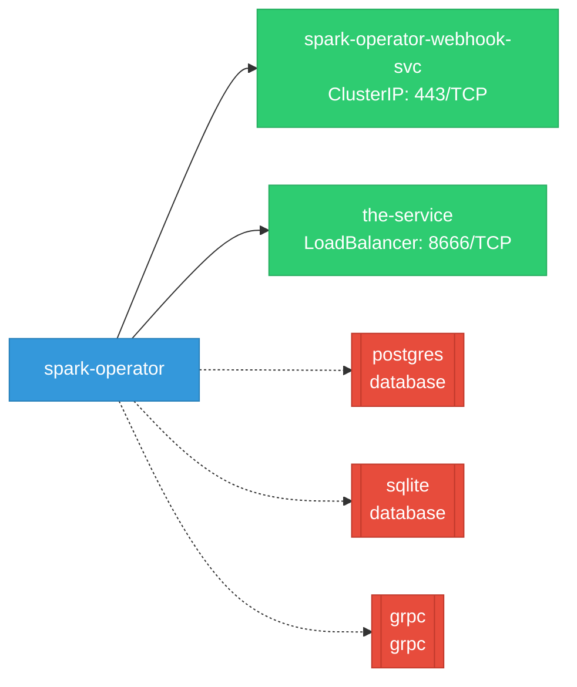
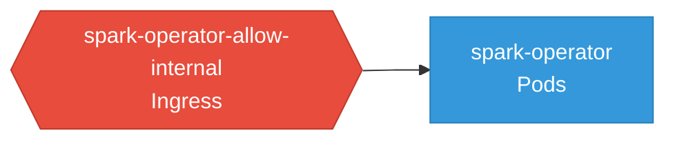

# spark-operator: Network

## Service Map

*2 unique services (3 total, duplicates from test fixtures collapsed).*

### Services

| Name | Type | Ports | Source |
|------|------|-------|--------|
| spark-operator-webhook-svc | ClusterIP | 443/TCP | [`kustomize:config/overlays/odh`](https://github.com/kubeflow/spark-operator/blob/e88e255636428e903c0beb8854a8a2870dedc2fd/kustomize:config/overlays/odh) |
| the-service | LoadBalancer | 8666/TCP | [`.gomod-cache/k8s.io/cli-runtime@v0.32.5/artifacts/kustomization/service.yaml`](https://github.com/kubeflow/spark-operator/blob/e88e255636428e903c0beb8854a8a2870dedc2fd/.gomod-cache/k8s.io/cli-runtime@v0.32.5/artifacts/kustomization/service.yaml) |
| the-service | LoadBalancer | 8666/TCP | [`.gopath-loader/pkg/mod/k8s.io/cli-runtime@v0.32.5/artifacts/kustomization/service.yaml`](https://github.com/kubeflow/spark-operator/blob/e88e255636428e903c0beb8854a8a2870dedc2fd/.gopath-loader/pkg/mod/k8s.io/cli-runtime@v0.32.5/artifacts/kustomization/service.yaml) |

### Ingress / Routing

| Kind | Name | Hosts | Paths | TLS | Source |
|------|------|-------|-------|-----|--------|
| Ingress | rbac-inferred |  |  | no | [`rbac/spark-operator-controller`](https://github.com/kubeflow/spark-operator/blob/e88e255636428e903c0beb8854a8a2870dedc2fd/rbac/spark-operator-controller) |

### Network Policies

| Name | Policy Types | Source |
|------|-------------|--------|
| spark-operator-allow-internal | Ingress | [`kustomize:config/overlays/odh`](https://github.com/kubeflow/spark-operator/blob/e88e255636428e903c0beb8854a8a2870dedc2fd/kustomize:config/overlays/odh) |

## Network Policy Graph

Visual representation of NetworkPolicy rules. Ingress rules show what traffic is allowed into pods, egress rules show what traffic is allowed out.

