# trainer

> **Architecture snapshot: 2026-05-19** (2026-05-19)

**Repository:** kubeflow/trainer  
**Analyzer:** arch-analyzer 0.2.0  
**Extracted:** 2026-05-19T04:07:27Z

## Summary

| Metric | Count |
|--------|-------|
| CRDs | 3 |
| Deployments | 20 |
| Services | 2 |
| Secrets | 2 |
| Cluster Roles | 8 |
| Controller Watches | 17 |

## Component Architecture

CRDs, controllers, and owned Kubernetes resources.

```mermaid
graph LR
    %% Component architecture for trainer

    classDef crd fill:#e74c3c,stroke:#c0392b,color:#fff
    classDef controller fill:#3498db,stroke:#2980b9,color:#fff
    classDef owned fill:#2ecc71,stroke:#27ae60,color:#fff
    classDef external fill:#95a5a6,stroke:#7f8c8d,color:#fff
    classDef dep fill:#f39c12,stroke:#e67e22,color:#fff

    subgraph controller["trainer Controller"]
        dep_1["controller-manager"]
        class dep_1 controller
        dep_2["controller-manager"]
        class dep_2 controller
        dep_3["controller-manager"]
        class dep_3 controller
        dep_4["controller-manager"]
        class dep_4 controller
        dep_5["controller-manager"]
        class dep_5 controller
        dep_6["controller-manager"]
        class dep_6 controller
        dep_7["controller-manager"]
        class dep_7 controller
        dep_8["controller-manager"]
        class dep_8 controller
        dep_9["controller-manager"]
        class dep_9 controller
        dep_10["controller-manager"]
        class dep_10 controller
        dep_11["controller-manager"]
        class dep_11 controller
        dep_12["controller-manager"]
        class dep_12 controller
        dep_13["controller-manager"]
        class dep_13 controller
        dep_14["controller-manager"]
        class dep_14 controller
        dep_15["kubeflow-trainer-controller-manager"]
        class dep_15 controller
        dep_16["kubeflow-trainer-controller-manager"]
        class dep_16 controller
        dep_17["kubeflow-trainer-controller-manager"]
        class dep_17 controller
        dep_18["kubeflow-trainer-controller-manager"]
        class dep_18 controller
        dep_19["peaks"]
        class dep_19 controller
        dep_20["peaks"]
        class dep_20 controller
    end

    crd_ClusterTrainingRuntime{{"ClusterTrainingRuntime\ntrainer.kubeflow.org/v1alpha1"}}
    class crd_ClusterTrainingRuntime crd
    crd_TrainJob{{"TrainJob\ntrainer.kubeflow.org/v1alpha1"}}
    class crd_TrainJob crd
    crd_TrainingRuntime{{"TrainingRuntime\ntrainer.kubeflow.org/v1alpha1"}}
    class crd_TrainingRuntime crd
    controller -->|"Owns"| owned_21["Job"]
    class owned_21 owned
    controller -->|"Owns"| owned_22["Service"]
    class owned_22 owned
    watch_23["Pod"] -->|"Watches"| controller
    class watch_23 external
```

### CRDs

| Group | Version | Kind | Scope | Fields | Validation Rules | Discovery | Source |
|-------|---------|------|-------|--------|------------------|-----------|--------|
| trainer.kubeflow.org | v1alpha1 | ClusterTrainingRuntime | Cluster | 1246 | 9 | YAML | [`manifests/base/crds/trainer.kubeflow.org_clustertrainingruntimes.yaml`](https://github.com/kubeflow/trainer/blob/4f5dac6692c032fe5257cd8209cb4653f6c3c51d/manifests/base/crds/trainer.kubeflow.org_clustertrainingruntimes.yaml) |
| trainer.kubeflow.org | v1alpha1 | TrainJob | Namespaced | 562 | 5 | YAML | [`manifests/base/crds/trainer.kubeflow.org_trainjobs.yaml`](https://github.com/kubeflow/trainer/blob/4f5dac6692c032fe5257cd8209cb4653f6c3c51d/manifests/base/crds/trainer.kubeflow.org_trainjobs.yaml) |
| trainer.kubeflow.org | v1alpha1 | TrainingRuntime | Namespaced | 1246 | 9 | YAML | [`manifests/base/crds/trainer.kubeflow.org_trainingruntimes.yaml`](https://github.com/kubeflow/trainer/blob/4f5dac6692c032fe5257cd8209cb4653f6c3c51d/manifests/base/crds/trainer.kubeflow.org_trainingruntimes.yaml) |

## Dependencies

### Key External Dependencies

| Module | Version |
|--------|---------|
| github.com/go-logr/logr | v1.4.2 |
| github.com/go-logr/logr | v1.4.2 |
| github.com/go-logr/logr | v1.3.0 |
| github.com/go-logr/logr | v1.4.1 |
| github.com/go-logr/logr | v1.4.1 |
| github.com/go-logr/logr | v1.4.2 |
| github.com/go-logr/logr | v1.4.3 |
| github.com/go-logr/logr | v1.4.2 |
| github.com/go-logr/logr | v1.4.3 |
| github.com/go-logr/logr | v1.4.2 |
| github.com/go-logr/logr | v1.3.0 |
| github.com/go-logr/logr | v1.4.2 |
| github.com/go-logr/logr | v1.4.2 |
| github.com/go-logr/logr | v1.4.3 |
| github.com/go-logr/logr | v1.4.2 |
| github.com/go-logr/zapr | v1.3.0 |
| github.com/go-logr/zapr | v1.3.0 |
| github.com/go-logr/zapr | v1.3.0 |
| github.com/go-logr/zapr | v1.3.0 |
| github.com/prometheus/client_golang | v1.22.0 |
| github.com/prometheus/client_golang | v1.23.2 |
| github.com/prometheus/client_golang | v1.22.0 |
| github.com/prometheus/client_golang | v1.22.0 |
| github.com/prometheus/client_golang | v1.22.0 |
| github.com/prometheus/client_golang | v1.23.2 |
| github.com/prometheus/client_model | v0.6.2 |
| github.com/prometheus/client_model | v0.6.2 |
| github.com/prometheus/client_model | v0.6.1 |
| github.com/prometheus/client_model | v0.6.1 |
| github.com/prometheus/client_model | v0.6.2 |
| github.com/prometheus/client_model | v0.6.1 |
| github.com/prometheus/client_model | v0.6.2 |
| github.com/prometheus/client_model | v0.6.1 |
| github.com/prometheus/common | v0.66.1 |
| github.com/prometheus/common | v0.62.0 |
| github.com/prometheus/common | v0.66.1 |
| github.com/prometheus/common | v0.62.0 |
| github.com/prometheus/procfs | v0.15.1 |
| github.com/prometheus/procfs | v0.16.1 |
| github.com/prometheus/procfs | v0.15.1 |
| github.com/prometheus/procfs | v0.16.1 |
| google.golang.org/grpc | v1.72.1 |
| google.golang.org/grpc | v1.72.1 |
| k8s.io/api | v0.34.1 |
| k8s.io/api | v0.34.1 |
| k8s.io/api | v0.34.1 |
| k8s.io/api | v0.34.1 |
| k8s.io/api | v0.34.1 |
| k8s.io/api | v0.33.4 |
| k8s.io/api | v0.34.1 |
| k8s.io/api | v0.34.1 |
| k8s.io/api | v0.34.1 |
| k8s.io/api | v0.34.1 |
| k8s.io/api | v0.34.1 |
| k8s.io/api | v0.34.1 |
| k8s.io/api | v0.34.1 |
| k8s.io/api | v0.34.1 |
| k8s.io/api | v0.34.1 |
| k8s.io/api | v0.33.4 |
| k8s.io/api | v0.34.1 |
| k8s.io/apiextensions-apiserver | v0.33.4 |
| k8s.io/apiextensions-apiserver | v0.34.1 |
| k8s.io/apiextensions-apiserver | v0.34.1 |
| k8s.io/apiextensions-apiserver | v0.33.4 |
| k8s.io/apimachinery | v0.34.1 |
| k8s.io/apimachinery | v0.34.1 |
| k8s.io/apimachinery | v0.34.1 |
| k8s.io/apimachinery | v0.34.1 |
| k8s.io/apimachinery | v0.34.1 |
| k8s.io/apimachinery | v0.34.1 |
| k8s.io/apimachinery | v0.34.1 |
| k8s.io/apimachinery | v0.34.1 |
| k8s.io/apimachinery | v0.33.4 |
| k8s.io/apimachinery | v0.34.1 |
| k8s.io/apimachinery | v0.34.1 |
| k8s.io/apimachinery | v0.34.1 |
| k8s.io/apimachinery | v0.34.1 |
| k8s.io/apimachinery | v0.34.1 |
| k8s.io/apimachinery | v0.34.1 |
| k8s.io/apimachinery | v0.34.1 |
| k8s.io/apimachinery | v0.34.1 |
| k8s.io/apimachinery | v0.34.1 |
| k8s.io/apimachinery | v0.34.1 |
| k8s.io/apimachinery | v0.34.1 |
| k8s.io/apimachinery | v0.34.1 |
| k8s.io/apimachinery | v0.33.4 |
| k8s.io/apimachinery | v0.34.1 |
| k8s.io/apiserver | v0.34.1 |
| k8s.io/apiserver | v0.34.1 |
| k8s.io/apiserver | v0.34.1 |
| k8s.io/apiserver | v0.34.1 |
| k8s.io/apiserver | v0.34.1 |
| k8s.io/apiserver | v0.34.1 |
| k8s.io/apiserver | v0.34.1 |
| k8s.io/apiserver | v0.34.1 |
| k8s.io/apiserver | v0.34.1 |
| k8s.io/apiserver | v0.34.1 |
| k8s.io/client-go | v0.34.1 |
| k8s.io/client-go | v0.33.4 |
| k8s.io/client-go | v0.34.1 |
| k8s.io/client-go | v0.34.1 |
| k8s.io/client-go | v0.34.1 |
| k8s.io/client-go | v0.34.1 |
| k8s.io/client-go | v0.34.1 |
| k8s.io/client-go | v0.34.1 |
| k8s.io/client-go | v0.34.1 |
| k8s.io/client-go | v0.34.1 |
| k8s.io/client-go | v0.34.1 |
| k8s.io/client-go | v0.34.1 |
| k8s.io/client-go | v0.33.4 |
| k8s.io/client-go | v0.34.1 |
| k8s.io/client-go | v0.34.1 |
| k8s.io/client-go | v0.34.1 |
| k8s.io/client-go | v0.34.1 |
| sigs.k8s.io/controller-runtime | v0.22.3 |
| sigs.k8s.io/controller-runtime | v0.22.3 |
| sigs.k8s.io/controller-runtime | v0.21.0 |
| sigs.k8s.io/controller-runtime | v0.21.0 |
| sigs.k8s.io/controller-runtime | v0.22.1 |
| sigs.k8s.io/controller-runtime | v0.22.3 |
| sigs.k8s.io/controller-runtime | v0.22.1 |

