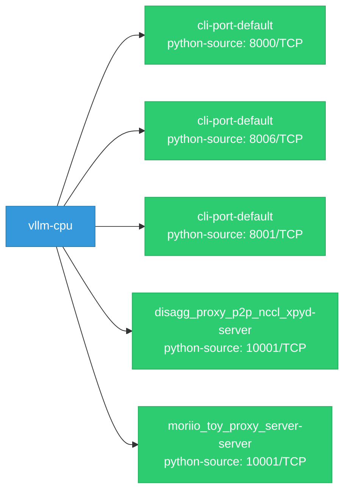

# vllm-cpu: Network

## Service Map

### Services

| Name | Type | Ports | Source |
|------|------|-------|--------|
| cli-port-default | python-source | 8000/TCP | [`benchmarks/benchmark_serving_structured_output.py:869`](https://github.com/red-hat-data-services/vllm-cpu/blob/4a21dc6fdc261bc6cd2b1200af5c3a495c5fc29b/benchmarks/benchmark_serving_structured_output.py#L869) |
| cli-port-default | python-source | 8006/TCP | [`examples/online_serving/elastic_ep/scale.py:41`](https://github.com/red-hat-data-services/vllm-cpu/blob/4a21dc6fdc261bc6cd2b1200af5c3a495c5fc29b/examples/online_serving/elastic_ep/scale.py#L41) |
| cli-port-default | python-source | 8001/TCP | [`examples/online_serving/gradio_openai_chatbot_webserver.py:75`](https://github.com/red-hat-data-services/vllm-cpu/blob/4a21dc6fdc261bc6cd2b1200af5c3a495c5fc29b/examples/online_serving/gradio_openai_chatbot_webserver.py#L75) |
| disagg_proxy_p2p_nccl_xpyd-server | python-source | 10001/TCP | [`examples/online_serving/disaggregated_serving_p2p_nccl_xpyd/disagg_proxy_p2p_nccl_xpyd.py:189`](https://github.com/red-hat-data-services/vllm-cpu/blob/4a21dc6fdc261bc6cd2b1200af5c3a495c5fc29b/examples/online_serving/disaggregated_serving_p2p_nccl_xpyd/disagg_proxy_p2p_nccl_xpyd.py#L189) |
| moriio_toy_proxy_server-server | python-source | 10001/TCP | [`examples/online_serving/disaggregated_serving/moriio_toy_proxy_server.py:305`](https://github.com/red-hat-data-services/vllm-cpu/blob/4a21dc6fdc261bc6cd2b1200af5c3a495c5fc29b/examples/online_serving/disaggregated_serving/moriio_toy_proxy_server.py#L305) |

!!! warning "No Network Policies"
    No NetworkPolicy resources found. All pod-to-pod traffic is allowed by default.

