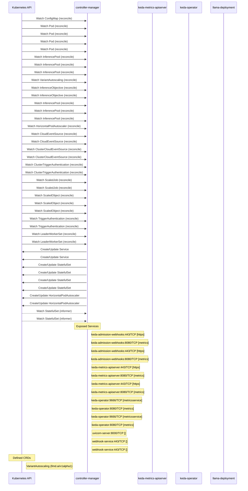

# workload-variant-autoscaler: Dataflow

## Controller Watches

Kubernetes resources this controller monitors for changes. Each watch triggers reconciliation when the watched resource is created, updated, or deleted.

| Type | GVK | Source |
|------|-----|--------|
| For | /v1/ConfigMap | [`internal/controller/configmap_reconciler.go:101`](https://github.com/llm-d/workload-variant-autoscaler/blob/cf1724aa84bcc891d374400021a37dee3384c92f/internal/controller/configmap_reconciler.go#L101) |
| For | /v1/Pod | [`.gomod-cache/sigs.k8s.io/lws@v0.8.0/pkg/controllers/pod_controller.go:420`](https://github.com/llm-d/workload-variant-autoscaler/blob/cf1724aa84bcc891d374400021a37dee3384c92f/.gomod-cache/sigs.k8s.io/lws@v0.8.0/pkg/controllers/pod_controller.go#L420) |
| For | /v1/Pod | [`.gopath-loader/pkg/mod/sigs.k8s.io/lws@v0.8.0/pkg/controllers/pod_controller.go:420`](https://github.com/llm-d/workload-variant-autoscaler/blob/cf1724aa84bcc891d374400021a37dee3384c92f/.gopath-loader/pkg/mod/sigs.k8s.io/lws@v0.8.0/pkg/controllers/pod_controller.go#L420) |
| For | /v1/Pod | [`.gomod-cache/sigs.k8s.io/gateway-api-inference-extension@v1.2.1/pkg/epp/controller/pod_reconciler.go:86`](https://github.com/llm-d/workload-variant-autoscaler/blob/cf1724aa84bcc891d374400021a37dee3384c92f/.gomod-cache/sigs.k8s.io/gateway-api-inference-extension@v1.2.1/pkg/epp/controller/pod_reconciler.go#L86) |
| For | /v1/Pod | [`.gopath-loader/pkg/mod/sigs.k8s.io/gateway-api-inference-extension@v1.2.1/pkg/epp/controller/pod_reconciler.go:86`](https://github.com/llm-d/workload-variant-autoscaler/blob/cf1724aa84bcc891d374400021a37dee3384c92f/.gopath-loader/pkg/mod/sigs.k8s.io/gateway-api-inference-extension@v1.2.1/pkg/epp/controller/pod_reconciler.go#L86) |
| For | api/v1/InferencePool | [`.gomod-cache/sigs.k8s.io/gateway-api-inference-extension@v1.2.1/pkg/epp/controller/inferencepool_reconciler.go:105`](https://github.com/llm-d/workload-variant-autoscaler/blob/cf1724aa84bcc891d374400021a37dee3384c92f/.gomod-cache/sigs.k8s.io/gateway-api-inference-extension@v1.2.1/pkg/epp/controller/inferencepool_reconciler.go#L105) |
| For | api/v1/InferencePool | [`internal/controller/inferencepool_reconciler.go:113`](https://github.com/llm-d/workload-variant-autoscaler/blob/cf1724aa84bcc891d374400021a37dee3384c92f/internal/controller/inferencepool_reconciler.go#L113) |
| For | api/v1/InferencePool | [`.gopath-loader/pkg/mod/sigs.k8s.io/gateway-api-inference-extension@v1.2.1/pkg/epp/controller/inferencepool_reconciler.go:105`](https://github.com/llm-d/workload-variant-autoscaler/blob/cf1724aa84bcc891d374400021a37dee3384c92f/.gopath-loader/pkg/mod/sigs.k8s.io/gateway-api-inference-extension@v1.2.1/pkg/epp/controller/inferencepool_reconciler.go#L105) |
| For | api/v1alpha1/VariantAutoscaling | [`internal/controller/variantautoscaling_controller.go:378`](https://github.com/llm-d/workload-variant-autoscaler/blob/cf1724aa84bcc891d374400021a37dee3384c92f/internal/controller/variantautoscaling_controller.go#L378) |
| For | apix/v1alpha2/InferenceObjective | [`.gomod-cache/sigs.k8s.io/gateway-api-inference-extension@v1.2.1/pkg/epp/controller/inferenceobjective_reconciler.go:73`](https://github.com/llm-d/workload-variant-autoscaler/blob/cf1724aa84bcc891d374400021a37dee3384c92f/.gomod-cache/sigs.k8s.io/gateway-api-inference-extension@v1.2.1/pkg/epp/controller/inferenceobjective_reconciler.go#L73) |
| For | apix/v1alpha2/InferenceObjective | [`.gopath-loader/pkg/mod/sigs.k8s.io/gateway-api-inference-extension@v1.2.1/pkg/epp/controller/inferenceobjective_reconciler.go:73`](https://github.com/llm-d/workload-variant-autoscaler/blob/cf1724aa84bcc891d374400021a37dee3384c92f/.gopath-loader/pkg/mod/sigs.k8s.io/gateway-api-inference-extension@v1.2.1/pkg/epp/controller/inferenceobjective_reconciler.go#L73) |
| For | apix/v1alpha2/InferencePool | [`.gopath-loader/pkg/mod/sigs.k8s.io/gateway-api-inference-extension@v1.2.1/pkg/epp/controller/inferencepool_reconciler.go:101`](https://github.com/llm-d/workload-variant-autoscaler/blob/cf1724aa84bcc891d374400021a37dee3384c92f/.gopath-loader/pkg/mod/sigs.k8s.io/gateway-api-inference-extension@v1.2.1/pkg/epp/controller/inferencepool_reconciler.go#L101) |
| For | apix/v1alpha2/InferencePool | [`.gomod-cache/sigs.k8s.io/gateway-api-inference-extension@v1.2.1/pkg/epp/controller/inferencepool_reconciler.go:101`](https://github.com/llm-d/workload-variant-autoscaler/blob/cf1724aa84bcc891d374400021a37dee3384c92f/.gomod-cache/sigs.k8s.io/gateway-api-inference-extension@v1.2.1/pkg/epp/controller/inferencepool_reconciler.go#L101) |
| For | apix/v1alpha2/InferencePool | [`internal/controller/inferencepool_reconciler.go:109`](https://github.com/llm-d/workload-variant-autoscaler/blob/cf1724aa84bcc891d374400021a37dee3384c92f/internal/controller/inferencepool_reconciler.go#L109) |
| For | autoscaling/v2/HorizontalPodAutoscaler | [`internal/controller/hpa_reconciler.go:67`](https://github.com/llm-d/workload-variant-autoscaler/blob/cf1724aa84bcc891d374400021a37dee3384c92f/internal/controller/hpa_reconciler.go#L67) |
| For | eventing/v1alpha1/CloudEventSource | [`.gopath-loader/pkg/mod/github.com/kedacore/keda/v2@v2.18.0/controllers/eventing/cloudeventsource_controller.go:70`](https://github.com/llm-d/workload-variant-autoscaler/blob/cf1724aa84bcc891d374400021a37dee3384c92f/.gopath-loader/pkg/mod/github.com/kedacore/keda/v2@v2.18.0/controllers/eventing/cloudeventsource_controller.go#L70) |
| For | eventing/v1alpha1/CloudEventSource | [`.gomod-cache/github.com/kedacore/keda/v2@v2.18.0/controllers/eventing/cloudeventsource_controller.go:70`](https://github.com/llm-d/workload-variant-autoscaler/blob/cf1724aa84bcc891d374400021a37dee3384c92f/.gomod-cache/github.com/kedacore/keda/v2@v2.18.0/controllers/eventing/cloudeventsource_controller.go#L70) |
| For | eventing/v1alpha1/ClusterCloudEventSource | [`.gopath-loader/pkg/mod/github.com/kedacore/keda/v2@v2.18.0/controllers/eventing/clustercloudeventsource_controller.go:69`](https://github.com/llm-d/workload-variant-autoscaler/blob/cf1724aa84bcc891d374400021a37dee3384c92f/.gopath-loader/pkg/mod/github.com/kedacore/keda/v2@v2.18.0/controllers/eventing/clustercloudeventsource_controller.go#L69) |
| For | eventing/v1alpha1/ClusterCloudEventSource | [`.gomod-cache/github.com/kedacore/keda/v2@v2.18.0/controllers/eventing/clustercloudeventsource_controller.go:69`](https://github.com/llm-d/workload-variant-autoscaler/blob/cf1724aa84bcc891d374400021a37dee3384c92f/.gomod-cache/github.com/kedacore/keda/v2@v2.18.0/controllers/eventing/clustercloudeventsource_controller.go#L69) |
| For | keda/v1alpha1/ClusterTriggerAuthentication | [`.gopath-loader/pkg/mod/github.com/kedacore/keda/v2@v2.18.0/controllers/keda/clustertriggerauthentication_controller.go:98`](https://github.com/llm-d/workload-variant-autoscaler/blob/cf1724aa84bcc891d374400021a37dee3384c92f/.gopath-loader/pkg/mod/github.com/kedacore/keda/v2@v2.18.0/controllers/keda/clustertriggerauthentication_controller.go#L98) |
| For | keda/v1alpha1/ClusterTriggerAuthentication | [`.gomod-cache/github.com/kedacore/keda/v2@v2.18.0/controllers/keda/clustertriggerauthentication_controller.go:98`](https://github.com/llm-d/workload-variant-autoscaler/blob/cf1724aa84bcc891d374400021a37dee3384c92f/.gomod-cache/github.com/kedacore/keda/v2@v2.18.0/controllers/keda/clustertriggerauthentication_controller.go#L98) |
| For | keda/v1alpha1/ScaledJob | [`.gopath-loader/pkg/mod/github.com/kedacore/keda/v2@v2.18.0/controllers/keda/scaledjob_controller.go:91`](https://github.com/llm-d/workload-variant-autoscaler/blob/cf1724aa84bcc891d374400021a37dee3384c92f/.gopath-loader/pkg/mod/github.com/kedacore/keda/v2@v2.18.0/controllers/keda/scaledjob_controller.go#L91) |
| For | keda/v1alpha1/ScaledJob | [`.gomod-cache/github.com/kedacore/keda/v2@v2.18.0/controllers/keda/scaledjob_controller.go:91`](https://github.com/llm-d/workload-variant-autoscaler/blob/cf1724aa84bcc891d374400021a37dee3384c92f/.gomod-cache/github.com/kedacore/keda/v2@v2.18.0/controllers/keda/scaledjob_controller.go#L91) |
| For | keda/v1alpha1/ScaledObject | [`internal/controller/scaledobject_reconciler.go:68`](https://github.com/llm-d/workload-variant-autoscaler/blob/cf1724aa84bcc891d374400021a37dee3384c92f/internal/controller/scaledobject_reconciler.go#L68) |
| For | keda/v1alpha1/ScaledObject | [`.gomod-cache/github.com/kedacore/keda/v2@v2.18.0/controllers/keda/scaledobject_controller.go:130`](https://github.com/llm-d/workload-variant-autoscaler/blob/cf1724aa84bcc891d374400021a37dee3384c92f/.gomod-cache/github.com/kedacore/keda/v2@v2.18.0/controllers/keda/scaledobject_controller.go#L130) |
| For | keda/v1alpha1/ScaledObject | [`.gopath-loader/pkg/mod/github.com/kedacore/keda/v2@v2.18.0/controllers/keda/scaledobject_controller.go:130`](https://github.com/llm-d/workload-variant-autoscaler/blob/cf1724aa84bcc891d374400021a37dee3384c92f/.gopath-loader/pkg/mod/github.com/kedacore/keda/v2@v2.18.0/controllers/keda/scaledobject_controller.go#L130) |
| For | keda/v1alpha1/TriggerAuthentication | [`.gomod-cache/github.com/kedacore/keda/v2@v2.18.0/controllers/keda/triggerauthentication_controller.go:99`](https://github.com/llm-d/workload-variant-autoscaler/blob/cf1724aa84bcc891d374400021a37dee3384c92f/.gomod-cache/github.com/kedacore/keda/v2@v2.18.0/controllers/keda/triggerauthentication_controller.go#L99) |
| For | keda/v1alpha1/TriggerAuthentication | [`.gopath-loader/pkg/mod/github.com/kedacore/keda/v2@v2.18.0/controllers/keda/triggerauthentication_controller.go:99`](https://github.com/llm-d/workload-variant-autoscaler/blob/cf1724aa84bcc891d374400021a37dee3384c92f/.gopath-loader/pkg/mod/github.com/kedacore/keda/v2@v2.18.0/controllers/keda/triggerauthentication_controller.go#L99) |
| For | leaderworkerset/v1/LeaderWorkerSet | [`.gopath-loader/pkg/mod/sigs.k8s.io/lws@v0.8.0/pkg/controllers/leaderworkerset_controller.go:205`](https://github.com/llm-d/workload-variant-autoscaler/blob/cf1724aa84bcc891d374400021a37dee3384c92f/.gopath-loader/pkg/mod/sigs.k8s.io/lws@v0.8.0/pkg/controllers/leaderworkerset_controller.go#L205) |
| For | leaderworkerset/v1/LeaderWorkerSet | [`.gomod-cache/sigs.k8s.io/lws@v0.8.0/pkg/controllers/leaderworkerset_controller.go:205`](https://github.com/llm-d/workload-variant-autoscaler/blob/cf1724aa84bcc891d374400021a37dee3384c92f/.gomod-cache/sigs.k8s.io/lws@v0.8.0/pkg/controllers/leaderworkerset_controller.go#L205) |
| Owns | /v1/Service | [`.gopath-loader/pkg/mod/sigs.k8s.io/lws@v0.8.0/pkg/controllers/leaderworkerset_controller.go:207`](https://github.com/llm-d/workload-variant-autoscaler/blob/cf1724aa84bcc891d374400021a37dee3384c92f/.gopath-loader/pkg/mod/sigs.k8s.io/lws@v0.8.0/pkg/controllers/leaderworkerset_controller.go#L207) |
| Owns | /v1/Service | [`.gomod-cache/sigs.k8s.io/lws@v0.8.0/pkg/controllers/leaderworkerset_controller.go:207`](https://github.com/llm-d/workload-variant-autoscaler/blob/cf1724aa84bcc891d374400021a37dee3384c92f/.gomod-cache/sigs.k8s.io/lws@v0.8.0/pkg/controllers/leaderworkerset_controller.go#L207) |
| Owns | apps/v1/StatefulSet | [`.gopath-loader/pkg/mod/sigs.k8s.io/lws@v0.8.0/pkg/controllers/pod_controller.go:431`](https://github.com/llm-d/workload-variant-autoscaler/blob/cf1724aa84bcc891d374400021a37dee3384c92f/.gopath-loader/pkg/mod/sigs.k8s.io/lws@v0.8.0/pkg/controllers/pod_controller.go#L431) |
| Owns | apps/v1/StatefulSet | [`.gopath-loader/pkg/mod/sigs.k8s.io/lws@v0.8.0/pkg/controllers/leaderworkerset_controller.go:206`](https://github.com/llm-d/workload-variant-autoscaler/blob/cf1724aa84bcc891d374400021a37dee3384c92f/.gopath-loader/pkg/mod/sigs.k8s.io/lws@v0.8.0/pkg/controllers/leaderworkerset_controller.go#L206) |
| Owns | apps/v1/StatefulSet | [`.gomod-cache/sigs.k8s.io/lws@v0.8.0/pkg/controllers/pod_controller.go:431`](https://github.com/llm-d/workload-variant-autoscaler/blob/cf1724aa84bcc891d374400021a37dee3384c92f/.gomod-cache/sigs.k8s.io/lws@v0.8.0/pkg/controllers/pod_controller.go#L431) |
| Owns | apps/v1/StatefulSet | [`.gomod-cache/sigs.k8s.io/lws@v0.8.0/pkg/controllers/leaderworkerset_controller.go:206`](https://github.com/llm-d/workload-variant-autoscaler/blob/cf1724aa84bcc891d374400021a37dee3384c92f/.gomod-cache/sigs.k8s.io/lws@v0.8.0/pkg/controllers/leaderworkerset_controller.go#L206) |
| Owns | autoscaling/v2/HorizontalPodAutoscaler | [`.gopath-loader/pkg/mod/github.com/kedacore/keda/v2@v2.18.0/controllers/keda/scaledobject_controller.go:144`](https://github.com/llm-d/workload-variant-autoscaler/blob/cf1724aa84bcc891d374400021a37dee3384c92f/.gopath-loader/pkg/mod/github.com/kedacore/keda/v2@v2.18.0/controllers/keda/scaledobject_controller.go#L144) |
| Owns | autoscaling/v2/HorizontalPodAutoscaler | [`.gomod-cache/github.com/kedacore/keda/v2@v2.18.0/controllers/keda/scaledobject_controller.go:144`](https://github.com/llm-d/workload-variant-autoscaler/blob/cf1724aa84bcc891d374400021a37dee3384c92f/.gomod-cache/github.com/kedacore/keda/v2@v2.18.0/controllers/keda/scaledobject_controller.go#L144) |
| Watches | apps/v1/StatefulSet | [`.gopath-loader/pkg/mod/sigs.k8s.io/lws@v0.8.0/pkg/controllers/leaderworkerset_controller.go:208`](https://github.com/llm-d/workload-variant-autoscaler/blob/cf1724aa84bcc891d374400021a37dee3384c92f/.gopath-loader/pkg/mod/sigs.k8s.io/lws@v0.8.0/pkg/controllers/leaderworkerset_controller.go#L208) |
| Watches | apps/v1/StatefulSet | [`.gomod-cache/sigs.k8s.io/lws@v0.8.0/pkg/controllers/leaderworkerset_controller.go:208`](https://github.com/llm-d/workload-variant-autoscaler/blob/cf1724aa84bcc891d374400021a37dee3384c92f/.gomod-cache/sigs.k8s.io/lws@v0.8.0/pkg/controllers/leaderworkerset_controller.go#L208) |

### Programmatic Resource Operations

| Verb | Kind | Group | Condition |
|------|------|-------|----------|
| patch | VariantAutoscaling | api |  |

## Reconciliation Flow

How the controller interacts with the Kubernetes API during reconciliation.

### Webhooks

| Name | Type | Path | Failure Policy | Service | Overlays | Enable Condition | Sources |
|------|------|------|----------------|---------|----------|------------------|----------|
| mleaderworkerset.kb.io | mutating | /mutate-leaderworkerset-x-k8s-io-v1-leaderworkerset | fail |  |  |  | [`.gomod-cache/sigs.k8s.io/lws@v0.8.0/pkg/webhooks/leaderworkerset_webhook.go`](https://github.com/llm-d/workload-variant-autoscaler/blob/cf1724aa84bcc891d374400021a37dee3384c92f/.gomod-cache/sigs.k8s.io/lws@v0.8.0/pkg/webhooks/leaderworkerset_webhook.go), [`.gomod-cache/sigs.k8s.io/lws@v0.8.0/pkg/webhooks/leaderworkerset_webhook.go`](https://github.com/llm-d/workload-variant-autoscaler/blob/cf1724aa84bcc891d374400021a37dee3384c92f/.gomod-cache/sigs.k8s.io/lws@v0.8.0/pkg/webhooks/leaderworkerset_webhook.go) |
| mleaderworkerset.kb.io | mutating | /mutate-leaderworkerset-x-k8s-io-v1-leaderworkerset | fail |  |  |  | [`.gopath-loader/pkg/mod/sigs.k8s.io/lws@v0.8.0/pkg/webhooks/leaderworkerset_webhook.go`](https://github.com/llm-d/workload-variant-autoscaler/blob/cf1724aa84bcc891d374400021a37dee3384c92f/.gopath-loader/pkg/mod/sigs.k8s.io/lws@v0.8.0/pkg/webhooks/leaderworkerset_webhook.go), [`.gopath-loader/pkg/mod/sigs.k8s.io/lws@v0.8.0/pkg/webhooks/leaderworkerset_webhook.go`](https://github.com/llm-d/workload-variant-autoscaler/blob/cf1724aa84bcc891d374400021a37dee3384c92f/.gopath-loader/pkg/mod/sigs.k8s.io/lws@v0.8.0/pkg/webhooks/leaderworkerset_webhook.go) |
| mpod.kb.io | mutating | /mutate--v1-pod | fail |  |  |  | [`.gomod-cache/sigs.k8s.io/lws@v0.8.0/pkg/webhooks/pod_webhook.go`](https://github.com/llm-d/workload-variant-autoscaler/blob/cf1724aa84bcc891d374400021a37dee3384c92f/.gomod-cache/sigs.k8s.io/lws@v0.8.0/pkg/webhooks/pod_webhook.go), [`.gomod-cache/sigs.k8s.io/lws@v0.8.0/pkg/webhooks/pod_webhook.go`](https://github.com/llm-d/workload-variant-autoscaler/blob/cf1724aa84bcc891d374400021a37dee3384c92f/.gomod-cache/sigs.k8s.io/lws@v0.8.0/pkg/webhooks/pod_webhook.go) |
| mpod.kb.io | mutating | /mutate--v1-pod | fail |  |  |  | [`.gopath-loader/pkg/mod/sigs.k8s.io/lws@v0.8.0/pkg/webhooks/pod_webhook.go`](https://github.com/llm-d/workload-variant-autoscaler/blob/cf1724aa84bcc891d374400021a37dee3384c92f/.gopath-loader/pkg/mod/sigs.k8s.io/lws@v0.8.0/pkg/webhooks/pod_webhook.go), [`.gopath-loader/pkg/mod/sigs.k8s.io/lws@v0.8.0/pkg/webhooks/pod_webhook.go`](https://github.com/llm-d/workload-variant-autoscaler/blob/cf1724aa84bcc891d374400021a37dee3384c92f/.gopath-loader/pkg/mod/sigs.k8s.io/lws@v0.8.0/pkg/webhooks/pod_webhook.go) |
| vleaderworkerset.kb.io | validating | /validate-leaderworkerset-x-k8s-io-v1-leaderworkerset | fail |  |  |  | [`.gomod-cache/sigs.k8s.io/lws@v0.8.0/pkg/webhooks/leaderworkerset_webhook.go`](https://github.com/llm-d/workload-variant-autoscaler/blob/cf1724aa84bcc891d374400021a37dee3384c92f/.gomod-cache/sigs.k8s.io/lws@v0.8.0/pkg/webhooks/leaderworkerset_webhook.go), [`.gomod-cache/sigs.k8s.io/lws@v0.8.0/pkg/webhooks/leaderworkerset_webhook.go`](https://github.com/llm-d/workload-variant-autoscaler/blob/cf1724aa84bcc891d374400021a37dee3384c92f/.gomod-cache/sigs.k8s.io/lws@v0.8.0/pkg/webhooks/leaderworkerset_webhook.go) |
| vleaderworkerset.kb.io | validating | /validate-leaderworkerset-x-k8s-io-v1-leaderworkerset | fail |  |  |  | [`.gopath-loader/pkg/mod/sigs.k8s.io/lws@v0.8.0/pkg/webhooks/leaderworkerset_webhook.go`](https://github.com/llm-d/workload-variant-autoscaler/blob/cf1724aa84bcc891d374400021a37dee3384c92f/.gopath-loader/pkg/mod/sigs.k8s.io/lws@v0.8.0/pkg/webhooks/leaderworkerset_webhook.go), [`.gopath-loader/pkg/mod/sigs.k8s.io/lws@v0.8.0/pkg/webhooks/leaderworkerset_webhook.go`](https://github.com/llm-d/workload-variant-autoscaler/blob/cf1724aa84bcc891d374400021a37dee3384c92f/.gopath-loader/pkg/mod/sigs.k8s.io/lws@v0.8.0/pkg/webhooks/leaderworkerset_webhook.go) |
| vpod.kb.io | validating | /validate--v1-pod | fail |  |  |  | [`.gomod-cache/sigs.k8s.io/lws@v0.8.0/pkg/webhooks/pod_webhook.go`](https://github.com/llm-d/workload-variant-autoscaler/blob/cf1724aa84bcc891d374400021a37dee3384c92f/.gomod-cache/sigs.k8s.io/lws@v0.8.0/pkg/webhooks/pod_webhook.go), [`.gomod-cache/sigs.k8s.io/lws@v0.8.0/pkg/webhooks/pod_webhook.go`](https://github.com/llm-d/workload-variant-autoscaler/blob/cf1724aa84bcc891d374400021a37dee3384c92f/.gomod-cache/sigs.k8s.io/lws@v0.8.0/pkg/webhooks/pod_webhook.go) |
| vpod.kb.io | validating | /validate--v1-pod | fail |  |  |  | [`.gopath-loader/pkg/mod/sigs.k8s.io/lws@v0.8.0/pkg/webhooks/pod_webhook.go`](https://github.com/llm-d/workload-variant-autoscaler/blob/cf1724aa84bcc891d374400021a37dee3384c92f/.gopath-loader/pkg/mod/sigs.k8s.io/lws@v0.8.0/pkg/webhooks/pod_webhook.go), [`.gopath-loader/pkg/mod/sigs.k8s.io/lws@v0.8.0/pkg/webhooks/pod_webhook.go`](https://github.com/llm-d/workload-variant-autoscaler/blob/cf1724aa84bcc891d374400021a37dee3384c92f/.gopath-loader/pkg/mod/sigs.k8s.io/lws@v0.8.0/pkg/webhooks/pod_webhook.go) |

### HTTP Endpoints

| Method | Path | Source |
|--------|------|--------|
| * | / | [`.gopath-loader/pkg/mod/golang.org/toolchain@v0.0.1-go1.25.0.linux-amd64/src/cmd/trace/main.go:188`](https://github.com/llm-d/workload-variant-autoscaler/blob/cf1724aa84bcc891d374400021a37dee3384c92f/.gopath-loader/pkg/mod/golang.org/toolchain@v0.0.1-go1.25.0.linux-amd64/src/cmd/trace/main.go#L188) |
| * | / | [`.gopath-loader/pkg/mod/golang.org/toolchain@v0.0.1-go1.25.0.linux-amd64/src/net/http/triv.go:130`](https://github.com/llm-d/workload-variant-autoscaler/blob/cf1724aa84bcc891d374400021a37dee3384c92f/.gopath-loader/pkg/mod/golang.org/toolchain@v0.0.1-go1.25.0.linux-amd64/src/net/http/triv.go#L130) |
| * | / | [`.gomod-cache/golang.org/toolchain@v0.0.1-go1.25.0.linux-amd64/src/net/http/triv.go:130`](https://github.com/llm-d/workload-variant-autoscaler/blob/cf1724aa84bcc891d374400021a37dee3384c92f/.gomod-cache/golang.org/toolchain@v0.0.1-go1.25.0.linux-amd64/src/net/http/triv.go#L130) |
| * | / | [`.gomod-cache/github.com/google/pprof@v0.0.0-20260115054156-294ebfa9ad83/internal/driver/webui.go:214`](https://github.com/llm-d/workload-variant-autoscaler/blob/cf1724aa84bcc891d374400021a37dee3384c92f/.gomod-cache/github.com/google/pprof@v0.0.0-20260115054156-294ebfa9ad83/internal/driver/webui.go#L214) |
| * | / | [`.gomod-cache/golang.org/x/net@v0.49.0/webdav/litmus_test_server.go:83`](https://github.com/llm-d/workload-variant-autoscaler/blob/cf1724aa84bcc891d374400021a37dee3384c92f/.gomod-cache/golang.org/x/net@v0.49.0/webdav/litmus_test_server.go#L83) |
| * | / | [`.gomod-cache/golang.org/x/tools@v0.41.0/cmd/present/dir.go:23`](https://github.com/llm-d/workload-variant-autoscaler/blob/cf1724aa84bcc891d374400021a37dee3384c92f/.gomod-cache/golang.org/x/tools@v0.41.0/cmd/present/dir.go#L23) |
| * | / | [`.gomod-cache/golang.org/x/tools@v0.41.0/go/types/internal/play/play.go:47`](https://github.com/llm-d/workload-variant-autoscaler/blob/cf1724aa84bcc891d374400021a37dee3384c92f/.gomod-cache/golang.org/x/tools@v0.41.0/go/types/internal/play/play.go#L47) |
| * | / | [`.gomod-cache/knative.dev/pkg@v0.0.0-20250326102644-9f3e60a9244c/webhook/webhook.go:220`](https://github.com/llm-d/workload-variant-autoscaler/blob/cf1724aa84bcc891d374400021a37dee3384c92f/.gomod-cache/knative.dev/pkg@v0.0.0-20250326102644-9f3e60a9244c/webhook/webhook.go#L220) |
| * | / | [`.gopath-loader/pkg/mod/github.com/google/pprof@v0.0.0-20260115054156-294ebfa9ad83/internal/driver/webui.go:214`](https://github.com/llm-d/workload-variant-autoscaler/blob/cf1724aa84bcc891d374400021a37dee3384c92f/.gopath-loader/pkg/mod/github.com/google/pprof@v0.0.0-20260115054156-294ebfa9ad83/internal/driver/webui.go#L214) |
| * | / | [`.gopath-loader/pkg/mod/golang.org/x/tools@v0.41.0/go/types/internal/play/play.go:47`](https://github.com/llm-d/workload-variant-autoscaler/blob/cf1724aa84bcc891d374400021a37dee3384c92f/.gopath-loader/pkg/mod/golang.org/x/tools@v0.41.0/go/types/internal/play/play.go#L47) |
| * | / | [`.gopath-loader/pkg/mod/golang.org/x/tools@v0.41.0/cmd/present/dir.go:23`](https://github.com/llm-d/workload-variant-autoscaler/blob/cf1724aa84bcc891d374400021a37dee3384c92f/.gopath-loader/pkg/mod/golang.org/x/tools@v0.41.0/cmd/present/dir.go#L23) |
| * | / | [`.gopath-loader/pkg/mod/golang.org/x/net@v0.49.0/webdav/litmus_test_server.go:83`](https://github.com/llm-d/workload-variant-autoscaler/blob/cf1724aa84bcc891d374400021a37dee3384c92f/.gopath-loader/pkg/mod/golang.org/x/net@v0.49.0/webdav/litmus_test_server.go#L83) |
| * | / | [`.gomod-cache/golang.org/toolchain@v0.0.1-go1.25.0.linux-amd64/src/cmd/trace/main.go:188`](https://github.com/llm-d/workload-variant-autoscaler/blob/cf1724aa84bcc891d374400021a37dee3384c92f/.gomod-cache/golang.org/toolchain@v0.0.1-go1.25.0.linux-amd64/src/cmd/trace/main.go#L188) |
| * | / | [`.gopath-loader/pkg/mod/knative.dev/pkg@v0.0.0-20250326102644-9f3e60a9244c/webhook/webhook.go:220`](https://github.com/llm-d/workload-variant-autoscaler/blob/cf1724aa84bcc891d374400021a37dee3384c92f/.gopath-loader/pkg/mod/knative.dev/pkg@v0.0.0-20250326102644-9f3e60a9244c/webhook/webhook.go#L220) |
| GET | / | [`.gomod-cache/k8s.io/apiserver@v0.34.3/pkg/server/routes/version.go:44`](https://github.com/llm-d/workload-variant-autoscaler/blob/cf1724aa84bcc891d374400021a37dee3384c92f/.gomod-cache/k8s.io/apiserver@v0.34.3/pkg/server/routes/version.go#L44) |
| GET | / | [`.gopath-loader/pkg/mod/k8s.io/apiserver@v0.34.3/pkg/endpoints/discovery/aggregated/wrapper.go:58`](https://github.com/llm-d/workload-variant-autoscaler/blob/cf1724aa84bcc891d374400021a37dee3384c92f/.gopath-loader/pkg/mod/k8s.io/apiserver@v0.34.3/pkg/endpoints/discovery/aggregated/wrapper.go#L58) |
| GET | / | [`.gopath-loader/pkg/mod/k8s.io/apiserver@v0.34.3/pkg/server/routes/version.go:44`](https://github.com/llm-d/workload-variant-autoscaler/blob/cf1724aa84bcc891d374400021a37dee3384c92f/.gopath-loader/pkg/mod/k8s.io/apiserver@v0.34.3/pkg/server/routes/version.go#L44) |
| GET | / | [`.gopath-loader/pkg/mod/k8s.io/apiserver@v0.34.3/pkg/endpoints/discovery/version.go:67`](https://github.com/llm-d/workload-variant-autoscaler/blob/cf1724aa84bcc891d374400021a37dee3384c92f/.gopath-loader/pkg/mod/k8s.io/apiserver@v0.34.3/pkg/endpoints/discovery/version.go#L67) |
| GET | / | [`.gopath-loader/pkg/mod/k8s.io/apiserver@v0.34.3/pkg/endpoints/discovery/root.go:154`](https://github.com/llm-d/workload-variant-autoscaler/blob/cf1724aa84bcc891d374400021a37dee3384c92f/.gopath-loader/pkg/mod/k8s.io/apiserver@v0.34.3/pkg/endpoints/discovery/root.go#L154) |
| GET | / | [`.gopath-loader/pkg/mod/k8s.io/apiserver@v0.34.3/pkg/endpoints/discovery/legacy.go:59`](https://github.com/llm-d/workload-variant-autoscaler/blob/cf1724aa84bcc891d374400021a37dee3384c92f/.gopath-loader/pkg/mod/k8s.io/apiserver@v0.34.3/pkg/endpoints/discovery/legacy.go#L59) |
| GET | / | [`.gomod-cache/k8s.io/apiserver@v0.34.3/pkg/endpoints/discovery/aggregated/wrapper.go:58`](https://github.com/llm-d/workload-variant-autoscaler/blob/cf1724aa84bcc891d374400021a37dee3384c92f/.gomod-cache/k8s.io/apiserver@v0.34.3/pkg/endpoints/discovery/aggregated/wrapper.go#L58) |
| GET | / | [`.gomod-cache/k8s.io/apiserver@v0.34.3/pkg/endpoints/discovery/group.go:57`](https://github.com/llm-d/workload-variant-autoscaler/blob/cf1724aa84bcc891d374400021a37dee3384c92f/.gomod-cache/k8s.io/apiserver@v0.34.3/pkg/endpoints/discovery/group.go#L57) |
| GET | / | [`.gomod-cache/k8s.io/apiserver@v0.34.3/pkg/endpoints/discovery/legacy.go:59`](https://github.com/llm-d/workload-variant-autoscaler/blob/cf1724aa84bcc891d374400021a37dee3384c92f/.gomod-cache/k8s.io/apiserver@v0.34.3/pkg/endpoints/discovery/legacy.go#L59) |
| GET | / | [`.gomod-cache/k8s.io/apiserver@v0.34.3/pkg/endpoints/discovery/root.go:154`](https://github.com/llm-d/workload-variant-autoscaler/blob/cf1724aa84bcc891d374400021a37dee3384c92f/.gomod-cache/k8s.io/apiserver@v0.34.3/pkg/endpoints/discovery/root.go#L154) |
| GET | / | [`.gomod-cache/k8s.io/apiserver@v0.34.3/pkg/endpoints/discovery/version.go:67`](https://github.com/llm-d/workload-variant-autoscaler/blob/cf1724aa84bcc891d374400021a37dee3384c92f/.gomod-cache/k8s.io/apiserver@v0.34.3/pkg/endpoints/discovery/version.go#L67) |
| GET | / | [`.gopath-loader/pkg/mod/k8s.io/apiserver@v0.34.3/pkg/endpoints/discovery/group.go:57`](https://github.com/llm-d/workload-variant-autoscaler/blob/cf1724aa84bcc891d374400021a37dee3384c92f/.gopath-loader/pkg/mod/k8s.io/apiserver@v0.34.3/pkg/endpoints/discovery/group.go#L57) |
| * | /abort | [`.gopath-loader/pkg/mod/github.com/onsi/ginkgo/v2@v2.28.1/internal/parallel_support/http_server.go:63`](https://github.com/llm-d/workload-variant-autoscaler/blob/cf1724aa84bcc891d374400021a37dee3384c92f/.gopath-loader/pkg/mod/github.com/onsi/ginkgo/v2@v2.28.1/internal/parallel_support/http_server.go#L63) |
| * | /abort | [`.gomod-cache/github.com/onsi/ginkgo/v2@v2.28.1/internal/parallel_support/http_server.go:63`](https://github.com/llm-d/workload-variant-autoscaler/blob/cf1724aa84bcc891d374400021a37dee3384c92f/.gomod-cache/github.com/onsi/ginkgo/v2@v2.28.1/internal/parallel_support/http_server.go#L63) |
| * | /aggregated-nonprimary-procs-report | [`.gopath-loader/pkg/mod/github.com/onsi/ginkgo/v2@v2.28.1/internal/parallel_support/http_server.go:60`](https://github.com/llm-d/workload-variant-autoscaler/blob/cf1724aa84bcc891d374400021a37dee3384c92f/.gopath-loader/pkg/mod/github.com/onsi/ginkgo/v2@v2.28.1/internal/parallel_support/http_server.go#L60) |
| * | /aggregated-nonprimary-procs-report | [`.gomod-cache/github.com/onsi/ginkgo/v2@v2.28.1/internal/parallel_support/http_server.go:60`](https://github.com/llm-d/workload-variant-autoscaler/blob/cf1724aa84bcc891d374400021a37dee3384c92f/.gomod-cache/github.com/onsi/ginkgo/v2@v2.28.1/internal/parallel_support/http_server.go#L60) |
| * | /args | [`.gomod-cache/golang.org/toolchain@v0.0.1-go1.25.0.linux-amd64/src/net/http/triv.go:136`](https://github.com/llm-d/workload-variant-autoscaler/blob/cf1724aa84bcc891d374400021a37dee3384c92f/.gomod-cache/golang.org/toolchain@v0.0.1-go1.25.0.linux-amd64/src/net/http/triv.go#L136) |
| * | /args | [`.gopath-loader/pkg/mod/golang.org/toolchain@v0.0.1-go1.25.0.linux-amd64/src/net/http/triv.go:136`](https://github.com/llm-d/workload-variant-autoscaler/blob/cf1724aa84bcc891d374400021a37dee3384c92f/.gopath-loader/pkg/mod/golang.org/toolchain@v0.0.1-go1.25.0.linux-amd64/src/net/http/triv.go#L136) |
| * | /bar | [`.gomod-cache/golang.org/toolchain@v0.0.1-go1.25.0.linux-amd64/src/net/http/doc.go:67`](https://github.com/llm-d/workload-variant-autoscaler/blob/cf1724aa84bcc891d374400021a37dee3384c92f/.gomod-cache/golang.org/toolchain@v0.0.1-go1.25.0.linux-amd64/src/net/http/doc.go#L67) |
| * | /bar | [`.gopath-loader/pkg/mod/golang.org/toolchain@v0.0.1-go1.25.0.linux-amd64/src/net/http/doc.go:67`](https://github.com/llm-d/workload-variant-autoscaler/blob/cf1724aa84bcc891d374400021a37dee3384c92f/.gopath-loader/pkg/mod/golang.org/toolchain@v0.0.1-go1.25.0.linux-amd64/src/net/http/doc.go#L67) |
| * | /before-suite-completed | [`.gopath-loader/pkg/mod/github.com/onsi/ginkgo/v2@v2.28.1/internal/parallel_support/http_server.go:57`](https://github.com/llm-d/workload-variant-autoscaler/blob/cf1724aa84bcc891d374400021a37dee3384c92f/.gopath-loader/pkg/mod/github.com/onsi/ginkgo/v2@v2.28.1/internal/parallel_support/http_server.go#L57) |
| * | /before-suite-completed | [`.gomod-cache/github.com/onsi/ginkgo/v2@v2.28.1/internal/parallel_support/http_server.go:57`](https://github.com/llm-d/workload-variant-autoscaler/blob/cf1724aa84bcc891d374400021a37dee3384c92f/.gomod-cache/github.com/onsi/ginkgo/v2@v2.28.1/internal/parallel_support/http_server.go#L57) |
| * | /before-suite-state | [`.gomod-cache/github.com/onsi/ginkgo/v2@v2.28.1/internal/parallel_support/http_server.go:58`](https://github.com/llm-d/workload-variant-autoscaler/blob/cf1724aa84bcc891d374400021a37dee3384c92f/.gomod-cache/github.com/onsi/ginkgo/v2@v2.28.1/internal/parallel_support/http_server.go#L58) |
| * | /before-suite-state | [`.gopath-loader/pkg/mod/github.com/onsi/ginkgo/v2@v2.28.1/internal/parallel_support/http_server.go:58`](https://github.com/llm-d/workload-variant-autoscaler/blob/cf1724aa84bcc891d374400021a37dee3384c92f/.gopath-loader/pkg/mod/github.com/onsi/ginkgo/v2@v2.28.1/internal/parallel_support/http_server.go#L58) |
| * | /block | [`.gomod-cache/golang.org/toolchain@v0.0.1-go1.25.0.linux-amd64/src/cmd/trace/main.go:210`](https://github.com/llm-d/workload-variant-autoscaler/blob/cf1724aa84bcc891d374400021a37dee3384c92f/.gomod-cache/golang.org/toolchain@v0.0.1-go1.25.0.linux-amd64/src/cmd/trace/main.go#L210) |
| * | /block | [`.gopath-loader/pkg/mod/golang.org/toolchain@v0.0.1-go1.25.0.linux-amd64/src/cmd/trace/main.go:210`](https://github.com/llm-d/workload-variant-autoscaler/blob/cf1724aa84bcc891d374400021a37dee3384c92f/.gopath-loader/pkg/mod/golang.org/toolchain@v0.0.1-go1.25.0.linux-amd64/src/cmd/trace/main.go#L210) |
| * | /chan | [`.gopath-loader/pkg/mod/golang.org/toolchain@v0.0.1-go1.25.0.linux-amd64/src/net/http/triv.go:134`](https://github.com/llm-d/workload-variant-autoscaler/blob/cf1724aa84bcc891d374400021a37dee3384c92f/.gopath-loader/pkg/mod/golang.org/toolchain@v0.0.1-go1.25.0.linux-amd64/src/net/http/triv.go#L134) |
| * | /chan | [`.gomod-cache/golang.org/toolchain@v0.0.1-go1.25.0.linux-amd64/src/net/http/triv.go:134`](https://github.com/llm-d/workload-variant-autoscaler/blob/cf1724aa84bcc891d374400021a37dee3384c92f/.gomod-cache/golang.org/toolchain@v0.0.1-go1.25.0.linux-amd64/src/net/http/triv.go#L134) |
| * | /compile | [`.gopath-loader/pkg/mod/golang.org/x/tools@v0.41.0/playground/playground.go:23`](https://github.com/llm-d/workload-variant-autoscaler/blob/cf1724aa84bcc891d374400021a37dee3384c92f/.gopath-loader/pkg/mod/golang.org/x/tools@v0.41.0/playground/playground.go#L23) |
| * | /compile | [`.gomod-cache/golang.org/x/tools@v0.41.0/playground/playground.go:23`](https://github.com/llm-d/workload-variant-autoscaler/blob/cf1724aa84bcc891d374400021a37dee3384c92f/.gomod-cache/golang.org/x/tools@v0.41.0/playground/playground.go#L23) |
| * | /counter | [`.gomod-cache/golang.org/toolchain@v0.0.1-go1.25.0.linux-amd64/src/net/http/triv.go:129`](https://github.com/llm-d/workload-variant-autoscaler/blob/cf1724aa84bcc891d374400021a37dee3384c92f/.gomod-cache/golang.org/toolchain@v0.0.1-go1.25.0.linux-amd64/src/net/http/triv.go#L129) |
| * | /counter | [`.gopath-loader/pkg/mod/golang.org/toolchain@v0.0.1-go1.25.0.linux-amd64/src/net/http/triv.go:129`](https://github.com/llm-d/workload-variant-autoscaler/blob/cf1724aa84bcc891d374400021a37dee3384c92f/.gopath-loader/pkg/mod/golang.org/toolchain@v0.0.1-go1.25.0.linux-amd64/src/net/http/triv.go#L129) |
| * | /counter | [`.gopath-loader/pkg/mod/github.com/onsi/ginkgo/v2@v2.28.1/internal/parallel_support/http_server.go:61`](https://github.com/llm-d/workload-variant-autoscaler/blob/cf1724aa84bcc891d374400021a37dee3384c92f/.gopath-loader/pkg/mod/github.com/onsi/ginkgo/v2@v2.28.1/internal/parallel_support/http_server.go#L61) |
| * | /counter | [`.gomod-cache/github.com/onsi/ginkgo/v2@v2.28.1/internal/parallel_support/http_server.go:61`](https://github.com/llm-d/workload-variant-autoscaler/blob/cf1724aa84bcc891d374400021a37dee3384c92f/.gomod-cache/github.com/onsi/ginkgo/v2@v2.28.1/internal/parallel_support/http_server.go#L61) |
| * | /date | [`.gopath-loader/pkg/mod/golang.org/toolchain@v0.0.1-go1.25.0.linux-amd64/src/net/http/triv.go:138`](https://github.com/llm-d/workload-variant-autoscaler/blob/cf1724aa84bcc891d374400021a37dee3384c92f/.gopath-loader/pkg/mod/golang.org/toolchain@v0.0.1-go1.25.0.linux-amd64/src/net/http/triv.go#L138) |
| * | /date | [`.gomod-cache/golang.org/toolchain@v0.0.1-go1.25.0.linux-amd64/src/net/http/triv.go:138`](https://github.com/llm-d/workload-variant-autoscaler/blob/cf1724aa84bcc891d374400021a37dee3384c92f/.gomod-cache/golang.org/toolchain@v0.0.1-go1.25.0.linux-amd64/src/net/http/triv.go#L138) |
| * | /debug/flags | [`.gopath-loader/pkg/mod/k8s.io/apiserver@v0.34.3/pkg/server/routes/debugsocket.go:55`](https://github.com/llm-d/workload-variant-autoscaler/blob/cf1724aa84bcc891d374400021a37dee3384c92f/.gopath-loader/pkg/mod/k8s.io/apiserver@v0.34.3/pkg/server/routes/debugsocket.go#L55) |
| * | /debug/flags | [`.gomod-cache/k8s.io/apiserver@v0.34.3/pkg/server/routes/debugsocket.go:55`](https://github.com/llm-d/workload-variant-autoscaler/blob/cf1724aa84bcc891d374400021a37dee3384c92f/.gomod-cache/k8s.io/apiserver@v0.34.3/pkg/server/routes/debugsocket.go#L55) |
| * | /debug/flags/ | [`.gomod-cache/k8s.io/apiserver@v0.34.3/pkg/server/routes/debugsocket.go:56`](https://github.com/llm-d/workload-variant-autoscaler/blob/cf1724aa84bcc891d374400021a37dee3384c92f/.gomod-cache/k8s.io/apiserver@v0.34.3/pkg/server/routes/debugsocket.go#L56) |
| * | /debug/flags/ | [`.gopath-loader/pkg/mod/k8s.io/apiserver@v0.34.3/pkg/server/routes/debugsocket.go:56`](https://github.com/llm-d/workload-variant-autoscaler/blob/cf1724aa84bcc891d374400021a37dee3384c92f/.gopath-loader/pkg/mod/k8s.io/apiserver@v0.34.3/pkg/server/routes/debugsocket.go#L56) |
| * | /debug/pprof | [`.gomod-cache/k8s.io/apiserver@v0.34.3/pkg/server/routes/debugsocket.go:44`](https://github.com/llm-d/workload-variant-autoscaler/blob/cf1724aa84bcc891d374400021a37dee3384c92f/.gomod-cache/k8s.io/apiserver@v0.34.3/pkg/server/routes/debugsocket.go#L44) |
| * | /debug/pprof | [`.gopath-loader/pkg/mod/k8s.io/apiserver@v0.34.3/pkg/server/routes/debugsocket.go:44`](https://github.com/llm-d/workload-variant-autoscaler/blob/cf1724aa84bcc891d374400021a37dee3384c92f/.gopath-loader/pkg/mod/k8s.io/apiserver@v0.34.3/pkg/server/routes/debugsocket.go#L44) |
| * | /debug/pprof/ | [`.gomod-cache/k8s.io/apiserver@v0.34.3/pkg/server/routes/debugsocket.go:45`](https://github.com/llm-d/workload-variant-autoscaler/blob/cf1724aa84bcc891d374400021a37dee3384c92f/.gomod-cache/k8s.io/apiserver@v0.34.3/pkg/server/routes/debugsocket.go#L45) |
| * | /debug/pprof/ | [`.gopath-loader/pkg/mod/k8s.io/apiserver@v0.34.3/pkg/server/routes/debugsocket.go:45`](https://github.com/llm-d/workload-variant-autoscaler/blob/cf1724aa84bcc891d374400021a37dee3384c92f/.gopath-loader/pkg/mod/k8s.io/apiserver@v0.34.3/pkg/server/routes/debugsocket.go#L45) |
| * | /debug/pprof/ | [`.gomod-cache/sigs.k8s.io/controller-runtime@v0.22.5/pkg/manager/internal.go:316`](https://github.com/llm-d/workload-variant-autoscaler/blob/cf1724aa84bcc891d374400021a37dee3384c92f/.gomod-cache/sigs.k8s.io/controller-runtime@v0.22.5/pkg/manager/internal.go#L316) |
| * | /debug/pprof/ | [`.gopath-loader/pkg/mod/sigs.k8s.io/controller-runtime@v0.22.5/pkg/manager/internal.go:316`](https://github.com/llm-d/workload-variant-autoscaler/blob/cf1724aa84bcc891d374400021a37dee3384c92f/.gopath-loader/pkg/mod/sigs.k8s.io/controller-runtime@v0.22.5/pkg/manager/internal.go#L316) |
| * | /debug/pprof/cmdline | [`.gomod-cache/sigs.k8s.io/controller-runtime@v0.22.5/pkg/manager/internal.go:317`](https://github.com/llm-d/workload-variant-autoscaler/blob/cf1724aa84bcc891d374400021a37dee3384c92f/.gomod-cache/sigs.k8s.io/controller-runtime@v0.22.5/pkg/manager/internal.go#L317) |
| * | /debug/pprof/cmdline | [`.gopath-loader/pkg/mod/k8s.io/apiserver@v0.34.3/pkg/server/routes/debugsocket.go:46`](https://github.com/llm-d/workload-variant-autoscaler/blob/cf1724aa84bcc891d374400021a37dee3384c92f/.gopath-loader/pkg/mod/k8s.io/apiserver@v0.34.3/pkg/server/routes/debugsocket.go#L46) |
| * | /debug/pprof/cmdline | [`.gomod-cache/k8s.io/apiserver@v0.34.3/pkg/server/routes/debugsocket.go:46`](https://github.com/llm-d/workload-variant-autoscaler/blob/cf1724aa84bcc891d374400021a37dee3384c92f/.gomod-cache/k8s.io/apiserver@v0.34.3/pkg/server/routes/debugsocket.go#L46) |
| * | /debug/pprof/cmdline | [`.gopath-loader/pkg/mod/sigs.k8s.io/controller-runtime@v0.22.5/pkg/manager/internal.go:317`](https://github.com/llm-d/workload-variant-autoscaler/blob/cf1724aa84bcc891d374400021a37dee3384c92f/.gopath-loader/pkg/mod/sigs.k8s.io/controller-runtime@v0.22.5/pkg/manager/internal.go#L317) |
| * | /debug/pprof/profile | [`.gomod-cache/k8s.io/apiserver@v0.34.3/pkg/server/routes/debugsocket.go:47`](https://github.com/llm-d/workload-variant-autoscaler/blob/cf1724aa84bcc891d374400021a37dee3384c92f/.gomod-cache/k8s.io/apiserver@v0.34.3/pkg/server/routes/debugsocket.go#L47) |
| * | /debug/pprof/profile | [`.gopath-loader/pkg/mod/k8s.io/apiserver@v0.34.3/pkg/server/routes/debugsocket.go:47`](https://github.com/llm-d/workload-variant-autoscaler/blob/cf1724aa84bcc891d374400021a37dee3384c92f/.gopath-loader/pkg/mod/k8s.io/apiserver@v0.34.3/pkg/server/routes/debugsocket.go#L47) |
| * | /debug/pprof/profile | [`.gopath-loader/pkg/mod/sigs.k8s.io/controller-runtime@v0.22.5/pkg/manager/internal.go:318`](https://github.com/llm-d/workload-variant-autoscaler/blob/cf1724aa84bcc891d374400021a37dee3384c92f/.gopath-loader/pkg/mod/sigs.k8s.io/controller-runtime@v0.22.5/pkg/manager/internal.go#L318) |
| * | /debug/pprof/profile | [`.gomod-cache/sigs.k8s.io/controller-runtime@v0.22.5/pkg/manager/internal.go:318`](https://github.com/llm-d/workload-variant-autoscaler/blob/cf1724aa84bcc891d374400021a37dee3384c92f/.gomod-cache/sigs.k8s.io/controller-runtime@v0.22.5/pkg/manager/internal.go#L318) |
| * | /debug/pprof/symbol | [`.gopath-loader/pkg/mod/sigs.k8s.io/controller-runtime@v0.22.5/pkg/manager/internal.go:319`](https://github.com/llm-d/workload-variant-autoscaler/blob/cf1724aa84bcc891d374400021a37dee3384c92f/.gopath-loader/pkg/mod/sigs.k8s.io/controller-runtime@v0.22.5/pkg/manager/internal.go#L319) |
| * | /debug/pprof/symbol | [`.gopath-loader/pkg/mod/k8s.io/apiserver@v0.34.3/pkg/server/routes/debugsocket.go:48`](https://github.com/llm-d/workload-variant-autoscaler/blob/cf1724aa84bcc891d374400021a37dee3384c92f/.gopath-loader/pkg/mod/k8s.io/apiserver@v0.34.3/pkg/server/routes/debugsocket.go#L48) |
| * | /debug/pprof/symbol | [`.gomod-cache/k8s.io/apiserver@v0.34.3/pkg/server/routes/debugsocket.go:48`](https://github.com/llm-d/workload-variant-autoscaler/blob/cf1724aa84bcc891d374400021a37dee3384c92f/.gomod-cache/k8s.io/apiserver@v0.34.3/pkg/server/routes/debugsocket.go#L48) |
| * | /debug/pprof/symbol | [`.gomod-cache/sigs.k8s.io/controller-runtime@v0.22.5/pkg/manager/internal.go:319`](https://github.com/llm-d/workload-variant-autoscaler/blob/cf1724aa84bcc891d374400021a37dee3384c92f/.gomod-cache/sigs.k8s.io/controller-runtime@v0.22.5/pkg/manager/internal.go#L319) |
| * | /debug/pprof/trace | [`.gopath-loader/pkg/mod/k8s.io/apiserver@v0.34.3/pkg/server/routes/debugsocket.go:49`](https://github.com/llm-d/workload-variant-autoscaler/blob/cf1724aa84bcc891d374400021a37dee3384c92f/.gopath-loader/pkg/mod/k8s.io/apiserver@v0.34.3/pkg/server/routes/debugsocket.go#L49) |
| * | /debug/pprof/trace | [`.gomod-cache/k8s.io/apiserver@v0.34.3/pkg/server/routes/debugsocket.go:49`](https://github.com/llm-d/workload-variant-autoscaler/blob/cf1724aa84bcc891d374400021a37dee3384c92f/.gomod-cache/k8s.io/apiserver@v0.34.3/pkg/server/routes/debugsocket.go#L49) |
| * | /debug/pprof/trace | [`.gomod-cache/sigs.k8s.io/controller-runtime@v0.22.5/pkg/manager/internal.go:320`](https://github.com/llm-d/workload-variant-autoscaler/blob/cf1724aa84bcc891d374400021a37dee3384c92f/.gomod-cache/sigs.k8s.io/controller-runtime@v0.22.5/pkg/manager/internal.go#L320) |
| * | /debug/pprof/trace | [`.gopath-loader/pkg/mod/sigs.k8s.io/controller-runtime@v0.22.5/pkg/manager/internal.go:320`](https://github.com/llm-d/workload-variant-autoscaler/blob/cf1724aa84bcc891d374400021a37dee3384c92f/.gopath-loader/pkg/mod/sigs.k8s.io/controller-runtime@v0.22.5/pkg/manager/internal.go#L320) |
| * | /debug/vars | [`.gopath-loader/pkg/mod/golang.org/toolchain@v0.0.1-go1.25.0.linux-amd64/src/expvar/expvar.go:382`](https://github.com/llm-d/workload-variant-autoscaler/blob/cf1724aa84bcc891d374400021a37dee3384c92f/.gopath-loader/pkg/mod/golang.org/toolchain@v0.0.1-go1.25.0.linux-amd64/src/expvar/expvar.go#L382) |
| * | /debug/vars | [`.gomod-cache/golang.org/toolchain@v0.0.1-go1.25.0.linux-amd64/src/expvar/expvar.go:382`](https://github.com/llm-d/workload-variant-autoscaler/blob/cf1724aa84bcc891d374400021a37dee3384c92f/.gomod-cache/golang.org/toolchain@v0.0.1-go1.25.0.linux-amd64/src/expvar/expvar.go#L382) |
| * | /did-run | [`.gomod-cache/github.com/onsi/ginkgo/v2@v2.28.1/internal/parallel_support/http_server.go:49`](https://github.com/llm-d/workload-variant-autoscaler/blob/cf1724aa84bcc891d374400021a37dee3384c92f/.gomod-cache/github.com/onsi/ginkgo/v2@v2.28.1/internal/parallel_support/http_server.go#L49) |
| * | /did-run | [`.gopath-loader/pkg/mod/github.com/onsi/ginkgo/v2@v2.28.1/internal/parallel_support/http_server.go:49`](https://github.com/llm-d/workload-variant-autoscaler/blob/cf1724aa84bcc891d374400021a37dee3384c92f/.gopath-loader/pkg/mod/github.com/onsi/ginkgo/v2@v2.28.1/internal/parallel_support/http_server.go#L49) |
| * | /emit-output | [`.gomod-cache/github.com/onsi/ginkgo/v2@v2.28.1/internal/parallel_support/http_server.go:51`](https://github.com/llm-d/workload-variant-autoscaler/blob/cf1724aa84bcc891d374400021a37dee3384c92f/.gomod-cache/github.com/onsi/ginkgo/v2@v2.28.1/internal/parallel_support/http_server.go#L51) |
| * | /emit-output | [`.gopath-loader/pkg/mod/github.com/onsi/ginkgo/v2@v2.28.1/internal/parallel_support/http_server.go:51`](https://github.com/llm-d/workload-variant-autoscaler/blob/cf1724aa84bcc891d374400021a37dee3384c92f/.gopath-loader/pkg/mod/github.com/onsi/ginkgo/v2@v2.28.1/internal/parallel_support/http_server.go#L51) |
| * | /flags | [`.gomod-cache/golang.org/toolchain@v0.0.1-go1.25.0.linux-amd64/src/net/http/triv.go:135`](https://github.com/llm-d/workload-variant-autoscaler/blob/cf1724aa84bcc891d374400021a37dee3384c92f/.gomod-cache/golang.org/toolchain@v0.0.1-go1.25.0.linux-amd64/src/net/http/triv.go#L135) |
| * | /flags | [`.gopath-loader/pkg/mod/golang.org/toolchain@v0.0.1-go1.25.0.linux-amd64/src/net/http/triv.go:135`](https://github.com/llm-d/workload-variant-autoscaler/blob/cf1724aa84bcc891d374400021a37dee3384c92f/.gopath-loader/pkg/mod/golang.org/toolchain@v0.0.1-go1.25.0.linux-amd64/src/net/http/triv.go#L135) |
| * | /foo | [`.gomod-cache/golang.org/toolchain@v0.0.1-go1.25.0.linux-amd64/src/net/http/doc.go:65`](https://github.com/llm-d/workload-variant-autoscaler/blob/cf1724aa84bcc891d374400021a37dee3384c92f/.gomod-cache/golang.org/toolchain@v0.0.1-go1.25.0.linux-amd64/src/net/http/doc.go#L65) |
| * | /foo | [`.gopath-loader/pkg/mod/golang.org/toolchain@v0.0.1-go1.25.0.linux-amd64/src/net/http/doc.go:65`](https://github.com/llm-d/workload-variant-autoscaler/blob/cf1724aa84bcc891d374400021a37dee3384c92f/.gopath-loader/pkg/mod/golang.org/toolchain@v0.0.1-go1.25.0.linux-amd64/src/net/http/doc.go#L65) |
| * | /go/ | [`.gopath-loader/pkg/mod/golang.org/toolchain@v0.0.1-go1.25.0.linux-amd64/src/net/http/triv.go:132`](https://github.com/llm-d/workload-variant-autoscaler/blob/cf1724aa84bcc891d374400021a37dee3384c92f/.gopath-loader/pkg/mod/golang.org/toolchain@v0.0.1-go1.25.0.linux-amd64/src/net/http/triv.go#L132) |
| * | /go/ | [`.gomod-cache/golang.org/toolchain@v0.0.1-go1.25.0.linux-amd64/src/net/http/triv.go:132`](https://github.com/llm-d/workload-variant-autoscaler/blob/cf1724aa84bcc891d374400021a37dee3384c92f/.gomod-cache/golang.org/toolchain@v0.0.1-go1.25.0.linux-amd64/src/net/http/triv.go#L132) |
| * | /go/hello | [`.gomod-cache/golang.org/toolchain@v0.0.1-go1.25.0.linux-amd64/src/net/http/triv.go:137`](https://github.com/llm-d/workload-variant-autoscaler/blob/cf1724aa84bcc891d374400021a37dee3384c92f/.gomod-cache/golang.org/toolchain@v0.0.1-go1.25.0.linux-amd64/src/net/http/triv.go#L137) |
| * | /go/hello | [`.gopath-loader/pkg/mod/golang.org/toolchain@v0.0.1-go1.25.0.linux-amd64/src/net/http/triv.go:137`](https://github.com/llm-d/workload-variant-autoscaler/blob/cf1724aa84bcc891d374400021a37dee3384c92f/.gopath-loader/pkg/mod/golang.org/toolchain@v0.0.1-go1.25.0.linux-amd64/src/net/http/triv.go#L137) |
| * | /goroutine | [`.gomod-cache/golang.org/toolchain@v0.0.1-go1.25.0.linux-amd64/src/cmd/trace/main.go:203`](https://github.com/llm-d/workload-variant-autoscaler/blob/cf1724aa84bcc891d374400021a37dee3384c92f/.gomod-cache/golang.org/toolchain@v0.0.1-go1.25.0.linux-amd64/src/cmd/trace/main.go#L203) |
| * | /goroutine | [`.gopath-loader/pkg/mod/golang.org/toolchain@v0.0.1-go1.25.0.linux-amd64/src/cmd/trace/main.go:203`](https://github.com/llm-d/workload-variant-autoscaler/blob/cf1724aa84bcc891d374400021a37dee3384c92f/.gopath-loader/pkg/mod/golang.org/toolchain@v0.0.1-go1.25.0.linux-amd64/src/cmd/trace/main.go#L203) |
| * | /goroutines | [`.gomod-cache/golang.org/toolchain@v0.0.1-go1.25.0.linux-amd64/src/cmd/trace/main.go:202`](https://github.com/llm-d/workload-variant-autoscaler/blob/cf1724aa84bcc891d374400021a37dee3384c92f/.gomod-cache/golang.org/toolchain@v0.0.1-go1.25.0.linux-amd64/src/cmd/trace/main.go#L202) |
| * | /goroutines | [`.gopath-loader/pkg/mod/golang.org/toolchain@v0.0.1-go1.25.0.linux-amd64/src/cmd/trace/main.go:202`](https://github.com/llm-d/workload-variant-autoscaler/blob/cf1724aa84bcc891d374400021a37dee3384c92f/.gopath-loader/pkg/mod/golang.org/toolchain@v0.0.1-go1.25.0.linux-amd64/src/cmd/trace/main.go#L202) |
| * | /have-nonprimary-procs-finished | [`.gopath-loader/pkg/mod/github.com/onsi/ginkgo/v2@v2.28.1/internal/parallel_support/http_server.go:59`](https://github.com/llm-d/workload-variant-autoscaler/blob/cf1724aa84bcc891d374400021a37dee3384c92f/.gopath-loader/pkg/mod/github.com/onsi/ginkgo/v2@v2.28.1/internal/parallel_support/http_server.go#L59) |
| * | /have-nonprimary-procs-finished | [`.gomod-cache/github.com/onsi/ginkgo/v2@v2.28.1/internal/parallel_support/http_server.go:59`](https://github.com/llm-d/workload-variant-autoscaler/blob/cf1724aa84bcc891d374400021a37dee3384c92f/.gomod-cache/github.com/onsi/ginkgo/v2@v2.28.1/internal/parallel_support/http_server.go#L59) |
| * | /health | [`.gopath-loader/pkg/mod/knative.dev/pkg@v0.0.0-20250326102644-9f3e60a9244c/injection/health_check.go:55`](https://github.com/llm-d/workload-variant-autoscaler/blob/cf1724aa84bcc891d374400021a37dee3384c92f/.gopath-loader/pkg/mod/knative.dev/pkg@v0.0.0-20250326102644-9f3e60a9244c/injection/health_check.go#L55) |
| * | /health | [`.gomod-cache/knative.dev/pkg@v0.0.0-20250326102644-9f3e60a9244c/injection/health_check.go:55`](https://github.com/llm-d/workload-variant-autoscaler/blob/cf1724aa84bcc891d374400021a37dee3384c92f/.gomod-cache/knative.dev/pkg@v0.0.0-20250326102644-9f3e60a9244c/injection/health_check.go#L55) |
| * | /io | [`.gomod-cache/golang.org/toolchain@v0.0.1-go1.25.0.linux-amd64/src/cmd/trace/main.go:209`](https://github.com/llm-d/workload-variant-autoscaler/blob/cf1724aa84bcc891d374400021a37dee3384c92f/.gomod-cache/golang.org/toolchain@v0.0.1-go1.25.0.linux-amd64/src/cmd/trace/main.go#L209) |
| * | /io | [`.gopath-loader/pkg/mod/golang.org/toolchain@v0.0.1-go1.25.0.linux-amd64/src/cmd/trace/main.go:209`](https://github.com/llm-d/workload-variant-autoscaler/blob/cf1724aa84bcc891d374400021a37dee3384c92f/.gopath-loader/pkg/mod/golang.org/toolchain@v0.0.1-go1.25.0.linux-amd64/src/cmd/trace/main.go#L209) |
| * | /jsontrace | [`.gomod-cache/golang.org/toolchain@v0.0.1-go1.25.0.linux-amd64/src/cmd/trace/main.go:198`](https://github.com/llm-d/workload-variant-autoscaler/blob/cf1724aa84bcc891d374400021a37dee3384c92f/.gomod-cache/golang.org/toolchain@v0.0.1-go1.25.0.linux-amd64/src/cmd/trace/main.go#L198) |
| * | /jsontrace | [`.gopath-loader/pkg/mod/golang.org/toolchain@v0.0.1-go1.25.0.linux-amd64/src/cmd/trace/main.go:198`](https://github.com/llm-d/workload-variant-autoscaler/blob/cf1724aa84bcc891d374400021a37dee3384c92f/.gopath-loader/pkg/mod/golang.org/toolchain@v0.0.1-go1.25.0.linux-amd64/src/cmd/trace/main.go#L198) |
| * | /main.css | [`.gomod-cache/golang.org/x/tools@v0.41.0/go/types/internal/play/play.go:49`](https://github.com/llm-d/workload-variant-autoscaler/blob/cf1724aa84bcc891d374400021a37dee3384c92f/.gomod-cache/golang.org/x/tools@v0.41.0/go/types/internal/play/play.go#L49) |
| * | /main.css | [`.gopath-loader/pkg/mod/golang.org/x/tools@v0.41.0/go/types/internal/play/play.go:49`](https://github.com/llm-d/workload-variant-autoscaler/blob/cf1724aa84bcc891d374400021a37dee3384c92f/.gopath-loader/pkg/mod/golang.org/x/tools@v0.41.0/go/types/internal/play/play.go#L49) |
| * | /main.js | [`.gopath-loader/pkg/mod/golang.org/x/tools@v0.41.0/go/types/internal/play/play.go:48`](https://github.com/llm-d/workload-variant-autoscaler/blob/cf1724aa84bcc891d374400021a37dee3384c92f/.gopath-loader/pkg/mod/golang.org/x/tools@v0.41.0/go/types/internal/play/play.go#L48) |
| * | /main.js | [`.gomod-cache/golang.org/x/tools@v0.41.0/go/types/internal/play/play.go:48`](https://github.com/llm-d/workload-variant-autoscaler/blob/cf1724aa84bcc891d374400021a37dee3384c92f/.gomod-cache/golang.org/x/tools@v0.41.0/go/types/internal/play/play.go#L48) |
| * | /metrics | [`.gomod-cache/github.com/kedacore/keda/v2@v2.18.0/cmd/adapter/main.go:176`](https://github.com/llm-d/workload-variant-autoscaler/blob/cf1724aa84bcc891d374400021a37dee3384c92f/.gomod-cache/github.com/kedacore/keda/v2@v2.18.0/cmd/adapter/main.go#L176) |
| * | /metrics | [`.gopath-loader/pkg/mod/github.com/kedacore/keda/v2@v2.18.0/cmd/adapter/main.go:176`](https://github.com/llm-d/workload-variant-autoscaler/blob/cf1724aa84bcc891d374400021a37dee3384c92f/.gopath-loader/pkg/mod/github.com/kedacore/keda/v2@v2.18.0/cmd/adapter/main.go#L176) |
| * | /mmu | [`.gopath-loader/pkg/mod/golang.org/toolchain@v0.0.1-go1.25.0.linux-amd64/src/cmd/trace/main.go:206`](https://github.com/llm-d/workload-variant-autoscaler/blob/cf1724aa84bcc891d374400021a37dee3384c92f/.gopath-loader/pkg/mod/golang.org/toolchain@v0.0.1-go1.25.0.linux-amd64/src/cmd/trace/main.go#L206) |
| * | /mmu | [`.gomod-cache/golang.org/toolchain@v0.0.1-go1.25.0.linux-amd64/src/cmd/trace/main.go:206`](https://github.com/llm-d/workload-variant-autoscaler/blob/cf1724aa84bcc891d374400021a37dee3384c92f/.gomod-cache/golang.org/toolchain@v0.0.1-go1.25.0.linux-amd64/src/cmd/trace/main.go#L206) |
| * | /play.js | [`.gopath-loader/pkg/mod/golang.org/x/tools@v0.41.0/cmd/present/play.go:43`](https://github.com/llm-d/workload-variant-autoscaler/blob/cf1724aa84bcc891d374400021a37dee3384c92f/.gopath-loader/pkg/mod/golang.org/x/tools@v0.41.0/cmd/present/play.go#L43) |
| * | /play.js | [`.gomod-cache/golang.org/x/tools@v0.41.0/cmd/present/play.go:43`](https://github.com/llm-d/workload-variant-autoscaler/blob/cf1724aa84bcc891d374400021a37dee3384c92f/.gomod-cache/golang.org/x/tools@v0.41.0/cmd/present/play.go#L43) |
| * | /progress-report | [`.gomod-cache/github.com/onsi/ginkgo/v2@v2.28.1/internal/parallel_support/http_server.go:52`](https://github.com/llm-d/workload-variant-autoscaler/blob/cf1724aa84bcc891d374400021a37dee3384c92f/.gomod-cache/github.com/onsi/ginkgo/v2@v2.28.1/internal/parallel_support/http_server.go#L52) |
| * | /progress-report | [`.gopath-loader/pkg/mod/github.com/onsi/ginkgo/v2@v2.28.1/internal/parallel_support/http_server.go:52`](https://github.com/llm-d/workload-variant-autoscaler/blob/cf1724aa84bcc891d374400021a37dee3384c92f/.gopath-loader/pkg/mod/github.com/onsi/ginkgo/v2@v2.28.1/internal/parallel_support/http_server.go#L52) |
| * | /readiness | [`.gomod-cache/knative.dev/pkg@v0.0.0-20250326102644-9f3e60a9244c/injection/health_check.go:54`](https://github.com/llm-d/workload-variant-autoscaler/blob/cf1724aa84bcc891d374400021a37dee3384c92f/.gomod-cache/knative.dev/pkg@v0.0.0-20250326102644-9f3e60a9244c/injection/health_check.go#L54) |
| * | /readiness | [`.gopath-loader/pkg/mod/knative.dev/pkg@v0.0.0-20250326102644-9f3e60a9244c/injection/health_check.go:54`](https://github.com/llm-d/workload-variant-autoscaler/blob/cf1724aa84bcc891d374400021a37dee3384c92f/.gopath-loader/pkg/mod/knative.dev/pkg@v0.0.0-20250326102644-9f3e60a9244c/injection/health_check.go#L54) |
| * | /regionblock | [`.gopath-loader/pkg/mod/golang.org/toolchain@v0.0.1-go1.25.0.linux-amd64/src/cmd/trace/main.go:216`](https://github.com/llm-d/workload-variant-autoscaler/blob/cf1724aa84bcc891d374400021a37dee3384c92f/.gopath-loader/pkg/mod/golang.org/toolchain@v0.0.1-go1.25.0.linux-amd64/src/cmd/trace/main.go#L216) |
| * | /regionblock | [`.gomod-cache/golang.org/toolchain@v0.0.1-go1.25.0.linux-amd64/src/cmd/trace/main.go:216`](https://github.com/llm-d/workload-variant-autoscaler/blob/cf1724aa84bcc891d374400021a37dee3384c92f/.gomod-cache/golang.org/toolchain@v0.0.1-go1.25.0.linux-amd64/src/cmd/trace/main.go#L216) |
| * | /regionio | [`.gopath-loader/pkg/mod/golang.org/toolchain@v0.0.1-go1.25.0.linux-amd64/src/cmd/trace/main.go:215`](https://github.com/llm-d/workload-variant-autoscaler/blob/cf1724aa84bcc891d374400021a37dee3384c92f/.gopath-loader/pkg/mod/golang.org/toolchain@v0.0.1-go1.25.0.linux-amd64/src/cmd/trace/main.go#L215) |
| * | /regionio | [`.gomod-cache/golang.org/toolchain@v0.0.1-go1.25.0.linux-amd64/src/cmd/trace/main.go:215`](https://github.com/llm-d/workload-variant-autoscaler/blob/cf1724aa84bcc891d374400021a37dee3384c92f/.gomod-cache/golang.org/toolchain@v0.0.1-go1.25.0.linux-amd64/src/cmd/trace/main.go#L215) |
| * | /regionsched | [`.gopath-loader/pkg/mod/golang.org/toolchain@v0.0.1-go1.25.0.linux-amd64/src/cmd/trace/main.go:218`](https://github.com/llm-d/workload-variant-autoscaler/blob/cf1724aa84bcc891d374400021a37dee3384c92f/.gopath-loader/pkg/mod/golang.org/toolchain@v0.0.1-go1.25.0.linux-amd64/src/cmd/trace/main.go#L218) |
| * | /regionsched | [`.gomod-cache/golang.org/toolchain@v0.0.1-go1.25.0.linux-amd64/src/cmd/trace/main.go:218`](https://github.com/llm-d/workload-variant-autoscaler/blob/cf1724aa84bcc891d374400021a37dee3384c92f/.gomod-cache/golang.org/toolchain@v0.0.1-go1.25.0.linux-amd64/src/cmd/trace/main.go#L218) |
| * | /regionsyscall | [`.gomod-cache/golang.org/toolchain@v0.0.1-go1.25.0.linux-amd64/src/cmd/trace/main.go:217`](https://github.com/llm-d/workload-variant-autoscaler/blob/cf1724aa84bcc891d374400021a37dee3384c92f/.gomod-cache/golang.org/toolchain@v0.0.1-go1.25.0.linux-amd64/src/cmd/trace/main.go#L217) |
| * | /regionsyscall | [`.gopath-loader/pkg/mod/golang.org/toolchain@v0.0.1-go1.25.0.linux-amd64/src/cmd/trace/main.go:217`](https://github.com/llm-d/workload-variant-autoscaler/blob/cf1724aa84bcc891d374400021a37dee3384c92f/.gopath-loader/pkg/mod/golang.org/toolchain@v0.0.1-go1.25.0.linux-amd64/src/cmd/trace/main.go#L217) |
| * | /report-before-suite-completed | [`.gomod-cache/github.com/onsi/ginkgo/v2@v2.28.1/internal/parallel_support/http_server.go:55`](https://github.com/llm-d/workload-variant-autoscaler/blob/cf1724aa84bcc891d374400021a37dee3384c92f/.gomod-cache/github.com/onsi/ginkgo/v2@v2.28.1/internal/parallel_support/http_server.go#L55) |
| * | /report-before-suite-completed | [`.gopath-loader/pkg/mod/github.com/onsi/ginkgo/v2@v2.28.1/internal/parallel_support/http_server.go:55`](https://github.com/llm-d/workload-variant-autoscaler/blob/cf1724aa84bcc891d374400021a37dee3384c92f/.gopath-loader/pkg/mod/github.com/onsi/ginkgo/v2@v2.28.1/internal/parallel_support/http_server.go#L55) |
| * | /report-before-suite-state | [`.gomod-cache/github.com/onsi/ginkgo/v2@v2.28.1/internal/parallel_support/http_server.go:56`](https://github.com/llm-d/workload-variant-autoscaler/blob/cf1724aa84bcc891d374400021a37dee3384c92f/.gomod-cache/github.com/onsi/ginkgo/v2@v2.28.1/internal/parallel_support/http_server.go#L56) |
| * | /report-before-suite-state | [`.gopath-loader/pkg/mod/github.com/onsi/ginkgo/v2@v2.28.1/internal/parallel_support/http_server.go:56`](https://github.com/llm-d/workload-variant-autoscaler/blob/cf1724aa84bcc891d374400021a37dee3384c92f/.gopath-loader/pkg/mod/github.com/onsi/ginkgo/v2@v2.28.1/internal/parallel_support/http_server.go#L56) |
| * | /sched | [`.gopath-loader/pkg/mod/golang.org/toolchain@v0.0.1-go1.25.0.linux-amd64/src/cmd/trace/main.go:212`](https://github.com/llm-d/workload-variant-autoscaler/blob/cf1724aa84bcc891d374400021a37dee3384c92f/.gopath-loader/pkg/mod/golang.org/toolchain@v0.0.1-go1.25.0.linux-amd64/src/cmd/trace/main.go#L212) |
| * | /sched | [`.gomod-cache/golang.org/toolchain@v0.0.1-go1.25.0.linux-amd64/src/cmd/trace/main.go:212`](https://github.com/llm-d/workload-variant-autoscaler/blob/cf1724aa84bcc891d374400021a37dee3384c92f/.gomod-cache/golang.org/toolchain@v0.0.1-go1.25.0.linux-amd64/src/cmd/trace/main.go#L212) |
| * | /select.json | [`.gopath-loader/pkg/mod/golang.org/x/tools@v0.41.0/go/types/internal/play/play.go:50`](https://github.com/llm-d/workload-variant-autoscaler/blob/cf1724aa84bcc891d374400021a37dee3384c92f/.gopath-loader/pkg/mod/golang.org/x/tools@v0.41.0/go/types/internal/play/play.go#L50) |
| * | /select.json | [`.gomod-cache/golang.org/x/tools@v0.41.0/go/types/internal/play/play.go:50`](https://github.com/llm-d/workload-variant-autoscaler/blob/cf1724aa84bcc891d374400021a37dee3384c92f/.gomod-cache/golang.org/x/tools@v0.41.0/go/types/internal/play/play.go#L50) |
| * | /socket | [`.gomod-cache/golang.org/x/tools@v0.41.0/cmd/present/play.go:59`](https://github.com/llm-d/workload-variant-autoscaler/blob/cf1724aa84bcc891d374400021a37dee3384c92f/.gomod-cache/golang.org/x/tools@v0.41.0/cmd/present/play.go#L59) |
| * | /socket | [`.gopath-loader/pkg/mod/golang.org/x/tools@v0.41.0/cmd/present/play.go:59`](https://github.com/llm-d/workload-variant-autoscaler/blob/cf1724aa84bcc891d374400021a37dee3384c92f/.gopath-loader/pkg/mod/golang.org/x/tools@v0.41.0/cmd/present/play.go#L59) |
| * | /static/ | [`.gomod-cache/golang.org/toolchain@v0.0.1-go1.25.0.linux-amd64/src/cmd/trace/main.go:199`](https://github.com/llm-d/workload-variant-autoscaler/blob/cf1724aa84bcc891d374400021a37dee3384c92f/.gomod-cache/golang.org/toolchain@v0.0.1-go1.25.0.linux-amd64/src/cmd/trace/main.go#L199) |
| * | /static/ | [`.gomod-cache/golang.org/x/tools@v0.41.0/cmd/present/main.go:98`](https://github.com/llm-d/workload-variant-autoscaler/blob/cf1724aa84bcc891d374400021a37dee3384c92f/.gomod-cache/golang.org/x/tools@v0.41.0/cmd/present/main.go#L98) |
| * | /static/ | [`.gopath-loader/pkg/mod/golang.org/toolchain@v0.0.1-go1.25.0.linux-amd64/src/cmd/trace/main.go:199`](https://github.com/llm-d/workload-variant-autoscaler/blob/cf1724aa84bcc891d374400021a37dee3384c92f/.gopath-loader/pkg/mod/golang.org/toolchain@v0.0.1-go1.25.0.linux-amd64/src/cmd/trace/main.go#L199) |
| * | /static/ | [`.gopath-loader/pkg/mod/golang.org/x/tools@v0.41.0/cmd/present/main.go:98`](https://github.com/llm-d/workload-variant-autoscaler/blob/cf1724aa84bcc891d374400021a37dee3384c92f/.gopath-loader/pkg/mod/golang.org/x/tools@v0.41.0/cmd/present/main.go#L98) |
| * | /suite-did-end | [`.gomod-cache/github.com/onsi/ginkgo/v2@v2.28.1/internal/parallel_support/http_server.go:50`](https://github.com/llm-d/workload-variant-autoscaler/blob/cf1724aa84bcc891d374400021a37dee3384c92f/.gomod-cache/github.com/onsi/ginkgo/v2@v2.28.1/internal/parallel_support/http_server.go#L50) |
| * | /suite-did-end | [`.gopath-loader/pkg/mod/github.com/onsi/ginkgo/v2@v2.28.1/internal/parallel_support/http_server.go:50`](https://github.com/llm-d/workload-variant-autoscaler/blob/cf1724aa84bcc891d374400021a37dee3384c92f/.gopath-loader/pkg/mod/github.com/onsi/ginkgo/v2@v2.28.1/internal/parallel_support/http_server.go#L50) |
| * | /suite-will-begin | [`.gopath-loader/pkg/mod/github.com/onsi/ginkgo/v2@v2.28.1/internal/parallel_support/http_server.go:48`](https://github.com/llm-d/workload-variant-autoscaler/blob/cf1724aa84bcc891d374400021a37dee3384c92f/.gopath-loader/pkg/mod/github.com/onsi/ginkgo/v2@v2.28.1/internal/parallel_support/http_server.go#L48) |
| * | /suite-will-begin | [`.gomod-cache/github.com/onsi/ginkgo/v2@v2.28.1/internal/parallel_support/http_server.go:48`](https://github.com/llm-d/workload-variant-autoscaler/blob/cf1724aa84bcc891d374400021a37dee3384c92f/.gomod-cache/github.com/onsi/ginkgo/v2@v2.28.1/internal/parallel_support/http_server.go#L48) |
| * | /syscall | [`.gomod-cache/golang.org/toolchain@v0.0.1-go1.25.0.linux-amd64/src/cmd/trace/main.go:211`](https://github.com/llm-d/workload-variant-autoscaler/blob/cf1724aa84bcc891d374400021a37dee3384c92f/.gomod-cache/golang.org/toolchain@v0.0.1-go1.25.0.linux-amd64/src/cmd/trace/main.go#L211) |
| * | /syscall | [`.gopath-loader/pkg/mod/golang.org/toolchain@v0.0.1-go1.25.0.linux-amd64/src/cmd/trace/main.go:211`](https://github.com/llm-d/workload-variant-autoscaler/blob/cf1724aa84bcc891d374400021a37dee3384c92f/.gopath-loader/pkg/mod/golang.org/toolchain@v0.0.1-go1.25.0.linux-amd64/src/cmd/trace/main.go#L211) |
| * | /trace | [`.gopath-loader/pkg/mod/golang.org/toolchain@v0.0.1-go1.25.0.linux-amd64/src/cmd/trace/main.go:197`](https://github.com/llm-d/workload-variant-autoscaler/blob/cf1724aa84bcc891d374400021a37dee3384c92f/.gopath-loader/pkg/mod/golang.org/toolchain@v0.0.1-go1.25.0.linux-amd64/src/cmd/trace/main.go#L197) |
| * | /trace | [`.gomod-cache/golang.org/toolchain@v0.0.1-go1.25.0.linux-amd64/src/cmd/trace/main.go:197`](https://github.com/llm-d/workload-variant-autoscaler/blob/cf1724aa84bcc891d374400021a37dee3384c92f/.gomod-cache/golang.org/toolchain@v0.0.1-go1.25.0.linux-amd64/src/cmd/trace/main.go#L197) |
| * | /ui/ | [`.gomod-cache/github.com/google/pprof@v0.0.0-20260115054156-294ebfa9ad83/internal/driver/webui.go:213`](https://github.com/llm-d/workload-variant-autoscaler/blob/cf1724aa84bcc891d374400021a37dee3384c92f/.gomod-cache/github.com/google/pprof@v0.0.0-20260115054156-294ebfa9ad83/internal/driver/webui.go#L213) |
| * | /ui/ | [`.gopath-loader/pkg/mod/github.com/google/pprof@v0.0.0-20260115054156-294ebfa9ad83/internal/driver/webui.go:213`](https://github.com/llm-d/workload-variant-autoscaler/blob/cf1724aa84bcc891d374400021a37dee3384c92f/.gopath-loader/pkg/mod/github.com/google/pprof@v0.0.0-20260115054156-294ebfa9ad83/internal/driver/webui.go#L213) |
| * | /up | [`.gopath-loader/pkg/mod/github.com/onsi/ginkgo/v2@v2.28.1/internal/parallel_support/http_server.go:62`](https://github.com/llm-d/workload-variant-autoscaler/blob/cf1724aa84bcc891d374400021a37dee3384c92f/.gopath-loader/pkg/mod/github.com/onsi/ginkgo/v2@v2.28.1/internal/parallel_support/http_server.go#L62) |
| * | /up | [`.gomod-cache/github.com/onsi/ginkgo/v2@v2.28.1/internal/parallel_support/http_server.go:62`](https://github.com/llm-d/workload-variant-autoscaler/blob/cf1724aa84bcc891d374400021a37dee3384c92f/.gomod-cache/github.com/onsi/ginkgo/v2@v2.28.1/internal/parallel_support/http_server.go#L62) |
| * | /userregion | [`.gopath-loader/pkg/mod/golang.org/toolchain@v0.0.1-go1.25.0.linux-amd64/src/cmd/trace/main.go:222`](https://github.com/llm-d/workload-variant-autoscaler/blob/cf1724aa84bcc891d374400021a37dee3384c92f/.gopath-loader/pkg/mod/golang.org/toolchain@v0.0.1-go1.25.0.linux-amd64/src/cmd/trace/main.go#L222) |
| * | /userregion | [`.gomod-cache/golang.org/toolchain@v0.0.1-go1.25.0.linux-amd64/src/cmd/trace/main.go:222`](https://github.com/llm-d/workload-variant-autoscaler/blob/cf1724aa84bcc891d374400021a37dee3384c92f/.gomod-cache/golang.org/toolchain@v0.0.1-go1.25.0.linux-amd64/src/cmd/trace/main.go#L222) |
| * | /userregions | [`.gomod-cache/golang.org/toolchain@v0.0.1-go1.25.0.linux-amd64/src/cmd/trace/main.go:221`](https://github.com/llm-d/workload-variant-autoscaler/blob/cf1724aa84bcc891d374400021a37dee3384c92f/.gomod-cache/golang.org/toolchain@v0.0.1-go1.25.0.linux-amd64/src/cmd/trace/main.go#L221) |
| * | /userregions | [`.gopath-loader/pkg/mod/golang.org/toolchain@v0.0.1-go1.25.0.linux-amd64/src/cmd/trace/main.go:221`](https://github.com/llm-d/workload-variant-autoscaler/blob/cf1724aa84bcc891d374400021a37dee3384c92f/.gopath-loader/pkg/mod/golang.org/toolchain@v0.0.1-go1.25.0.linux-amd64/src/cmd/trace/main.go#L221) |
| * | /usertask | [`.gopath-loader/pkg/mod/golang.org/toolchain@v0.0.1-go1.25.0.linux-amd64/src/cmd/trace/main.go:226`](https://github.com/llm-d/workload-variant-autoscaler/blob/cf1724aa84bcc891d374400021a37dee3384c92f/.gopath-loader/pkg/mod/golang.org/toolchain@v0.0.1-go1.25.0.linux-amd64/src/cmd/trace/main.go#L226) |
| * | /usertask | [`.gomod-cache/golang.org/toolchain@v0.0.1-go1.25.0.linux-amd64/src/cmd/trace/main.go:226`](https://github.com/llm-d/workload-variant-autoscaler/blob/cf1724aa84bcc891d374400021a37dee3384c92f/.gomod-cache/golang.org/toolchain@v0.0.1-go1.25.0.linux-amd64/src/cmd/trace/main.go#L226) |
| * | /usertasks | [`.gopath-loader/pkg/mod/golang.org/toolchain@v0.0.1-go1.25.0.linux-amd64/src/cmd/trace/main.go:225`](https://github.com/llm-d/workload-variant-autoscaler/blob/cf1724aa84bcc891d374400021a37dee3384c92f/.gopath-loader/pkg/mod/golang.org/toolchain@v0.0.1-go1.25.0.linux-amd64/src/cmd/trace/main.go#L225) |
| * | /usertasks | [`.gomod-cache/golang.org/toolchain@v0.0.1-go1.25.0.linux-amd64/src/cmd/trace/main.go:225`](https://github.com/llm-d/workload-variant-autoscaler/blob/cf1724aa84bcc891d374400021a37dee3384c92f/.gomod-cache/golang.org/toolchain@v0.0.1-go1.25.0.linux-amd64/src/cmd/trace/main.go#L225) |
| GET | /{user-id} | [`.gopath-loader/pkg/mod/github.com/emicklei/go-restful/v3@v3.13.0/doc.go:19`](https://github.com/llm-d/workload-variant-autoscaler/blob/cf1724aa84bcc891d374400021a37dee3384c92f/.gopath-loader/pkg/mod/github.com/emicklei/go-restful/v3@v3.13.0/doc.go#L19) |
| GET | /{user-id} | [`.gomod-cache/github.com/emicklei/go-restful/v3@v3.13.0/doc.go:19`](https://github.com/llm-d/workload-variant-autoscaler/blob/cf1724aa84bcc891d374400021a37dee3384c92f/.gomod-cache/github.com/emicklei/go-restful/v3@v3.13.0/doc.go#L19) |
| GET | /{user-id} | [`.gomod-cache/github.com/emicklei/go-restful/v3@v3.13.0/doc.go:82`](https://github.com/llm-d/workload-variant-autoscaler/blob/cf1724aa84bcc891d374400021a37dee3384c92f/.gomod-cache/github.com/emicklei/go-restful/v3@v3.13.0/doc.go#L82) |
| GET | /{user-id} | [`.gopath-loader/pkg/mod/github.com/emicklei/go-restful/v3@v3.13.0/doc.go:82`](https://github.com/llm-d/workload-variant-autoscaler/blob/cf1724aa84bcc891d374400021a37dee3384c92f/.gopath-loader/pkg/mod/github.com/emicklei/go-restful/v3@v3.13.0/doc.go#L82) |
| * | G | [`.gopath-loader/pkg/mod/golang.org/x/exp@v0.0.0-20250808145144-a408d31f581a/slog/slogtest/slogtest.go:102`](https://github.com/llm-d/workload-variant-autoscaler/blob/cf1724aa84bcc891d374400021a37dee3384c92f/.gopath-loader/pkg/mod/golang.org/x/exp@v0.0.0-20250808145144-a408d31f581a/slog/slogtest/slogtest.go#L102) |
| * | G | [`.gomod-cache/golang.org/x/exp@v0.0.0-20250808145144-a408d31f581a/slog/slogtest/slogtest.go:113`](https://github.com/llm-d/workload-variant-autoscaler/blob/cf1724aa84bcc891d374400021a37dee3384c92f/.gomod-cache/golang.org/x/exp@v0.0.0-20250808145144-a408d31f581a/slog/slogtest/slogtest.go#L113) |
| * | G | [`.gopath-loader/pkg/mod/golang.org/toolchain@v0.0.1-go1.25.0.linux-amd64/src/testing/slogtest/slogtest.go:109`](https://github.com/llm-d/workload-variant-autoscaler/blob/cf1724aa84bcc891d374400021a37dee3384c92f/.gopath-loader/pkg/mod/golang.org/toolchain@v0.0.1-go1.25.0.linux-amd64/src/testing/slogtest/slogtest.go#L109) |
| * | G | [`.gopath-loader/pkg/mod/golang.org/toolchain@v0.0.1-go1.25.0.linux-amd64/src/testing/slogtest/slogtest.go:203`](https://github.com/llm-d/workload-variant-autoscaler/blob/cf1724aa84bcc891d374400021a37dee3384c92f/.gopath-loader/pkg/mod/golang.org/toolchain@v0.0.1-go1.25.0.linux-amd64/src/testing/slogtest/slogtest.go#L203) |
| * | G | [`.gopath-loader/pkg/mod/golang.org/toolchain@v0.0.1-go1.25.0.linux-amd64/src/testing/slogtest/slogtest.go:225`](https://github.com/llm-d/workload-variant-autoscaler/blob/cf1724aa84bcc891d374400021a37dee3384c92f/.gopath-loader/pkg/mod/golang.org/toolchain@v0.0.1-go1.25.0.linux-amd64/src/testing/slogtest/slogtest.go#L225) |
| * | G | [`.gomod-cache/golang.org/x/exp@v0.0.0-20250808145144-a408d31f581a/slog/slogtest/slogtest.go:191`](https://github.com/llm-d/workload-variant-autoscaler/blob/cf1724aa84bcc891d374400021a37dee3384c92f/.gomod-cache/golang.org/x/exp@v0.0.0-20250808145144-a408d31f581a/slog/slogtest/slogtest.go#L191) |
| * | G | [`.gomod-cache/golang.org/toolchain@v0.0.1-go1.25.0.linux-amd64/src/testing/slogtest/slogtest.go:97`](https://github.com/llm-d/workload-variant-autoscaler/blob/cf1724aa84bcc891d374400021a37dee3384c92f/.gomod-cache/golang.org/toolchain@v0.0.1-go1.25.0.linux-amd64/src/testing/slogtest/slogtest.go#L97) |
| * | G | [`.gopath-loader/pkg/mod/golang.org/x/exp@v0.0.0-20250808145144-a408d31f581a/slog/slogtest/slogtest.go:113`](https://github.com/llm-d/workload-variant-autoscaler/blob/cf1724aa84bcc891d374400021a37dee3384c92f/.gopath-loader/pkg/mod/golang.org/x/exp@v0.0.0-20250808145144-a408d31f581a/slog/slogtest/slogtest.go#L113) |
| * | G | [`.gopath-loader/pkg/mod/golang.org/x/exp@v0.0.0-20250808145144-a408d31f581a/slog/slogtest/slogtest.go:171`](https://github.com/llm-d/workload-variant-autoscaler/blob/cf1724aa84bcc891d374400021a37dee3384c92f/.gopath-loader/pkg/mod/golang.org/x/exp@v0.0.0-20250808145144-a408d31f581a/slog/slogtest/slogtest.go#L171) |
| * | G | [`.gopath-loader/pkg/mod/golang.org/x/exp@v0.0.0-20250808145144-a408d31f581a/slog/slogtest/slogtest.go:191`](https://github.com/llm-d/workload-variant-autoscaler/blob/cf1724aa84bcc891d374400021a37dee3384c92f/.gopath-loader/pkg/mod/golang.org/x/exp@v0.0.0-20250808145144-a408d31f581a/slog/slogtest/slogtest.go#L191) |
| * | G | [`.gomod-cache/golang.org/toolchain@v0.0.1-go1.25.0.linux-amd64/src/testing/slogtest/slogtest.go:109`](https://github.com/llm-d/workload-variant-autoscaler/blob/cf1724aa84bcc891d374400021a37dee3384c92f/.gomod-cache/golang.org/toolchain@v0.0.1-go1.25.0.linux-amd64/src/testing/slogtest/slogtest.go#L109) |
| * | G | [`.gomod-cache/golang.org/toolchain@v0.0.1-go1.25.0.linux-amd64/src/testing/slogtest/slogtest.go:203`](https://github.com/llm-d/workload-variant-autoscaler/blob/cf1724aa84bcc891d374400021a37dee3384c92f/.gomod-cache/golang.org/toolchain@v0.0.1-go1.25.0.linux-amd64/src/testing/slogtest/slogtest.go#L203) |
| * | G | [`.gomod-cache/golang.org/toolchain@v0.0.1-go1.25.0.linux-amd64/src/testing/slogtest/slogtest.go:225`](https://github.com/llm-d/workload-variant-autoscaler/blob/cf1724aa84bcc891d374400021a37dee3384c92f/.gomod-cache/golang.org/toolchain@v0.0.1-go1.25.0.linux-amd64/src/testing/slogtest/slogtest.go#L225) |
| * | G | [`.gopath-loader/pkg/mod/golang.org/toolchain@v0.0.1-go1.25.0.linux-amd64/src/testing/slogtest/slogtest.go:97`](https://github.com/llm-d/workload-variant-autoscaler/blob/cf1724aa84bcc891d374400021a37dee3384c92f/.gopath-loader/pkg/mod/golang.org/toolchain@v0.0.1-go1.25.0.linux-amd64/src/testing/slogtest/slogtest.go#L97) |
| * | G | [`.gomod-cache/golang.org/x/exp@v0.0.0-20250808145144-a408d31f581a/slog/slogtest/slogtest.go:102`](https://github.com/llm-d/workload-variant-autoscaler/blob/cf1724aa84bcc891d374400021a37dee3384c92f/.gomod-cache/golang.org/x/exp@v0.0.0-20250808145144-a408d31f581a/slog/slogtest/slogtest.go#L102) |
| * | G | [`.gomod-cache/golang.org/x/exp@v0.0.0-20250808145144-a408d31f581a/slog/slogtest/slogtest.go:171`](https://github.com/llm-d/workload-variant-autoscaler/blob/cf1724aa84bcc891d374400021a37dee3384c92f/.gomod-cache/golang.org/x/exp@v0.0.0-20250808145144-a408d31f581a/slog/slogtest/slogtest.go#L171) |
| * | GET /debug/vars | [`.gopath-loader/pkg/mod/golang.org/toolchain@v0.0.1-go1.25.0.linux-amd64/src/expvar/expvar.go:384`](https://github.com/llm-d/workload-variant-autoscaler/blob/cf1724aa84bcc891d374400021a37dee3384c92f/.gopath-loader/pkg/mod/golang.org/toolchain@v0.0.1-go1.25.0.linux-amd64/src/expvar/expvar.go#L384) |
| * | GET /debug/vars | [`.gomod-cache/golang.org/toolchain@v0.0.1-go1.25.0.linux-amd64/src/expvar/expvar.go:384`](https://github.com/llm-d/workload-variant-autoscaler/blob/cf1724aa84bcc891d374400021a37dee3384c92f/.gomod-cache/golang.org/toolchain@v0.0.1-go1.25.0.linux-amd64/src/expvar/expvar.go#L384) |
| * | POST | [`.gopath-loader/pkg/mod/go.opentelemetry.io/proto/otlp@v1.7.1/collector/trace/v1/trace_service.pb.gw.go:74`](https://github.com/llm-d/workload-variant-autoscaler/blob/cf1724aa84bcc891d374400021a37dee3384c92f/.gopath-loader/pkg/mod/go.opentelemetry.io/proto/otlp@v1.7.1/collector/trace/v1/trace_service.pb.gw.go#L74) |
| * | POST | [`.gomod-cache/go.opentelemetry.io/proto/otlp@v1.7.1/collector/logs/v1/logs_service.pb.gw.go:74`](https://github.com/llm-d/workload-variant-autoscaler/blob/cf1724aa84bcc891d374400021a37dee3384c92f/.gomod-cache/go.opentelemetry.io/proto/otlp@v1.7.1/collector/logs/v1/logs_service.pb.gw.go#L74) |
| * | POST | [`.gomod-cache/go.opentelemetry.io/proto/otlp@v1.7.1/collector/logs/v1/logs_service.pb.gw.go:140`](https://github.com/llm-d/workload-variant-autoscaler/blob/cf1724aa84bcc891d374400021a37dee3384c92f/.gomod-cache/go.opentelemetry.io/proto/otlp@v1.7.1/collector/logs/v1/logs_service.pb.gw.go#L140) |
| * | POST | [`.gopath-loader/pkg/mod/go.opentelemetry.io/proto/otlp@v1.7.1/collector/trace/v1/trace_service.pb.gw.go:140`](https://github.com/llm-d/workload-variant-autoscaler/blob/cf1724aa84bcc891d374400021a37dee3384c92f/.gopath-loader/pkg/mod/go.opentelemetry.io/proto/otlp@v1.7.1/collector/trace/v1/trace_service.pb.gw.go#L140) |
| * | POST | [`.gomod-cache/go.opentelemetry.io/proto/otlp@v1.7.1/collector/trace/v1/trace_service.pb.gw.go:140`](https://github.com/llm-d/workload-variant-autoscaler/blob/cf1724aa84bcc891d374400021a37dee3384c92f/.gomod-cache/go.opentelemetry.io/proto/otlp@v1.7.1/collector/trace/v1/trace_service.pb.gw.go#L140) |
| * | POST | [`.gopath-loader/pkg/mod/go.opentelemetry.io/proto/otlp@v1.7.1/collector/metrics/v1/metrics_service.pb.gw.go:140`](https://github.com/llm-d/workload-variant-autoscaler/blob/cf1724aa84bcc891d374400021a37dee3384c92f/.gopath-loader/pkg/mod/go.opentelemetry.io/proto/otlp@v1.7.1/collector/metrics/v1/metrics_service.pb.gw.go#L140) |
| * | POST | [`.gopath-loader/pkg/mod/go.opentelemetry.io/proto/otlp@v1.7.1/collector/metrics/v1/metrics_service.pb.gw.go:74`](https://github.com/llm-d/workload-variant-autoscaler/blob/cf1724aa84bcc891d374400021a37dee3384c92f/.gopath-loader/pkg/mod/go.opentelemetry.io/proto/otlp@v1.7.1/collector/metrics/v1/metrics_service.pb.gw.go#L74) |
| * | POST | [`.gopath-loader/pkg/mod/go.opentelemetry.io/proto/otlp@v1.7.1/collector/logs/v1/logs_service.pb.gw.go:140`](https://github.com/llm-d/workload-variant-autoscaler/blob/cf1724aa84bcc891d374400021a37dee3384c92f/.gopath-loader/pkg/mod/go.opentelemetry.io/proto/otlp@v1.7.1/collector/logs/v1/logs_service.pb.gw.go#L140) |
| * | POST | [`.gopath-loader/pkg/mod/go.opentelemetry.io/proto/otlp@v1.7.1/collector/logs/v1/logs_service.pb.gw.go:74`](https://github.com/llm-d/workload-variant-autoscaler/blob/cf1724aa84bcc891d374400021a37dee3384c92f/.gopath-loader/pkg/mod/go.opentelemetry.io/proto/otlp@v1.7.1/collector/logs/v1/logs_service.pb.gw.go#L74) |
| * | POST | [`.gomod-cache/go.opentelemetry.io/proto/otlp@v1.7.1/collector/metrics/v1/metrics_service.pb.gw.go:74`](https://github.com/llm-d/workload-variant-autoscaler/blob/cf1724aa84bcc891d374400021a37dee3384c92f/.gomod-cache/go.opentelemetry.io/proto/otlp@v1.7.1/collector/metrics/v1/metrics_service.pb.gw.go#L74) |
| * | POST | [`.gomod-cache/go.opentelemetry.io/proto/otlp@v1.7.1/collector/metrics/v1/metrics_service.pb.gw.go:140`](https://github.com/llm-d/workload-variant-autoscaler/blob/cf1724aa84bcc891d374400021a37dee3384c92f/.gomod-cache/go.opentelemetry.io/proto/otlp@v1.7.1/collector/metrics/v1/metrics_service.pb.gw.go#L140) |
| * | POST | [`.gomod-cache/go.opentelemetry.io/proto/otlp@v1.7.1/collector/trace/v1/trace_service.pb.gw.go:74`](https://github.com/llm-d/workload-variant-autoscaler/blob/cf1724aa84bcc891d374400021a37dee3384c92f/.gomod-cache/go.opentelemetry.io/proto/otlp@v1.7.1/collector/trace/v1/trace_service.pb.gw.go#L74) |
| * | header | [`.gopath-loader/pkg/mod/golang.org/x/net@v0.49.0/quic/qlog.go:187`](https://github.com/llm-d/workload-variant-autoscaler/blob/cf1724aa84bcc891d374400021a37dee3384c92f/.gopath-loader/pkg/mod/golang.org/x/net@v0.49.0/quic/qlog.go#L187) |
| * | header | [`.gopath-loader/pkg/mod/golang.org/x/net@v0.49.0/quic/qlog.go:267`](https://github.com/llm-d/workload-variant-autoscaler/blob/cf1724aa84bcc891d374400021a37dee3384c92f/.gopath-loader/pkg/mod/golang.org/x/net@v0.49.0/quic/qlog.go#L267) |
| * | header | [`.gopath-loader/pkg/mod/golang.org/x/net@v0.49.0/quic/qlog.go:165`](https://github.com/llm-d/workload-variant-autoscaler/blob/cf1724aa84bcc891d374400021a37dee3384c92f/.gopath-loader/pkg/mod/golang.org/x/net@v0.49.0/quic/qlog.go#L165) |
| * | header | [`.gomod-cache/golang.org/x/net@v0.49.0/quic/qlog.go:211`](https://github.com/llm-d/workload-variant-autoscaler/blob/cf1724aa84bcc891d374400021a37dee3384c92f/.gomod-cache/golang.org/x/net@v0.49.0/quic/qlog.go#L211) |
| * | header | [`.gopath-loader/pkg/mod/golang.org/x/net@v0.49.0/quic/qlog.go:211`](https://github.com/llm-d/workload-variant-autoscaler/blob/cf1724aa84bcc891d374400021a37dee3384c92f/.gopath-loader/pkg/mod/golang.org/x/net@v0.49.0/quic/qlog.go#L211) |
| * | header | [`.gomod-cache/golang.org/x/net@v0.49.0/quic/qlog.go:187`](https://github.com/llm-d/workload-variant-autoscaler/blob/cf1724aa84bcc891d374400021a37dee3384c92f/.gomod-cache/golang.org/x/net@v0.49.0/quic/qlog.go#L187) |
| * | header | [`.gomod-cache/golang.org/x/net@v0.49.0/quic/qlog.go:267`](https://github.com/llm-d/workload-variant-autoscaler/blob/cf1724aa84bcc891d374400021a37dee3384c92f/.gomod-cache/golang.org/x/net@v0.49.0/quic/qlog.go#L267) |
| * | header | [`.gomod-cache/golang.org/x/net@v0.49.0/quic/qlog.go:165`](https://github.com/llm-d/workload-variant-autoscaler/blob/cf1724aa84bcc891d374400021a37dee3384c92f/.gomod-cache/golang.org/x/net@v0.49.0/quic/qlog.go#L165) |
| * | raw | [`.gomod-cache/golang.org/x/net@v0.49.0/quic/qlog.go:172`](https://github.com/llm-d/workload-variant-autoscaler/blob/cf1724aa84bcc891d374400021a37dee3384c92f/.gomod-cache/golang.org/x/net@v0.49.0/quic/qlog.go#L172) |
| * | raw | [`.gopath-loader/pkg/mod/golang.org/x/net@v0.49.0/quic/qlog.go:217`](https://github.com/llm-d/workload-variant-autoscaler/blob/cf1724aa84bcc891d374400021a37dee3384c92f/.gopath-loader/pkg/mod/golang.org/x/net@v0.49.0/quic/qlog.go#L217) |
| * | raw | [`.gomod-cache/golang.org/x/net@v0.49.0/quic/qlog.go:193`](https://github.com/llm-d/workload-variant-autoscaler/blob/cf1724aa84bcc891d374400021a37dee3384c92f/.gomod-cache/golang.org/x/net@v0.49.0/quic/qlog.go#L193) |
| * | raw | [`.gopath-loader/pkg/mod/golang.org/x/net@v0.49.0/quic/qlog.go:193`](https://github.com/llm-d/workload-variant-autoscaler/blob/cf1724aa84bcc891d374400021a37dee3384c92f/.gopath-loader/pkg/mod/golang.org/x/net@v0.49.0/quic/qlog.go#L193) |
| * | raw | [`.gopath-loader/pkg/mod/golang.org/x/net@v0.49.0/quic/qlog.go:172`](https://github.com/llm-d/workload-variant-autoscaler/blob/cf1724aa84bcc891d374400021a37dee3384c92f/.gopath-loader/pkg/mod/golang.org/x/net@v0.49.0/quic/qlog.go#L172) |
| * | raw | [`.gomod-cache/golang.org/x/net@v0.49.0/quic/qlog.go:217`](https://github.com/llm-d/workload-variant-autoscaler/blob/cf1724aa84bcc891d374400021a37dee3384c92f/.gomod-cache/golang.org/x/net@v0.49.0/quic/qlog.go#L217) |
| * | request | [`.gomod-cache/golang.org/x/exp@v0.0.0-20250808145144-a408d31f581a/slog/doc.go:137`](https://github.com/llm-d/workload-variant-autoscaler/blob/cf1724aa84bcc891d374400021a37dee3384c92f/.gomod-cache/golang.org/x/exp@v0.0.0-20250808145144-a408d31f581a/slog/doc.go#L137) |
| * | request | [`.gopath-loader/pkg/mod/golang.org/toolchain@v0.0.1-go1.25.0.linux-amd64/src/log/slog/doc.go:137`](https://github.com/llm-d/workload-variant-autoscaler/blob/cf1724aa84bcc891d374400021a37dee3384c92f/.gopath-loader/pkg/mod/golang.org/toolchain@v0.0.1-go1.25.0.linux-amd64/src/log/slog/doc.go#L137) |
| * | request | [`.gomod-cache/golang.org/toolchain@v0.0.1-go1.25.0.linux-amd64/src/log/slog/doc.go:137`](https://github.com/llm-d/workload-variant-autoscaler/blob/cf1724aa84bcc891d374400021a37dee3384c92f/.gomod-cache/golang.org/toolchain@v0.0.1-go1.25.0.linux-amd64/src/log/slog/doc.go#L137) |
| * | request | [`.gopath-loader/pkg/mod/golang.org/x/exp@v0.0.0-20250808145144-a408d31f581a/slog/doc.go:137`](https://github.com/llm-d/workload-variant-autoscaler/blob/cf1724aa84bcc891d374400021a37dee3384c92f/.gopath-loader/pkg/mod/golang.org/x/exp@v0.0.0-20250808145144-a408d31f581a/slog/doc.go#L137) |
| * | vantage_point | [`.gomod-cache/golang.org/x/net@v0.49.0/quic/qlog.go:96`](https://github.com/llm-d/workload-variant-autoscaler/blob/cf1724aa84bcc891d374400021a37dee3384c92f/.gomod-cache/golang.org/x/net@v0.49.0/quic/qlog.go#L96) |
| * | vantage_point | [`.gopath-loader/pkg/mod/golang.org/x/net@v0.49.0/quic/qlog.go:96`](https://github.com/llm-d/workload-variant-autoscaler/blob/cf1724aa84bcc891d374400021a37dee3384c92f/.gopath-loader/pkg/mod/golang.org/x/net@v0.49.0/quic/qlog.go#L96) |

## Configuration

ConfigMaps and Helm values that control this component's runtime behavior.

### ConfigMaps

| Name | Data Keys | Source |
|------|-----------|--------|
| saturation-scaling-config | default | [`config/manager/configmap-saturation-scaling.yaml`](https://github.com/llm-d/workload-variant-autoscaler/blob/cf1724aa84bcc891d374400021a37dee3384c92f/config/manager/configmap-saturation-scaling.yaml) |
| service-classes-config | freemium.yaml, premium.yaml | [`deploy/configmap-serviceclass.yaml`](https://github.com/llm-d/workload-variant-autoscaler/blob/cf1724aa84bcc891d374400021a37dee3384c92f/deploy/configmap-serviceclass.yaml) |
| wva-queueing-model-config | default | [`deploy/configmap-queueing-model.yaml`](https://github.com/llm-d/workload-variant-autoscaler/blob/cf1724aa84bcc891d374400021a37dee3384c92f/deploy/configmap-queueing-model.yaml) |
| wva-saturation-scaling-config | default | [`deploy/configmap-saturation-scaling.yaml`](https://github.com/llm-d/workload-variant-autoscaler/blob/cf1724aa84bcc891d374400021a37dee3384c92f/deploy/configmap-saturation-scaling.yaml) |
| wva-variantautoscaling-config | GLOBAL_OPT_INTERVAL, PROMETHEUS_BASE_URL, PROMETHEUS_METRICS_CACHE_CLEANUP_INTERVAL, PROMETHEUS_METRICS_CACHE_FETCH_INTERVAL, PROMETHEUS_METRICS_CACHE_FRESH_THRESHOLD, PROMETHEUS_METRICS_CACHE_MAX_SIZE, PROMETHEUS_METRICS_CACHE_STALE_THRESHOLD, PROMETHEUS_METRICS_CACHE_TTL, PROMETHEUS_METRICS_CACHE_UNAVAILABLE_THRESHOLD, PROMETHEUS_TLS_INSECURE_SKIP_VERIFY, WVA_LIMITED_MODE, WVA_NODE_SELECTOR, WVA_SCALE_TO_ZERO | [`config/manager/configmap.yaml`](https://github.com/llm-d/workload-variant-autoscaler/blob/cf1724aa84bcc891d374400021a37dee3384c92f/config/manager/configmap.yaml) |
| wva-variantautoscaling-config | GLOBAL_OPT_INTERVAL, PROMETHEUS_BASE_URL, PROMETHEUS_METRICS_CACHE_CLEANUP_INTERVAL, PROMETHEUS_METRICS_CACHE_FETCH_INTERVAL, PROMETHEUS_METRICS_CACHE_FRESH_THRESHOLD, PROMETHEUS_METRICS_CACHE_STALE_THRESHOLD, PROMETHEUS_METRICS_CACHE_TTL, PROMETHEUS_METRICS_CACHE_UNAVAILABLE_THRESHOLD, PROMETHEUS_TLS_INSECURE_SKIP_VERIFY | [`config/openshift/configmap-patch.yaml`](https://github.com/llm-d/workload-variant-autoscaler/blob/cf1724aa84bcc891d374400021a37dee3384c92f/config/openshift/configmap-patch.yaml) |

### Helm

**Chart:** inference-perf v0.2.0

