# workload-variant-autoscaler

> **Architecture snapshot: 2026-05-15** (2026-05-15)

**Repository:** llm-d/workload-variant-autoscaler  
**Analyzer:** arch-analyzer 0.2.0  
**Extracted:** 2026-05-15T11:48:12Z

## Summary

| Metric | Count |
|--------|-------|
| CRDs | 1 |
| Deployments | 15 |
| Services | 9 |
| Secrets | 5 |
| Cluster Roles | 7 |
| Controller Watches | 39 |

## Component Architecture

CRDs, controllers, and owned Kubernetes resources.

```mermaid
graph LR
    %% Component architecture for workload-variant-autoscaler

    classDef crd fill:#e74c3c,stroke:#c0392b,color:#fff
    classDef controller fill:#3498db,stroke:#2980b9,color:#fff
    classDef owned fill:#2ecc71,stroke:#27ae60,color:#fff
    classDef external fill:#95a5a6,stroke:#7f8c8d,color:#fff
    classDef dep fill:#f39c12,stroke:#e67e22,color:#fff

    subgraph controller["workload-variant-autoscaler Controller"]
        dep_1["controller-manager"]
        class dep_1 controller
        dep_2["controller-manager"]
        class dep_2 controller
        dep_3["controller-manager"]
        class dep_3 controller
        dep_4["controller-manager"]
        class dep_4 controller
        dep_5["controller-manager"]
        class dep_5 controller
        dep_6["controller-manager"]
        class dep_6 controller
        dep_7["controller-manager"]
        class dep_7 controller
        dep_8["controller-manager"]
        class dep_8 controller
        dep_9["controller-manager"]
        class dep_9 controller
        dep_10["keda-metrics-apiserver"]
        class dep_10 controller
        dep_11["keda-metrics-apiserver"]
        class dep_11 controller
        dep_12["keda-operator"]
        class dep_12 controller
        dep_13["keda-operator"]
        class dep_13 controller
        dep_14["llama-deployment"]
        class dep_14 controller
        dep_15["llama-deployment"]
        class dep_15 controller
    end

    crd_VariantAutoscaling{{"VariantAutoscaling\nllmd.ai/v1alpha1"}}
    class crd_VariantAutoscaling crd
    crd_VariantAutoscaling -->|"For (reconciles)"| controller
    controller -->|"Owns"| owned_16["HorizontalPodAutoscaler"]
    class owned_16 owned
    controller -->|"Owns"| owned_17["Service"]
    class owned_17 owned
    controller -->|"Owns"| owned_18["StatefulSet"]
    class owned_18 owned
    watch_19["StatefulSet"] -->|"Watches"| controller
    class watch_19 external
```

### CRDs

| Group | Version | Kind | Scope | Fields | Validation Rules | Discovery | Source |
|-------|---------|------|-------|--------|------------------|-----------|--------|
| llmd.ai | v1alpha1 | VariantAutoscaling | Namespaced | 26 | 1 | YAML | [`config/crd/bases/llmd.ai_variantautoscalings.yaml`](https://github.com/llm-d/workload-variant-autoscaler/blob/46a611076ea6e421be0dafe4f085f3ecc80fa09e/config/crd/bases/llmd.ai_variantautoscalings.yaml) |

## Dependencies

### Key External Dependencies

| Module | Version |
|--------|---------|
| github.com/go-logr/logr | v1.4.3 |
| github.com/go-logr/logr | v1.4.2 |
| github.com/go-logr/logr | v1.4.3 |
| github.com/go-logr/logr | v1.4.3 |
| github.com/go-logr/logr | v1.4.3 |
| github.com/go-logr/logr | v1.4.2 |
| github.com/go-logr/logr | v1.4.2 |
| github.com/go-logr/logr | v1.4.2 |
| github.com/go-logr/logr | v1.4.2 |
| github.com/go-logr/logr | v1.4.2 |
| github.com/go-logr/logr | v1.4.3 |
| github.com/go-logr/logr | v1.4.2 |
| github.com/go-logr/logr | v1.4.1 |
| github.com/go-logr/logr | v1.4.3 |
| github.com/go-logr/logr | v1.3.0 |
| github.com/go-logr/logr | v1.2.2 |
| github.com/go-logr/logr | v1.4.3 |
| github.com/go-logr/logr | v1.4.2 |
| github.com/go-logr/logr | v1.4.3 |
| github.com/go-logr/logr | v1.4.3 |
| github.com/go-logr/logr | v1.4.3 |
| github.com/go-logr/logr | v1.4.3 |
| github.com/go-logr/logr | v1.2.2 |
| github.com/go-logr/logr | v1.3.0 |
| github.com/go-logr/logr | v1.4.1 |
| github.com/go-logr/stdr | v1.2.2 |
| github.com/go-logr/stdr | v1.2.2 |
| github.com/go-logr/zapr | v1.3.0 |
| github.com/go-logr/zapr | v1.3.0 |
| github.com/go-logr/zapr | v1.3.0 |
| github.com/go-logr/zapr | v1.3.0 |
| github.com/go-logr/zapr | v1.3.0 |
| github.com/go-logr/zapr | v1.3.0 |
| github.com/prometheus-operator/prometheus-operator/pkg/apis/monitoring | v0.89.0 |
| github.com/prometheus/client_golang | v1.23.0 |
| github.com/prometheus/client_golang | v1.23.2 |
| github.com/prometheus/client_golang | v1.23.2 |
| github.com/prometheus/client_golang | v1.22.0 |
| github.com/prometheus/client_golang | v1.22.0 |
| github.com/prometheus/client_golang | v1.23.2 |
| github.com/prometheus/client_golang | v1.22.0 |
| github.com/prometheus/client_golang | v1.22.0 |
| github.com/prometheus/client_golang | v1.11.1 |
| github.com/prometheus/client_golang | v1.23.0 |
| github.com/prometheus/client_golang | v1.11.1 |
| github.com/prometheus/client_model | v0.6.2 |
| github.com/prometheus/client_model | v0.6.1 |
| github.com/prometheus/client_model | v0.6.2 |
| github.com/prometheus/client_model | v0.6.1 |
| github.com/prometheus/client_model | v0.6.2 |
| github.com/prometheus/client_model | v0.6.2 |
| github.com/prometheus/client_model | v0.6.2 |
| github.com/prometheus/client_model | v0.6.2 |
| github.com/prometheus/client_model | v0.6.1 |
| github.com/prometheus/client_model | v0.6.2 |
| github.com/prometheus/client_model | v0.6.2 |
| github.com/prometheus/client_model | v0.6.1 |
| github.com/prometheus/common | v0.62.0 |
| github.com/prometheus/common | v0.67.2 |
| github.com/prometheus/common | v0.62.0 |
| github.com/prometheus/common | v0.67.5 |
| github.com/prometheus/common | v0.62.0 |
| github.com/prometheus/common | v0.66.1 |
| github.com/prometheus/common | v0.62.0 |
| github.com/prometheus/common | v0.66.1 |
| github.com/prometheus/common | v0.67.2 |
| github.com/prometheus/procfs | v0.16.1 |
| github.com/prometheus/procfs | v0.15.1 |
| github.com/prometheus/procfs | v0.15.1 |
| github.com/prometheus/procfs | v0.16.1 |
| github.com/prometheus/prometheus | v0.307.3 |
| github.com/prometheus/prometheus | v0.304.2 |
| github.com/prometheus/prometheus | v0.304.2 |
| github.com/prometheus/prometheus | v0.307.3 |
| google.golang.org/grpc | v1.75.0 |
| google.golang.org/grpc | v1.75.0 |
| google.golang.org/grpc | v1.56.3 |
| google.golang.org/grpc | v1.72.1 |
| google.golang.org/grpc | v1.75.1 |
| google.golang.org/grpc | v1.75.0 |
| google.golang.org/grpc | v1.71.0 |
| google.golang.org/grpc | v1.56.3 |
| google.golang.org/grpc | v1.72.1 |
| google.golang.org/grpc | v1.71.0 |
| google.golang.org/grpc | v1.76.0 |
| google.golang.org/grpc | v1.74.2 |
| google.golang.org/grpc | v1.71.0 |
| google.golang.org/grpc | v1.74.2 |
| google.golang.org/grpc | v1.72.1 |
| google.golang.org/grpc | v1.75.0 |
| google.golang.org/grpc | v1.72.1 |
| google.golang.org/grpc | v1.71.0 |
| google.golang.org/grpc | v1.76.0 |
| google.golang.org/grpc | v1.75.1 |
| google.golang.org/grpc/cmd/protoc-gen-go-grpc | v1.5.1 |
| google.golang.org/grpc/cmd/protoc-gen-go-grpc | v1.5.1 |
| k8s.io/api | v0.34.3 |
| k8s.io/api | v0.34.3 |
| k8s.io/api | v0.33.5 |
| k8s.io/api | v0.34.3 |
| k8s.io/api | v0.32.2 |
| k8s.io/api | v0.32.2 |
| k8s.io/api | v0.34.3 |
| k8s.io/api | v0.34.5 |
| k8s.io/api | v0.34.3 |
| k8s.io/api | v0.34.5 |
| k8s.io/api | v0.34.2 |
| k8s.io/api | v0.34.3 |
| k8s.io/api | v0.33.5 |
| k8s.io/api | v0.34.3 |
| k8s.io/api | v0.34.3 |
| k8s.io/api | v0.34.3 |
| k8s.io/api | v0.34.3 |
| k8s.io/api | v0.34.2 |
| k8s.io/api | v0.34.5 |
| k8s.io/apiextensions-apiserver | v0.34.3 |
| k8s.io/apiextensions-apiserver | v0.34.3 |
| k8s.io/apiextensions-apiserver | v0.34.2 |
| k8s.io/apiextensions-apiserver | v0.34.3 |
| k8s.io/apiextensions-apiserver | v0.34.3 |
| k8s.io/apiextensions-apiserver | v0.34.3 |
| k8s.io/apiextensions-apiserver | v0.34.3 |
| k8s.io/apiextensions-apiserver | v0.34.2 |
| k8s.io/apiextensions-apiserver | v0.32.1 |
| k8s.io/apiextensions-apiserver | v0.32.1 |
| k8s.io/apimachinery | v0.34.3 |
| k8s.io/apimachinery | v0.34.3 |
| k8s.io/apimachinery | v0.34.3 |
| k8s.io/apimachinery | v0.34.5 |
| k8s.io/apimachinery | v0.34.3 |
| k8s.io/apimachinery | v0.33.5 |
| k8s.io/apimachinery | v0.34.5 |
| k8s.io/apimachinery | v0.34.5 |
| k8s.io/apimachinery | v0.34.3 |
| k8s.io/apimachinery | v0.34.3 |
| k8s.io/apimachinery | v0.32.2 |
| k8s.io/apimachinery | v0.34.2 |
| k8s.io/apimachinery | v0.34.3 |
| k8s.io/apimachinery | v0.34.3 |
| k8s.io/apimachinery | v0.34.5 |
| k8s.io/apimachinery | v0.34.3 |
| k8s.io/apimachinery | v0.34.5 |
| k8s.io/apimachinery | v0.32.2 |
| k8s.io/apimachinery | v0.34.3 |
| k8s.io/apimachinery | v0.34.3 |
| k8s.io/apimachinery | v0.34.2 |
| k8s.io/apimachinery | v0.34.3 |
| k8s.io/apimachinery | v0.33.5 |
| k8s.io/apiserver | v0.34.3 |
| k8s.io/apiserver | v0.34.3 |
| k8s.io/apiserver | v0.34.3 |
| k8s.io/apiserver | v0.34.3 |
| k8s.io/apiserver | v0.34.3 |
| k8s.io/apiserver | v0.33.5 |
| k8s.io/apiserver | v0.34.3 |
| k8s.io/apiserver | v0.33.5 |
| k8s.io/client-go | v0.32.2 |
| k8s.io/client-go | v0.33.5 |
| k8s.io/client-go | v0.34.5 |
| k8s.io/client-go | v0.34.3 |
| k8s.io/client-go | v0.34.3 |
| k8s.io/client-go | v0.34.3 |
| k8s.io/client-go | v0.34.3 |
| k8s.io/client-go | v0.34.2 |
| k8s.io/client-go | v0.34.3 |
| k8s.io/client-go | v0.34.3 |
| k8s.io/client-go | v0.34.2 |
| k8s.io/client-go | v0.34.3 |
| k8s.io/client-go | v0.34.3 |
| k8s.io/client-go | v0.33.5 |
| k8s.io/client-go | v0.32.2 |
| k8s.io/client-go | v0.34.3 |
| k8s.io/client-go | v0.34.3 |
| sigs.k8s.io/controller-runtime | v0.22.4 |
| sigs.k8s.io/controller-runtime | v0.22.4 |
| sigs.k8s.io/controller-runtime | v0.22.4 |
| sigs.k8s.io/controller-runtime | v0.22.4 |
| sigs.k8s.io/controller-runtime | v0.21.0 |
| sigs.k8s.io/controller-runtime | v0.22.3 |
| sigs.k8s.io/controller-runtime | v0.21.0 |
| sigs.k8s.io/controller-runtime | v0.22.3 |
| sigs.k8s.io/controller-runtime | v0.22.5 |
| sigs.k8s.io/controller-runtime/tools/setup-envtest | v0.0.0-20240804232438-89b5deec030c |
| sigs.k8s.io/controller-runtime/tools/setup-envtest | v0.0.0-20240804232438-89b5deec030c |

