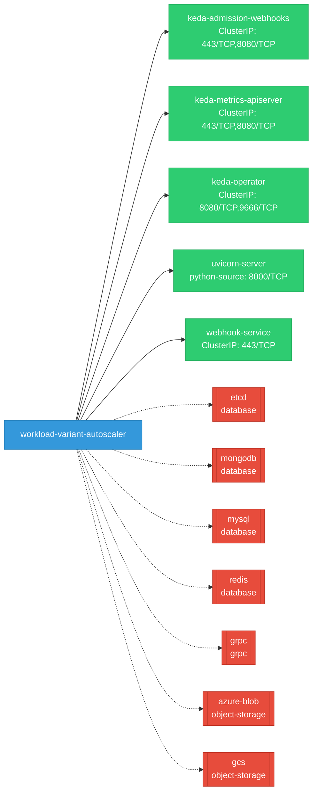

# workload-variant-autoscaler: Network

## Service Map

*5 unique services (9 total, duplicates from test fixtures collapsed).*

### Services

| Name | Type | Ports | Source |
|------|------|-------|--------|
| keda-admission-webhooks | ClusterIP | 443/TCP, 8080/TCP | [`.gomod-cache/github.com/kedacore/keda/v2@v2.18.0/config/webhooks/service.yaml`](https://github.com/llm-d/workload-variant-autoscaler/blob/46a611076ea6e421be0dafe4f085f3ecc80fa09e/.gomod-cache/github.com/kedacore/keda/v2@v2.18.0/config/webhooks/service.yaml) |
| keda-admission-webhooks | ClusterIP | 443/TCP, 8080/TCP | [`.gopath-loader/pkg/mod/github.com/kedacore/keda/v2@v2.18.0/config/webhooks/service.yaml`](https://github.com/llm-d/workload-variant-autoscaler/blob/46a611076ea6e421be0dafe4f085f3ecc80fa09e/.gopath-loader/pkg/mod/github.com/kedacore/keda/v2@v2.18.0/config/webhooks/service.yaml) |
| keda-metrics-apiserver | ClusterIP | 443/TCP, 8080/TCP | [`.gomod-cache/github.com/kedacore/keda/v2@v2.18.0/config/metrics-server/service.yaml`](https://github.com/llm-d/workload-variant-autoscaler/blob/46a611076ea6e421be0dafe4f085f3ecc80fa09e/.gomod-cache/github.com/kedacore/keda/v2@v2.18.0/config/metrics-server/service.yaml) |
| keda-metrics-apiserver | ClusterIP | 443/TCP, 8080/TCP | [`.gopath-loader/pkg/mod/github.com/kedacore/keda/v2@v2.18.0/config/metrics-server/service.yaml`](https://github.com/llm-d/workload-variant-autoscaler/blob/46a611076ea6e421be0dafe4f085f3ecc80fa09e/.gopath-loader/pkg/mod/github.com/kedacore/keda/v2@v2.18.0/config/metrics-server/service.yaml) |
| keda-operator | ClusterIP | 9666/TCP, 8080/TCP | [`.gomod-cache/github.com/kedacore/keda/v2@v2.18.0/config/manager/service.yaml`](https://github.com/llm-d/workload-variant-autoscaler/blob/46a611076ea6e421be0dafe4f085f3ecc80fa09e/.gomod-cache/github.com/kedacore/keda/v2@v2.18.0/config/manager/service.yaml) |
| keda-operator | ClusterIP | 9666/TCP, 8080/TCP | [`.gopath-loader/pkg/mod/github.com/kedacore/keda/v2@v2.18.0/config/manager/service.yaml`](https://github.com/llm-d/workload-variant-autoscaler/blob/46a611076ea6e421be0dafe4f085f3ecc80fa09e/.gopath-loader/pkg/mod/github.com/kedacore/keda/v2@v2.18.0/config/manager/service.yaml) |
| uvicorn-server | python-source | 8000/TCP | [`.gomod-cache/sigs.k8s.io/gateway-api-inference-extension@v1.2.1/latencypredictor/training_server.py:1866`](https://github.com/llm-d/workload-variant-autoscaler/blob/46a611076ea6e421be0dafe4f085f3ecc80fa09e/.gomod-cache/sigs.k8s.io/gateway-api-inference-extension@v1.2.1/latencypredictor/training_server.py#L1866) |
| webhook-service | ClusterIP | 443/TCP | [`.gomod-cache/sigs.k8s.io/lws@v0.8.0/config/webhook/service.yaml`](https://github.com/llm-d/workload-variant-autoscaler/blob/46a611076ea6e421be0dafe4f085f3ecc80fa09e/.gomod-cache/sigs.k8s.io/lws@v0.8.0/config/webhook/service.yaml) |
| webhook-service | ClusterIP | 443/TCP | [`.gopath-loader/pkg/mod/sigs.k8s.io/lws@v0.8.0/config/webhook/service.yaml`](https://github.com/llm-d/workload-variant-autoscaler/blob/46a611076ea6e421be0dafe4f085f3ecc80fa09e/.gopath-loader/pkg/mod/sigs.k8s.io/lws@v0.8.0/config/webhook/service.yaml) |

### Ingress / Routing

| Kind | Name | Hosts | Paths | TLS | Source |
|------|------|-------|-------|-----|--------|
| Gateway | inference-gateway |  |  | no | [`.gomod-cache/sigs.k8s.io/gateway-api-inference-extension@v1.2.1/config/manifests/gateway/gke/gateway.yaml`](https://github.com/llm-d/workload-variant-autoscaler/blob/46a611076ea6e421be0dafe4f085f3ecc80fa09e/.gomod-cache/sigs.k8s.io/gateway-api-inference-extension@v1.2.1/config/manifests/gateway/gke/gateway.yaml) |
| Gateway | inference-gateway |  |  | no | [`.gomod-cache/sigs.k8s.io/gateway-api-inference-extension@v1.2.1/config/manifests/gateway/istio/gateway.yaml`](https://github.com/llm-d/workload-variant-autoscaler/blob/46a611076ea6e421be0dafe4f085f3ecc80fa09e/.gomod-cache/sigs.k8s.io/gateway-api-inference-extension@v1.2.1/config/manifests/gateway/istio/gateway.yaml) |
| Gateway | inference-gateway |  |  | no | [`.gomod-cache/sigs.k8s.io/gateway-api-inference-extension@v1.2.1/config/manifests/gateway/kgateway/gateway.yaml`](https://github.com/llm-d/workload-variant-autoscaler/blob/46a611076ea6e421be0dafe4f085f3ecc80fa09e/.gomod-cache/sigs.k8s.io/gateway-api-inference-extension@v1.2.1/config/manifests/gateway/kgateway/gateway.yaml) |
| Gateway | inference-gateway |  |  | no | [`.gomod-cache/sigs.k8s.io/gateway-api-inference-extension@v1.2.1/config/manifests/gateway/nginxgatewayfabric/gateway.yaml`](https://github.com/llm-d/workload-variant-autoscaler/blob/46a611076ea6e421be0dafe4f085f3ecc80fa09e/.gomod-cache/sigs.k8s.io/gateway-api-inference-extension@v1.2.1/config/manifests/gateway/nginxgatewayfabric/gateway.yaml) |
| Gateway | inference-gateway |  |  | no | [`.gopath-loader/pkg/mod/sigs.k8s.io/gateway-api-inference-extension@v1.2.1/config/manifests/gateway/envoyaigateway/gateway.yaml`](https://github.com/llm-d/workload-variant-autoscaler/blob/46a611076ea6e421be0dafe4f085f3ecc80fa09e/.gopath-loader/pkg/mod/sigs.k8s.io/gateway-api-inference-extension@v1.2.1/config/manifests/gateway/envoyaigateway/gateway.yaml) |
| Gateway | inference-gateway |  |  | no | [`.gopath-loader/pkg/mod/sigs.k8s.io/gateway-api-inference-extension@v1.2.1/config/manifests/gateway/gke/gateway.yaml`](https://github.com/llm-d/workload-variant-autoscaler/blob/46a611076ea6e421be0dafe4f085f3ecc80fa09e/.gopath-loader/pkg/mod/sigs.k8s.io/gateway-api-inference-extension@v1.2.1/config/manifests/gateway/gke/gateway.yaml) |
| Gateway | inference-gateway |  |  | no | [`.gopath-loader/pkg/mod/sigs.k8s.io/gateway-api-inference-extension@v1.2.1/config/manifests/gateway/istio/gateway.yaml`](https://github.com/llm-d/workload-variant-autoscaler/blob/46a611076ea6e421be0dafe4f085f3ecc80fa09e/.gopath-loader/pkg/mod/sigs.k8s.io/gateway-api-inference-extension@v1.2.1/config/manifests/gateway/istio/gateway.yaml) |
| Gateway | inference-gateway |  |  | no | [`.gopath-loader/pkg/mod/sigs.k8s.io/gateway-api-inference-extension@v1.2.1/config/manifests/gateway/kgateway/gateway.yaml`](https://github.com/llm-d/workload-variant-autoscaler/blob/46a611076ea6e421be0dafe4f085f3ecc80fa09e/.gopath-loader/pkg/mod/sigs.k8s.io/gateway-api-inference-extension@v1.2.1/config/manifests/gateway/kgateway/gateway.yaml) |
| Gateway | inference-gateway |  |  | no | [`.gopath-loader/pkg/mod/sigs.k8s.io/gateway-api-inference-extension@v1.2.1/config/manifests/gateway/nginxgatewayfabric/gateway.yaml`](https://github.com/llm-d/workload-variant-autoscaler/blob/46a611076ea6e421be0dafe4f085f3ecc80fa09e/.gopath-loader/pkg/mod/sigs.k8s.io/gateway-api-inference-extension@v1.2.1/config/manifests/gateway/nginxgatewayfabric/gateway.yaml) |
| Gateway | inference-gateway |  |  | no | [`.gomod-cache/sigs.k8s.io/gateway-api-inference-extension@v1.2.1/config/manifests/gateway/envoyaigateway/gateway.yaml`](https://github.com/llm-d/workload-variant-autoscaler/blob/46a611076ea6e421be0dafe4f085f3ecc80fa09e/.gomod-cache/sigs.k8s.io/gateway-api-inference-extension@v1.2.1/config/manifests/gateway/envoyaigateway/gateway.yaml) |
| HTTPRoute | llm-llama-route |  | / | no | [`.gopath-loader/pkg/mod/sigs.k8s.io/gateway-api-inference-extension@v1.2.1/config/manifests/bbr-example/httproute_bbr.yaml`](https://github.com/llm-d/workload-variant-autoscaler/blob/46a611076ea6e421be0dafe4f085f3ecc80fa09e/.gopath-loader/pkg/mod/sigs.k8s.io/gateway-api-inference-extension@v1.2.1/config/manifests/bbr-example/httproute_bbr.yaml) |
| HTTPRoute | llm-llama-route |  | / | no | [`.gomod-cache/sigs.k8s.io/gateway-api-inference-extension@v1.2.1/config/manifests/bbr-example/httproute_bbr.yaml`](https://github.com/llm-d/workload-variant-autoscaler/blob/46a611076ea6e421be0dafe4f085f3ecc80fa09e/.gomod-cache/sigs.k8s.io/gateway-api-inference-extension@v1.2.1/config/manifests/bbr-example/httproute_bbr.yaml) |
| HTTPRoute | llm-phi4-route |  | / | no | [`.gopath-loader/pkg/mod/sigs.k8s.io/gateway-api-inference-extension@v1.2.1/config/manifests/bbr-example/httproute_bbr.yaml`](https://github.com/llm-d/workload-variant-autoscaler/blob/46a611076ea6e421be0dafe4f085f3ecc80fa09e/.gopath-loader/pkg/mod/sigs.k8s.io/gateway-api-inference-extension@v1.2.1/config/manifests/bbr-example/httproute_bbr.yaml) |
| HTTPRoute | llm-phi4-route |  | / | no | [`.gomod-cache/sigs.k8s.io/gateway-api-inference-extension@v1.2.1/config/manifests/bbr-example/httproute_bbr.yaml`](https://github.com/llm-d/workload-variant-autoscaler/blob/46a611076ea6e421be0dafe4f085f3ecc80fa09e/.gomod-cache/sigs.k8s.io/gateway-api-inference-extension@v1.2.1/config/manifests/bbr-example/httproute_bbr.yaml) |
| HTTPRoute | llm-route |  | / | no | [`.gomod-cache/sigs.k8s.io/gateway-api-inference-extension@v1.2.1/config/manifests/gateway/gke/httproute.yaml`](https://github.com/llm-d/workload-variant-autoscaler/blob/46a611076ea6e421be0dafe4f085f3ecc80fa09e/.gomod-cache/sigs.k8s.io/gateway-api-inference-extension@v1.2.1/config/manifests/gateway/gke/httproute.yaml) |
| HTTPRoute | llm-route |  | / | no | [`.gomod-cache/sigs.k8s.io/gateway-api-inference-extension@v1.2.1/config/manifests/gateway/istio/httproute.yaml`](https://github.com/llm-d/workload-variant-autoscaler/blob/46a611076ea6e421be0dafe4f085f3ecc80fa09e/.gomod-cache/sigs.k8s.io/gateway-api-inference-extension@v1.2.1/config/manifests/gateway/istio/httproute.yaml) |
| HTTPRoute | llm-route |  | / | no | [`.gomod-cache/sigs.k8s.io/gateway-api-inference-extension@v1.2.1/config/manifests/gateway/kgateway/httproute.yaml`](https://github.com/llm-d/workload-variant-autoscaler/blob/46a611076ea6e421be0dafe4f085f3ecc80fa09e/.gomod-cache/sigs.k8s.io/gateway-api-inference-extension@v1.2.1/config/manifests/gateway/kgateway/httproute.yaml) |
| HTTPRoute | llm-route |  | / | no | [`.gomod-cache/sigs.k8s.io/gateway-api-inference-extension@v1.2.1/config/manifests/gateway/nginxgatewayfabric/httproute.yaml`](https://github.com/llm-d/workload-variant-autoscaler/blob/46a611076ea6e421be0dafe4f085f3ecc80fa09e/.gomod-cache/sigs.k8s.io/gateway-api-inference-extension@v1.2.1/config/manifests/gateway/nginxgatewayfabric/httproute.yaml) |
| HTTPRoute | llm-route |  | / | no | [`.gomod-cache/sigs.k8s.io/gateway-api-inference-extension@v1.2.1/config/manifests/gateway/envoyaigateway/httproute.yaml`](https://github.com/llm-d/workload-variant-autoscaler/blob/46a611076ea6e421be0dafe4f085f3ecc80fa09e/.gomod-cache/sigs.k8s.io/gateway-api-inference-extension@v1.2.1/config/manifests/gateway/envoyaigateway/httproute.yaml) |
| HTTPRoute | llm-route |  | / | no | [`.gopath-loader/pkg/mod/sigs.k8s.io/gateway-api-inference-extension@v1.2.1/config/manifests/gateway/envoyaigateway/httproute.yaml`](https://github.com/llm-d/workload-variant-autoscaler/blob/46a611076ea6e421be0dafe4f085f3ecc80fa09e/.gopath-loader/pkg/mod/sigs.k8s.io/gateway-api-inference-extension@v1.2.1/config/manifests/gateway/envoyaigateway/httproute.yaml) |
| HTTPRoute | llm-route |  | / | no | [`.gopath-loader/pkg/mod/sigs.k8s.io/gateway-api-inference-extension@v1.2.1/config/manifests/gateway/gke/httproute.yaml`](https://github.com/llm-d/workload-variant-autoscaler/blob/46a611076ea6e421be0dafe4f085f3ecc80fa09e/.gopath-loader/pkg/mod/sigs.k8s.io/gateway-api-inference-extension@v1.2.1/config/manifests/gateway/gke/httproute.yaml) |
| HTTPRoute | llm-route |  | / | no | [`.gopath-loader/pkg/mod/sigs.k8s.io/gateway-api-inference-extension@v1.2.1/config/manifests/gateway/istio/httproute.yaml`](https://github.com/llm-d/workload-variant-autoscaler/blob/46a611076ea6e421be0dafe4f085f3ecc80fa09e/.gopath-loader/pkg/mod/sigs.k8s.io/gateway-api-inference-extension@v1.2.1/config/manifests/gateway/istio/httproute.yaml) |
| HTTPRoute | llm-route |  | / | no | [`.gopath-loader/pkg/mod/sigs.k8s.io/gateway-api-inference-extension@v1.2.1/config/manifests/gateway/kgateway/httproute.yaml`](https://github.com/llm-d/workload-variant-autoscaler/blob/46a611076ea6e421be0dafe4f085f3ecc80fa09e/.gopath-loader/pkg/mod/sigs.k8s.io/gateway-api-inference-extension@v1.2.1/config/manifests/gateway/kgateway/httproute.yaml) |
| HTTPRoute | llm-route |  | / | no | [`.gopath-loader/pkg/mod/sigs.k8s.io/gateway-api-inference-extension@v1.2.1/config/manifests/gateway/nginxgatewayfabric/httproute.yaml`](https://github.com/llm-d/workload-variant-autoscaler/blob/46a611076ea6e421be0dafe4f085f3ecc80fa09e/.gopath-loader/pkg/mod/sigs.k8s.io/gateway-api-inference-extension@v1.2.1/config/manifests/gateway/nginxgatewayfabric/httproute.yaml) |

!!! warning "No Network Policies"
    No NetworkPolicy resources found. All pod-to-pod traffic is allowed by default.

