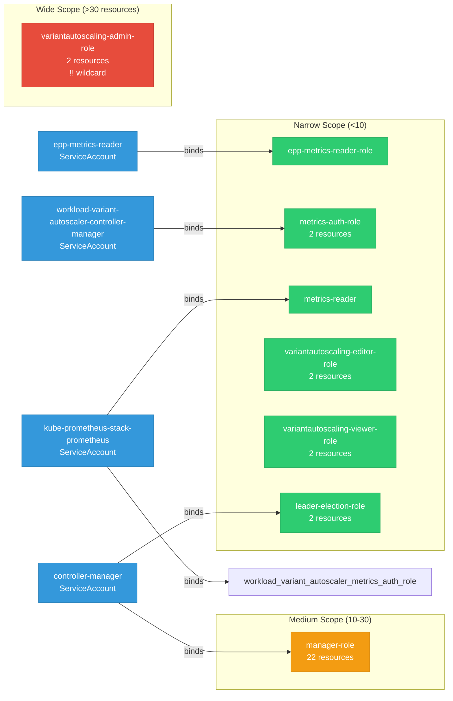

# workload-variant-autoscaler: RBAC

ServiceAccount bindings, roles, and resource permissions.

## RBAC Overview

This component defines a large RBAC surface (93 diagram lines). The graph below groups roles by permission scope.

## Bindings

Subject-to-role mappings defining who has access to what.

| Binding | Type | Role | Subject |
|---------|------|------|---------|
| epp-metrics-reader-role-binding | ClusterRoleBinding | epp-metrics-reader-role | ServiceAccount/epp-metrics-reader |
| manager-rolebinding | ClusterRoleBinding | manager-role | ServiceAccount/controller-manager |
| metrics-auth-rolebinding | ClusterRoleBinding | metrics-auth-role | ServiceAccount/workload-variant-autoscaler-controller-manager |
| metrics-reader-rolebinding | ClusterRoleBinding | metrics-reader | ServiceAccount/kube-prometheus-stack-prometheus |
| prometheus-metrics-auth-rolebinding | ClusterRoleBinding | workload-variant-autoscaler-metrics-auth-role | ServiceAccount/kube-prometheus-stack-prometheus |
| leader-election-rolebinding | RoleBinding | leader-election-role | ServiceAccount/controller-manager |

## Role Details

Per-rule breakdown of API groups, resources, and verbs for each role.

| Role | Kind | API Groups | Resources | Verbs |
|------|------|------------|-----------|-------|
| epp-metrics-reader-role | ClusterRole |  |  | get |
| manager-role | ClusterRole |  | configmaps | get, list, update, watch |
| manager-role | ClusterRole |  | configmaps/status | get |
| manager-role | ClusterRole |  | events | create, patch |
| manager-role | ClusterRole |  | namespaces, pods, secrets, services | get, list, watch |
| manager-role | ClusterRole |  | nodes, nodes/status | get, list, patch, update, watch |
| manager-role | ClusterRole |  | deployments | get, list, patch, update, watch |
| manager-role | ClusterRole |  | deployments/scale | get, update |
| manager-role | ClusterRole |  | replicasets, statefulsets | get, list, watch |
| manager-role | ClusterRole |  | horizontalpodautoscalers | get, list, watch |
| manager-role | ClusterRole |  | inferencepools | get, list, watch |
| manager-role | ClusterRole |  | scaledobjects | get, list, watch |
| manager-role | ClusterRole |  | leaderworkersets | get, list, patch, update, watch |
| manager-role | ClusterRole |  | leaderworkersets/scale | get, update |
| manager-role | ClusterRole |  | variantautoscalings | create, delete, get, list, patch, update, watch |
| manager-role | ClusterRole |  | variantautoscalings/finalizers | update |
| manager-role | ClusterRole |  | variantautoscalings/status | get, patch, update |
| manager-role | ClusterRole |  | servicemonitors | get, list, watch |
| metrics-auth-role | ClusterRole |  | tokenreviews | create |
| metrics-auth-role | ClusterRole |  | subjectaccessreviews | create |
| metrics-reader | ClusterRole |  |  | get |
| variantautoscaling-admin-role | ClusterRole |  | VariantAutoscalingss | * |
| variantautoscaling-admin-role | ClusterRole |  | variantautoscalings/status | get |
| variantautoscaling-editor-role | ClusterRole |  | variantautoscalings | create, delete, get, list, patch, update, watch |
| variantautoscaling-editor-role | ClusterRole |  | VariantAutoscalingss/status | get |
| variantautoscaling-viewer-role | ClusterRole |  | variantautoscalings | get, list, watch |
| variantautoscaling-viewer-role | ClusterRole |  | variantautoscalings/status | get |
| leader-election-role | Role |  | leases | get, list, watch, create, update, patch, delete |
| leader-election-role | Role |  | events | create, patch |

### Cluster Roles

| Name | Resources | Verbs | Source |
|------|-----------|-------|--------|
| epp-metrics-reader-role |  | get | [`config/rbac/epp_metrics_reader_role.yaml`](https://github.com/llm-d/workload-variant-autoscaler/blob/cf1724aa84bcc891d374400021a37dee3384c92f/config/rbac/epp_metrics_reader_role.yaml) |
| manager-role | configmaps | get, list, update, watch | [`config/rbac/role.yaml`](https://github.com/llm-d/workload-variant-autoscaler/blob/cf1724aa84bcc891d374400021a37dee3384c92f/config/rbac/role.yaml) |
| manager-role | configmaps/status | get | [`config/rbac/role.yaml`](https://github.com/llm-d/workload-variant-autoscaler/blob/cf1724aa84bcc891d374400021a37dee3384c92f/config/rbac/role.yaml) |
| manager-role | events | create, patch | [`config/rbac/role.yaml`](https://github.com/llm-d/workload-variant-autoscaler/blob/cf1724aa84bcc891d374400021a37dee3384c92f/config/rbac/role.yaml) |
| manager-role | namespaces, pods, secrets, services | get, list, watch | [`config/rbac/role.yaml`](https://github.com/llm-d/workload-variant-autoscaler/blob/cf1724aa84bcc891d374400021a37dee3384c92f/config/rbac/role.yaml) |
| manager-role | nodes, nodes/status | get, list, patch, update, watch | [`config/rbac/role.yaml`](https://github.com/llm-d/workload-variant-autoscaler/blob/cf1724aa84bcc891d374400021a37dee3384c92f/config/rbac/role.yaml) |
| manager-role | deployments | get, list, patch, update, watch | [`config/rbac/role.yaml`](https://github.com/llm-d/workload-variant-autoscaler/blob/cf1724aa84bcc891d374400021a37dee3384c92f/config/rbac/role.yaml) |
| manager-role | deployments/scale | get, update | [`config/rbac/role.yaml`](https://github.com/llm-d/workload-variant-autoscaler/blob/cf1724aa84bcc891d374400021a37dee3384c92f/config/rbac/role.yaml) |
| manager-role | replicasets, statefulsets | get, list, watch | [`config/rbac/role.yaml`](https://github.com/llm-d/workload-variant-autoscaler/blob/cf1724aa84bcc891d374400021a37dee3384c92f/config/rbac/role.yaml) |
| manager-role | horizontalpodautoscalers | get, list, watch | [`config/rbac/role.yaml`](https://github.com/llm-d/workload-variant-autoscaler/blob/cf1724aa84bcc891d374400021a37dee3384c92f/config/rbac/role.yaml) |
| manager-role | inferencepools | get, list, watch | [`config/rbac/role.yaml`](https://github.com/llm-d/workload-variant-autoscaler/blob/cf1724aa84bcc891d374400021a37dee3384c92f/config/rbac/role.yaml) |
| manager-role | scaledobjects | get, list, watch | [`config/rbac/role.yaml`](https://github.com/llm-d/workload-variant-autoscaler/blob/cf1724aa84bcc891d374400021a37dee3384c92f/config/rbac/role.yaml) |
| manager-role | leaderworkersets | get, list, patch, update, watch | [`config/rbac/role.yaml`](https://github.com/llm-d/workload-variant-autoscaler/blob/cf1724aa84bcc891d374400021a37dee3384c92f/config/rbac/role.yaml) |
| manager-role | leaderworkersets/scale | get, update | [`config/rbac/role.yaml`](https://github.com/llm-d/workload-variant-autoscaler/blob/cf1724aa84bcc891d374400021a37dee3384c92f/config/rbac/role.yaml) |
| manager-role | variantautoscalings | create, delete, get, list, patch, update, watch | [`config/rbac/role.yaml`](https://github.com/llm-d/workload-variant-autoscaler/blob/cf1724aa84bcc891d374400021a37dee3384c92f/config/rbac/role.yaml) |
| manager-role | variantautoscalings/finalizers | update | [`config/rbac/role.yaml`](https://github.com/llm-d/workload-variant-autoscaler/blob/cf1724aa84bcc891d374400021a37dee3384c92f/config/rbac/role.yaml) |
| manager-role | variantautoscalings/status | get, patch, update | [`config/rbac/role.yaml`](https://github.com/llm-d/workload-variant-autoscaler/blob/cf1724aa84bcc891d374400021a37dee3384c92f/config/rbac/role.yaml) |
| manager-role | servicemonitors | get, list, watch | [`config/rbac/role.yaml`](https://github.com/llm-d/workload-variant-autoscaler/blob/cf1724aa84bcc891d374400021a37dee3384c92f/config/rbac/role.yaml) |
| metrics-auth-role | tokenreviews | create | [`config/rbac/metrics_auth_role.yaml`](https://github.com/llm-d/workload-variant-autoscaler/blob/cf1724aa84bcc891d374400021a37dee3384c92f/config/rbac/metrics_auth_role.yaml) |
| metrics-auth-role | subjectaccessreviews | create | [`config/rbac/metrics_auth_role.yaml`](https://github.com/llm-d/workload-variant-autoscaler/blob/cf1724aa84bcc891d374400021a37dee3384c92f/config/rbac/metrics_auth_role.yaml) |
| metrics-reader |  | get | [`config/rbac/metrics_reader_role.yaml`](https://github.com/llm-d/workload-variant-autoscaler/blob/cf1724aa84bcc891d374400021a37dee3384c92f/config/rbac/metrics_reader_role.yaml) |
| variantautoscaling-admin-role | VariantAutoscalingss | * | [`config/rbac/variantautoscaling_admin_role.yaml`](https://github.com/llm-d/workload-variant-autoscaler/blob/cf1724aa84bcc891d374400021a37dee3384c92f/config/rbac/variantautoscaling_admin_role.yaml) |
| variantautoscaling-admin-role | variantautoscalings/status | get | [`config/rbac/variantautoscaling_admin_role.yaml`](https://github.com/llm-d/workload-variant-autoscaler/blob/cf1724aa84bcc891d374400021a37dee3384c92f/config/rbac/variantautoscaling_admin_role.yaml) |
| variantautoscaling-editor-role | variantautoscalings | create, delete, get, list, patch, update, watch | [`config/rbac/variantautoscaling_editor_role.yaml`](https://github.com/llm-d/workload-variant-autoscaler/blob/cf1724aa84bcc891d374400021a37dee3384c92f/config/rbac/variantautoscaling_editor_role.yaml) |
| variantautoscaling-editor-role | VariantAutoscalingss/status | get | [`config/rbac/variantautoscaling_editor_role.yaml`](https://github.com/llm-d/workload-variant-autoscaler/blob/cf1724aa84bcc891d374400021a37dee3384c92f/config/rbac/variantautoscaling_editor_role.yaml) |
| variantautoscaling-viewer-role | variantautoscalings | get, list, watch | [`config/rbac/variantautoscaling_viewer_role.yaml`](https://github.com/llm-d/workload-variant-autoscaler/blob/cf1724aa84bcc891d374400021a37dee3384c92f/config/rbac/variantautoscaling_viewer_role.yaml) |
| variantautoscaling-viewer-role | variantautoscalings/status | get | [`config/rbac/variantautoscaling_viewer_role.yaml`](https://github.com/llm-d/workload-variant-autoscaler/blob/cf1724aa84bcc891d374400021a37dee3384c92f/config/rbac/variantautoscaling_viewer_role.yaml) |

### Kubebuilder RBAC Markers

Kubebuilder `+kubebuilder:rbac` markers declare the RBAC requirements of controller reconcilers. These are the source of truth for generated ClusterRole manifests. 38 markers found.

| File | Line | Groups | Resources | Verbs |
|------|------|--------|-----------|-------|
| [`.gomod-cache/sigs.k8s.io/lws@v0.8.0/pkg/cert/cert.go:31`](https://github.com/llm-d/workload-variant-autoscaler/blob/cf1724aa84bcc891d374400021a37dee3384c92f/.gomod-cache/sigs.k8s.io/lws@v0.8.0/pkg/cert/cert.go#L31) | 31 | "" | secrets | get, list, watch, update |
| [`.gomod-cache/sigs.k8s.io/lws@v0.8.0/pkg/cert/cert.go:32`](https://github.com/llm-d/workload-variant-autoscaler/blob/cf1724aa84bcc891d374400021a37dee3384c92f/.gomod-cache/sigs.k8s.io/lws@v0.8.0/pkg/cert/cert.go#L32) | 32 | "admissionregistration.k8s.io" | mutatingwebhookconfigurations | get, list, watch, update |
| [`.gomod-cache/sigs.k8s.io/lws@v0.8.0/pkg/cert/cert.go:33`](https://github.com/llm-d/workload-variant-autoscaler/blob/cf1724aa84bcc891d374400021a37dee3384c92f/.gomod-cache/sigs.k8s.io/lws@v0.8.0/pkg/cert/cert.go#L33) | 33 | "admissionregistration.k8s.io" | validatingwebhookconfigurations | get, list, watch, update |
| [`.gomod-cache/sigs.k8s.io/lws@v0.8.0/pkg/controllers/leaderworkerset_controller.go:85`](https://github.com/llm-d/workload-variant-autoscaler/blob/cf1724aa84bcc891d374400021a37dee3384c92f/.gomod-cache/sigs.k8s.io/lws@v0.8.0/pkg/controllers/leaderworkerset_controller.go#L85) | 85 | "" | events | create, watch, update, patch |
| [`.gomod-cache/sigs.k8s.io/lws@v0.8.0/pkg/controllers/leaderworkerset_controller.go:86`](https://github.com/llm-d/workload-variant-autoscaler/blob/cf1724aa84bcc891d374400021a37dee3384c92f/.gomod-cache/sigs.k8s.io/lws@v0.8.0/pkg/controllers/leaderworkerset_controller.go#L86) | 86 | leaderworkerset.x-k8s.io | leaderworkersets | get, list, watch, create, update, patch, delete |
| [`.gomod-cache/sigs.k8s.io/lws@v0.8.0/pkg/controllers/leaderworkerset_controller.go:87`](https://github.com/llm-d/workload-variant-autoscaler/blob/cf1724aa84bcc891d374400021a37dee3384c92f/.gomod-cache/sigs.k8s.io/lws@v0.8.0/pkg/controllers/leaderworkerset_controller.go#L87) | 87 | leaderworkerset.x-k8s.io | leaderworkersets/status | get, update, patch |
| [`.gomod-cache/sigs.k8s.io/lws@v0.8.0/pkg/controllers/leaderworkerset_controller.go:88`](https://github.com/llm-d/workload-variant-autoscaler/blob/cf1724aa84bcc891d374400021a37dee3384c92f/.gomod-cache/sigs.k8s.io/lws@v0.8.0/pkg/controllers/leaderworkerset_controller.go#L88) | 88 | leaderworkerset.x-k8s.io | leaderworkersets/finalizers | update |
| [`.gomod-cache/sigs.k8s.io/lws@v0.8.0/pkg/controllers/leaderworkerset_controller.go:89`](https://github.com/llm-d/workload-variant-autoscaler/blob/cf1724aa84bcc891d374400021a37dee3384c92f/.gomod-cache/sigs.k8s.io/lws@v0.8.0/pkg/controllers/leaderworkerset_controller.go#L89) | 89 | apps | statefulsets | get, list, watch, create, update, patch, delete |
| [`.gomod-cache/sigs.k8s.io/lws@v0.8.0/pkg/controllers/leaderworkerset_controller.go:90`](https://github.com/llm-d/workload-variant-autoscaler/blob/cf1724aa84bcc891d374400021a37dee3384c92f/.gomod-cache/sigs.k8s.io/lws@v0.8.0/pkg/controllers/leaderworkerset_controller.go#L90) | 90 | apps | statefulsets/status | get, update, patch |
| [`.gomod-cache/sigs.k8s.io/lws@v0.8.0/pkg/controllers/leaderworkerset_controller.go:91`](https://github.com/llm-d/workload-variant-autoscaler/blob/cf1724aa84bcc891d374400021a37dee3384c92f/.gomod-cache/sigs.k8s.io/lws@v0.8.0/pkg/controllers/leaderworkerset_controller.go#L91) | 91 | apps | statefulsets/finalizers | update |
| [`.gomod-cache/sigs.k8s.io/lws@v0.8.0/pkg/controllers/leaderworkerset_controller.go:92`](https://github.com/llm-d/workload-variant-autoscaler/blob/cf1724aa84bcc891d374400021a37dee3384c92f/.gomod-cache/sigs.k8s.io/lws@v0.8.0/pkg/controllers/leaderworkerset_controller.go#L92) | 92 | core | services | get, list, watch, create, update, patch, delete |
| [`.gomod-cache/sigs.k8s.io/lws@v0.8.0/pkg/controllers/leaderworkerset_controller.go:93`](https://github.com/llm-d/workload-variant-autoscaler/blob/cf1724aa84bcc891d374400021a37dee3384c92f/.gomod-cache/sigs.k8s.io/lws@v0.8.0/pkg/controllers/leaderworkerset_controller.go#L93) | 93 | core | events | get, list, watch, create, patch |
| [`.gomod-cache/sigs.k8s.io/lws@v0.8.0/pkg/controllers/leaderworkerset_controller.go:94`](https://github.com/llm-d/workload-variant-autoscaler/blob/cf1724aa84bcc891d374400021a37dee3384c92f/.gomod-cache/sigs.k8s.io/lws@v0.8.0/pkg/controllers/leaderworkerset_controller.go#L94) | 94 | apps | controllerrevisions | get, list, watch, create, update, patch, delete |
| [`.gomod-cache/sigs.k8s.io/lws@v0.8.0/pkg/controllers/leaderworkerset_controller.go:95`](https://github.com/llm-d/workload-variant-autoscaler/blob/cf1724aa84bcc891d374400021a37dee3384c92f/.gomod-cache/sigs.k8s.io/lws@v0.8.0/pkg/controllers/leaderworkerset_controller.go#L95) | 95 | apps | controllerrevisions/status | get, update, patch |
| [`.gomod-cache/sigs.k8s.io/lws@v0.8.0/pkg/controllers/leaderworkerset_controller.go:96`](https://github.com/llm-d/workload-variant-autoscaler/blob/cf1724aa84bcc891d374400021a37dee3384c92f/.gomod-cache/sigs.k8s.io/lws@v0.8.0/pkg/controllers/leaderworkerset_controller.go#L96) | 96 | apps | controllerrevisions/finalizers | update |
| [`.gomod-cache/sigs.k8s.io/lws@v0.8.0/pkg/controllers/pod_controller.go:63`](https://github.com/llm-d/workload-variant-autoscaler/blob/cf1724aa84bcc891d374400021a37dee3384c92f/.gomod-cache/sigs.k8s.io/lws@v0.8.0/pkg/controllers/pod_controller.go#L63) | 63 | "" | events | create, watch, update, patch |
| [`.gomod-cache/sigs.k8s.io/lws@v0.8.0/pkg/controllers/pod_controller.go:64`](https://github.com/llm-d/workload-variant-autoscaler/blob/cf1724aa84bcc891d374400021a37dee3384c92f/.gomod-cache/sigs.k8s.io/lws@v0.8.0/pkg/controllers/pod_controller.go#L64) | 64 | core | pods | create, delete, get, list, patch, update, watch |
| [`.gomod-cache/sigs.k8s.io/lws@v0.8.0/pkg/controllers/pod_controller.go:65`](https://github.com/llm-d/workload-variant-autoscaler/blob/cf1724aa84bcc891d374400021a37dee3384c92f/.gomod-cache/sigs.k8s.io/lws@v0.8.0/pkg/controllers/pod_controller.go#L65) | 65 | core | pods/finalizers | update |
| [`.gomod-cache/sigs.k8s.io/lws@v0.8.0/pkg/controllers/pod_controller.go:66`](https://github.com/llm-d/workload-variant-autoscaler/blob/cf1724aa84bcc891d374400021a37dee3384c92f/.gomod-cache/sigs.k8s.io/lws@v0.8.0/pkg/controllers/pod_controller.go#L66) | 66 | core | nodes | get, list, watch, update, patch |
| [`.gopath-loader/pkg/mod/sigs.k8s.io/lws@v0.8.0/pkg/cert/cert.go:31`](https://github.com/llm-d/workload-variant-autoscaler/blob/cf1724aa84bcc891d374400021a37dee3384c92f/.gopath-loader/pkg/mod/sigs.k8s.io/lws@v0.8.0/pkg/cert/cert.go#L31) | 31 | "" | secrets | get, list, watch, update |
| [`.gopath-loader/pkg/mod/sigs.k8s.io/lws@v0.8.0/pkg/cert/cert.go:32`](https://github.com/llm-d/workload-variant-autoscaler/blob/cf1724aa84bcc891d374400021a37dee3384c92f/.gopath-loader/pkg/mod/sigs.k8s.io/lws@v0.8.0/pkg/cert/cert.go#L32) | 32 | "admissionregistration.k8s.io" | mutatingwebhookconfigurations | get, list, watch, update |
| [`.gopath-loader/pkg/mod/sigs.k8s.io/lws@v0.8.0/pkg/cert/cert.go:33`](https://github.com/llm-d/workload-variant-autoscaler/blob/cf1724aa84bcc891d374400021a37dee3384c92f/.gopath-loader/pkg/mod/sigs.k8s.io/lws@v0.8.0/pkg/cert/cert.go#L33) | 33 | "admissionregistration.k8s.io" | validatingwebhookconfigurations | get, list, watch, update |
| [`.gopath-loader/pkg/mod/sigs.k8s.io/lws@v0.8.0/pkg/controllers/leaderworkerset_controller.go:85`](https://github.com/llm-d/workload-variant-autoscaler/blob/cf1724aa84bcc891d374400021a37dee3384c92f/.gopath-loader/pkg/mod/sigs.k8s.io/lws@v0.8.0/pkg/controllers/leaderworkerset_controller.go#L85) | 85 | "" | events | create, watch, update, patch |
| [`.gopath-loader/pkg/mod/sigs.k8s.io/lws@v0.8.0/pkg/controllers/leaderworkerset_controller.go:86`](https://github.com/llm-d/workload-variant-autoscaler/blob/cf1724aa84bcc891d374400021a37dee3384c92f/.gopath-loader/pkg/mod/sigs.k8s.io/lws@v0.8.0/pkg/controllers/leaderworkerset_controller.go#L86) | 86 | leaderworkerset.x-k8s.io | leaderworkersets | get, list, watch, create, update, patch, delete |
| [`.gopath-loader/pkg/mod/sigs.k8s.io/lws@v0.8.0/pkg/controllers/leaderworkerset_controller.go:87`](https://github.com/llm-d/workload-variant-autoscaler/blob/cf1724aa84bcc891d374400021a37dee3384c92f/.gopath-loader/pkg/mod/sigs.k8s.io/lws@v0.8.0/pkg/controllers/leaderworkerset_controller.go#L87) | 87 | leaderworkerset.x-k8s.io | leaderworkersets/status | get, update, patch |
| [`.gopath-loader/pkg/mod/sigs.k8s.io/lws@v0.8.0/pkg/controllers/leaderworkerset_controller.go:88`](https://github.com/llm-d/workload-variant-autoscaler/blob/cf1724aa84bcc891d374400021a37dee3384c92f/.gopath-loader/pkg/mod/sigs.k8s.io/lws@v0.8.0/pkg/controllers/leaderworkerset_controller.go#L88) | 88 | leaderworkerset.x-k8s.io | leaderworkersets/finalizers | update |
| [`.gopath-loader/pkg/mod/sigs.k8s.io/lws@v0.8.0/pkg/controllers/leaderworkerset_controller.go:89`](https://github.com/llm-d/workload-variant-autoscaler/blob/cf1724aa84bcc891d374400021a37dee3384c92f/.gopath-loader/pkg/mod/sigs.k8s.io/lws@v0.8.0/pkg/controllers/leaderworkerset_controller.go#L89) | 89 | apps | statefulsets | get, list, watch, create, update, patch, delete |
| [`.gopath-loader/pkg/mod/sigs.k8s.io/lws@v0.8.0/pkg/controllers/leaderworkerset_controller.go:90`](https://github.com/llm-d/workload-variant-autoscaler/blob/cf1724aa84bcc891d374400021a37dee3384c92f/.gopath-loader/pkg/mod/sigs.k8s.io/lws@v0.8.0/pkg/controllers/leaderworkerset_controller.go#L90) | 90 | apps | statefulsets/status | get, update, patch |
| [`.gopath-loader/pkg/mod/sigs.k8s.io/lws@v0.8.0/pkg/controllers/leaderworkerset_controller.go:91`](https://github.com/llm-d/workload-variant-autoscaler/blob/cf1724aa84bcc891d374400021a37dee3384c92f/.gopath-loader/pkg/mod/sigs.k8s.io/lws@v0.8.0/pkg/controllers/leaderworkerset_controller.go#L91) | 91 | apps | statefulsets/finalizers | update |
| [`.gopath-loader/pkg/mod/sigs.k8s.io/lws@v0.8.0/pkg/controllers/leaderworkerset_controller.go:92`](https://github.com/llm-d/workload-variant-autoscaler/blob/cf1724aa84bcc891d374400021a37dee3384c92f/.gopath-loader/pkg/mod/sigs.k8s.io/lws@v0.8.0/pkg/controllers/leaderworkerset_controller.go#L92) | 92 | core | services | get, list, watch, create, update, patch, delete |
| [`.gopath-loader/pkg/mod/sigs.k8s.io/lws@v0.8.0/pkg/controllers/leaderworkerset_controller.go:93`](https://github.com/llm-d/workload-variant-autoscaler/blob/cf1724aa84bcc891d374400021a37dee3384c92f/.gopath-loader/pkg/mod/sigs.k8s.io/lws@v0.8.0/pkg/controllers/leaderworkerset_controller.go#L93) | 93 | core | events | get, list, watch, create, patch |
| [`.gopath-loader/pkg/mod/sigs.k8s.io/lws@v0.8.0/pkg/controllers/leaderworkerset_controller.go:94`](https://github.com/llm-d/workload-variant-autoscaler/blob/cf1724aa84bcc891d374400021a37dee3384c92f/.gopath-loader/pkg/mod/sigs.k8s.io/lws@v0.8.0/pkg/controllers/leaderworkerset_controller.go#L94) | 94 | apps | controllerrevisions | get, list, watch, create, update, patch, delete |
| [`.gopath-loader/pkg/mod/sigs.k8s.io/lws@v0.8.0/pkg/controllers/leaderworkerset_controller.go:95`](https://github.com/llm-d/workload-variant-autoscaler/blob/cf1724aa84bcc891d374400021a37dee3384c92f/.gopath-loader/pkg/mod/sigs.k8s.io/lws@v0.8.0/pkg/controllers/leaderworkerset_controller.go#L95) | 95 | apps | controllerrevisions/status | get, update, patch |
| [`.gopath-loader/pkg/mod/sigs.k8s.io/lws@v0.8.0/pkg/controllers/leaderworkerset_controller.go:96`](https://github.com/llm-d/workload-variant-autoscaler/blob/cf1724aa84bcc891d374400021a37dee3384c92f/.gopath-loader/pkg/mod/sigs.k8s.io/lws@v0.8.0/pkg/controllers/leaderworkerset_controller.go#L96) | 96 | apps | controllerrevisions/finalizers | update |
| [`.gopath-loader/pkg/mod/sigs.k8s.io/lws@v0.8.0/pkg/controllers/pod_controller.go:63`](https://github.com/llm-d/workload-variant-autoscaler/blob/cf1724aa84bcc891d374400021a37dee3384c92f/.gopath-loader/pkg/mod/sigs.k8s.io/lws@v0.8.0/pkg/controllers/pod_controller.go#L63) | 63 | "" | events | create, watch, update, patch |
| [`.gopath-loader/pkg/mod/sigs.k8s.io/lws@v0.8.0/pkg/controllers/pod_controller.go:64`](https://github.com/llm-d/workload-variant-autoscaler/blob/cf1724aa84bcc891d374400021a37dee3384c92f/.gopath-loader/pkg/mod/sigs.k8s.io/lws@v0.8.0/pkg/controllers/pod_controller.go#L64) | 64 | core | pods | create, delete, get, list, patch, update, watch |
| [`.gopath-loader/pkg/mod/sigs.k8s.io/lws@v0.8.0/pkg/controllers/pod_controller.go:65`](https://github.com/llm-d/workload-variant-autoscaler/blob/cf1724aa84bcc891d374400021a37dee3384c92f/.gopath-loader/pkg/mod/sigs.k8s.io/lws@v0.8.0/pkg/controllers/pod_controller.go#L65) | 65 | core | pods/finalizers | update |
| [`.gopath-loader/pkg/mod/sigs.k8s.io/lws@v0.8.0/pkg/controllers/pod_controller.go:66`](https://github.com/llm-d/workload-variant-autoscaler/blob/cf1724aa84bcc891d374400021a37dee3384c92f/.gopath-loader/pkg/mod/sigs.k8s.io/lws@v0.8.0/pkg/controllers/pod_controller.go#L66) | 66 | core | nodes | get, list, watch, update, patch |

