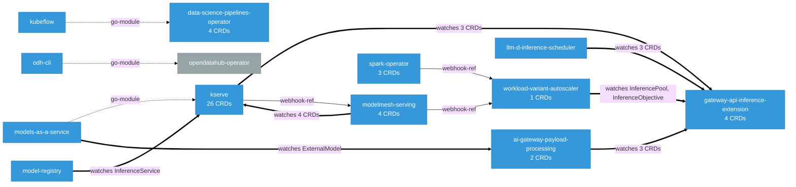

# OpenShift AI Platform Analysis

> **Architecture snapshot: 2026-05-19** (2026-05-19)

*Generated by architecture-analyzer. All data produced by deterministic static analysis.*

## Platform Summary

| Metric | Count |
|--------|-------|
| Components | 56 |
| CRDs | 56 |
| Services | 81 |
| Secrets | 45 |
| Cluster Roles | 61 |
| Cross-Component Dependencies | 24 |
| Webhooks | 121 |

## Component Dependency Graph

## Components Analyzed

| Component | CRDs |
|-----------|------|
| MLServer | 0 |
| NeMo-Guardrails | 0 |
| ai-gateway-payload-processing | 2 |
| ai4rag | 0 |
| argo-workflows | 0 |
| batch-gateway | 0 |
| caikit-nlp | 0 |
| caikit-tgis-serving | 0 |
| codeflare-sdk | 0 |
| data-science-pipelines | 3 |
| data-science-pipelines-operator | 4 |
| distributed-workloads | 0 |
| eval-hub | 0 |
| feast | 0 |
| fms-guardrails-orchestrator | 0 |
| fms-hf-tuning | 0 |
| gateway-api-inference-extension | 4 |
| guardrails-regex-detector | 0 |
| kserve | 26 |
| kube-auth-proxy | 0 |
| kube-rbac-proxy | 0 |
| kubeflow | 0 |
| kuberay | 0 |
| kueue | 2 |
| llama-stack | 0 |
| llama-stack-k8s-operator | 2 |
| llm-d | 0 |
| llm-d-inference-scheduler | 0 |
| llm-d-kv-cache | 0 |
| llm-d-routing-sidecar | 0 |
| lm-evaluation-harness | 0 |
| ml-metadata | 0 |
| mlflow-operator | 2 |
| model-metadata-collection | 0 |
| model-registry | 0 |
| modelmesh-runtime-adapter | 0 |
| modelmesh-serving | 4 |
| models-as-a-service | 0 |
| notebooks | 0 |
| notebooks-downstream | 0 |
| odh-cli | 0 |
| odh-deployer | 0 |
| openvino_model_server | 0 |
| pipelines-components | 0 |
| rest-proxy | 0 |
| rhds-llama-stack-distribution | 0 |
| spark-operator | 3 |
| text-generation-inference | 0 |
| trainer | 3 |
| trustyai-explainability | 0 |
| vllm-cpu | 0 |
| vllm-gaudi | 0 |
| vllm-orchestrator-gateway | 0 |
| vllm-rocm | 0 |
| vllm-spyre | 0 |
| workload-variant-autoscaler | 1 |

