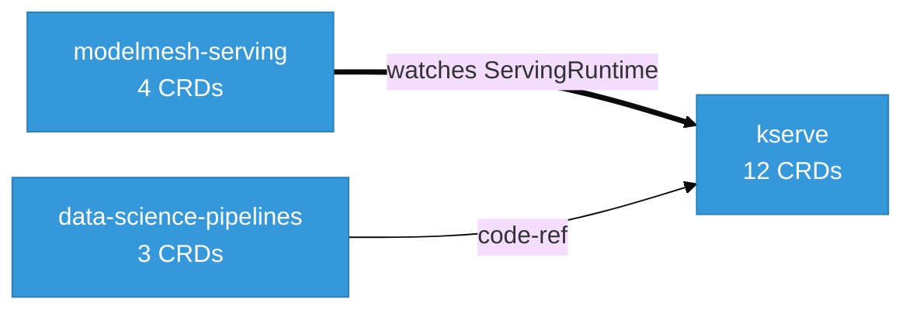

# OpenShift AI Platform Analysis

> **Architecture snapshot: 2026-05-12** (2026-05-12)

*Generated by architecture-analyzer. All data produced by deterministic static analysis.*

## Platform Summary

| Metric | Count |
|--------|-------|
| Components | 4 |
| CRDs | 23 |
| Services | 22 |
| Secrets | 10 |
| Cluster Roles | 19 |
| Cross-Component Dependencies | 2 |
| Webhooks | 16 |

## Component Dependency Graph

## Components Analyzed

| Component | CRDs |
|-----------|------|
| data-science-pipelines | 3 |
| data-science-pipelines-operator | 4 |
| kserve | 12 |
| modelmesh-serving | 4 |

