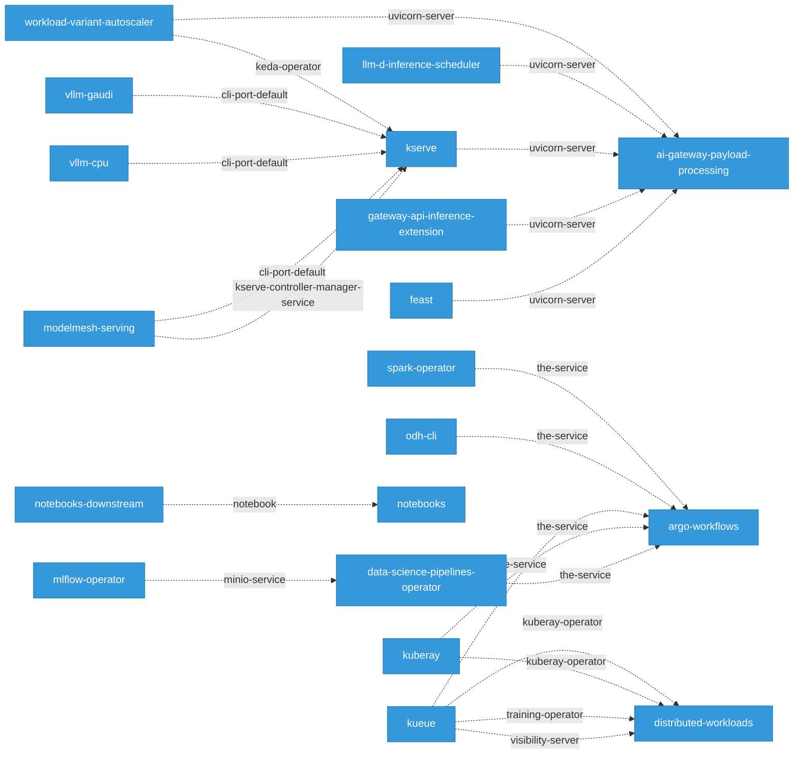

# Network Topology

81 Kubernetes services across the platform.

## Network Topology Graph

Interactive service mesh view of the platform. Drag nodes to rearrange, hover to highlight connections, click for details. Double-click background to fit all.

  <button data-action="fit" title="Fit to view">Fit</button>
  <button data-action="zoom-in" title="Zoom in">+</button>
  <button data-action="zoom-out" title="Zoom out">&minus;</button>
  <button data-action="relayout" title="Re-run layout">Relayout</button>
  <button data-action="fullscreen" title="Toggle fullscreen">Fullscreen</button>

  

   Component
   Has Ingress
   Has NetworkPolicy
   External
   CRD Watch
   Sidecar
   Module
   External

## Cross-Component Service References

Services referenced across component boundaries. When component A defines a service that component B also references, it indicates a deployment dependency.

## Services by Component

| Component | Services | Webhook (443) | Metrics (8443) | Data |
|-----------|----------|---------------|----------------|------|
| NeMo-Guardrails | 1 | 0 | 0 | 1 |
| ai-gateway-payload-processing | 1 | 0 | 0 | 1 |
| argo-workflows | 1 | 0 | 0 | 1 |
| data-science-pipelines | 2 | 0 | 0 | 2 |
| data-science-pipelines-operator | 11 | 0 | 2 | 9 |
| distributed-workloads | 4 | 2 | 0 | 2 |
| feast | 1 | 0 | 0 | 1 |
| gateway-api-inference-extension | 1 | 0 | 0 | 1 |
| kserve | 12 | 6 | 3 | 3 |
| kubeflow | 2 | 2 | 0 | 0 |
| kuberay | 3 | 1 | 0 | 2 |
| kueue | 5 | 3 | 0 | 2 |
| llama-stack-k8s-operator | 2 | 1 | 1 | 0 |
| llm-d-inference-scheduler | 5 | 1 | 0 | 4 |
| llm-d-routing-sidecar | 1 | 0 | 0 | 1 |
| mlflow-operator | 3 | 0 | 1 | 2 |
| model-registry | 1 | 0 | 0 | 1 |
| modelmesh-serving | 7 | 1 | 1 | 5 |
| models-as-a-service | 2 | 0 | 0 | 2 |
| notebooks | 1 | 0 | 0 | 1 |
| notebooks-downstream | 1 | 0 | 0 | 1 |
| odh-cli | 1 | 0 | 0 | 1 |
| spark-operator | 2 | 1 | 0 | 1 |
| text-generation-inference | 1 | 0 | 0 | 1 |
| trainer | 1 | 1 | 0 | 0 |
| vllm-cpu | 3 | 0 | 0 | 3 |
| vllm-gaudi | 1 | 0 | 0 | 1 |
| workload-variant-autoscaler | 5 | 3 | 0 | 2 |

## Service Detail

Per-component service breakdown with exact port numbers and protocols.

### NeMo-Guardrails (1 services)

| Service | Type | Ports |
|---------|------|-------|
| env-port-default | python-source | 1235/TCP |

### ai-gateway-payload-processing (1 services)

| Service | Type | Ports |
|---------|------|-------|
| uvicorn-server | python-source | 8000/TCP |

### argo-workflows (1 services)

| Service | Type | Ports |
|---------|------|-------|
| the-service | LoadBalancer | 8666/TCP |

### data-science-pipelines (2 services)

| Service | Type | Ports |
|---------|------|-------|
| kubeflow-pipelines-profile-controller | ClusterIP | 80/TCP |
| squid | ClusterIP | 3128/TCP |

### data-science-pipelines-operator (11 services)

| Service | Type | Ports |
|---------|------|-------|
| data-science-pipelines-operator-service | ClusterIP | 8080/TCP |
| ds-pipeline-workflow-controller-metrics-template-value | ClusterIP | 9090/TCP |
| mariadb | ClusterIP | 3306/TCP |
| mariadb-template-value | ClusterIP | 3306/TCP |
| minio | ClusterIP | 9000/TCP, 9001/TCP |
| minio-service | ClusterIP | 9000/TCP |
| minio-template-value | ClusterIP | 9000/TCP, 80/TCP |
| ml-pipeline | ClusterIP | 8443/TCP, 8888/TCP, 8887/TCP |
| pypi-server | ClusterIP | 8080/TCP |
| template-value | ClusterIP | 8443/TCP, 8888/TCP, 8887/TCP |
| the-service | LoadBalancer | 8666/TCP |

### distributed-workloads (4 services)

| Service | Type | Ports |
|---------|------|-------|
| kuberay-operator | ClusterIP | 8080/TCP |
| training-operator | ClusterIP | 8080/TCP |
| visibility-server | ClusterIP | 443/TCP |
| webhook-service | ClusterIP | 443/TCP |

### feast (1 services)

| Service | Type | Ports |
|---------|------|-------|
| uvicorn-server | python-source | 6566/TCP |

### gateway-api-inference-extension (1 services)

| Service | Type | Ports |
|---------|------|-------|
| uvicorn-server | python-source | 8000/TCP |

### kserve (12 services)

| Service | Type | Ports |
|---------|------|-------|
| cli-port-default | python-source | 80/TCP |
| keda-admission-webhooks | ClusterIP | 443/TCP, 8080/TCP |
| keda-metrics-apiserver | ClusterIP | 443/TCP, 8080/TCP |
| keda-operator | ClusterIP | 9666/TCP, 8080/TCP |
| kserve-controller-manager-metrics-service | ClusterIP | 8443/TCP |
| kserve-controller-manager-service | ClusterIP | 8443/TCP |
| kserve-webhook-server-service | ClusterIP | 443/TCP |
| llmisvc-controller-manager-service | ClusterIP | 8443/TCP |
| llmisvc-webhook-server-service | ClusterIP | 443/TCP |
| localmodel-webhook-server-service | ClusterIP | 443/TCP |
| uvicorn-server | python-source | 8000/TCP |
| webhook-service | ClusterIP | 443/TCP |

### kubeflow (2 services)

| Service | Type | Ports |
|---------|------|-------|
| service | ClusterIP | 443/TCP |
| webhook-service | ClusterIP | 443/TCP |

### kuberay (3 services)

| Service | Type | Ports |
|---------|------|-------|
| kuberay-operator | ClusterIP | 8080/TCP |
| the-service | LoadBalancer | 8666/TCP |
| webhook-service | ClusterIP | 443/TCP |

### kueue (5 services)

| Service | Type | Ports |
|---------|------|-------|
| kuberay-operator | ClusterIP | 8080/TCP |
| the-service | LoadBalancer | 8666/TCP |
| training-operator | ClusterIP | 8080/TCP, 443/TCP |
| visibility-server | ClusterIP | 443/TCP |
| webhook-service | ClusterIP | 443/TCP |

### llama-stack-k8s-operator (2 services)

| Service | Type | Ports |
|---------|------|-------|
| ogx-k8s-operator-controller-manager-metrics-service | ClusterIP | 8443/TCP |
| ogx-k8s-operator-webhook-service | ClusterIP | 443/TCP |

### llm-d-inference-scheduler (5 services)

| Service | Type | Ports |
|---------|------|-------|
| ${EPP_NAME} | ClusterIP | 9002/TCP, 5557/TCP, 9090/TCP |
| inference-gateway-istio-nodeport | NodePort | 15021/TCP, 80/TCP |
| istiod-llm-d-gateway | ClusterIP | 15010/TCP, 15012/TCP, 443/TCP, 15014/TCP |
| service | ClusterIP | 8080/TCP |
| uvicorn-server | python-source | 8000/TCP |

### llm-d-routing-sidecar (1 services)

| Service | Type | Ports |
|---------|------|-------|
| service | ClusterIP | 8080/TCP |

### mlflow-operator (3 services)

| Service | Type | Ports |
|---------|------|-------|
| minio-service | ClusterIP | 9000/TCP |
| mlflow-operator-controller-manager-metrics-service | ClusterIP | 8443/TCP |
| postgres-service | ClusterIP | 5432/TCP |

### model-registry (1 services)

| Service | Type | Ports |
|---------|------|-------|
| model-catalog | ClusterIP | 8080/TCP |

### modelmesh-serving (7 services)

| Service | Type | Ports |
|---------|------|-------|
| cli-port-default | python-source | 80/TCP |
| etcd | ClusterIP | 2379/TCP |
| kserve-controller-manager-service | ClusterIP | 8443/TCP |
| kserve-webhook-server-service | ClusterIP | 443/TCP |
| modelmesh-controller | ClusterIP | 8080/TCP |
| modelmesh-webhook-server-service | ClusterIP | 9443/TCP |
| models-server | python-source | 8080/TCP |

### models-as-a-service (2 services)

| Service | Type | Ports |
|---------|------|-------|
| maas-api | ClusterIP | 8080/TCP, 9090/TCP |
| payload-processing | ClusterIP | 9004/TCP |

### notebooks (1 services)

| Service | Type | Ports |
|---------|------|-------|
| notebook | ClusterIP | 8888/TCP |

### notebooks-downstream (1 services)

| Service | Type | Ports |
|---------|------|-------|
| notebook | ClusterIP | 8888/TCP |

### odh-cli (1 services)

| Service | Type | Ports |
|---------|------|-------|
| the-service | LoadBalancer | 8666/TCP |

### spark-operator (2 services)

| Service | Type | Ports |
|---------|------|-------|
| spark-operator-webhook-svc | ClusterIP | 443/TCP |
| the-service | LoadBalancer | 8666/TCP |

### text-generation-inference (1 services)

| Service | Type | Ports |
|---------|------|-------|
| inference-server | ClusterIP | 8033/TCP |

### trainer (1 services)

| Service | Type | Ports |
|---------|------|-------|
| webhook-service | ClusterIP | 443/TCP |

### vllm-cpu (3 services)

| Service | Type | Ports |
|---------|------|-------|
| cli-port-default | python-source | 8000/TCP |
| disagg_proxy_p2p_nccl_xpyd-server | python-source | 10001/TCP |
| moriio_toy_proxy_server-server | python-source | 10001/TCP |

### vllm-gaudi (1 services)

| Service | Type | Ports |
|---------|------|-------|
| cli-port-default | python-source | 8000/TCP |

### workload-variant-autoscaler (5 services)

| Service | Type | Ports |
|---------|------|-------|
| keda-admission-webhooks | ClusterIP | 443/TCP, 8080/TCP |
| keda-metrics-apiserver | ClusterIP | 443/TCP, 8080/TCP |
| keda-operator | ClusterIP | 9666/TCP, 8080/TCP |
| uvicorn-server | python-source | 8000/TCP |
| webhook-service | ClusterIP | 443/TCP |

## Port Patterns

- **10001/TCP**: disagg_proxy_p2p_nccl_xpyd-server, moriio_toy_proxy_server-server
- **1235/TCP**: env-port-default
- **15010/TCP**: istiod-llm-d-gateway
- **15012/TCP**: istiod-llm-d-gateway
- **15014/TCP**: istiod-llm-d-gateway
- **15021/TCP**: inference-gateway-istio-nodeport
- **2379/TCP**: etcd
- **3128/TCP**: squid
- **3306/TCP**: mariadb, mariadb-template-value
- **443/TCP**: visibility-server, webhook-service, keda-admission-webhooks, keda-metrics-apiserver, kserve-webhook-server-service, llmisvc-webhook-server-service, localmodel-webhook-server-service, webhook-service, service, webhook-service, webhook-service, training-operator, visibility-server, webhook-service, ogx-k8s-operator-webhook-service, istiod-llm-d-gateway, kserve-webhook-server-service, spark-operator-webhook-svc, webhook-service, keda-admission-webhooks, keda-metrics-apiserver, webhook-service
- **5432/TCP**: postgres-service
- **5557/TCP**: ${EPP_NAME}
- **6566/TCP**: uvicorn-server
- **80/TCP**: minio-template-value, kubeflow-pipelines-profile-controller, cli-port-default, inference-gateway-istio-nodeport, cli-port-default
- **8000/TCP**: uvicorn-server, uvicorn-server, uvicorn-server, uvicorn-server, cli-port-default, cli-port-default, uvicorn-server
- **8033/TCP**: inference-server
- **8080/TCP**: data-science-pipelines-operator-service, pypi-server, kuberay-operator, training-operator, keda-admission-webhooks, keda-metrics-apiserver, keda-operator, kuberay-operator, kuberay-operator, training-operator, service, service, model-catalog, modelmesh-controller, models-server, maas-api, keda-admission-webhooks, keda-metrics-apiserver, keda-operator
- **8443/TCP**: ml-pipeline, template-value, kserve-controller-manager-metrics-service, kserve-controller-manager-service, llmisvc-controller-manager-service, ogx-k8s-operator-controller-manager-metrics-service, mlflow-operator-controller-manager-metrics-service, kserve-controller-manager-service
- **8666/TCP**: the-service, the-service, the-service, the-service, the-service, the-service
- **8887/TCP**: ml-pipeline, template-value
- **8888/TCP**: ml-pipeline, template-value, notebook, notebook
- **9000/TCP**: minio, minio-service, minio-template-value, minio-service
- **9001/TCP**: minio
- **9002/TCP**: ${EPP_NAME}
- **9004/TCP**: payload-processing
- **9090/TCP**: ds-pipeline-workflow-controller-metrics-template-value, ${EPP_NAME}, maas-api
- **9443/TCP**: modelmesh-webhook-server-service
- **9666/TCP**: keda-operator, keda-operator

